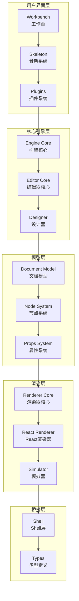
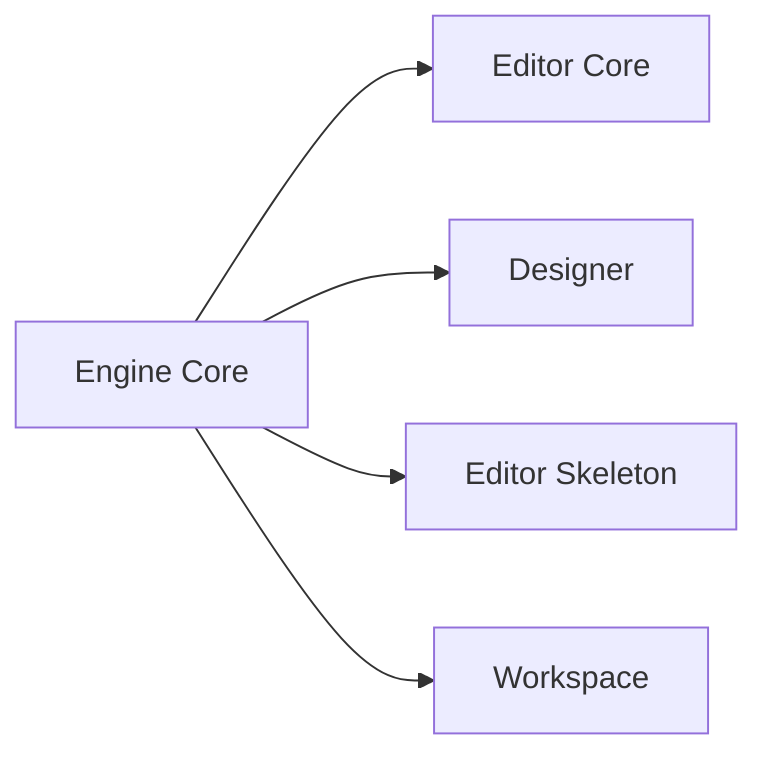
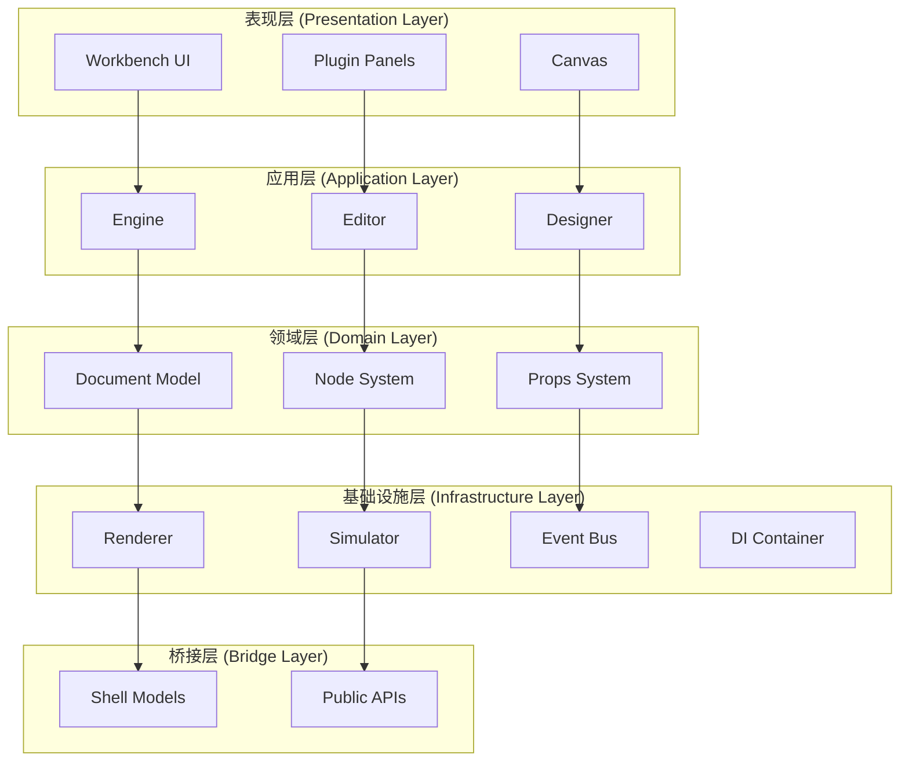
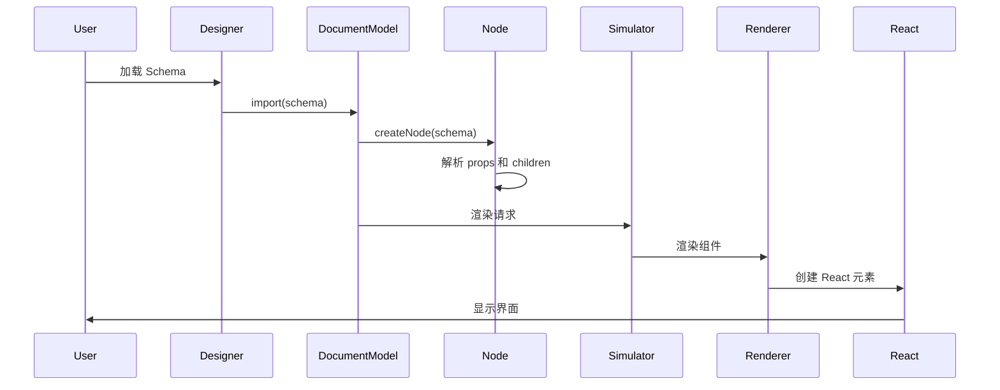
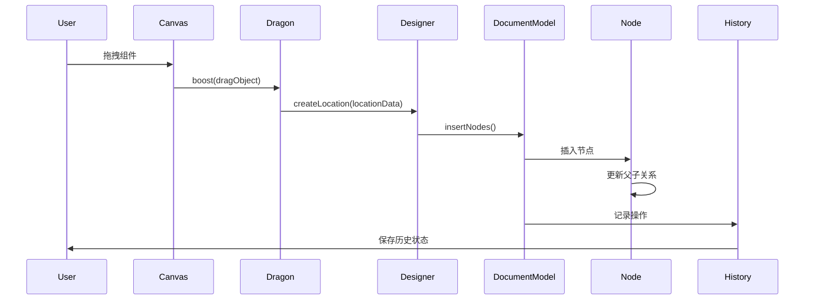
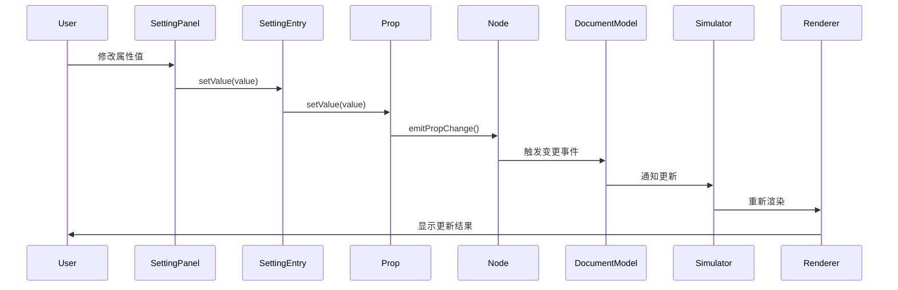
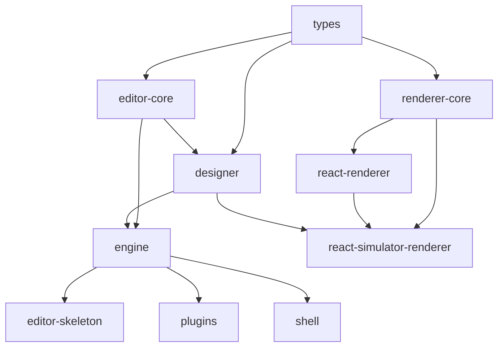

# LowCode Engine 系统架构总览

## 目录

- [架构概述](#架构概述)
- [核心模块](#核心模块)
- [架构分层](#架构分层)
- [数据流向](#数据流向)
- [设计原则](#设计原则)
- [技术栈](#技术栈)

## 架构概述

LowCode Engine 是一个基于 React 的低代码引擎，采用分层架构设计，实现了从 Schema 描述到可视化编辑再到代码生成的完整流程。

### 整体架构图



## 核心模块

### 1. Engine Core (`packages/engine`)

**职责**: 引擎的入口和核心协调器

**核心功能**:
- 初始化整个引擎
- 协调各模块的启动顺序
- 注册内置插件
- 提供全局配置管理

**关键类**:
- `init()`: 引擎初始化函数
- `destroy()`: 引擎销毁函数

**依赖关系**:


### 2. Editor Core (`packages/editor-core`)

**职责**: 编辑器的核心基础设施

**核心功能**:
- 事件总线管理
- 配置管理
- 依赖注入容器
- 国际化支持
- 快捷键管理

**关键类**:
- `Editor`: 编辑器主类
- `EventBus`: 事件总线
- `engineConfig`: 引擎配置
- `Hotkey`: 快捷键管理

**核心接口**:
```typescript
interface IEditor {
  get<T>(key: string): T | undefined;
  set(key: string, data: any): void;
  onceGot<T>(key: string): Promise<T>;
  onGot<T>(key: string, fn: (data: T) => void): () => void;
  onChange<T>(key: string, fn: (data: T) => void): () => void;
}
```

### 3. Designer (`packages/designer`)

**职责**: 可视化设计的核心逻辑

**核心功能**:
- 文档模型管理
- 节点系统
- 拖拽系统
- 选区系统
- 历史记录
- 组件元数据管理
- 模拟器集成

**关键类**:
- `Designer`: 设计器主类
- `DocumentModel`: 文档模型
- `Node`: 节点类
- `Props`: 属性系统
- `Selection`: 选区管理
- `History`: 历史记录
- `BuiltinSimulatorHost`: 内置模拟器宿主

**核心数据结构**:
```typescript
class Designer {
  readonly project: IProject;
  readonly dragon: IDragon;
  readonly activeTracker: IActiveTracker;
  readonly detecting: Detecting;
  getComponentMeta(componentName: string): IComponentMeta;
  createLocation(locationData: LocationData): DropLocation;
  transformProps(props: any, node: Node, stage: TransformStage): any;
}
```

### 4. Renderer Core (`packages/renderer-core`)

**职责**: 渲染器核心抽象

**核心功能**:
- 提供渲染器抽象接口
- 支持多种渲染框架适配
- 高阶组件系统
- 组件生命周期管理

**关键类**:
- `Renderer`: 渲染器基类
- `BaseRenderer`: 基础渲染器
- `ComponentRenderer`: 组件渲染器
- `PageRenderer`: 页面渲染器
- `BlockRenderer`: 区块渲染器

### 5. React Renderer (`packages/react-renderer`)

**职责**: React 框架的具体渲染实现

**核心功能**:
- 基于 React 的渲染实现
- 组件实例管理
- DOM 节点查找
- 事件处理

### 6. Editor Skeleton (`packages/editor-skeleton`)

**职责**: 编辑器 UI 骨架

**核心功能**:
- 面板管理
- 组件注册
- 布局管理
- 面板生命周期

### 7. Shell (`packages/shell`)

**职责**: 对外暴露的 API 层

**核心功能**:
- 将内部模型转换为对外 API
- 提供统一的接口访问
- 隐藏内部实现细节

## 架构分层

### 分层说明



### 表现层
负责用户界面的展示和交互，包括工作台、面板、画布等。

### 应用层
协调各领域模块，处理业务逻辑，包括引擎、编辑器、设计器等。

### 领域层
包含核心业务模型和领域逻辑，如文档模型、节点系统、属性系统等。

### 基础设施层
提供底层技术支持，如渲染器、模拟器、事件总线、依赖注入等。

### 桥接层
将内部实现转换为对外 API，提供统一的访问接口。

## 数据流向

### Schema 到渲染的流程



### 编辑操作的流程



### 属性修改的流程



## 设计原则

### 1. 分层架构
- 清晰的层次划分
- 单向依赖关系
- 每层独立演进

### 2. 依赖倒置
- 面向接口编程
- 通过依赖注入解耦
- 便于测试和扩展

### 3. 单一职责
- 每个模块职责明确
- 类和函数功能单一
- 降低复杂度

### 4. 开闭原则
- 对扩展开放
- 对修改封闭
- 通过插件机制扩展

### 5. 响应式设计
- 使用 MobX 实现响应式
- 自动追踪依赖
- 高效更新

### 6. 事件驱动
- 松耦合的模块通信
- 事件总线机制
- 易于扩展

## 技术栈

### 核心技术

| 技术 | 版本 | 用途 |
|------|------|------|
| React | 16.x+ | UI 框架 |
| MobX | 6.x+ | 状态管理 |
| TypeScript | 4.x+ | 类型系统 |
| React DOM | 16.x+ | DOM 操作 |

### 构建工具

| 工具 | 用途 |
|------|------|
| Webpack | 模块打包 |
| Babel | 代码转译 |
| Jest | 单元测试 |
| ESLint | 代码检查 |
| Prettier | 代码格式化 |

### 开发工具

| 工具 | 用途 |
|------|------|
| Lerna | Monorepo 管理 |
| pnpm | 包管理 |
| TypeScript | 类型检查 |

## 模块依赖关系

### 依赖层次

```
Level 0: types (基础类型定义)
Level 1: editor-core, renderer-core (核心基础设施)
Level 2: designer, engine (核心业务逻辑)
Level 3: react-renderer, react-simulator-renderer (框架适配)
Level 4: editor-skeleton, plugins (UI 和扩展)
Level 5: shell (对外 API)
```

### 依赖图



## 性能优化策略

### 1. 虚拟化渲染
- 大列表虚拟滚动
- 按需渲染节点

### 2. 响应式优化
- 精确的依赖追踪
- 避免不必要的重渲染

### 3. 事件节流
- 拖拽事件节流
- 滚动事件节流

### 4. 懒加载
- 组件懒加载
- 插件按需加载

### 5. 缓存策略
- 组件实例缓存
- 元数据缓存
- Schema 缓存

## 扩展点

### 1. 插件系统
- 自定义面板
- 自定义组件
- 自定义命令

### 2. 渲染器扩展
- 自定义渲染器
- 高阶组件
- 适配其他框架

### 3. Setter 扩展
- 自定义属性编辑器
- 自定义校验规则
- 自定义转换逻辑

### 4. 元数据扩展
- 自定义组件元数据
- 自定义行为配置
- 自定义生命周期

## 总结

LowCode Engine 采用分层架构设计，通过清晰的模块划分和依赖关系，实现了高度可扩展和可维护的低代码平台。核心设计原则包括分层架构、依赖倒置、单一职责、开闭原则、响应式设计和事件驱动。通过插件机制和渲染器抽象，支持灵活的扩展和适配。

相关文档:
- [模块依赖关系](./module-dependencies.md)
- [设计模式应用](./design-patterns.md)
- [Designer 模块](../01-designer/index.md)
- [Engine 模块](../03-engine/index.md)
