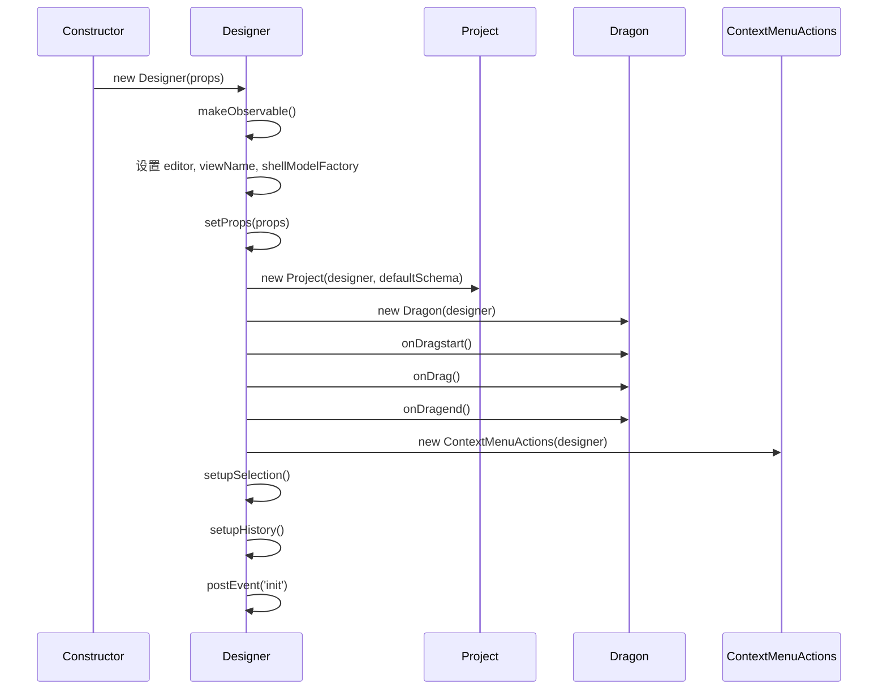
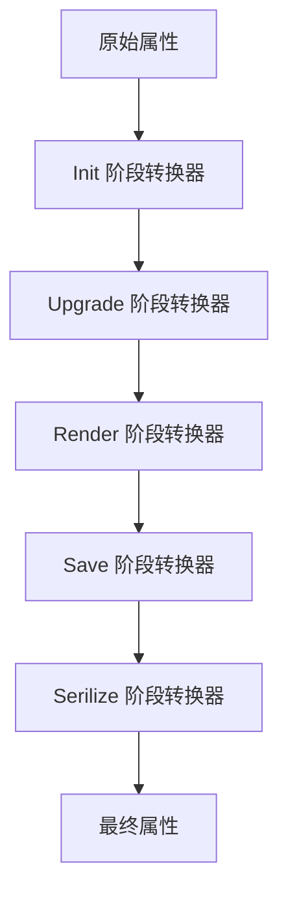
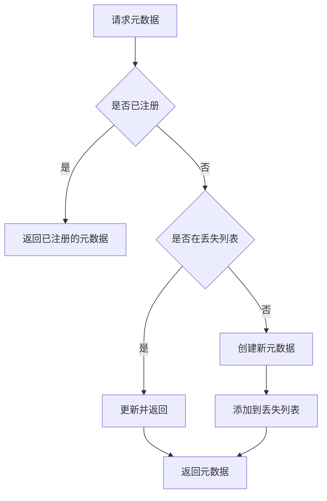

# Designer 核心类详解

## 目录

- [类概述](#类概述)
- [类定义](#类定义)
- [核心属性](#核心属性)
- [核心方法](#核心方法)
- [初始化流程](#初始化流程)
- [拖拽处理](#拖拽处理)
- [属性转换](#属性转换)
- [组件元数据管理](#组件元数据管理)
- [事件系统](#事件系统)
- [使用示例](#使用示例)

## 类概述

[`Designer`](../../packages/designer/src/designer/designer.ts:123) 是设计器的核心类，负责协调各个子系统，包括文档模型、拖拽系统、选区系统、检测系统、组件元数据管理等。

**文件位置**: `packages/designer/src/designer/designer.ts`

**继承关系**: 无

**实现接口**: [`IDesigner`](../../packages/designer/src/designer/designer.ts:63)

## 类定义

```typescript
export class Designer implements IDesigner {
  // 核心子系统
  readonly project: IProject;
  readonly dragon: IDragon;
  readonly activeTracker: IActiveTracker;
  readonly detecting: Detecting;
  readonly componentActions: ComponentActions;
  readonly contextMenuActions: IContextMenuActions;
  readonly bemToolsManager: BemToolsManager;

  // 编辑器引用
  readonly editor: IPublicModelEditor;
  readonly shellModelFactory: IShellModelFactory;

  // 组件元数据
  @obx.ref private _componentMetasMap = new Map<string, IComponentMeta>();
  private _lostComponentMetasMap = new Map<string, ComponentMeta>();

  // 配置
  private props?: DesignerProps;
  @obx.ref private _simulatorComponent?: ComponentType<any>;
  @obx.ref private _simulatorProps?: Record<string, any> | ((project: IProject) => object);
  @obx.ref private _suspensed = false;

  // 状态
  private _dropLocation?: DropLocation;
  private propsReducers = new Map<TransformStage, PropsTransducer[]>();
  private oobxList: OffsetObserver[] = [];
  private selectionDispose: undefined | (() => void);

  // 构造函数
  constructor(props: DesignerProps);

  // 核心方法
  getComponentMeta(componentName: string, generateMetadata?: () => ComponentMetadata | null): IComponentMeta;
  createComponentMeta(data: ComponentMetadata): IComponentMeta | null;
  refreshComponentMetasMap(): void;
  createLocation(locationData: LocationData<INode>): DropLocation;
  clearLocation(): void;
  transformProps(props: any, node: Node, stage: TransformStage): any;
  addPropsReducer(reducer: PropsTransducer, stage: TransformStage): void;
  loadIncrementalAssets(incrementalAssets: AssetsJson): Promise<void>;
  createScroller(scrollable: Scrollable): IScroller;
  createOffsetObserver(nodeInstance: INodeSelector): OffsetObserver | null;
  createSettingEntry(nodes: INode[]): ISettingTopEntry;

  // 计算属性
  @computed get currentDocument(): DocumentModel | undefined;
  @computed get currentHistory(): IHistory | undefined;
  @computed get currentSelection(): ISelection | undefined;
  @computed get simulatorComponent(): ComponentType<any> | undefined;
  @computed get simulatorProps(): Record<string, any>;
  @computed get projectSimulatorProps(): any;
  @computed get componentsMap(): { [key: string]: NpmInfo | Component };
  @computed get suspensed(): boolean;

  // Schema 操作
  get schema(): ProjectSchema;
  setSchema(schema?: ProjectSchema);
}
```

## 核心属性

### 1. project: IProject
项目实例，管理多个文档。

```typescript
readonly project: IProject;
```

**说明**:
- 包含所有打开的文档
- 管理当前激活的文档
- 提供文档级别的操作

**使用示例**:
```typescript
// 获取当前文档
const currentDoc = designer.project.currentDocument;

// 创建新文档
const newDoc = designer.project.createDocument(schema);

// 打开文档
designer.project.openDocument(docId);
```

### 2. dragon: IDragon
拖拽系统实例。

```typescript
readonly dragon: IDragon;
```

**说明**:
- 处理组件拖拽
- 计算投放位置
- 执行节点移动或复制

**使用示例**:
```typescript
// 开始拖拽
designer.dragon.boost({
  type: 'node',
  nodes: [node1, node2]
}, dragStartEvent);

// 监听拖拽事件
designer.dragon.onDragstart((e) => {
  console.log('Drag started', e.dragObject);
});
```

### 3. activeTracker: IActiveTracker
活动追踪器，追踪当前活动的节点。

```typescript
readonly activeTracker = new ActiveTracker();
```

**说明**:
- 追踪当前活动的节点
- 自动滚动到活动节点
- 提供活动节点变更通知

**使用示例**:
```typescript
// 追踪节点
designer.activeTracker.track({ node, detail });

// 监听变更
designer.activeTracker.onChange(({ node, detail }) => {
  console.log('Active node changed', node, detail);
});
```

### 4. detecting: Detecting
检测系统，处理鼠标悬停检测。

```typescript
readonly detecting = new Detecting();
```

**说明**:
- 检测鼠标悬停的节点
- 提供高亮反馈
- 支持启用/禁用

**使用示例**:
```typescript
// 捕获节点
designer.detecting.capture(node);

// 释放节点
designer.detecting.release(node);

// 禁用检测
designer.detecting.enable = false;
```

### 5. componentActions: ComponentActions
组件操作管理器。

```typescript
readonly componentActions = new ComponentActions();
```

**说明**:
- 管理组件操作
- 提供操作注册和调用

### 6. contextMenuActions: IContextMenuActions
上下文菜单操作管理器。

```typescript
readonly contextMenuActions: IContextMenuActions;
```

**说明**:
- 管理上下文菜单项
- 处理菜单操作

### 7. editor: IPublicModelEditor
编辑器实例。

```typescript
readonly editor: IPublicModelEditor;
```

**说明**:
- 提供编辑器级别的功能
- 管理编辑器配置
- 提供事件总线

### 8. shellModelFactory: IShellModelFactory
Shell 模型工厂。

```typescript
readonly shellModelFactory: IShellModelFactory;
```

**说明**:
- 创建 Shell 模型
- 将内部模型转换为对外 API

## 核心方法

### 1. getComponentMeta()

获取组件元数据。

```typescript
getComponentMeta(
  componentName: string,
  generateMetadata?: () => ComponentMetadata | null
): IComponentMeta
```

**参数**:
- `componentName`: 组件名称
- `generateMetadata`: 可选的元数据生成函数

**返回值**: 组件元数据对象

**实现逻辑**:
```typescript
getComponentMeta(
  componentName: string,
  generateMetadata?: () => ComponentMetadata | null,
): IComponentMeta {
  // 1. 从已注册的元数据中查找
  if (this._componentMetasMap.has(componentName)) {
    return this._componentMetasMap.get(componentName)!;
  }

  // 2. 从丢失的元数据中查找
  if (this._lostComponentMetasMap.has(componentName)) {
    return this._lostComponentMetasMap.get(componentName);
  }

  // 3. 创建新的元数据
  const meta = new ComponentMeta(this, {
    componentName,
    ...(generateMetadata ? generateMetadata() : null),
  });

  // 4. 添加到丢失的元数据中
  this._lostComponentMetasMap.set(componentName, meta);

  return meta;
}
```

**使用示例**:
```typescript
// 获取组件元数据
const meta = designer.getComponentMeta('Button');

// 检查是否为容器
const isContainer = meta.isContainer;

// 获取组件标题
const title = meta.title;

// 获取组件图标
const icon = meta.icon;
```

### 2. createComponentMeta()

创建组件元数据。

```typescript
createComponentMeta(data: ComponentMetadata): IComponentMeta | null
```

**参数**:
- `data`: 组件元数据

**返回值**: 组件元数据对象，如果组件名称为空则返回 null

**实现逻辑**:
```typescript
createComponentMeta(data: ComponentMetadata): IComponentMeta | null {
  const key = data.componentName;
  if (!key) {
    return null;
  }

  // 1. 检查是否已存在
  let meta = this._componentMetasMap.get(key);
  if (meta) {
    // 更新现有元数据
    meta.setMetadata(data);
    this._componentMetasMap.set(key, meta);
  } else {
    // 2. 检查丢失的元数据
    meta = this._lostComponentMetasMap.get(key);

    if (meta) {
      // 更新丢失的元数据
      meta.setMetadata(data);
      this._lostComponentMetasMap.delete(key);
    } else {
      // 3. 创建新元数据
      meta = new ComponentMeta(this, data);
    }

    // 4. 添加到元数据映射
    this._componentMetasMap.set(key, meta);
  }

  return meta;
}
```

### 3. refreshComponentMetasMap()

刷新组件元数据映射。

```typescript
refreshComponentMetasMap(): void
```

**说明**:
- 触发模拟器重新构建组件
- 用于增量加载资源后刷新

**实现逻辑**:
```typescript
refreshComponentMetasMap() {
  this._componentMetasMap = new Map(this._componentMetasMap);
}
```

### 4. createLocation()

创建投放位置。

```typescript
createLocation(locationData: LocationData<INode>): DropLocation
```

**参数**:
- `locationData`: 位置数据

**返回值**: 投放位置对象

**实现逻辑**:
```typescript
createLocation(locationData: LocationData<INode>): DropLocation {
  const loc = new DropLocation(locationData);

  // 1. 清除不同文档的投放位置
  if (this._dropLocation && this._dropLocation.document && this._dropLocation.document !== loc.document) {
    this._dropLocation.document.dropLocation = null;
  }

  // 2. 设置新的投放位置
  this._dropLocation = loc;

  // 3. 发送事件
  this.postEvent('dropLocation.change', loc);

  // 4. 更新文档的投放位置
  if (loc.document) {
    loc.document.dropLocation = loc;
  }

  // 5. 追踪活动节点
  this.activeTracker.track({ node: loc.target, detail: loc.detail });

  return loc;
}
```

### 5. clearLocation()

清除投放位置。

```typescript
clearLocation(): void
```

**实现逻辑**:
```typescript
clearLocation() {
  if (this._dropLocation && this._dropLocation.document) {
    this._dropLocation.document.dropLocation = null;
  }
  this.postEvent('dropLocation.change', undefined);
  this._dropLocation = undefined;
}
```

### 6. transformProps()

转换属性。

```typescript
transformProps(
  props: CompositeObject | PropsList,
  node: Node,
  stage: TransformStage
): CompositeObject | PropsList
```

**参数**:
- `props`: 属性对象
- `node`: 节点实例
- `stage`: 转换阶段

**返回值**: 转换后的属性

**实现逻辑**:
```typescript
transformProps(
  props: CompositeObject | PropsList,
  node: Node,
  stage: TransformStage
) {
  // 1. 如果是数组，暂不支持
  if (Array.isArray(props)) {
    return props;
  }

  // 2. 获取转换器
  const reducers = this.propsReducers.get(stage);
  if (!reducers) {
    return props;
  }

  // 3. 应用所有转换器
  return reducers.reduce((xprops, reducer) => {
    try {
      return reducer(xprops, node.internalToShellNode() as any, { stage });
    } catch (e) {
      console.warn(e);
      return xprops;
    }
  }, props);
}
```

**转换阶段**:
- `Init`: 初始化阶段
- `Upgrade`: 升级阶段
- `Render`: 渲染阶段
- `Save`: 保存阶段
- `Serilize`: 序列化阶段

### 7. addPropsReducer()

添加属性转换器。

```typescript
addPropsReducer(reducer: PropsTransducer, stage: TransformStage): void
```

**参数**:
- `reducer`: 转换器函数
- `stage`: 转换阶段

**实现逻辑**:
```typescript
addPropsReducer(reducer: PropsTransducer, stage: TransformStage) {
  if (!reducer) {
    logger.error('reducer is not available');
    return;
  }

  const reducers = this.propsReducers.get(stage);
  if (reducers) {
    reducers.push(reducer);
  } else {
    this.propsReducers.set(stage, [reducer]);
  }
}
```

**使用示例**:
```typescript
// 添加属性转换器
designer.addPropsReducer((props, node) => {
  // 转换逻辑
  if (props.style) {
    props.style = {
      ...props.style,
      padding: '10px'
    };
  }
  return props;
}, TransformStage.Render);
```

### 8. loadIncrementalAssets()

加载增量资源。

```typescript
loadIncrementalAssets(incrementalAssets: AssetsJson): Promise<void>
```

**参数**:
- `incrementalAssets`: 增量资源

**实现逻辑**:
```typescript
async loadIncrementalAssets(incrementalAssets: AssetsJson): Promise<void> {
  const { components, packages } = incrementalAssets;

  // 1. 构建组件元数据
  components && this.buildComponentMetasMap(components);

  // 2. 设置组件包
  if (packages) {
    await this.project.simulator?.setupComponents(packages);
  }

  // 3. 合并资源
  if (components) {
    let assets = this.editor.get('assets') || {};
    let newAssets = mergeAssets(assets, incrementalAssets);
    await this.editor.set('assets', newAssets);
  }

  // 4. 刷新组件元数据
  this.refreshComponentMetasMap();

  // 5. 发送事件
  this.editor.eventBus.emit('designer.incrementalAssetsReady');
}
```

### 9. createScroller()

创建滚动器。

```typescript
createScroller(scrollable: Scrollable): IScroller
```

**参数**:
- `scrollable`: 可滚动对象

**返回值**: 滚动器实例

### 10. createOffsetObserver()

创建偏移观察器。

```typescript
createOffsetObserver(nodeInstance: INodeSelector): OffsetObserver | null
```

**参数**:
- `nodeInstance`: 节点实例

**返回值**: 偏移观察器实例

### 11. createSettingEntry()

创建设置入口。

```typescript
createSettingEntry(nodes: INode[]): ISettingTopEntry
```

**参数**:
- `nodes`: 节点数组

**返回值**: 设置入口对象

## 初始化流程



**初始化步骤**:

1. **设置响应式**
   ```typescript
   makeObservable(this);
   ```

2. **初始化核心属性**
   ```typescript
   this.editor = editor;
   this.viewName = viewName;
   this.shellModelFactory = shellModelFactory;
   this.setProps(props);
   ```

3. **创建项目**
   ```typescript
   this.project = new Project(this, props.defaultSchema, viewName);
   ```

4. **创建拖拽系统**
   ```typescript
   this.dragon = new Dragon(this);
   ```

5. **设置拖拽事件监听**
   ```typescript
   this.dragon.onDragstart((e) => { /* 处理拖拽开始 */ });
   this.dragon.onDrag((e) => { /* 处理拖拽中 */ });
   this.dragon.onDragend((e) => { /* 处理拖拽结束 */ });
   ```

6. **创建上下文菜单操作**
   ```typescript
   this.contextMenuActions = new ContextMenuActions(this);
   ```

7. **设置选区监听**
   ```typescript
   this.setupSelection();
   ```

8. **设置历史记录监听**
   ```typescript
   this.setupHistory();
   ```

9. **发送初始化事件**
   ```typescript
   this.postEvent('init', this);
   ```

## 拖拽处理

### 拖拽开始

```typescript
this.dragon.onDragstart((e) => {
  // 1. 禁用检测
  this.detecting.enable = false;

  const { dragObject } = e;

  // 2. 处理节点拖拽
  if (isDragNodeObject(dragObject)) {
    if (dragObject.nodes.length === 1) {
      if (dragObject.nodes[0].parent) {
        // 确保当前选中
        dragObject.nodes[0].select();
      } else {
        this.currentSelection?.clear();
      }
    }
  } else {
    // 3. 清空选区
    this.currentSelection?.clear();
  }

  // 4. 触发外部回调
  if (this.props?.onDragstart) {
    this.props.onDragstart(e);
  }

  // 5. 发送事件
  this.postEvent('dragstart', e);
});
```

### 拖拽中

```typescript
this.dragon.onDrag((e) => {
  // 1. 触发外部回调
  if (this.props?.onDrag) {
    this.props.onDrag(e);
  }

  // 2. 发送事件
  this.postEvent('drag', e);
});
```

### 拖拽结束

```typescript
this.dragon.onDragend((e) => {
  const { dragObject, copy } = e;
  const loc = this._dropLocation;

  // 1. 检查投放位置
  if (loc) {
    if (isLocationChildrenDetail(loc.detail) && loc.detail.valid !== false) {
      let nodes: INode[] | undefined;

      // 2. 处理节点拖拽
      if (isDragNodeObject(dragObject)) {
        nodes = insertChildren(loc.target, [...dragObject.nodes], loc.detail.index, copy);
      }
      // 3. 处理节点数据拖拽
      else if (isDragNodeDataObject(dragObject)) {
        const nodeData = Array.isArray(dragObject.data) ? dragObject.data : [dragObject.data];
        const isNotNodeSchema = nodeData.find((item) => !isNodeSchema(item));
        if (isNotNodeSchema) {
          return;
        }
        nodes = insertChildren(loc.target, nodeData, loc.detail.index);
      }

      // 4. 选中插入的节点
      if (nodes) {
        loc.document?.selection.selectAll(nodes.map((o) => o.id));
        setTimeout(() => this.activeTracker.track(nodes![0]), 10);
      }
    }
  }

  // 5. 触发外部回调
  if (this.props?.onDragend) {
    this.props.onDragend(e, loc);
  }

  // 6. 发送事件
  this.postEvent('dragend', e, loc);

  // 7. 启用检测
  this.detecting.enable = true;
});
```

## 属性转换

### 转换流程



### 转换器示例

```typescript
// 添加默认样式
designer.addPropsReducer((props, node, { stage }) => {
  if (stage === TransformStage.Render) {
    if (!props.style) {
      props.style = {};
    }
    props.style = {
      ...props.style,
      boxSizing: 'border-box'
    };
  }
  return props;
}, TransformStage.Render);

// 转换颜色值
designer.addPropsReducer((props, node, { stage }) => {
  if (stage === TransformStage.Save) {
    if (props.color && typeof props.color === 'object') {
      props.color = `rgb(${props.color.r}, ${props.color.g}, ${props.color.b})`;
    }
  }
  return props;
}, TransformStage.Save);
```

## 组件元数据管理

### 元数据结构

```typescript
interface ComponentMetadata {
  componentName: string;           // 组件名称
  title: string;                   // 组件标题
  description?: string;             // 组件描述
  docUrl?: string;                 // 文档地址
  screenshot?: string;              // 截图地址
  devMode?: 'lowCode' | 'proCode'; // 开发模式
  npm?: NpmInfo;                   // npm 信息
  snippets?: Snippet[];            // 代码片段
  configure?: Configure;            // 配置信息
  props?: PropConfig[];            // 属性配置
  advanced?: Advanced;              // 高级配置
}
```

### 元数据管理流程



## 事件系统

### 事件列表

| 事件名 | 参数 | 说明 |
|--------|------|------|
| `init` | `designer: Designer` | 设计器初始化完成 |
| `dragstart` | `e: DragEvent` | 拖拽开始 |
| `drag` | `e: DragEvent` | 拖拽中 |
| `dragend` | `e: DragEvent, loc?: DropLocation` | 拖拽结束 |
| `dropLocation.change` | `loc: DropLocation \| undefined` | 投放位置变更 |
| `current-document.change` | `doc: DocumentModel \| undefined` | 当前文档变更 |
| `selection.change` | `selection: Selection \| undefined` | 选区变更 |
| `history.change` | `history: History \| undefined` | 历史记录变更 |

### 事件监听

```typescript
// 监听拖拽开始
designer.on('dragstart', (e) => {
  console.log('Drag started', e.dragObject);
});

// 监听拖拽结束
designer.on('dragend', (e, loc) => {
  console.log('Drag ended', e, loc);
});

// 监听选区变更
designer.on('selection.change', (selection) => {
  console.log('Selection changed', selection);
});

// 监听历史记录变更
designer.on('history.change', (history) => {
  console.log('History changed', history);
});
```

## 使用示例

### 示例 1: 创建 Designer 实例

```typescript
import { Designer } from '@alilc/lowcode-designer';

const designer = new Designer({
  editor: editor,
  shellModelFactory: shellModelFactory,
  defaultSchema: {
    componentName: 'Page',
    id: 'root',
    children: []
  },
  simulatorProps: {
    designMode: 'design',
    device: 'desktop'
  },
  componentMetadatas: [
    {
      componentName: 'Button',
      title: '按钮',
      description: '一个简单的按钮组件'
    }
  ]
});
```

### 示例 2: 获取组件元数据

```typescript
const meta = designer.getComponentMeta('Button');

console.log('Component title:', meta.title);
console.log('Is container:', meta.isContainer);
console.log('Available actions:', meta.availableActions);
```

### 示例 3: 添加属性转换器

```typescript
designer.addPropsReducer((props, node, { stage }) => {
  if (stage === TransformStage.Render) {
    // 添加默认样式
    if (!props.style) {
      props.style = {};
    }
    props.style = {
      ...props.style,
      boxSizing: 'border-box'
    };
  }
  return props;
}, TransformStage.Render);
```

### 示例 4: 监听事件

```typescript
// 监听拖拽事件
designer.on('dragstart', (e) => {
  console.log('Drag started', e.dragObject);
});

designer.on('drag', (e) => {
  console.log('Dragging', e.location);
});

designer.on('dragend', (e, loc) => {
  console.log('Drag ended', e, loc);
});

// 监听选区变更
designer.on('selection.change', (selection) => {
  console.log('Selection changed', selection);
});
```

### 示例 5: 加载增量资源

```typescript
const incrementalAssets = {
  components: [
    {
      componentName: 'NewComponent',
      title: '新组件',
      description: '这是一个新组件'
    }
  ],
  packages: [
    {
      package: 'new-package',
      version: '1.0.0',
      library: 'NewPackage',
      urls: ['https://cdn.example.com/new-package.js']
    }
  ]
};

await designer.loadIncrementalAssets(incrementalAssets);
```

## 相关文档

- [Designer 模块总览](./index.md)
- [文档模型](./document-model.md)
- [节点系统](./node-system.md)
- [拖拽系统](./drag-drop-system.md)
- [组件元数据](./component-meta.md)
