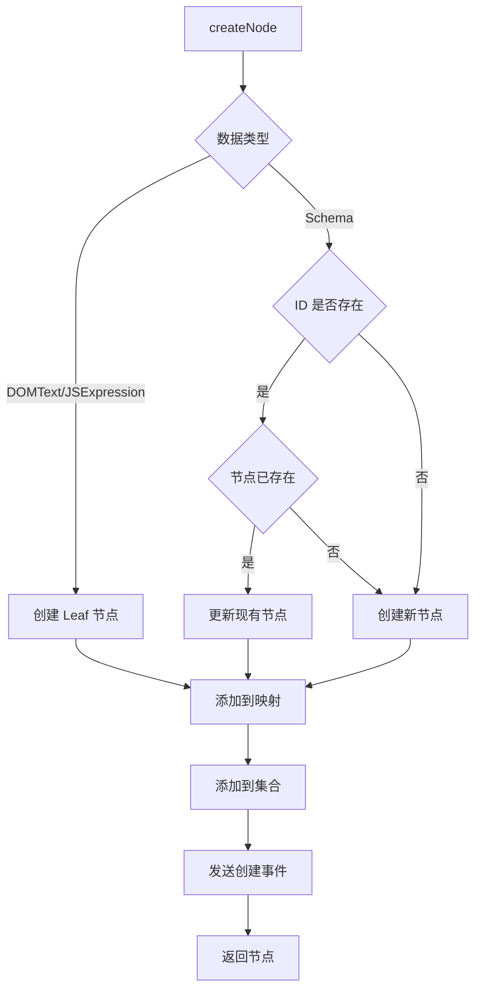
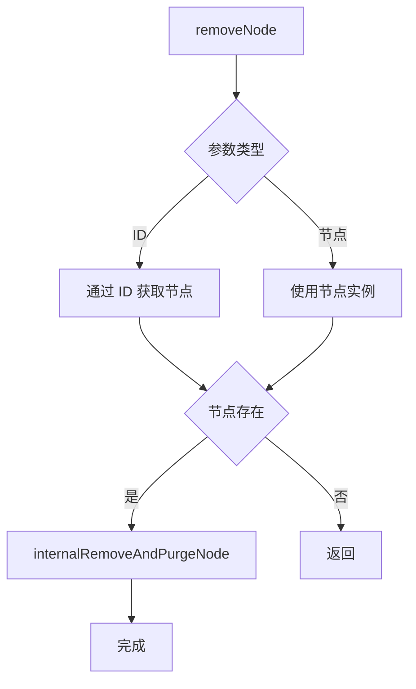
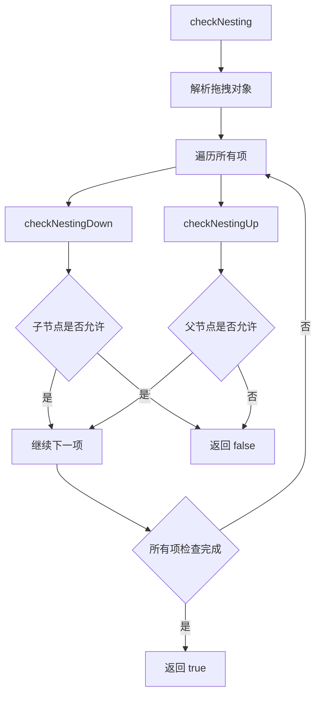
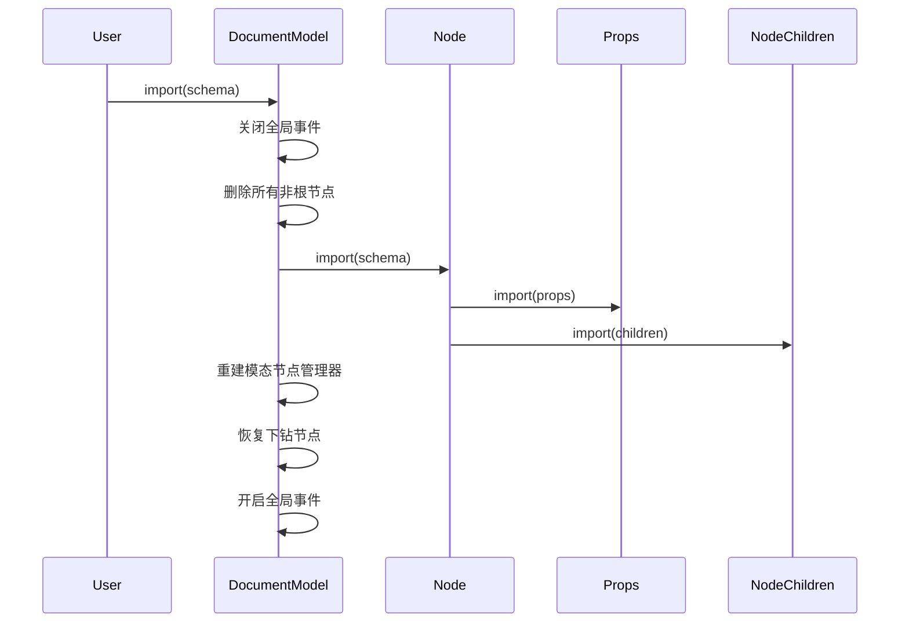
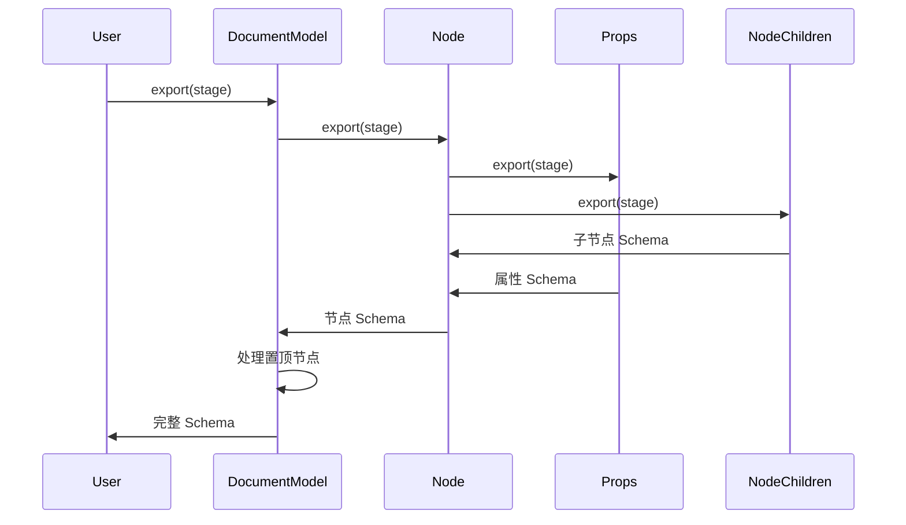

# Document Model 文档模型详解

## 目录

- [模型概述](#模型概述)
- [类定义](#类定义)
- [核心属性](#核心属性)
- [核心方法](#核心方法)
- [节点管理](#节点管理)
- [嵌套检查](#嵌套检查)
- [Schema 导入导出](#schema-导入导出)
- [历史记录集成](#历史记录集成)
- [使用示例](#使用示例)

## 模型概述

[`DocumentModel`](../../packages/designer/src/document/document-model.ts:156) 是文档模型类，负责管理页面或组件的树形结构，包括节点管理、选区管理、历史记录等。

**文件位置**: `packages/designer/src/document/document-model.ts`

**继承关系**: 无

**实现接口**: [`IDocumentModel`](../../packages/designer/src/document/document-model.ts:59)

## 类定义

```typescript
export class DocumentModel implements IDocumentModel {
  // 根节点
  rootNode: IRootNode | null;

  // 文档 ID
  id: string = uniqueId('doc');

  // 选区管理
  readonly selection: ISelection = new Selection(this);

  // 历史记录
  readonly history: IHistory;

  // 模态节点管理
  modalNodesManager: IModalNodesManager;

  // 节点映射
  private _nodesMap = new Map<string, INode>();

  // 节点集合
  @obx.shallow private nodes = new Set<INode>();

  // 项目引用
  readonly project: IProject;

  // 设计器引用
  readonly designer: IDesigner;

  // 状态
  @obx.ref private _drillDownNode: INode | null = null;
  @obx.ref private _dropLocation: IDropLocation | null = null;
  @obx.ref private _opened = false;
  @obx.ref private _suspensed = false;
  private _blank?: boolean;
  private inited = false;

  // 构造函数
  constructor(project: IProject, schema?: RootSchema);

  // 节点管理
  createNode<T extends INode = INode, C = undefined>(data: GetDataType<C, T>): T;
  destroyNode(node: INode): void;
  insertNode(parent: INode, thing: INode | NodeData, at?: number | null, copy?: boolean): INode | null;
  insertNodes(parent: INode, thing: INode[] | NodeData[], at?: number | null, copy?: boolean): INode[];
  removeNode(idOrNode: string | INode): void;

  // Schema 操作
  import(schema: RootSchema, checkId?: boolean): void;
  export(stage: TransformStage): RootSchema | undefined;
  getNodeSchema(id: string): NodeData | null;

  // 嵌套检查
  checkNesting(dropTarget: INode, dragObject: DragNodeObject | NodeSchema | INode | DragNodeDataObject): boolean;

  // 文档操作
  open(): DocumentModel;
  close(): void;
  remove(): void;
  purge(): void;
  suspense(): void;
  activate(): void;

  // 节点查询
  getNode(id: string): INode | null;
  getNodeCount(): number;
  hasNode(id: string): boolean;

  // 生命周期
  onNodeCreate(func: (node: INode) => void): Disposable;
  onNodeDestroy(func: (node: INode) => void): Disposable;
  onChangeNodeVisible(fn: (node: INode, visible: boolean) => void): Disposable;

  // 其他
  getComponentMeta(componentName: string): IComponentMeta;
  getComponentsMap(extraComps?: string[]): ComponentsMap;
  getUtilsMap(): UtilsMap[];
  isModified(): boolean;
  toData(extraComps?: string[]): any;
}
```

## 核心属性

### 1. rootNode: IRootNode | null
根节点，文档的顶级节点。

```typescript
rootNode: IRootNode | null;
```

**说明**:
- 类型为 `Page`、`Component` 或 `Block`
- 包含所有子节点
- 是文档树的起点

### 2. selection: ISelection
选区管理器。

```typescript
readonly selection: ISelection = new Selection(this);
```

**说明**:
- 管理当前选中的节点
- 支持单选和多选
- 提供选区变更通知

### 3. history: IHistory
历史记录管理器。

```typescript
readonly history: IHistory;
```

**说明**:
- 记录操作历史
- 支持撤销和重做
- 管理历史点

### 4. modalNodesManager: IModalNodesManager
模态节点管理器。

```typescript
modalNodesManager: IModalNodesManager;
```

**说明**:
- 管理模态节点
- 处理模态节点的显示和隐藏

### 5. nodesMap: Map<string, INode>
节点映射表。

```typescript
get nodesMap(): Map<string, INode> {
  return this._nodesMap;
}
```

**说明**:
- 通过 ID 快速查找节点
- 维护所有节点的引用

### 6. nodes: Set<INode>
节点集合。

```typescript
@obx.shallow private nodes = new Set<INode>();
```

**说明**:
- 响应式节点集合
- 用于追踪节点变化

## 核心方法

### 1. createNode()

创建节点。

```typescript
createNode<T extends INode = INode, C = undefined>(data: GetDataType<C, T>): T
```

**参数**:
- `data`: 节点数据

**返回值**: 创建的节点

**实现逻辑**:
```typescript
@action
createNode<T extends INode = INode, C = undefined>(data: GetDataType<C, T>): T {
  let schema: any;

  // 1. 处理文本节点
  if (isDOMText(data) || isJSExpression(data)) {
    schema = {
      componentName: 'Leaf',
      children: data,
    };
  } else {
    schema = data;
  }

  let node: INode | null = null;

  // 2. 检查 ID 是否已存在
  if (this.hasNode(schema?.id)) {
    schema.id = null;
  }

  // 3. 尝试获取已存在的节点
  if (schema.id) {
    node = this.getNode(schema.id);
    if (node && node.componentName === schema.componentName) {
      if (node.parent) {
        node.internalSetParent(null, false);
      }
      node.import(schema, true);
    } else if (node) {
      node = null;
    }
  }

  // 4. 创建新节点
  if (!node) {
    node = new Node(this, schema);
  }

  // 5. 添加到映射和集合
  this._nodesMap.set(node.id, node);
  this.nodes.add(node);

  // 6. 发送事件
  this.emitter.emit('nodecreate', node);

  return node as any;
}
```

**使用示例**:
```typescript
// 创建普通节点
const node = documentModel.createNode({
  componentName: 'Div',
  props: {
    style: { padding: '20px' }
  },
  children: ['Hello World']
});

// 创建文本节点
const textNode = documentModel.createNode('Hello World');

// 创建带 ID 的节点
const nodeWithId = documentModel.createNode({
  componentName: 'Button',
  id: 'button-1',
  props: {
    type: 'primary'
  }
});
```

### 2. removeNode()

移除节点。

```typescript
removeNode(idOrNode: string | INode): void
```

**参数**:
- `idOrNode`: 节点 ID 或节点实例

**实现逻辑**:
```typescript
removeNode(idOrNode: string | INode) {
  let id: string;
  let node: INode | null = null;

  // 1. 获取节点
  if (typeof idOrNode === 'string') {
    id = idOrNode;
    node = this.getNode(id);
  } else if (idOrNode.id) {
    id = idOrNode.id;
    node = this.getNode(id);
  }

  if (!node) {
    return;
  }

  // 2. 移除节点
  this.internalRemoveAndPurgeNode(node, true);
}
```

**使用示例**:
```typescript
// 通过 ID 移除
documentModel.removeNode('node-id');

// 通过节点实例移除
const node = documentModel.getNode('node-id');
documentModel.removeNode(node);
```

### 3. insertNode()

插入节点。

```typescript
insertNode(parent: INode, thing: INode | NodeData, at?: number | null, copy?: boolean): INode | null
```

**参数**:
- `parent`: 父节点
- `thing`: 节点或节点数据
- `at`: 插入位置
- `copy`: 是否复制

**返回值**: 插入的节点

### 4. insertNodes()

插入多个节点。

```typescript
insertNodes(parent: INode, thing: INode[] | NodeData[], at?: number | null, copy?: boolean): INode[]
```

**参数**:
- `parent`: 父节点
- `thing`: 节点数组或节点数据数组
- `at`: 插入位置
- `copy`: 是否复制

**返回值**: 插入的节点数组

**使用示例**:
```typescript
// 插入单个节点
const parent = documentModel.rootNode;
const node = documentModel.createNode({
  componentName: 'Div',
  children: ['Hello']
});
documentModel.insertNode(parent, node, 0);

// 插入多个节点
const nodes = [
  documentModel.createNode({ componentName: 'Div', children: ['Item 1'] }),
  documentModel.createNode({ componentName: 'Div', children: ['Item 2'] })
];
documentModel.insertNodes(parent, nodes, 0);

// 插入节点数据
documentModel.insertNode(parent, {
  componentName: 'Div',
  children: ['New Item']
}, 0);
```

### 5. import()

导入 Schema。

```typescript
import(schema: RootSchema, checkId = false): void
```

**参数**:
- `schema`: Schema 数据
- `checkId`: 是否检查 ID

**实现逻辑**:
```typescript
@action
import(schema: RootSchema, checkId = false) {
  const drillDownNodeId = this._drillDownNode?.id;

  runWithGlobalEventOff(() => {
    // 1. 删除所有非根节点
    this.nodes.forEach(node => {
      if (node.isRoot()) return;
      this.internalRemoveAndPurgeNode(node, true);
    });

    // 2. 导入根节点
    this.rootNode?.import(schema as any, checkId);

    // 3. 重建模态节点管理器
    this.modalNodesManager = new ModalNodesManager(this);

    // 4. 恢复下钻节点
    if (drillDownNodeId) {
      this.drillDown(this.getNode(drillDownNodeId));
    }
  });
}
```

**使用示例**:
```typescript
// 导入 Schema
const schema = {
  componentName: 'Page',
  id: 'root',
  children: [
    {
      componentName: 'Div',
      props: { style: { padding: '20px' } },
      children: ['Hello World']
    }
  ]
};
documentModel.import(schema);

// 从 JSON 导入
const jsonString = '{"componentName":"Page","children":[]}';
const schema = JSON.parse(jsonString);
documentModel.import(schema);
```

### 6. export()

导出 Schema。

```typescript
export(stage: TransformStage = TransformStage.Serilize): RootSchema | undefined
```

**参数**:
- `stage`: 导出阶段

**返回值**: Schema 数据

**实现逻辑**:
```typescript
export(stage: TransformStage = TransformStage.Serilize): RootSchema | undefined {
  stage = compatStage(stage);

  // 1. 导出根节点
  const currentSchema = this.rootNode?.export<RootSchema>(stage);

  // 2. 处理置顶节点
  if (Array.isArray(currentSchema?.children) && currentSchema?.children?.length > 0) {
    const FixedTopNodeIndex = currentSchema?.children
      .filter(i => isPlainObject(i))
      .findIndex((i => (i as NodeSchema).props?.__isTopFixed__));

    if (FixedTopNodeIndex > 0) {
      const FixedTopNode = currentSchema?.children.splice(FixedTopNodeIndex, 1);
      currentSchema?.children.unshift(FixedTopNode[0]);
    }
  }

  return currentSchema;
}
```

**使用示例**:
```typescript
// 导出为保存格式
const schema = documentModel.export('save');

// 导出为序列化格式
const schema = documentModel.export('serilize');

// 导出为渲染格式
const schema = documentModel.export('render');

// 导出为 JSON
const json = JSON.stringify(schema, null, 2);
```

### 7. checkNesting()

检查嵌套规则。

```typescript
checkNesting(
  dropTarget: INode,
  dragObject: DragNodeObject | NodeSchema | INode | DragNodeDataObject
): boolean
```

**参数**:
- `dropTarget`: 投放目标节点
- `dragObject`: 拖拽对象

**返回值**: 是否允许嵌套

**实现逻辑**:
```typescript
checkNesting(
  dropTarget: INode,
  dragObject: DragNodeObject | NodeSchema | INode | DragNodeDataObject
): boolean {
  let items: Array<INode | NodeSchema>;

  // 1. 解析拖拽对象
  if (isDragNodeDataObject(dragObject)) {
    items = Array.isArray(dragObject.data) ? dragObject.data : [dragObject.data];
  } else if (isDragNodeObject<INode>(dragObject)) {
    items = dragObject.nodes;
  } else if (isNode<INode>(dragObject) || isNodeSchema(dragObject)) {
    items = [dragObject];
  } else {
    console.warn('the dragObject is not in the correct type, dragObject:', dragObject);
    return true;
  }

  // 2. 检查所有项
  return items.every((item) =>
    this.checkNestingDown(dropTarget, item) && this.checkNestingUp(dropTarget, item)
  );
}
```

**使用示例**:
```typescript
// 检查是否可以拖拽到目标节点
const canDrop = documentModel.checkNesting(targetNode, {
  type: 'node',
  nodes: [sourceNode1, sourceNode2]
});

if (canDrop) {
  // 执行拖拽
} else {
  // 显示错误提示
}
```

### 8. open()

打开文档。

```typescript
open(): DocumentModel
```

**返回值**: 文档模型实例

**实现逻辑**:
```typescript
open(): DocumentModel {
  const originState = this._opened;
  this._opened = true;

  if (originState === false) {
    this.designer.postEvent('document-open', this);
  }

  if (this._suspensed) {
    this.setSuspense(false);
  } else {
    this.project.checkExclusive(this);
  }

  return this;
}
```

### 9. close()

关闭文档。

```typescript
close(): void
```

**实现逻辑**:
```typescript
close(): void {
  this.setSuspense(true);
  this._opened = false;
}
```

### 10. remove()

从项目中移除文档。

```typescript
remove(): void
```

**实现逻辑**:
```typescript
remove(): void {
  this.designer.postEvent('document.remove', { id: this.id });
  this.purge();
  this.project.removeDocument(this);
}
```

### 11. purge()

清理文档。

```typescript
purge(): void
```

**实现逻辑**:
```typescript
purge(): void {
  this.rootNode?.purge();
  this.nodes.clear();
  this._nodesMap.clear();
  this.rootNode = null;
}
```

## 节点管理

### 节点创建流程



### 节点移除流程



### 节点查询

```typescript
// 通过 ID 获取节点
const node = documentModel.getNode('node-id');

// 获取节点数量
const count = documentModel.getNodeCount();

// 检查节点是否存在
const exists = documentModel.hasNode('node-id');

// 获取所有节点
const allNodes = Array.from(documentModel.nodesMap.values());
```

## 嵌套检查

### 检查规则



### checkNestingDown()

检查投放目标是否允许子节点。

```typescript
checkNestingDown(parent: INode, obj: NodeSchema | INode): boolean {
  const config = parent.componentMeta;
  return config.checkNestingDown(parent, obj);
}
```

**检查内容**:
- `childWhitelist`: 允许的子节点类型
- `isContainer`: 是否为容器
- 自定义检查逻辑

### checkNestingUp()

检查拖拽对象是否允许该父节点。

```typescript
checkNestingUp(parent: INode, obj: NodeSchema | INode): boolean {
  if (isNode(obj) || isNodeSchema(obj)) {
    const config = isNode(obj) ? obj.componentMeta : this.getComponentMeta(obj.componentName);
    if (config) {
      return config.checkNestingUp(obj, parent);
    }
  }

  return true;
}
```

**检查内容**:
- `parentWhitelist`: 允许的父节点类型
- 自定义检查逻辑

## Schema 导入导出

### 导入流程



### 导出流程



### Schema 结构

```typescript
interface RootSchema {
  componentName: 'Page' | 'Component' | 'Block';
  id: string;
  fileName?: string;
  props?: PropsMap;
  children?: NodeData[];
  // 额外属性
  meta?: any;
  state?: any;
  dataSource?: any;
  lifeCycles?: any;
  methods?: any;
  css?: string;
}

interface NodeSchema {
  componentName: string;
  id?: string;
  props?: PropsMap | PropsList;
  children?: NodeData[];
  // 额外属性
  hidden?: boolean;
  isLocked?: boolean;
  condition?: any;
  loop?: any;
  loopArgs?: string[];
  title?: string;
  ignored?: boolean;
  conditionGroup?: string;
}
```

## 历史记录集成

### 历史记录初始化

```typescript
this.history = new History(
  () => this.export(TransformStage.Serilize),
  (schema) => {
    this.import(schema as RootSchema, true);
    this.simulator?.rerender();
  },
  this
);
```

### 历史记录操作

```typescript
// 撤销
documentModel.history.undo();

// 重做
documentModel.history.redo();

// 保存历史点
documentModel.history.savePoint();

// 检查是否有未保存的修改
const isModified = documentModel.isModified();

// 检查是否可以撤销
const canUndo = documentModel.history.canUndo();

// 检查是否可以重做
const canRedo = documentModel.history.canRedo();
```

### 历史记录事件

```typescript
// 监听历史记录变更
documentModel.history.onStateChange(() => {
  console.log('History state changed');
  console.log('Can undo:', documentModel.history.canUndo());
  console.log('Can redo:', documentModel.history.canRedo());
});
```

## 使用示例

### 示例 1: 创建文档

```typescript
import { DocumentModel } from '@alilc/lowcode-designer';

const documentModel = new DocumentModel(project, {
  componentName: 'Page',
  id: 'root',
  fileName: 'home',
  children: [
    {
      componentName: 'Div',
      props: {
        style: { padding: '20px' }
      },
      children: ['Hello World']
    }
  ]
});

// 打开文档
documentModel.open();
```

### 示例 2: 添加节点

```typescript
// 创建节点
const node = documentModel.createNode({
  componentName: 'Button',
  props: {
    type: 'primary',
    children: 'Click Me'
  }
});

// 插入到根节点
const rootNode = documentModel.rootNode;
rootNode.insert(node, 0);
```

### 示例 3: 修改节点

```typescript
// 获取节点
const node = documentModel.getNode('node-id');

// 修改属性
node.setPropValue('title', 'New Title');

// 修改子节点
const child = node.children?.get(0);
child?.setPropValue('text', 'New Text');
```

### 示例 4: 删除节点

```typescript
// 通过 ID 删除
documentModel.removeNode('node-id');

// 通过节点实例删除
const node = documentModel.getNode('node-id');
documentModel.removeNode(node);
```

### 示例 5: 导出 Schema

```typescript
// 导出 Schema
const schema = documentModel.export('save');

// 导出为 JSON
const json = JSON.stringify(schema, null, 2);

// 保存到服务器
await fetch('/api/save', {
  method: 'POST',
  headers: { 'Content-Type': 'application/json' },
  body: json
});
```

### 示例 6: 导入 Schema

```typescript
// 从服务器加载
const response = await fetch('/api/load');
const json = await response.text();
const schema = JSON.parse(json);

// 导入到文档
documentModel.import(schema);
```

### 示例 7: 监听节点事件

```typescript
// 监听节点创建
documentModel.onNodeCreate((node) => {
  console.log('Node created:', node.id);
});

// 监听节点销毁
documentModel.onNodeDestroy((node) => {
  console.log('Node destroyed:', node.id);
});

// 监听节点可见性变更
documentModel.onChangeNodeVisible((node, visible) => {
  console.log('Node visibility changed:', node.id, visible);
});
```

## 相关文档

- [Designer 模块总览](./index.md)
- [Designer 核心类](./designer-core.md)
- [节点系统](./node-system.md)
- [属性系统](./props-system.md)
- [选区系统](./selection-system.md)
- [历史记录系统](./history-system.md)
