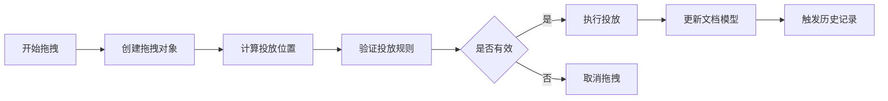
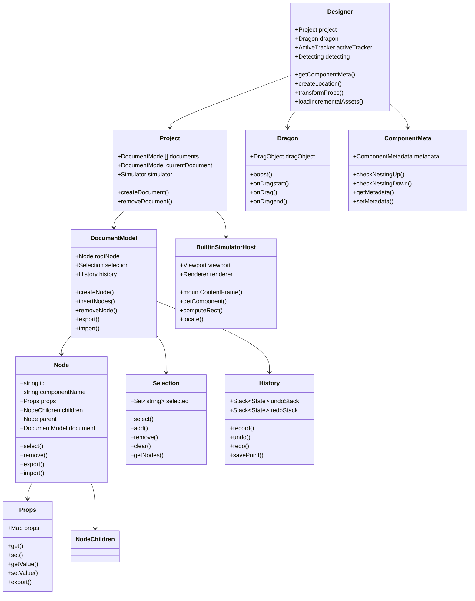

# Designer 模块总览

## 目录

- [模块简介](#模块简介)
- [核心职责](#核心职责)
- [模块结构](#模块结构)
- [关键概念](#关键概念)
- [核心类图](#核心类图)
- [数据模型](#数据模型)
- [事件系统](#事件系统)
- [使用场景](#使用场景)
- [相关文档](#相关文档)

## 模块简介

Designer 模块是 LowCode Engine 的核心设计器模块，负责处理可视化编辑的所有逻辑，包括文档模型管理、节点系统、拖拽系统、选区系统、历史记录、组件元数据管理和模拟器集成。

**包路径**: `packages/designer`

**主要导出**:
```typescript
export * from './component-meta';
export * from './simulator';
export * from './designer';
export * from './document';
export * from './project';
export * from './builtin-simulator';
export * from './plugin';
export * from './types';
export * from './context-menu-actions';
```

## 核心职责

### 1. 文档模型管理
- 管理页面/组件的树形结构
- 处理节点的增删改查
- 维护节点间的父子关系
- 支持 Schema 的导入导出

### 2. 节点系统
- 节点的创建和销毁
- 节点属性管理
- 节点生命周期管理
- 节点状态管理（锁定、隐藏、条件渲染等）

### 3. 拖拽系统
- 处理组件拖拽
- 计算投放位置
- 处理节点移动和复制
- 支持跨文档拖拽

### 4. 选区系统
- 管理当前选中的节点
- 支持多选
- 选区变更通知
- 选区持久化

### 5. 历史记录
- 记录操作历史
- 支持撤销重做
- 历史状态管理
- 历史点标记

### 6. 组件元数据管理
- 组件描述信息
- 组件配置规则
- 组件行为定义
- 组件可用性检查

### 7. 模拟器集成
- 与模拟器通信
- 渲染请求
- 事件转发
- 实例管理

## 模块结构

```
packages/designer/
├── src/
│   ├── designer/                    # 设计器核心
│   │   ├── designer.ts            # Designer 主类
│   │   ├── dragon.ts              # 拖拽系统
│   │   ├── detecting.ts           # 检测系统
│   │   ├── active-tracker.ts      # 活动追踪
│   │   ├── location.ts            # 位置计算
│   │   ├── scroller.ts            # 滚动管理
│   │   ├── offset-observer.ts    # 偏移观察
│   │   ├── setting/              # 设置面板
│   │   └── drag-ghost/          # 拖拽幽灵
│   ├── document/                   # 文档模型
│   │   ├── document-model.ts     # 文档模型
│   │   ├── selection.ts          # 选区管理
│   │   ├── history.ts            # 历史记录
│   │   └── node/                # 节点系统
│   │       ├── node.ts          # 节点类
│   │       ├── node-children.ts # 节点子集
│   │       ├── props/           # 属性系统
│   │       └── modal-nodes-manager.ts
│   ├── builtin-simulator/         # 内置模拟器
│   │   ├── host.ts              # 模拟器宿主
│   │   ├── renderer.ts          # 模拟器渲染器
│   │   ├── viewport.ts          # 视口管理
│   │   ├── resource-consumer.ts # 资源消费者
│   │   ├── bem-tools/           # 边缘工具
│   │   ├── live-editing/        # 实时编辑
│   │   └── node-selector/       # 节点选择器
│   ├── project/                   # 项目管理
│   │   ├── project.ts           # 项目类
│   │   └── project-view.tsx     # 项目视图
│   ├── plugin/                    # 插件系统
│   │   ├── plugin-manager.ts     # 插件管理器
│   │   ├── plugin.ts            # 插件类
│   │   ├── plugin-context.ts    # 插件上下文
│   │   └── plugin-types.ts     # 插件类型
│   ├── component-meta.ts          # 组件元数据
│   ├── simulator.ts               # 模拟器接口
│   ├── component-actions.ts       # 组件操作
│   ├── context-menu-actions.ts    # 上下文菜单
│   ├── transducers/              # 转换器
│   ├── types/                    # 类型定义
│   ├── utils/                    # 工具函数
│   ├── icons/                    # 图标
│   └── locale/                   # 国际化
└── tests/                        # 测试文件
```

## 关键概念

### 1. Document Model (文档模型)
文档模型是描述页面或组件结构的树形数据模型，包含根节点和所有子节点。

**特点**:
- 树形结构
- 可序列化为 Schema
- 支持历史记录
- 独立的文档实例

**示例**:
```typescript
const documentModel = new DocumentModel(project, {
  componentName: 'Page',
  id: 'root',
  fileName: 'home',
  children: [
    {
      componentName: 'Div',
      props: {
        style: { padding: '20px' }
      },
      children: ['Hello World']
    }
  ]
});
```

### 2. Node (节点)
节点是文档模型的基本单元，代表一个组件实例。

**节点类型**:
- `Page`: 页面根节点
- `Component`: 组件根节点
- `Block`: 区块节点
- `Slot`: 插槽节点
- `Leaf`: 叶子节点（文本或表达式）

**节点属性**:
```typescript
interface Node {
  id: string;                    // 节点唯一标识
  componentName: string;          // 组件名称
  props: Props;                  // 属性对象
  children: NodeChildren | null;  // 子节点
  parent: Node | null;           // 父节点
  document: DocumentModel;         // 所属文档
}
```

### 3. Props (属性)
属性系统管理节点的所有属性，包括组件属性和额外属性（如锁定、隐藏等）。

**属性类型**:
- 组件属性: 组件定义的 props
- 额外属性: 系统使用的属性（如 `hidden`, `isLocked`, `condition` 等）
- 指令属性: 控制渲染的属性（如 `loop`, `condition` 等）

**示例**:
```typescript
const props = new Props(node, {
  title: 'Hello',
  style: { color: 'red' },
  // 额外属性
  hidden: false,
  isLocked: false,
  condition: true,
  loop: undefined
});
```

### 4. Selection (选区)
选区管理当前选中的节点集合，支持单选和多选。

**选区操作**:
```typescript
// 选中节点
selection.select(nodeId);

// 添加到选区
selection.add(nodeId);

// 从选区移除
selection.remove(nodeId);

// 清空选区
selection.clear();

// 获取选中的节点
const selectedNodes = selection.getNodes();
```

### 5. Dragon (拖拽系统)
拖拽系统处理组件的拖拽操作，计算投放位置并执行节点移动或复制。

**拖拽流程**:


### 6. History (历史记录)
历史记录系统记录所有可逆的操作，支持撤销和重做。

**历史记录操作**:
```typescript
// 记录操作
history.record(() => {
  // 执行操作
  node.remove();
});

// 撤销
history.undo();

// 重做
history.redo();

// 保存历史点
history.savePoint();

// 检查是否有未保存的修改
history.isSavePoint();
```

### 7. Component Meta (组件元数据)
组件元数据描述组件的各种信息，包括配置规则、行为定义、可用性检查等。

**元数据结构**:
```typescript
interface ComponentMetadata {
  componentName: string;           // 组件名称
  title: string;                   // 组件标题
  description?: string;             // 组件描述
  docUrl?: string;                 // 文档地址
  screenshot?: string;              // 截图地址
  devMode?: 'lowCode' | 'proCode'; // 开发模式
  npm?: NpmInfo;                   // npm 信息
  snippets?: Snippet[];            // 代码片段
  configure?: Configure;            // 配置信息
  props?: PropConfig[];            // 属性配置
  advanced?: Advanced;              // 高级配置
}
```

## 核心类图



## 数据模型

### Schema 结构

```typescript
interface NodeSchema {
  componentName: string;           // 组件名称
  id?: string;                    // 节点 ID
  props?: PropsMap | PropsList;    // 属性
  children?: NodeData[];          // 子节点
  // 额外属性
  hidden?: boolean;                // 是否隐藏
  isLocked?: boolean;             // 是否锁定
  condition?: any;                 // 条件渲染
  loop?: any;                     // 循环渲染
  loopArgs?: string[];            // 循环参数
  title?: string;                  // 标题
  ignored?: boolean;               // 是否忽略
  conditionGroup?: string;         // 条件组
}
```

### Props Map 格式
```typescript
interface PropsMap {
  [key: string]: any;
}

// 示例
{
  title: 'Hello World',
  style: {
    color: 'red',
    fontSize: '16px'
  },
  onClick: {
    type: 'JSFunction',
    value: 'function() { console.log("clicked"); }'
  }
}
```

### Props List 格式
```typescript
interface PropsList {
  name: string;
  value: any;
  export?: boolean;
}

// 示例
[
  { name: 'title', value: 'Hello World' },
  { name: 'style', value: { color: 'red' } }
]
```

## 事件系统

### Designer 事件

```typescript
// 初始化事件
designer.on('init', (designer) => {
  console.log('Designer initialized');
});

// 拖拽开始
designer.on('dragstart', (e) => {
  console.log('Drag started', e.dragObject);
});

// 拖拽中
designer.on('drag', (e) => {
  console.log('Dragging', e.location);
});

// 拖拽结束
designer.on('dragend', (e, loc) => {
  console.log('Drag ended', e, loc);
});

// 投放位置变更
designer.on('dropLocation.change', (loc) => {
  console.log('Drop location changed', loc);
});

// 当前文档变更
designer.on('current-document.change', (doc) => {
  console.log('Current document changed', doc);
});

// 选区变更
designer.on('selection.change', (selection) => {
  console.log('Selection changed', selection);
});

// 历史变更
designer.on('history.change', (history) => {
  console.log('History changed', history);
});
```

### Document Model 事件

```typescript
// 节点创建
documentModel.onNodeCreate((node) => {
  console.log('Node created', node);
});

// 节点销毁
documentModel.onNodeDestroy((node) => {
  console.log('Node destroyed', node);
});

// 节点可见性变更
documentModel.onChangeNodeVisible((node, visible) => {
  console.log('Node visibility changed', node, visible);
});

// 节点子节点变更
documentModel.onChangeNodeChildren((info) => {
  console.log('Node children changed', info);
});
```

### Node 事件

```typescript
// 属性变更
node.onPropChange((info) => {
  console.log('Prop changed', info);
});

// 可见性变更
node.onVisibleChange((visible) => {
  console.log('Visibility changed', visible);
});

// 子节点变更
node.onChildrenChange((info) => {
  console.log('Children changed', info);
});
```

## 使用场景

### 场景 1: 创建新文档

```typescript
// 创建文档模型
const documentModel = designer.project.createDocument({
  componentName: 'Page',
  id: 'page-home',
  fileName: 'home',
  children: []
});

// 设置为当前文档
designer.project.openDocument(documentModel.id);
```

### 场景 2: 添加节点

```typescript
// 创建节点
const node = documentModel.createNode({
  componentName: 'Div',
  props: {
    style: { padding: '20px' }
  },
  children: ['Hello World']
});

// 插入到根节点
const rootNode = documentModel.rootNode;
rootNode.insert(node);
```

### 场景 3: 修改属性

```typescript
// 获取节点
const node = documentModel.getNode('node-id');

// 修改属性
node.setPropValue('title', 'New Title');

// 批量修改
node.mergeProps({
  title: 'New Title',
  style: { color: 'blue' }
});
```

### 场景 4: 拖拽移动

```typescript
// 拖拽节点
designer.dragon.boost({
  type: 'node',
  nodes: [node1, node2]
}, dragStartEvent);

// Dragon 会自动计算投放位置并执行移动
```

### 场景 5: 撤销重做

```typescript
// 撤销
documentModel.history.undo();

// 重做
documentModel.history.redo();

// 检查是否可以撤销
const canUndo = documentModel.history.canUndo();

// 检查是否可以重做
const canRedo = documentModel.history.canRedo();
```

### 场景 6: 导出 Schema

```typescript
// 导出 Schema
const schema = documentModel.export('save');

// 导出为 JSON
const json = JSON.stringify(schema, null, 2);
```

### 场景 7: 导入 Schema

```typescript
// 导入 Schema
documentModel.import(schema);

// 从 JSON 导入
const schema = JSON.parse(jsonString);
documentModel.import(schema);
```

## 相关文档

- [Designer 核心类](./designer-core.md)
- [文档模型](./document-model.md)
- [节点系统](./node-system.md)
- [属性系统](./props-system.md)
- [选区系统](./selection-system.md)
- [历史记录系统](./history-system.md)
- [模拟器宿主](./simulator-host.md)
- [拖拽系统](./drag-drop-system.md)
- [检测系统](./detecting-system.md)
- [插件系统](./plugin-system.md)
- [组件元数据](./component-meta.md)
