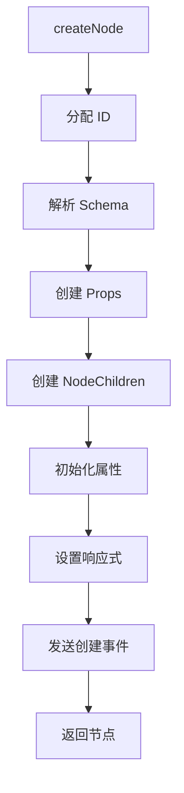
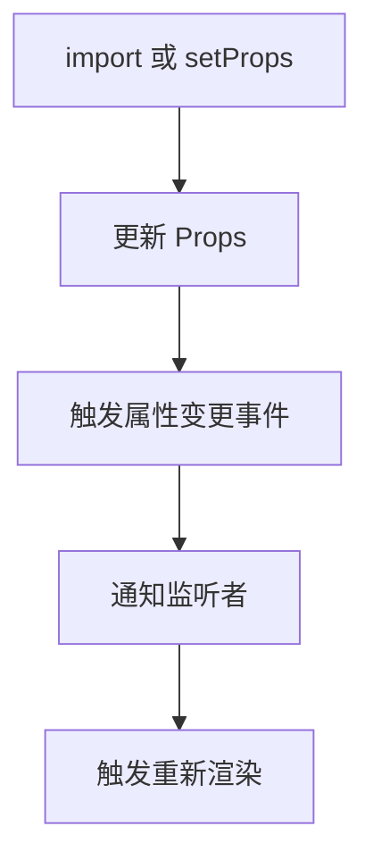
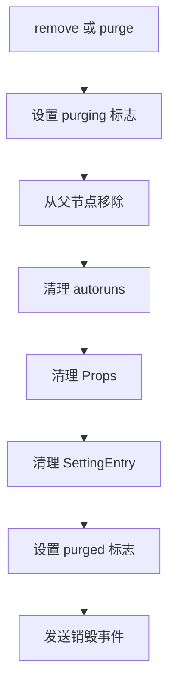
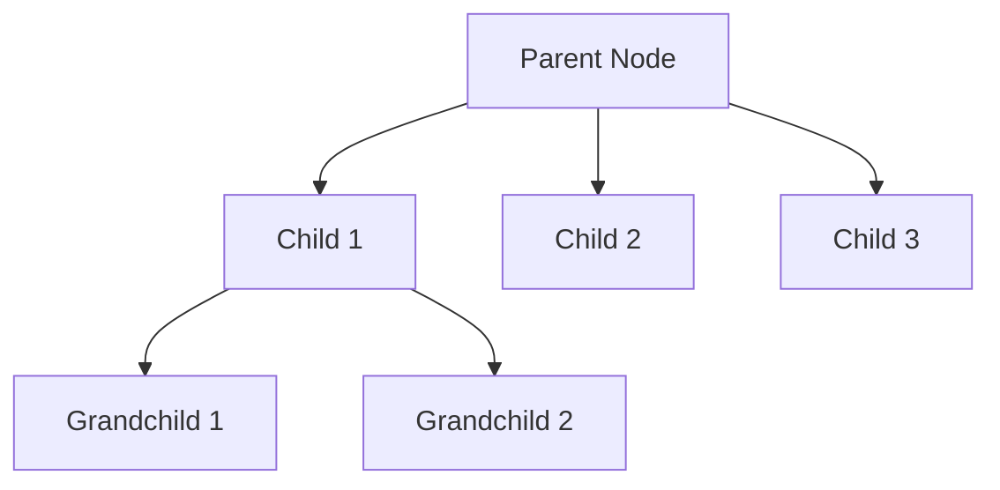

# Node 节点系统详解

## 目录

- [节点概述](#节点概述)
- [Node 类定义](#node-类定义)
- [节点类型](#节点类型)
- [节点属性](#节点属性)
- [节点方法](#节点方法)
- [节点生命周期](#节点生命周期)
- [节点关系](#节点关系)
- [节点状态](#节点状态)
- [使用示例](#使用示例)

## 节点概述

[`Node`](../../packages/designer/src/document/node/node.ts:215) 是文档模型的基本单元，代表一个组件实例，负责管理节点的属性、子节点、生命周期等。

**文件位置**: `packages/designer/src/document/node/node.ts`

**继承关系**: 无

**实现接口**: [`IBaseNode`](../../packages/designer/src/document/node/node.ts:40)

## Node 类定义

```typescript
export class Node<Schema extends NodeSchema = NodeSchema> implements IBaseNode {
  // 基本属性
  readonly isNode = true;
  readonly id: string;
  readonly componentName: string;
  props: IProps;
  protected _children?: INodeChildren;

  // 父子关系
  @obx.ref private _parent: INode | null = null;
  get parent(): INode | null;
  get children(): INodeChildren | null;

  // 计算属性
  @computed get zLevel(): number;
  @computed get title(): string | I18nData | ReactElement;
  get icon(): any;

  // 状态
  isInited = false;
  private _settingEntry: ISettingTopEntry;
  private autoruns?: Array<() => void>;
  private _isRGLContainer = false;
  private _slotFor?: IProp | null | undefined = null;
  @obx.shallow _slots: INode[] = [];
  @obx.ref private _conditionGroup: IExclusiveGroup | null = null;
  private purged = false;
  private purging: boolean = false;
  @obx.shallow status: NodeStatus = {
    inPlaceEditing: false,
    locking: false,
    pseudo: false,
  };

  // 文档引用
  readonly document: IDocumentModel;

  // 构造函数
  constructor(readonly document: IDocumentModel, nodeSchema: Schema);

  // 核心方法
  select(): void;
  remove(useMutator?: boolean, purge?: boolean, options?: NodeRemoveOptions): void;
  lock(flag?: boolean): void;
  hover(flag?: boolean): void;
  setVisible(flag: boolean): void;
  getVisible(): boolean;

  // 属性操作
  getProp(path: string, createIfNone?: boolean): IProp | null;
  getExtraProp(key: string, createIfNone?: boolean): IProp | null;
  setExtraProp(key: string, value: CompositeValue): void;
  getPropValue(path: string): any;
  setPropValue(path: string, value: any): void;
  clearPropValue(path: string): void;
  mergeProps(props: PropsMap): void;
  setProps(props?: PropsMap | PropsList | Props | null): void;

  // 子节点操作
  insert(node: INode, ref?: INode, useMutator?: boolean): void;
  insertBefore(node: INode, ref?: INode, useMutator?: boolean): void;
  insertAfter(node: any, ref?: INode, useMutator?: boolean): void;
  removeChild(node: INode): void;
  replaceChild(node: INode, data: any): INode | null;

  // Schema 操作
  get schema(): Schema;
  set schema(data: Schema);
  import(data: Schema, checkId?: boolean): void;
  export<T = Schema>(stage: TransformStage, options?: any): T;

  // 节点类型判断
  isContainer(): boolean;
  isModal(): boolean;
  isRoot(): boolean;
  isPage(): boolean;
  isComponent(): boolean;
  isSlot(): boolean;
  isParental(): boolean;
  isLeaf(): boolean;
  isEmpty(): boolean;

  // 节点关系
  contains(node: INode): boolean;
  comparePosition(otherNode: INode): PositionNO;
  getZLevelTop(zLevel: number): INode | null;

  // 事件
  onPropChange(func: (info: PropChangeOptions) => void): Disposable;
  onVisibleChange(func: (flag: boolean) => any): () => void;
  onChildrenChange(fn: (param?: { type: string; node: INode }) => void): Disposable | undefined;

  // 其他
  canSelect(): boolean;
  canPerformAction(actionName: string): boolean;
  getComponentName(): string;
  getId(): string;
  getParent(): INode | null;
  getIndex(): number | undefined;
  getChildren(): INodeChildren | null;
  getNode(): INode;
  getRoot(): INode;
  getProps(): IProps;
  purge(): void;
}
```

## 节点类型

### 1. Page Node
页面根节点，代表一个完整的页面。

**特点**:
- 根节点类型
- 包含页面级属性（fileName, meta, state, dataSource, lifeCycles, methods, css）
- 不支持循环和条件渲染

**判断方法**:
```typescript
isPage(): boolean {
  return this.isPageNode;
}

get isPageNode(): boolean {
  return this.isRootNode && this.componentName === 'Page';
}
```

### 2. Component Node
组件根节点，代表一个可复用的组件。

**特点**:
- 根节点类型
- 可以独立渲染
- 不支持循环和条件渲染

**判断方法**:
```typescript
isComponent(): boolean {
  return this.isComponentNode;
}

get isComponentNode(): boolean {
  return this.isRootNode && this.componentName === 'Component';
}
```

### 3. Block Node
区块节点，代表一个可复用的区块。

**特点**:
- 根节点类型
- 可以包含多个页面级属性
- 不支持循环和条件渲染

### 4. Slot Node
插槽节点，用于组件插槽。

**特点**:
- 不支持 props
- 支持子节点
- 有 slotArgs 属性

**判断方法**:
```typescript
isSlot(): boolean {
  return this.isSlotNode;
}

get isSlotNode(): boolean {
  return this._slotFor != null && this.componentName === 'Slot';
}
```

### 5. Leaf Node
叶子节点，代表文本或表达式。

**特点**:
- 不支持子节点
- 只有 children 属性
- componentName 为 'Leaf'

**判断方法**:
```typescript
isLeaf(): boolean {
  return this.isLeafNode;
}

get isLeafNode(): boolean {
  return this.componentName === 'Leaf';
}
```

## 节点属性

### 1. id: string
节点唯一标识符。

```typescript
readonly id: string;
```

**说明**:
- 自动生成或从 Schema 获取
- 在文档内唯一
- 用于节点查找和引用

### 2. componentName: string
组件名称。

```typescript
readonly componentName: string;
```

**说明**:
- 标识组件类型
- 用于查找组件元数据
- 用于渲染器选择组件

### 3. props: IProps
属性对象。

```typescript
props: IProps;
```

**说明**:
- 管理所有属性
- 包括组件属性和额外属性
- 支持属性查询和修改

### 4. parent: INode | null
父节点。

```typescript
@obx.ref private _parent: INode | null = null;
get parent(): INode | null {
  return this._parent;
}
```

**说明**:
- 根节点的 parent 为 null
- 用于向上遍历节点树
- 响应式属性

### 5. children: INodeChildren | null
子节点集合。

```typescript
protected _children?: INodeChildren;
get children(): INodeChildren | null {
  return this._children || null;
}
```

**说明**:
- Leaf 节点的 children 为 null
- 管理子节点的增删改查
- 响应式属性

### 6. document: IDocumentModel
所属文档。

```typescript
readonly document: IDocumentModel;
```

**说明**:
- 节点所属的文档
- 用于访问文档级功能
- 用于获取组件元数据

### 7. zLevel: number
节点深度。

```typescript
@computed get zLevel(): number {
  if (this._parent) {
    return this._parent.zLevel + 1;
  }
  return 0;
}
```

**说明**:
- 根节点的 zLevel 为 0
- 每增加一层深度加 1
- 用于节点比较和操作

### 8. title: string | I18nData | ReactElement
节点标题。

```typescript
@computed get title(): string | I18nData | ReactElement {
  let t = this.getExtraProp('title');
  if (t) {
    const v = t.getAsString();
    if (v) {
      return v;
    }
  }
  return this.componentMeta.title;
}
```

**说明**:
- 优先使用 title 属性
- 其次使用组件元数据的 title
- 支持国际化

### 9. icon: any
节点图标。

```typescript
get icon(): any {
  return this.componentMeta.icon;
}
```

**说明**:
- 从组件元数据获取
- 用于 UI 显示

### 10. status: NodeStatus
节点状态。

```typescript
@obx.shallow status: NodeStatus = {
  inPlaceEditing: false,
  locking: false,
  pseudo: false,
};
```

**状态类型**:
```typescript
interface NodeStatus {
  locking: boolean;      // 是否锁定
  pseudo: boolean;       // 是否为伪节点
  inPlaceEditing: boolean; // 是否在位编辑中
}
```

## 节点方法

### 1. select()

选中节点。

```typescript
select(): void
```

**实现逻辑**:
```typescript
select() {
  this.document.selection.select(this.id);
}
```

**使用示例**:
```typescript
node.select();
```

### 2. remove()

移除节点。

```typescript
remove(useMutator = true, purge = true, options: NodeRemoveOptions = { suppressRemoveEvent: false }): void
```

**参数**:
- `useMutator`: 是否触发联动逻辑
- `purge`: 是否清理节点
- `options`: 移除选项

**实现逻辑**:
```typescript
remove(useMutator = true, purge = true, options: NodeRemoveOptions = { suppressRemoveEvent: false }) {
  if (this.parent) {
    if (!options.suppressRemoveEvent) {
      this.document.designer.editor?.eventBus.emit('node.remove.topLevel', {
        node: this,
        index: this.parent?.children?.indexOf(this),
      });
    }
    if (this.isSlot()) {
      this.parent.removeSlot(this);
      this.parent.children?.internalDelete(this, purge, useMutator, { suppressRemoveEvent: true });
    } else {
      this.parent.children?.internalDelete(this, purge, useMutator, { suppressRemoveEvent: true });
    }
  }
}
```

### 3. lock()

锁定节点。

```typescript
lock(flag = true): void
```

**参数**:
- `flag`: 是否锁定

**实现逻辑**:
```typescript
lock(flag = true) {
  this.setExtraProp('isLocked', flag);
}
```

**使用示例**:
```typescript
// 锁定节点
node.lock();

// 解锁节点
node.lock(false);
```

### 4. hover()

悬停高亮。

```typescript
hover(flag = true): void
```

**参数**:
- `flag`: 是否高亮

**实现逻辑**:
```typescript
hover(flag = true) {
  if (flag) {
    this.document.designer.detecting.capture(this);
  } else {
    this.document.designer.detecting.release(this);
  }
}
```

### 5. setVisible()

设置可见性。

```typescript
setVisible(flag: boolean): void
```

**参数**:
- `flag`: 是否可见

**实现逻辑**:
```typescript
setVisible(flag: boolean): void {
  this.getExtraProp('hidden')?.setValue(!flag);
  this.emitter.emit('visibleChange', flag);
}
```

### 6. getProp()

获取属性。

```typescript
getProp(path: string, createIfNone = true): IProp | null
```

**参数**:
- `path`: 属性路径
- `createIfNone`: 不存在时是否创建

**返回值**: 属性对象

### 7. setPropValue()

设置属性值。

```typescript
setPropValue(path: string, value: any): void
```

**参数**:
- `path`: 属性路径
- `value`: 属性值

**实现逻辑**:
```typescript
setPropValue(path: string, value: any): void {
  this.getProp(path, true)!.setValue(value);
}
```

### 8. mergeProps()

合并属性。

```typescript
mergeProps(props: PropsMap): void
```

**参数**:
- `props`: 要合并的属性

**实现逻辑**:
```typescript
mergeProps(props: PropsMap): void {
  this.props.merge(props);
}
```

### 9. insert()

插入节点。

```typescript
insert(node: INode, ref?: INode, useMutator = true): void
```

**参数**:
- `node`: 要插入的节点
- `ref`: 参考节点
- `useMutator`: 是否触发联动逻辑

**实现逻辑**:
```typescript
insert(node: INode, ref?: INode, useMutator = true): void {
  this.insertAfter(node, ref, useMutator);
}
```

### 10. insertBefore()

在参考节点前插入。

```typescript
insertBefore(node: INode, ref?: INode, useMutator = true): void
```

### 11. insertAfter()

在参考节点后插入。

```typescript
insertAfter(node: any, ref?: INode, useMutator = true): void
```

### 12. export()

导出 Schema。

```typescript
export<T = Schema>(stage: TransformStage = TransformStage.Save, options: any = {}): T
```

**参数**:
- `stage`: 导出阶段
- `options`: 导出选项

**返回值**: Schema 数据

**实现逻辑**:
```typescript
export<T = Schema>(stage: TransformStage = TransformStage.Save, options: any = {}): T {
  stage = compatStage(stage);
  const baseSchema: any = {
    componentName: this.componentName,
  };

  if (stage !== TransformStage.Clone) {
    baseSchema.id = this.id;
  }
  if (stage === TransformStage.Render) {
    baseSchema.docId = this.document.id;
  }

  if (this.isLeaf()) {
    if (!options.bypassChildren) {
      baseSchema.children = this.props.get('children')?.export(stage);
    }
    return baseSchema;
  }

  const { props = {}, extras } = this.props.export(stage) || {};
  const _extras_: { [key: string]: any } = {
    ...extras,
  };

  const schema: any = {
    ...baseSchema,
    props: this.document.designer.transformProps(props, this, stage),
    ...this.document.designer.transformProps(_extras_, this, stage),
  };

  if (this.isParental() && this.children && this.children.size > 0 && !options.bypassChildren) {
    schema.children = this.children.export(stage);
  }

  return schema;
}
```

### 13. import()

导入 Schema。

```typescript
import(data: Schema, checkId = false): void
```

**参数**:
- `data`: Schema 数据
- `checkId`: 是否检查 ID

**实现逻辑**:
```typescript
import(data: Schema, checkId = false): void {
  const { componentName, id, children, props, ...extras } = data;

  if (this.isSlot()) {
    foreachReverse(
      this.children!,
      (subNode: INode) => {
        subNode.remove(true, true);
      },
      (iterable, idx) => (iterable as INodeChildren).get(idx),
    );
  }

  if (this.isParental()) {
    this.props.import(props, extras);
    this._children?.import(children, checkId);
  } else {
    this.props
      .get('children', true)!
      .setValue(isDOMText(children) || isJSExpression(children) ? children : '');
  }
}
```

### 14. contains()

检查是否包含节点。

```typescript
contains(node: INode): boolean
```

**参数**:
- `node`: 要检查的节点

**返回值**: 是否包含

**实现逻辑**:
```typescript
contains(node: INode): boolean {
  return contains(this, node);
}

export function contains(node1: INode, node2: INode): boolean {
  if (node1 === node2) {
    return true;
  }

  if (!node1.isParentalNode || !node2.parent) {
    return false;
  }

  const p = getZLevelTop(node2, node1.zLevel);
  if (!p) {
    return false;
  }

  return node1 === p;
}
```

### 15. comparePosition()

比较节点位置。

```typescript
comparePosition(otherNode: INode): PositionNO
```

**参数**:
- `otherNode`: 要比较的节点

**返回值**: 位置关系

**位置关系**:
```typescript
export enum PositionNO {
  Contains = 16,      // node1 包含 node2
  ContainedBy = 8,    // node1 被包含于 node2
  BeforeOrAfter = 2,   // node1 在 node2 前或后
  TheSame = 0,        // node1 与 node2 相同
}
```

### 16. purge()

清理节点。

```typescript
purge(): void
```

**实现逻辑**:
```typescript
purge(): void {
  if (this.purged) {
    return;
  }
  this.purged = true;
  this.autoruns?.forEach((dispose) => dispose());
  this.props.purge();
  this.settingEntry?.purge();
}
```

## 节点生命周期

### 1. 创建阶段



### 2. 更新阶段



### 3. 销毁阶段



## 节点关系

### 父子关系



### 兄弟关系

```typescript
// 获取上一个兄弟节点
const prevSibling = node.prevSibling;

// 获取下一个兄弟节点
const nextSibling = node.nextSibling;

// 获取索引
const index = node.index;
```

### 祖先关系

```typescript
// 获取特定深度的祖先节点
const ancestor = node.getZLevelTop(2);

// 获取根节点
const root = node.getRoot();
```

## 节点状态

### 1. Locking (锁定)

**说明**: 节点被锁定后，不能被选中、悬停、拖拽。

**设置方法**:
```typescript
node.lock(true);  // 锁定
node.lock(false); // 解锁
```

**检查方法**:
```typescript
const isLocked = node.isLocked;
```

### 2. Hidden (隐藏)

**说明**: 节点被隐藏后，在画布上不可见。

**设置方法**:
```typescript
node.setVisible(false); // 隐藏
node.setVisible(true);  // 显示
```

**检查方法**:
```typescript
const isVisible = node.getVisible();
```

### 3. Condition (条件渲染)

**说明**: 节点根据条件决定是否渲染。

**设置方法**:
```typescript
node.setExtraProp('condition', true);  // 渲染
node.setExtraProp('condition', false); // 不渲染
```

**检查方法**:
```typescript
const hasCondition = node.hasCondition();
```

### 4. Loop (循环渲染)

**说明**: 节点根据数组循环渲染。

**设置方法**:
```typescript
node.setExtraProp('loop', [1, 2, 3]);
node.setExtraProp('loopArgs', ['item', 'index']);
```

**检查方法**:
```typescript
const hasLoop = node.hasLoop();
```

## 使用示例

### 示例 1: 创建节点

```typescript
// 创建普通节点
const node = documentModel.createNode({
  componentName: 'Div',
  props: {
    style: { padding: '20px' }
  },
  children: ['Hello World']
});

// 创建文本节点
const textNode = documentModel.createNode('Hello World');

// 创建带 ID 的节点
const nodeWithId = documentModel.createNode({
  componentName: 'Button',
  id: 'button-1',
  props: {
    type: 'primary'
  }
});
```

### 示例 2: 修改属性

```typescript
// 获取属性
const titleProp = node.getProp('title');
const titleValue = titleProp?.getValue();

// 设置属性值
node.setPropValue('title', 'New Title');

// 批量修改属性
node.mergeProps({
  title: 'New Title',
  style: { color: 'blue' }
});

// 清除属性值
node.clearPropValue('title');
```

### 示例 3: 操作子节点

```typescript
// 插入节点
const childNode = documentModel.createNode({
  componentName: 'Div',
  children: ['Child']
});
node.insert(childNode);

// 在参考节点前插入
node.insertBefore(childNode, refNode);

// 在参考节点后插入
node.insertAfter(childNode, refNode);

// 移除子节点
node.removeChild(childNode);

// 替换子节点
node.replaceChild(oldChild, newChildSchema);
```

### 示例 4: 节点关系操作

```typescript
// 检查是否包含节点
const contains = node.contains(otherNode);

// 比较位置
const position = node.comparePosition(otherNode);
if (position === PositionNO.Contains) {
  console.log('Node contains other node');
}

// 获取祖先节点
const ancestor = node.getZLevelTop(2);

// 获取根节点
const root = node.getRoot();
```

### 示例 5: 节点状态操作

```typescript
// 锁定节点
node.lock(true);
const isLocked = node.isLocked;

// 设置可见性
node.setVisible(false);
const isVisible = node.getVisible();

// 设置条件渲染
node.setExtraProp('condition', true);

// 设置循环渲染
node.setExtraProp('loop', [1, 2, 3]);
node.setExtraProp('loopArgs', ['item', 'index']);
```

### 示例 6: 导出 Schema

```typescript
// 导出为保存格式
const schema = node.export('save');

// 导出为序列化格式
const schema = node.export('serilize');

// 导出为渲染格式
const schema = node.export('render');

// 导出为 JSON
const json = JSON.stringify(schema, null, 2);
```

### 示例 7: 监听节点事件

```typescript
// 监听属性变更
node.onPropChange((info) => {
  console.log('Prop changed:', info);
});

// 监听可见性变更
node.onVisibleChange((visible) => {
  console.log('Visibility changed:', visible);
});

// 监听子节点变更
node.onChildrenChange((info) => {
  console.log('Children changed:', info);
});
```

## 相关文档

- [Designer 模块总览](./index.md)
- [文档模型](./document-model.md)
- [属性系统](./props-system.md)
- [选区系统](./selection-system.md)
- [历史记录系统](./history-system.md)
