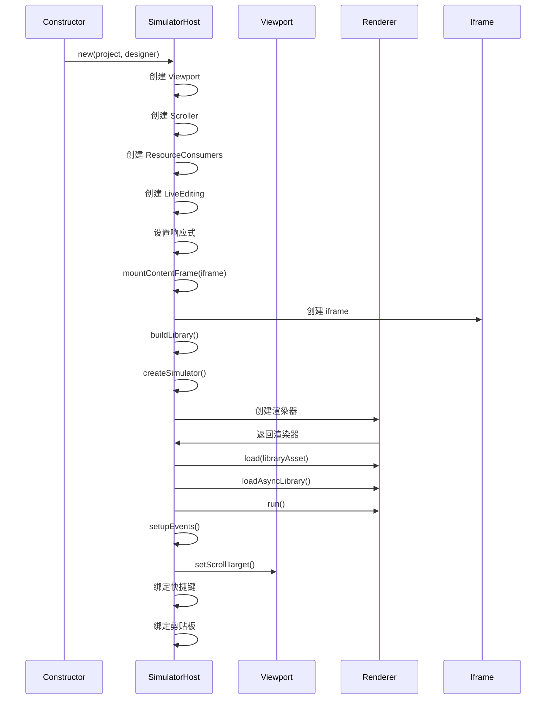
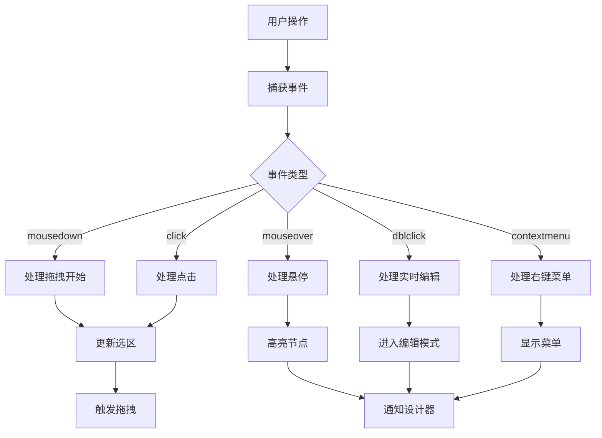
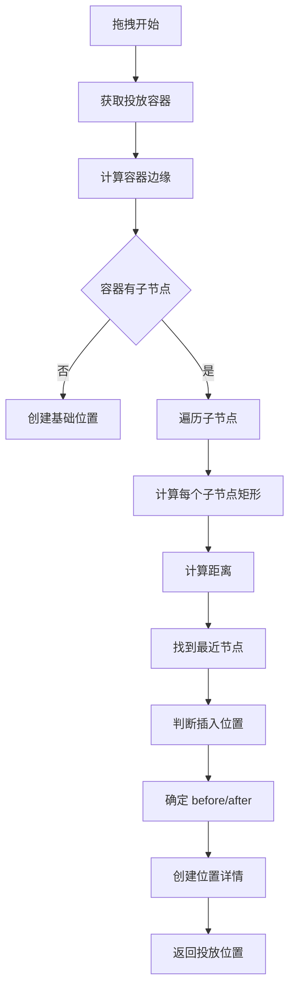

# Builtin Simulator Host 模拟器宿主详解

## 目录

- [模块概述](#模块概述)
- [类定义](#类定义)
- [核心属性](#核心属性)
- [核心方法](#核心方法)
- [初始化流程](#初始化流程)
- [事件处理](#事件处理)
- [拖拽定位](#拖拽定位)
- [组件管理](#组件管理)
- [实例管理](#实例管理)
- [使用示例](#使用示例)

## 模块概述

[`BuiltinSimulatorHost`](../../packages/designer/src/builtin-simulator/host.ts:142) 是内置模拟器的宿主类，负责管理模拟器的生命周期、事件处理、组件渲染、拖拽定位等。

**文件位置**: `packages/designer/src/builtin-simulator/host.ts`

**继承关系**: 无

**实现接口**: [`ISimulatorHost`](../../packages/designer/src/simulator.ts:18)

## 类定义

```typescript
export class BuiltinSimulatorHost implements ISimulatorHost<BuiltinSimulatorProps> {
  // 基本属性
  readonly isSimulator = true;
  readonly project: IProject;
  readonly designer: IDesigner;
  readonly viewport = new Viewport();
  readonly scroller: IScroller;
  readonly emitter: IEventBus = createModuleEventBus('BuiltinSimulatorHost');
  readonly componentsConsumer: ResourceConsumer<Asset | undefined>;
  readonly injectionConsumer: ResourceConsumer;
  readonly i18nConsumer: ResourceConsumer;

  // 自动渲染
  autoRender = true;

  // 渲染器
  private _renderer?: BuiltinSimulatorRenderer;
  get renderer(): BuiltinSimulatorRenderer | undefined;

  // 异步库映射
  readonly asyncLibraryMap: { [key: string]: {} } = {};
  readonly libraryMap: { [key: string]: string } = {};

  // Iframe
  private _iframe?: HTMLIFrameElement;
  @obx.ref private _contentWindow?: Window;
  @obx.ref private _contentDocument?: Document;
  get contentWindow(): Window | undefined;
  get contentDocument(): Document | undefined;

  // 实例映射
  @obx private instancesMap: {
    [docId: string]: Map<string, ComponentInstance[]>;
  } = {};

  // 状态
  @obx.ref private _props: BuiltinSimulatorProps = {};
  @obx.ref private _appHelper?: any;
  private _sensorAvailable = true;
  private sensing = false;

  // 实时编辑
  readonly liveEditing = new LiveEditing();

  // 构造函数
  constructor(project: Project, designer: Designer);

  // 核心方法
  setProps(props: BuiltinSimulatorProps): void;
  set(key: string, value: any): void;
  get(key: string): any;
  connect(renderer: BuiltinSimulatorRenderer, effect: (reaction: IReactionPublic) => void, options?: IReactionOptions): IReactionDisposer;
  reaction(expression: (reaction: IReactionPublic) => unknown, effect: (value: unknown, prev: unknown, reaction: IReactionPublic) => void, opts?: IReactionOptions | undefined): IReactionDisposer;
  autorun(effect: (reaction: IReactionPublic) => void, options?: IReactionOptions): IReactionDisposer;
  purge(): void;
  mountViewport(viewport: HTMLElement | null): void;
  mountContentFrame(iframe: HTMLIFrameElement | null): Promise<void>;
  setupComponents(library: LibraryItem[]): Promise<void>;
  setupEvents(): void;
  buildLibrary(library?: LibraryItem[]): AssetList;
  rerender(): void;

  // 组件管理
  generateComponentMetadata(componentName: string): ComponentMetadata;
  getComponent(componentName: string): Component | null;
  createComponent(schema: ComponentSchema): Component | null;
  setInstance(docId: string, id: string, instances: ComponentInstance[] | null): void;
  getComponentInstances(node: INode, context?: NodeInstance): ComponentInstance[] | null;
  getComponentContext(node: Node): any;
  getClosestNodeInstance(from: ComponentInstance, specId?: string): NodeInstance<ComponentInstance, INode> | null;

  // 计算方法
  computeRect(node: INode): Rect | null;
  computeComponentInstanceRect(instance: ComponentInstance, selector?: string): Rect | null;
  findDOMNodes(instance: ComponentInstance, selector?: string): Array<Element | Text> | null;
  getNodeInstanceFromElement(target: Element | null): NodeInstance<ComponentInstance, INode> | null;

  // 拖拽定位
  locate(e: LocateEvent): any;
  getDropContainer(e: LocateEvent): DropContainer | null;
  fixEvent(e: LocateEvent): LocateEvent;
  isEnter(e: LocateEvent): boolean;
  deactiveSensor(): void;

  // 滚动
  scrollToNode(node: Node, detail?: any): void;

  // 状态管理
  setNativeSelection(enableFlag: boolean): void;
  setDraggingState(state: boolean): void;
  setCopyState(state: boolean): void;
  clearState(): void;
  setSuspense(_suspended: boolean): boolean;
}
```

## 核心属性

### 1. project: IProject
项目实例。

```typescript
readonly project: IProject;
```

### 2. designer: IDesigner
设计器实例。

```typescript
readonly designer: IDesigner;
```

### 3. viewport: Viewport
视口管理器。

```typescript
readonly viewport = new Viewport();
```

**说明**:
- 管理模拟器的视口
- 处理坐标转换
- 管理滚动状态

### 4. renderer: BuiltinSimulatorRenderer | undefined
模拟器渲染器。

```typescript
private _renderer?: BuiltinSimulatorRenderer;
get renderer(): BuiltinSimulatorRenderer | undefined {
  return this._renderer;
}
```

### 5. instancesMap: Map<string, Map<string, ComponentInstance[]>>
组件实例映射。

```typescript
@obx private instancesMap: {
  [docId: string]: Map<string, ComponentInstance[]>;
} = {};
```

**说明**:
- 按文档 ID 组织
- 每个文档维护节点到实例的映射
- 支持多实例场景

### 6. contentWindow: Window | undefined
Iframe 的 contentWindow。

```typescript
@obx.ref private _contentWindow?: Window;
get contentWindow(): Window | undefined {
  return this._contentWindow;
}
```

### 7. contentDocument: Document | undefined
Iframe 的 contentDocument。

```typescript
@obx.ref private _contentDocument?: Document;
get contentDocument(): Document | undefined {
  return this._contentDocument;
}
```

## 核心方法

### 1. mountContentFrame()

挂载内容框架（Iframe）。

```typescript
async mountContentFrame(iframe: HTMLIFrameElement | null): Promise<void>
```

**参数**:
- `iframe`: Iframe 元素

**返回值**: Promise

**实现逻辑**:
```typescript
async mountContentFrame(iframe: HTMLIFrameElement | null): Promise<void> {
  // 1. 检查 Iframe
  if (!iframe || this._iframe === iframe) {
    return;
  }
  this._iframe = iframe;

  // 2. 获取 window 和 document
  this._contentWindow = iframe.contentWindow!;
  this._contentDocument = this._contentWindow.document;

  // 3. 构建库资源
  const libraryAsset: AssetList = this.buildLibrary();

  // 4. 准备环境资源
  const vendors = [
    assetBundle(
      this.get('environment') || defaultEnvironment,
      AssetLevel.Environment,
    ),
    assetBundle(this.get('extraEnvironment'), AssetLevel.Environment),
    assetBundle(libraryAsset, AssetLevel.Library),
    assetBundle(this.theme, AssetLevel.Theme),
    assetBundle(
      this.get('simulatorUrl') || defaultSimulatorUrl,
      AssetLevel.Runtime,
    ),
  ];

  // 5. 创建模拟器
  const renderer = await createSimulator(this, iframe, vendors);

  // 6. 等待组件消费
  await this.componentsConsumer.waitFirstConsume();
  await this.injectionConsumer.waitFirstConsume();

  // 7. 加载异步库
  if (Object.keys(this.asyncLibraryMap).length > 0) {
    await renderer.loadAsyncLibrary(this.asyncLibraryMap);
    Object.keys(this.asyncLibraryMap).forEach((key) => {
      delete this.asyncLibraryMap[key];
    });
  }

  // 8. 运行渲染器
  renderer.run();

  // 9. 设置事件和覆盖层
  this.viewport.setScrollTarget(this._contentWindow);
  this.setupEvents();

  // 10. 绑定快捷键和剪贴板
  const hotkey = this.designer.editor.get('innerHotkey');
  hotkey.mount(this._contentWindow);
  const innerSkeleton = this.designer.editor.get('skeleton');
  innerSkeleton.focusTracker.mount(this._contentWindow);
  clipboard.injectCopyPaster(this._contentDocument);
}
```

### 2. setupComponents()

设置组件库。

```typescript
async setupComponents(library: LibraryItem[]): Promise<void>
```

**参数**:
- `library`: 库配置数组

**实现逻辑**:
```typescript
async setupComponents(library: LibraryItem[]): Promise<void> {
  const libraryAsset: AssetList = this.buildLibrary(library);
  await this.renderer?.load(libraryAsset);
  if (Object.keys(this.asyncLibraryMap).length > 0) {
    await this.renderer?.loadAsyncLibrary(this.asyncLibraryMap);
    Object.keys(this.asyncLibraryMap).forEach((key) => {
      delete this.asyncLibraryMap[key];
    });
  }
}
```

### 3. setupEvents()

设置事件监听。

```typescript
setupEvents(): void
```

**实现逻辑**:
```typescript
setupEvents(): void {
  // 1. 设置拖拽和点击
  this.setupDragAndClick();

  // 2. 设置悬停检测
  this.setupDetecting();

  // 3. 设置实时编辑
  this.setupLiveEditing();

  // 4. 设置上下文菜单
  this.setupContextMenu();
}
```

### 4. setupDragAndClick()

设置拖拽和点击事件。

```typescript
setupDragAndClick(): void
```

**实现逻辑**:
```typescript
setupDragAndClick(): void {
  const { designer } = this;
  const doc = this.contentDocument!;

  // 1. 监听 mousedown
  doc.addEventListener('mousedown', (downEvent: MouseEvent) => {
    // 触发 document 的 mousedown
    document.dispatchEvent(new Event('mousedown'));

    const documentModel = this.project.currentDocument;
    if (this.liveEditing.editing || !documentModel) {
      return;
    }

    const { selection } = documentModel;
    let isMulti = false;

    // 2. 检查多选
    if (this.designMode === 'design') {
      isMulti = downEvent.metaKey || downEvent.ctrlKey;
    } else if (!downEvent.metaKey) {
      return;
    }

    // 3. 移除 label-for
    downEvent.target?.removeAttribute('for');

    // 4. 获取节点
    const nodeInst = this.getNodeInstanceFromElement(downEvent.target);
    const { focusNode } = documentModel;
    const node = getClosestClickableNode(nodeInst?.node || focusNode, downEvent);

    if (!node) {
      return;
    }

    // 5. 触发 onMouseDownHook
    const onMouseDownHook = node.componentMeta.advanced.callbacks?.onMouseDownHook;
    if (onMouseDownHook) {
      onMouseDownHook(downEvent, node.internalToShellNode());
    }

    // 6. 处理 RGL 节点
    const rglNode = node?.getParent();
    const isRGLNode = rglNode?.isRGLContainer;
    if (isRGLNode) {
      if (downEvent.target?.classList.contains('react-resizable-handle')) return;
      isMulti = false;
      designer.dragon.emitter.emit('rgl.switch', {
        action: 'start',
        rglNode,
      });
    } else {
      downEvent.stopPropagation();
      downEvent.preventDefault();
    }

    // 7. 检查是否为左键
    const isLeftButton = downEvent.which === 1 || downEvent.button === 0;

    // 8. 检查选择
    const checkSelect = (e: MouseEvent) => {
      doc.removeEventListener('mouseup', checkSelect, true);
      designer.dragon.emitter.emit('rgl.switch', {
        action: 'end',
        rglNode,
      });

      // 9. 检查是否移动
      if (!isShaken(downEvent, e) || isRGLNode) {
        let { id } = node;
        designer.activeTracker.track({ node, instance: nodeInst?.instance });

        if (isMulti && focusNode && !node.contains(focusNode) && selection.has(id)) {
          selection.remove(id);
        } else {
          if (node.isPage() && node.getChildren()?.notEmpty() && this.designMode === 'live') {
            const firstChildId = node.getChildren()?.get(0)?.getId();
            if (firstChildId) id = firstChildId;
          }
          if (focusNode) {
            selection.select(node.contains(focusNode) ? focusNode.id : id);
          }

          const editor = this.designer?.editor;
          const npm = node?.componentMeta?.npm;
          const selected =
            [npm?.package, npm?.componentName].filter((item) => !!item).join('-') ||
            node?.componentMeta?.componentName ||
            '';
          editor?.eventBus.emit('designer.builtinSimulator.select', {
            selected,
          });
        }
      }

      // 10. 处理多选
      if (isLeftButton && focusNode && !node.contains(focusNode)) {
        let nodes: INode[] = [node];
        let ignoreUpSelected = false;

        if (isMulti) {
          if (!selection.has(node.id)) {
            designer.activeTracker.track({ node, instance: nodeInst?.instance });
            selection.add(node.id);
            ignoreUpSelected = true;
          }
          focusNode?.id && selection.remove(focusNode.id);
          nodes = selection.getTopNodes();
        } else if (selection.containsNode(node, true)) {
          nodes = selection.getTopNodes();
        }

        // 11. 开始拖拽
        designer.dragon.boost(
          {
            type: DragObjectType.Node,
            nodes,
          },
          downEvent,
          isRGLNode ? rglNode : undefined,
        );

        if (ignoreUpSelected) {
          return;
        }
      }

      doc.addEventListener('mouseup', checkSelect, true);
    };

    // 12. 监听 mouseup
    if (isLeftButton && focusNode && !node.contains(focusNode)) {
      doc.addEventListener('mouseup', checkSelect, true);
    }
  }, true);

  // 13. 监听 click
  doc.addEventListener('click', (e) => {
    // 触发 document 的 click
    const x = new Event('click');
    x.initEvent('click', true);
    this._iframe?.dispatchEvent(x);

    const { target } = e;

    // 14. 忽略表单元素
    const customizeIgnoreSelectors = engineConfig.get('customizeIgnoreSelectors');
    const defaultIgnoreSelectors: string[] = [
      '.next-input-group',
      '.next-checkbox-group',
      '.next-checkbox-wrapper',
      '.next-date-picker',
      '.next-input',
      '.next-month-picker',
      '.next-number-picker',
      '.next-radio-group',
      '.next-range',
      '.next-range-picker',
      '.next-rating',
      '.next-select',
      '.next-switch',
      '.next-time-picker',
      '.next-upload',
      '.next-year-picker',
      '.next-breadcrumb-item',
      '.next-calendar-header',
      '.next-calendar-table',
      '.editor-container',
    ];
    const ignoreSelectors = customizeIgnoreSelectors?.(defaultIgnoreSelectors, e) || defaultIgnoreSelectors;
    const ignoreSelectorsString = ignoreSelectors.join(',');

    if ((!customizeIgnoreSelectors && isFormEvent(e)) || target?.closest(ignoreSelectorsString)) {
      e.preventDefault();
      e.stopPropagation();
    }
  }, true);
}
```

### 5. locate()

定位拖拽投放位置。

```typescript
locate(e: LocateEvent): any
```

**参数**:
- `e`: 定位事件

**返回值**: 投放位置

**实现逻辑**:
```typescript
locate(e: LocateEvent): any {
  const { dragObject } = e;
  const nodes = dragObject?.nodes;

  // 1. 过滤可操作的节点
  const operationalNodes = nodes?.filter((node) => {
    const onMoveHook = node.componentMeta?.advanced.callbacks?.onMoveHook;
    const canMove = onMoveHook && typeof onMoveHook === 'function' ? onMoveHook(node.internalToShellNode()) : true;

    let parentContainerNode: INode | null = null;
    let parentNode = node.parent;

    while (parentNode) {
      if (parentNode.isContainer()) {
        parentContainerNode = parentNode;
        break;
      }
      parentNode = parentNode.parent;
    }

    const onChildMoveHook = parentContainerNode?.componentMeta?.advanced.callbacks?.onChildMoveHook;
    const childrenCanMove = onChildMoveHook && parentContainerNode && typeof onChildMoveHook === 'function' ? onChildMoveHook(node.internalToShellNode(), parentContainerNode.internalToShellNode()) : true;

    return canMove && childrenCanMove;
  });

  if (nodes && (!operationalNodes || operationalNodes.length === 0)) {
    return;
  }

  this.sensing = true;
  this.scroller.scrolling(e);
  const document = this.project.currentDocument;
  if (!document) {
    return null;
  }

  // 2. 获取投放容器
  const dropContainer = this.getDropContainer(e);
  const lockedNode = getClosestNode(dropContainer?.container, (node) => node.isLocked);
  if (lockedNode) return null;

  if (!dropContainer) {
    return null;
  }

  // 3. 处理位置数据
  if (isLocationData(dropContainer)) {
    return this.designer.createLocation(dropContainer);
  }

  const { container, instance: containerInstance } = dropContainer;

  // 4. 计算边缘
  const edge = this.computeComponentInstanceRect(
    containerInstance,
    container.componentMeta.rootSelector,
  );

  if (!edge) {
    return null;
  }

  const { children } = container;

  // 5. 创建位置详情
  const detail: LocationChildrenDetail = {
    type: LocationDetailType.Children,
    index: 0,
    edge,
  };

  const locationData = {
    target: container,
    detail,
    source: `simulator${document.id}`,
    event: e,
  };

  // 6. 处理模态节点
  if (
    e.dragObject &&
    e.dragObject.nodes &&
    e.dragObject.nodes.length &&
    e.dragObject.nodes[0].componentMeta.isModal &&
    document.focusNode
  ) {
    return this.designer.createLocation({
      target: document.focusNode,
      detail,
      source: `simulator${document.id}`,
      event: e,
    });
  }

  // 7. 处理空容器
  if (!children || children.size < 1 || !edge) {
    return this.designer.createLocation(locationData);
  }

  // 8. 计算最近节点
  let nearRect: Rect | null = null;
  let nearIndex: number = 0;
  let nearNode: INode | null = null;
  let nearDistance: number | null = null;
  let minTop: number | null = null;
  let maxBottom: number | null = null;

  for (let i = 0, l = children.size; i < l; i++) {
    const node = children.get(i)!;
    const index = i;
    const instances = this.getComponentInstances(node);
    const inst = instances
      ? instances.length > 1
        ? instances.find(
            (_inst) => this.getClosestNodeInstance(_inst, container.id)?.instance === containerInstance,
          )
        : instances[0]
      : null;
    const rect = inst
      ? this.computeComponentInstanceRect(inst, node.componentMeta.rootSelector)
      : null;

    if (!rect) {
      continue;
    }

    const distance = isPointInRect(e as any, rect) ? 0 : distanceToRect(e as any, rect);

    if (distance === 0) {
      nearDistance = distance;
      nearNode = node;
      nearIndex = index;
      nearRect = rect;
      break;
    }

    if (minTop === null || rect.top < minTop) {
      minTop = rect.top;
    }
    if (maxBottom === null || rect.bottom > maxBottom) {
      maxBottom = rect.bottom;
    }

    if (nearDistance === null || distance < nearDistance) {
      nearDistance = distance;
      nearNode = node;
      nearIndex = index;
      nearRect = rect;
    }
  }

  detail.index = nearIndex;

  // 9. 处理最近节点
  if (nearNode && nearRect) {
    const el = getRectTarget(nearRect);
    const inline = el ? isChildInline(el) : false;
    const row = el ? isRowContainer(el.parentElement!) : false;
    const vertical = inline || row;

    const near: {
      node: IPublicModelNode;
      pos: 'before' | 'after' | 'replace';
      rect?: Rect;
      align?: 'V' | 'H';
    } = {
      node: nearNode.internalToShellNode()!,
      pos: 'before',
      align: vertical ? 'V' : 'H',
    };
    detail.near = near;

    if (isNearAfter(e as any, nearRect, vertical)) {
      near.pos = 'after';
      detail.index = nearIndex + 1;
    }

    if (!row && nearDistance !== 0) {
      const edgeDistance = distanceToEdge(e as any, edge);
      if (edgeDistance.distance < nearDistance!) {
        const { nearAfter } = edgeDistance;
        if (minTop == null) {
          minTop = edge.top;
        }
        if (maxBottom == null) {
          maxBottom = edge.bottom;
        }
        near.rect = new DOMRect(edge.left, minTop, edge.width, maxBottom - minTop);
        near.align = 'H';
        near.pos = nearAfter ? 'after' : 'before';
        detail.index = nearAfter ? children.size : 0;
      }
    }
  }

  return this.designer.createLocation(locationData);
}
```

### 6. getComponentInstances()

获取组件实例。

```typescript
getComponentInstances(node: INode, context?: NodeInstance): ComponentInstance[] | null
```

**参数**:
- `node`: 节点
- `context`: 节点实例上下文

**返回值**: 组件实例数组

**实现逻辑**:
```typescript
getComponentInstances(node: INode, context?: NodeInstance): ComponentInstance[] | null {
  const docId = node.document?.id;
  if (!docId) {
    return null;
  }

  const instances = this.instancesMap[docId]?.get(node.id) || null;
  if (!instances || !context) {
    return instances;
  }

  // 过滤上下文
  return instances.filter((instance) => {
    return this.getClosestNodeInstance(instance, context?.nodeId)?.instance === context.instance;
  });
}
```

### 7. computeRect()

计算节点矩形。

```typescript
computeRect(node: INode): Rect | null
```

**参数**:
- `node`: 节点

**返回值**: 矩形对象

**实现逻辑**:
```typescript
computeRect(node: INode): Rect | null {
  const instances = this.getComponentInstances(node);
  if (!instances) {
    return null;
  }
  return this.computeComponentInstanceRect(instances[0], node.componentMeta.rootSelector);
}
```

### 8. computeComponentInstanceRect()

计算组件实例矩形。

```typescript
computeComponentInstanceRect(instance: ComponentInstance, selector?: string): Rect | null
```

**参数**:
- `instance`: 组件实例
- `selector`: 选择器

**返回值**: 矩形对象

### 9. findDOMNodes()

查找 DOM 节点。

```typescript
findDOMNodes(instance: ComponentInstance, selector?: string): Array<Element | Text> | null
```

**参数**:
- `instance`: 组件实例
- `selector`: 选择器

**返回值**: DOM 节点数组

### 10. getNodeInstanceFromElement()

从 DOM 元素获取节点实例。

```typescript
getNodeInstanceFromElement(target: Element | null): NodeInstance<ComponentInstance, INode> | null
```

**参数**:
- `target`: DOM 元素

**返回值**: 节点实例

**实现逻辑**:
```typescript
getNodeInstanceFromElement(target: Element | null): NodeInstance<ComponentInstance, INode> | null {
  if (!target) {
    return null;
  }

  const nodeInstance = this.getClosestNodeInstance(target);
  if (!nodeInstance) {
    return null;
  }

  const { docId } = nodeInstance;
  const doc = this.project.getDocument(docId)!;
  const node = doc.getNode(nodeInstance.nodeId);

  return {
    ...nodeInstance,
    node,
  };
}
```

## 初始化流程



## 事件处理

### 事件类型

| 事件名 | 参数 | 说明 |
|--------|------|------|
| `mousedown` | `MouseEvent` | 鼠标按下 |
| `mouseup` | `MouseEvent` | 鼠标释放 |
| `click` | `MouseEvent` | 点击 |
| `mouseover` | `MouseEvent` | 鼠标悬停 |
| `mouseleave` | `MouseEvent` | 鼠标离开 |
| `mousemove` | `MouseEvent` | 鼠标移动 |
| `dblclick` | `MouseEvent` | 双击 |
| `contextmenu` | `MouseEvent` | 右键菜单 |

### 事件处理流程



## 拖拽定位

### 定位算法



### 距离计算

```typescript
// 点到矩形的距离
function distanceToRect(point: CanvasPoint, rect: Rect): number {
  let minX = Math.min(Math.abs(point.canvasX - rect.left), Math.abs(point.canvasX - rect.right));
  let minY = Math.min(Math.abs(point.canvasY - rect.top), Math.abs(point.canvasY - rect.bottom));

  if (point.canvasX >= rect.left && point.canvasX <= rect.right) {
    minX = 0;
  }
  if (point.canvasY >= rect.top && point.canvasY <= rect.bottom) {
    minY = 0;
  }

  return Math.sqrt(minX ** 2 + minY ** 2);
}

// 点是否在矩形内
function isPointInRect(point: CanvasPoint, rect: Rect): boolean {
  return (
    point.canvasY >= rect.top &&
    point.canvasY <= rect.bottom &&
    point.canvasX >= rect.left &&
    point.canvasX <= rect.right
  );
}
```

## 组件管理

### 组件注册

```typescript
// 通过元数据注册
const meta = designer.getComponentMeta('Button');
// 组件会自动注册到模拟器

// 通过库配置注册
await simulator.setupComponents([
  {
    package: '@alilc/lowcode-materials',
    version: '1.0.0',
    library: 'LowcodeMaterials',
    urls: ['https://cdn.example.com/materials.js']
  }
]);
```

### 组件查找

```typescript
// 获取组件
const component = simulator.getComponent('Button');

// 生成组件元数据
const metadata = simulator.generateComponentMetadata('Button');
```

## 实例管理

### 实例映射

```typescript
// 设置实例
simulator.setInstance(docId, nodeId, instances);

// 获取实例
const instances = simulator.getComponentInstances(node);

// 带上下文获取实例
const instances = simulator.getComponentInstances(node, { nodeId, instance });
```

### DOM 查找

```typescript
// 查找 DOM 节点
const domNodes = simulator.findDOMNodes(instance);

// 带选择器查找
const domNodes = simulator.findDOMNodes(instance, '.my-selector');

// 从 DOM 元素获取节点实例
const nodeInstance = simulator.getNodeInstanceFromElement(domElement);
```

## 使用示例

### 示例 1: 初始化模拟器

```typescript
import { BuiltinSimulatorHost } from '@alilc/lowcode-designer';

const simulatorHost = new BuiltinSimulatorHost(project, designer);

// 挂载视口
simulatorHost.mountViewport(viewportElement);

// 挂载内容框架
await simulatorHost.mountContentFrame(iframeElement);
```

### 示例 2: 设置组件

```typescript
// 设置组件库
await simulatorHost.setupComponents([
  {
    package: '@alilc/lowcode-materials',
    version: '1.0.0',
    library: 'LowcodeMaterials',
    urls: ['https://cdn.example.com/materials.js']
  }
]);
```

### 示例 3: 获取组件实例

```typescript
// 获取组件实例
const instances = simulatorHost.getComponentInstances(node);

// 带上下文获取实例
const instances = simulatorHost.getComponentInstances(node, { nodeId, instance });
```

### 示例 4: 计算节点矩形

```typescript
// 计算节点矩形
const rect = simulatorHost.computeRect(node);

if (rect) {
  console.log('Left:', rect.left);
  console.log('Top:', rect.top);
  console.log('Width:', rect.width);
  console.log('Height:', rect.height);
}
```

### 示例 5: 查找 DOM 节点

```typescript
// 查找 DOM 节点
const domNodes = simulatorHost.findDOMNodes(instance);

// 带选择器查找
const domNodes = simulatorHost.findDOMNodes(instance, '.my-selector');

// 从 DOM 元素获取节点实例
const nodeInstance = simulatorHost.getNodeInstanceFromElement(domElement);
```

### 示例 6: 滚动到节点

```typescript
// 滚动到节点
simulatorHost.scrollToNode(node);
```

## 相关文档

- [Designer 模块总览](./index.md)
- [Designer 核心类](./designer-core.md)
- [文档模型](./document-model.md)
- [节点系统](./node-system.md)
- [拖拽系统](./drag-drop-system.md)
