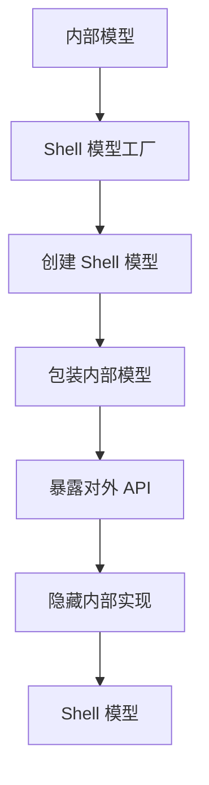

# Engine 模块总览

## 目录

- [模块简介](#模块简介)
- [核心职责](#核心职责)
- [模块结构](#模块结构)
- [初始化流程](#初始化流程)
- [内置插件](#内置插件)
- [Shell 模型工厂](#shell-模型工厂)
- [使用场景](#使用场景)
- [相关文档](#相关文档)

## 模块简介

Engine 模块是 LowCode Engine 的入口模块，负责初始化整个引擎，协调各个子模块的启动顺序，注册内置插件，并提供全局配置管理。

**包路径**: `packages/engine`

**主要导出**:
```typescript
export * from './modules/skeleton-types';
export * from './modules/designer-types';
export * from './modules/lowcode-types';

export {
  skeleton,
  plugins,
  project,
  setters,
  material,
  config,
  event,
  logger,
  hotkey,
  common,
  workspace,
  canvas,
  commonUI,
  command,
};

export { init, destroy };
export const isOpenSource = true;
export const version = VERSION_PLACEHOLDER;
```

## 核心职责

### 1. 引擎初始化
- 创建编辑器实例
- 创建设计器实例
- 创建工作区实例
- 初始化骨架系统
- 初始化插件系统

### 2. 内置插件注册
- 注册组件元数据解析器
- 注册 Setter 注册器
- 注册默认面板
- 注册内置快捷键
- 注册默认上下文菜单
- 注册命令插件

### 3. 全局配置管理
- 提供引擎配置
- 管理全局状态
- 提供配置访问接口

### 4. 模块协调
- 协调各模块的启动顺序
- 管理模块间的依赖关系
- 提供模块间的通信机制

## 模块结构

```
packages/engine/
├── src/
│   ├── engine-core.ts             # 引擎核心
│   ├── inner-plugins/             # 内置插件
│   │   ├── component-meta-parser.ts
│   │   ├── default-panel-registry.tsx
│   │   ├── default-context-menu.ts
│   │   ├── setter-registry.ts
│   │   └── builtin-hotkey.ts
│   ├── modules/                   # 模块定义
│   │   ├── classes.ts
│   │   ├── designer-types.ts
│   │   ├── live-editing.ts
│   │   ├── lowcode-types.ts
│   │   ├── shell-model-factory.ts
│   │   ├── skeleton-types.ts
│   │   └── symbols.ts
│   └── locale/                    # 国际化
│       ├── en-US.json
│       ├── zh-CN.json
│       └── index.ts
├── README.md
├── README-zh_CN.md
├── package.json
├── tsconfig.json
└── build.json
```

## 初始化流程

### init() 函数

[`init()`](../../packages/engine/src/engine-core.ts:218) 是引擎的初始化入口函数。

```typescript
export async function init(
  container?: HTMLElement,
  options?: EngineOptions,
  pluginPreference?: PluginPreference,
) {
  await destroy();

  let engineOptions = null;
  let engineContainer: HTMLElement;

  // 1. 处理容器
  if (isPlainObject(container)) {
    engineOptions = container;
    engineContainer = document.createElement('div');
    engineContainer.id = 'engine';
    document.body.appendChild(engineContainer);
  } else {
    engineOptions = options;
    engineContainer = container;
    if (!container) {
      engineContainer = document.createElement('div');
      engineContainer.id = 'engine';
      document.body.appendChild(engineContainer);
    }
  }

  // 2. 设置引擎配置
  engineConfig.setEngineOptions(engineOptions as any);

  // 3. 获取 Workbench 组件
  const { Workbench } = common.skeletonCabin;

  // 4. 检查是否启用工作区模式
  if (options && options.enableWorkspaceMode) {
    // 工作区模式
    const disposeFun = await pluginPromise;
    disposeFun && disposeFun();
    render(
      createElement(WorkSpaceWorkbench, {
        workspace: innerWorkspace,
        className: 'engine-main',
        topAreaItemClassName: 'engine-actionitem',
      }),
      engineContainer,
    );
    innerWorkspace.enableAutoOpenFirstWindow = engineConfig.get('enableAutoOpenFirstWindow', true);
    innerWorkspace.setActive(true);
    innerWorkspace.initWindow();
    innerHotkey.activate(false);
    await innerWorkspace.plugins.init(pluginPreference);
    return;
  }

  // 5. 初始化插件
  await plugins.init(pluginPreference as any);

  // 6. 渲染 Workbench
  render(
    createElement(Workbench, {
      skeleton: innerSkeleton,
      className: 'engine-main',
      topAreaItemClassName: 'engine-actionitem',
    }),
    engineContainer,
  );
}
```

### 初始化流程图

```mermaid
sequenceDiagram
    participant User
    participant init
    participant destroy
    participant Config
    participant Workspace
    participant Plugins
    participant React

    User->>init: init(container, options)
    init->>destroy: await destroy()
    destroy-->>init: 完成
    init->>init: 创建/获取容器
    init->>Config: setEngineOptions(options)
    init->>init: 检查工作区模式
    alt 启用工作区模式
        init->>Plugins: 等待插件注册
        init->>Workspace: 渲染 WorkSpaceWorkbench
        init->>Workspace: initWindow()
        init->>Plugins: init(pluginPreference)
    else 普通模式
        init->>Plugins: init(pluginPreference)
        init->>React: 渲染 Workbench
    React->>User: 显示界面
```

### 引擎核心初始化

```typescript
// 1. 创建编辑器
const editor = new Editor();
globalContext.register(editor, Editor);
globalContext.register(editor, 'editor');

// 2. 创建工作区
const innerWorkspace: IWorkspace = new InnerWorkspace(
  registryInnerPlugin,
  shellModelFactory
);
const workspace: IPublicApiWorkspace = new Workspace(innerWorkspace);
globalContext.register(innerWorkspace, 'workspace');

// 3. 创建骨架
const innerSkeleton = new InnerSkeleton(editor);
editor.set('skeleton' as any, innerSkeleton);

// 4. 创建设计器
const designer = new Designer({ editor, shellModelFactory });
editor.set('designer' as any, designer);

// 5. 创建项目
const { project: innerProject } = designer;
const project = new Project(innerProject);
editor.set('project', project);

// 6. 创建快捷键
const innerHotkey = new InnerHotkey();
const hotkey = new Hotkey(innerHotkey);

// 7. 创建骨架
const skeleton = new Skeleton(innerSkeleton, 'any', false);

// 8. 创建 Setters
const innerSetters = new InnerSetters();
const setters = new Setters(innerSetters);

// 9. 创建命令
const innerCommand = new InnerCommand();
const command = new Command(innerCommand, engineContext as PluginContext);

// 10. 创建物料
const material = new Material(editor);
const commonUI = new CommonUI(editor);
editor.set('setters' as any, setters);
editor.set('material', material);
editor.set('innerHotkey', innerHotkey);

// 11. 创建配置
const config = new Config(engineConfig);

// 12. 创建事件
const event = new Event(commonEvent, { prefix: 'common' });

// 13. 创建日志
const logger = new Logger({ level: 'warn', bizName: 'common' });

// 14. 创建通用
const common = new Common(editor, innerSkeleton);

// 15. 创建画布
const canvas = new Canvas(editor);

// 16. 创建插件
let plugins: Plugins;
const innerPlugins = new LowCodePluginManager(pluginContextApiAssembler);
plugins = new Plugins(innerPlugins).toProxy();
editor.set('innerPlugins' as any, innerPlugins);
editor.set('plugins' as any, plugins);
```

## 内置插件

### 1. Component Meta Parser
组件元数据解析器插件。

**职责**:
- 解析组件元数据
- 生成组件描述
- 提供组件信息

**注册代码**:
```typescript
const componentMetaParserPlugin = componentMetaParser(designer);
await plugins.register(componentMetaParserPlugin);
```

### 2. Setter Registry
Setter 注册器插件。

**职责**:
- 注册默认 Setter
- 管理 Setter 映射
- 提供 Setter 访问

**注册代码**:
```typescript
await plugins.register(setterRegistry, {});
```

### 3. Default Panel Registry
默认面板注册器插件。

**职责**:
- 注册默认面板
- 管理面板布局
- 提供面板访问

**注册代码**:
```typescript
const defaultPanelRegistryPlugin = defaultPanelRegistry(editor);
await plugins.register(defaultPanelRegistryPlugin);
```

### 4. Builtin Hotkey
内置快捷键插件。

**职责**:
- 注册默认快捷键
- 管理快捷键映射
- 处理快捷键事件

**注册代码**:
```typescript
await plugins.register(builtinHotkey);
```

### 5. Default Context Menu
默认上下文菜单插件。

**职责**:
- 注册默认菜单项
- 管理菜单结构
- 处理菜单操作

**注册代码**:
```typescript
await plugins.register(defaultContextMenu);
```

### 6. Command Plugin
命令插件。

**职责**:
- 注册默认命令
- 管理命令映射
- 执行命令操作

**注册代码**:
```typescript
await plugins.register(CommandPlugin, {});
```

### 7. Outline Plugin
大纲面板插件。

**职责**:
- 提供大纲面板
- 显示节点树
- 支持节点操作

**注册代码**:
```typescript
await plugins.register(OutlinePlugin, {}, { autoInit: true });
```

### 8. Register Defaults
注册默认值插件。

**职责**:
- 注册默认配置
- 初始化默认值
- 提供默认访问

**注册代码**:
```typescript
await plugins.register(registerDefaults, {}, { autoInit: true });
```

## Shell 模型工厂

### Shell Model Factory

Shell 模型工厂负责将内部模型转换为对外 API。

**职责**:
- 创建 Shell 模型
- 隐藏内部实现
- 提供统一接口

**核心接口**:
```typescript
interface IShellModelFactory {
  createNode(node: INode): IPublicModelNode;
  createDocumentModel(document: IDocumentModel): IPublicModelDocumentModel;
  createSelection(selection: ISelection): IPublicModelSelection;
  createHistory(history: IHistory): IPublicModelHistory;
  createComponentMeta(meta: IComponentMeta): IPublicModelComponentMeta;
  createProp(prop: IProp): IPublicModelProp;
  createProps(props: IProps): IPublicModelProps;
  // ... 其他创建方法
}
```

### Shell 模型创建流程



## 插件上下文 API 组装器

### Plugin Context API Assembler

插件上下文 API 组装器负责为每个插件组装上下文 API。

**核心接口**:
```typescript
interface ILowCodePluginContextApiAssembler {
  assembleApis(
    context: ILowCodePluginContextPrivate,
    pluginName: string,
    meta: PluginMeta
  ): void;
}
```

**实现逻辑**:
```typescript
const pluginContextApiAssembler: ILowCodePluginContextApiAssembler = {
  assembleApis: (context: ILowCodePluginContextPrivate, pluginName: string, meta: PluginMeta) => {
    // 1. 设置快捷键
    context.hotkey = hotkey;

    // 2. 设置项目
    context.project = project;

    // 3. 设置骨架
    context.skeleton = new Skeleton(innerSkeleton, pluginName, false);

    // 4. 设置 Setters
    context.setters = setters;

    // 5. 设置物料
    context.material = material;

    // 6. 设置事件
    const eventPrefix = meta?.eventPrefix || 'common';
    const commandScope = meta?.commandScope;
    context.event = new Event(commonEvent, { prefix: eventPrefix });

    // 7. 设置配置
    context.config = config;

    // 8. 设置通用
    context.common = common;

    // 9. 设置画布
    context.canvas = canvas;

    // 10. 设置插件
    context.plugins = plugins;

    // 11. 设置日志
    context.logger = new Logger({ level: 'warn', bizName: `plugin:${pluginName}` });

    // 12. 设置工作区
    context.workspace = workspace;

    // 13. 设置通用 UI
    context.commonUI = commonUI;

    // 14. 设置命令
    context.command = new Command(innerCommand, context as PluginContext, {
      commandScope,
    });

    // 15. 设置注册级别
    context.registerLevel = PluginRegisterLevel.Default;

    // 16. 设置是否在工作区注册
    context.isPluginRegisteredInWorkspace = false;

    // 17. 设置插件上下文到编辑器
    editor.set('pluginContext', context);
  },
};
```

## 全局配置

### Engine Config

引擎配置提供全局配置管理。

**核心接口**:
```typescript
interface IEngineConfig {
  get(key: string): any;
  set(key: string, value: any): void;
  has(key: string): boolean;
  setEngineOptions(options: EngineOptions): void;
}
```

**常用配置**:
```typescript
// 设置引擎版本
engineConfig.set('ENGINE_VERSION', '1.0.0');

// 设置是否为开源版本
engineConfig.set('isOpenSource', true);

// 设置是否禁用自动渲染
engineConfig.set('disableAutoRender', false);

// 设置是否启用自动打开第一个窗口
engineConfig.set('enableAutoOpenFirstWindow', true);

// 设置 JSE 中是否需要 this
engineConfig.set('thisRequiredInJSE', true);

// 设置是否启用严格未找到模式
engineConfig.set('enableStrictNotFoundMode', false);

// 设置未找到组件
engineConfig.set('notFoundComponent', null);

// 设置错误组件
engineConfig.set('faultComponent', null);

// 设置错误组件映射
engineConfig.set('faultComponentMap', null);
```

## 事件系统

### Common Event

公共事件总线，用于模块间通信。

**核心接口**:
```typescript
interface IEventBus {
  on(event: string, listener: Function): () => void;
  once(event: string, listener: Function): () => void;
  off(event: string, listener: Function): void;
  emit(event: string, ...args: any[]): void;
}
```

**常用事件**:
```typescript
// 监听文档打开
commonEvent.on('document-open', (doc) => {
  console.log('Document opened', doc);
});

// 监听文档关闭
commonEvent.on('document.remove', ({ id }) => {
  console.log('Document removed', id);
});

// 监听选区变更
commonEvent.on('selection.change', (selection) => {
  console.log('Selection changed', selection);
});

// 监听历史记录变更
commonEvent.on('history.change', (history) => {
  console.log('History changed', history);
});
```

## 使用场景

### 场景 1: 初始化引擎

```typescript
import { init } from '@alilc/lowcode-engine';

// 初始化引擎
await init(document.getElementById('engine-container'), {
  designMode: 'design',
  device: 'desktop',
  locale: 'zh-CN',
  enableWorkspaceMode: false
});
```

### 场景 2: 使用工作区模式

```typescript
import { init } from '@alilc/lowcode-engine';

// 初始化引擎（工作区模式）
await init(document.getElementById('engine-container'), {
  enableWorkspaceMode: true,
  enableAutoOpenFirstWindow: true
});
```

### 场景 3: 销毁引擎

```typescript
import { destroy } from '@alilc/lowcode-engine';

// 销毁引擎
await destroy();
```

### 场景 4: 访问全局配置

```typescript
import { engineConfig } from '@alilc/lowcode-engine';

// 获取配置
const version = engineConfig.get('ENGINE_VERSION');
const isOpenSource = engineConfig.get('isOpenSource');

// 设置配置
engineConfig.set('thisRequiredInJSE', false);
```

### 场景 5: 访问核心模块

```typescript
import {
  skeleton,
  plugins,
  project,
  setters,
  material,
  config,
  event,
  logger,
  hotkey,
  common,
  workspace,
  canvas,
  command
} from '@alilc/lowcode-engine';

// 使用骨架
skeleton.addPanel({
  type: 'PanelDock',
  name: 'my-panel',
  title: 'My Panel',
  content: MyPanelComponent
});

// 使用插件
plugins.register(MyPlugin, {});

// 使用项目
const currentDocument = project.currentDocument;

// 使用 Setters
setters.registerSetter('my-setter', MySetterComponent);

// 使用物料
material.addComponent({
  componentName: 'MyComponent',
  title: 'My Component'
});

// 使用命令
command.registerCommand({
  name: 'my-command',
  handler: () => {
    console.log('Command executed');
  }
});
```

## 相关文档

- [系统架构总览](../00-overview/architecture-overview.md)
- [Designer 模块](../01-designer/index.md)
- [Editor Core 模块](../02-editor-core/index.md)
- [插件系统](../08-plugins/index.md)
- [Shell 模块](../09-shell/index.md)
