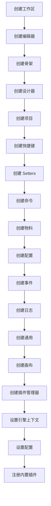

# Engine 模块总览

## 目录

- [模块简介](#模块简介)
- [核心职责](#核心职责)
- [模块结构](#模块结构)
- [核心文件详解](#核心文件详解)
- [初始化流程](#初始化流程)
- [内置插件详解](#内置插件详解)
- [模块定义](#模块定义)
- [国际化](#国际化)
- [导出内容](#导出内容)
- [使用场景](#使用场景)
- [相关文档](#相关文档)

## 模块简介

Engine 模块是 LowCode Engine 的核心入口模块，负责初始化整个低代码引擎，协调各个子模块的启动顺序，注册内置插件，并提供全局配置管理。该模块是整个低代码引擎的启动器和协调者。

**包路径**: `packages/engine`

**包名**: `@alilc/lowcode-engine`

**版本**: 1.3.2

**描述**: An enterprise-class low-code technology stack with scale-out design / 一套面向扩展设计的企业级低代码技术体系

## 核心职责

### 1. 引擎初始化
- 创建编辑器实例（Editor）
- 创建设计器实例（Designer）
- 创建工作区实例（Workspace）
- 初始化骨架系统（Skeleton）
- 初始化插件系统（Plugins）

### 2. 内置插件注册
- 注册组件元数据解析器（Component Meta Parser）
- 注册 Setter 注册器（Setter Registry）
- 注册默认面板（Default Panel Registry）
- 注册内置快捷键（Builtin Hotkey）
- 注册默认上下文菜单（Default Context Menu）
- 注册命令插件（Command Plugin）
- 注册大纲面板插件（Outline Plugin）
- 注册默认值插件（Register Defaults）

### 3. 全局配置管理
- 提供引擎配置（Engine Config）
- 管理全局状态
- 提供配置访问接口
- 注入版本号和开源标识

### 4. 模块协调
- 协调各模块的启动顺序
- 管理模块间的依赖关系
- 提供模块间的通信机制
- 创建 Shell 模型工厂

### 5. 渲染管理
- 渲染 Workbench 组件
- 支持普通模式和工作区模式
- 管理引擎容器的生命周期

## 模块结构

```
packages/engine/
├── src/
│   ├── engine-core.ts              # 引擎核心文件
│   ├── index.ts                    # 入口文件
│   ├── inner-plugins/              # 内置插件
│   │   ├── component-meta-parser.ts
│   │   ├── setter-registry.ts
│   │   ├── default-panel-registry.tsx
│   │   ├── builtin-hotkey.ts
│   │   └── default-context-menu.ts
│   ├── modules/                    # 模块定义
│   │   ├── classes.ts
│   │   ├── designer-types.ts
│   │   ├── live-editing.ts
│   │   ├── lowcode-types.ts
│   │   ├── shell-model-factory.ts
│   │   ├── skeleton-types.ts
│   │   └── symbols.ts
│   └── locale/                     # 国际化
│       ├── en-US.json
│       ├── zh-CN.json
│       └── index.ts
├── babel.config.js                 # Babel 配置
├── build.json                      # 构建配置
├── build.plugin.js                 # 构建插件
├── build.test.json                 # 测试构建配置
├── build.umd.json                  # UMD 构建配置
├── jest.config.js                  # Jest 配置
├── package.json                    # 包配置
├── tsconfig.json                   # TypeScript 配置
├── README.md                       # 英文说明
└── README-zh_CN.md                 # 中文说明
```

### 文件说明

| 文件 | 说明 |
|------|------|
| [`src/engine-core.ts`](../../packages/engine/src/engine-core.ts) | 引擎核心文件，包含初始化逻辑和模块实例化 |
| [`src/index.ts`](../../packages/engine/src/index.ts) | 入口文件，导出所有内容并打印版本信息 |
| [`src/inner-plugins/`](../../packages/engine/src/inner-plugins/) | 内置插件目录 |
| [`src/modules/`](../../packages/engine/src/modules/) | 模块定义目录 |
| [`src/locale/`](../../packages/engine/src/locale/) | 国际化目录 |
| [`package.json`](../../packages/engine/package.json) | 包配置文件 |

## 核心文件详解

### 1. engine-core.ts

[`engine-core.ts`](../../packages/engine/src/engine-core.ts) 是引擎的核心文件，负责初始化所有模块和插件。

#### 主要导出

```typescript
// 导出类型定义
export * from './modules/skeleton-types';
export * from './modules/designer-types';
export * from './modules/lowcode-types';

// 导出核心模块
export {
  skeleton,
  plugins,
  project,
  setters,
  material,
  config,
  event,
  logger,
  hotkey,
  common,
  workspace,
  canvas,
  commonUI,
  command,
};

// 导出常量
export const isOpenSource = true;
export const version = VERSION_PLACEHOLDER;

// 导出初始化和销毁函数
export async function init(container?, options?, pluginPreference?);
export async function destroy();
```

#### 初始化流程

引擎的初始化分为两个阶段：

**阶段 1：模块实例化（文件加载时执行）**

```typescript
// 1. 创建工作区
const innerWorkspace: IWorkspace = new InnerWorkspace(registryInnerPlugin, shellModelFactory);
const workspace: IPublicApiWorkspace = new Workspace(innerWorkspace);

// 2. 创建编辑器
const editor = new Editor();
globalContext.register(editor, Editor);
globalContext.register(editor, 'editor');
globalContext.register(innerWorkspace, 'workspace');

// 3. 创建骨架
const innerSkeleton = new InnerSkeleton(editor);
editor.set('skeleton' as any, innerSkeleton);

// 4. 创建设计器
const designer = new Designer({ editor, shellModelFactory });
editor.set('designer' as any, designer);

// 5. 创建项目
const { project: innerProject } = designer;
const project = new Project(innerProject);

// 6. 创建快捷键
const innerHotkey = new InnerHotkey();
const hotkey = new Hotkey(innerHotkey);

// 7. 创建骨架
const skeleton = new Skeleton(innerSkeleton, 'any', false);

// 8. 创建 Setters
const innerSetters = new InnerSetters();
const setters = new Setters(innerSetters);

// 9. 创建命令
const innerCommand = new InnerCommand();
const command = new Command(innerCommand, engineContext as IPublicModelPluginContext);

// 10. 创建物料
const material = new Material(editor);
const commonUI = new CommonUI(editor);
editor.set('project', project);
editor.set('setters' as any, setters);
editor.set('material', material);
editor.set('innerHotkey', innerHotkey);

// 11. 创建配置
const config = new Config(engineConfig);

// 12. 创建事件
const event = new Event(commonEvent, { prefix: 'common' });

// 13. 创建日志
const logger = new Logger({ level: 'warn', bizName: 'common' });

// 14. 创建通用
const common = new Common(editor, innerSkeleton);

// 15. 创建画布
const canvas = new Canvas(editor);

// 16. 创建插件管理器
const innerPlugins = new LowCodePluginManager(pluginContextApiAssembler);
plugins = new Plugins(innerPlugins).toProxy();
editor.set('innerPlugins' as any, innerPlugins);
editor.set('plugins' as any, plugins);

// 17. 设置引擎上下文
engineContext.skeleton = skeleton;
engineContext.plugins = plugins;
engineContext.project = project;
engineContext.setters = setters;
engineContext.material = material;
engineContext.event = event;
engineContext.logger = logger;
engineContext.hotkey = hotkey;
engineContext.common = common;
engineContext.workspace = workspace;
engineContext.canvas = canvas;
engineContext.commonUI = commonUI;
engineContext.command = command;

// 18. 设置配置
engineConfig.set('isOpenSource', isOpenSource);
engineConfig.set('ENGINE_VERSION', version);

// 19. 注册内置插件（异步）
const pluginPromise = registryInnerPlugin(designer, editor, plugins);
```

**阶段 2：init() 函数调用时执行**

```typescript
export async function init(
  container?: HTMLElement,
  options?: IPublicTypeEngineOptions,
  pluginPreference?: PluginPreference,
) {
  // 1. 销毁旧实例
  await destroy();

  // 2. 处理容器
  let engineOptions = null;
  if (isPlainObject(container)) {
    engineOptions = container;
    engineContainer = document.createElement('div');
    engineContainer.id = 'engine';
    document.body.appendChild(engineContainer);
  } else {
    engineOptions = options;
    engineContainer = container;
    if (!container) {
      engineContainer = document.createElement('div');
      engineContainer.id = 'engine';
      document.body.appendChild(engineContainer);
    }
  }

  // 3. 设置引擎配置
  engineConfig.setEngineOptions(engineOptions as any);

  // 4. 获取 Workbench 组件
  const { Workbench } = common.skeletonCabin;

  // 5. 检查是否启用工作区模式
  if (options && options.enableWorkspaceMode) {
    // 工作区模式
    const disposeFun = await pluginPromise;
    disposeFun && disposeFun();
    render(
      createElement(WorkSpaceWorkbench, {
        workspace: innerWorkspace,
        className: 'engine-main',
        topAreaItemClassName: 'engine-actionitem',
      }),
      engineContainer,
    );
    innerWorkspace.enableAutoOpenFirstWindow = engineConfig.get('enableAutoOpenFirstWindow', true);
    innerWorkspace.setActive(true);
    innerWorkspace.initWindow();
    innerHotkey.activate(false);
    await innerWorkspace.plugins.init(pluginPreference);
    return;
  }

  // 6. 初始化插件
  await plugins.init(pluginPreference as any);

  // 7. 渲染 Workbench
  render(
    createElement(Workbench, {
      skeleton: innerSkeleton,
      className: 'engine-main',
      topAreaItemClassName: 'engine-actionitem',
    }),
    engineContainer,
  );
}
```

#### 销毁流程

```typescript
export async function destroy() {
  // 1. 移除所有文档
  const { documents } = project;
  if (Array.isArray(documents) && documents.length > 0) {
    documents.forEach(((doc: IPublicModelDocumentModel) => project.removeDocument(doc)));
  }

  // 2. TODO: 删除除核心插件外的所有插件

  // 3. 卸载 DOM 容器
  engineContainer && unmountComponentAtNode(engineContainer);
}
```

### 2. index.ts

[`index.ts`](../../packages/engine/src/index.ts) 是模块的入口文件，负责导出所有内容并打印版本信息。

```typescript
import { version } from './engine-core';

// 导出所有内容
export * from './engine-core';

// 打印版本信息
console.log(
  `%c AliLowCodeEngine %c v${version} `,
  'padding: 2px 1px; border-radius: 3px 0 0 3px; color: #fff; background: #606060; font-weight: bold;',
  'padding: 2px 1px; border-radius: 0 3px 3px 0; color: #fff; background: #42c02e; font-weight: bold;',
);
```

### 3. package.json

[`package.json`](../../packages/engine/package.json) 定义了包的配置和依赖。

**主要依赖**：
- `@alifd/next`: Fusion UI 组件库
- `@alilc/lowcode-designer`: 设计器模块
- `@alilc/lowcode-editor-core`: 编辑器核心模块
- `@alilc/lowcode-editor-skeleton`: 编辑器骨架模块
- `@alilc/lowcode-engine-ext`: 引擎扩展
- `@alilc/lowcode-plugin-command`: 命令插件
- `@alilc/lowcode-plugin-designer`: 设计器插件
- `@alilc/lowcode-plugin-outline-pane`: 大纲面板插件
- `@alilc/lowcode-shell`: Shell 模块
- `@alilc/lowcode-utils`: 工具模块
- `@alilc/lowcode-workspace`: 工作区模块
- `react`: React 框架
- `react-dom`: React DOM

**脚本命令**：
- `start`: 启动开发服务器
- `version:update`: 更新版本号
- `build`: 构建生产版本
- `build:umd`: 构建 UMD 版本
- `test`: 运行测试

## 初始化流程

### 初始化流程图

```mermaid
sequenceDiagram
    participant User
    participant init
    participant destroy
    participant Config
    participant Workspace
    participant Plugins
    participant React

    User->>init: init(container, options)
    init->>destroy: await destroy()
    destroy-->>init: 完成
    init->>init: 创建/获取容器
    init->>Config: setEngineOptions(options)
    init->>init: 检查工作区模式
    alt 启用工作区模式
        init->>Plugins: 等待插件注册
        init->>Workspace: 渲染 WorkSpaceWorkbench
        init->>Workspace: initWindow()
        init->>Workspace: plugins.init()
    else 普通模式
        init->>Plugins: init(pluginPreference)
        init->>React: 渲染 Workbench
    React->>User: 显示界面
```

### 引擎核心初始化顺序



## 内置插件详解

### 1. Component Meta Parser

**文件**: [`src/inner-plugins/component-meta-parser.ts`](../../packages/engine/src/inner-plugins/component-meta-parser.ts)

**插件名称**: `___component_meta_parser___`

**功能**: 解析组件元数据，当物料资源变化时自动更新组件元数据映射。

**实现逻辑**:
```typescript
export const componentMetaParser = (designer: any) => {
  const fun = (ctx: IPublicModelPluginContext) => {
    return {
      init() {
        const { material } = ctx;
        material.onChangeAssets(() => {
          const assets = material.getAssets();
          const { components = [] } = assets;
          designer.buildComponentMetasMap(components);
        });
      },
    };
  };

  fun.pluginName = '___component_meta_parser___';

  return fun;
};
```

**职责**:
- 监听物料资源变化
- 获取组件列表
- 构建组件元数据映射
- 自动更新组件信息

### 2. Setter Registry

**文件**: [`src/inner-plugins/setter-registry.ts`](../../packages/engine/src/inner-plugins/setter-registry.ts)

**插件名称**: `___setter_registry___`

**功能**: 注册默认的 Setter。

**实现逻辑**:
```typescript
export const setterRegistry = (ctx: IPublicModelPluginContext) => {
  return {
    init() {
      const { config } = ctx;
      if (config.get('disableDefaultSetters')) return;
      const builtinSetters = require('@alilc/lowcode-engine-ext')?.setters;
      if (builtinSetters) {
        ctx.setters.registerSetter(builtinSetters);
      }
    },
  };
};

setterRegistry.pluginName = '___setter_registry___';
```

**职责**:
- 检查是否禁用默认 Setter
- 加载内置 Setter
- 注册 Setter 到系统

### 3. Default Panel Registry

**文件**: [`src/inner-plugins/default-panel-registry.tsx`](../../packages/engine/src/inner-plugins/default-panel-registry.tsx)

**插件名称**: `___default_panel___`

**功能**: 注册默认的面板。

**实现逻辑**:
```typescript
export const defaultPanelRegistry = (editor: any) => {
  const fun = (ctx: IPublicModelPluginContext) => {
    return {
      init() {
        const { skeleton, config } = ctx;
        // 注册设计器面板
        skeleton.add({
          area: 'mainArea',
          name: 'designer',
          type: 'Widget',
          content: <DesignerPlugin
            engineConfig={config}
            engineEditor={editor}
          />,
        });
        // 注册设置面板
        if (!config.get('disableDefaultSettingPanel')) {
          skeleton.add({
            area: 'rightArea',
            name: 'settingsPane',
            type: 'Panel',
            content: <SettingsPrimaryPane
              engineEditor={editor}
            />,
            props: {
              ignoreRoot: true,
            },
            panelProps: {
              ...(config.get('defaultSettingPanelProps') || {}),
            },
          });
        }
      },
    };
  };

  fun.pluginName = '___default_panel___';

  return fun;
};
```

**职责**:
- 注册设计器面板到主区域
- 注册设置面板到右侧区域
- 支持配置禁用默认设置面板
- 支持自定义面板属性

### 4. Builtin Hotkey

**文件**: [`src/inner-plugins/builtin-hotkey.ts`](../../packages/engine/src/inner-plugins/builtin-hotkey.ts)

**插件名称**: `___builtin_hotkey___`

**功能**: 注册内置快捷键。

**支持的快捷键**:

| 快捷键 | 功能 | 说明 |
|--------|------|------|
| `backspace` / `del` | 删除 | 删除选中的节点 |
| `escape` | 取消选择 | 清除当前选区 |
| `command+c` / `ctrl+c` | 复制 | 复制选中的节点 |
| `command+x` / `ctrl+x` | 剪切 | 剪切选中的节点 |
| `command+v` / `ctrl+v` | 粘贴 | 粘贴剪贴板内容 |
| `command+z` / `ctrl+z` | 撤销 | 撤销上一步操作 |
| `command+y` / `ctrl+y` / `command+shift+z` | 重做 | 重做上一步操作 |
| `left` / `right` | 兄弟选择 | 选择前一个/后一个兄弟节点 |
| `up` / `down` | 父子选择 | 选择父节点/子节点 |
| `option+left` / `option+right` | 兄弟移动 | 移动到前一个/后一个兄弟节点 |
| `option+up` | 向上移动 | 移动到父节点或前一个兄弟节点 |
| `option+down` | 向下移动 | 移动到子节点或后一个兄弟节点 |

**核心功能**:
- 节点删除
- 节点复制/剪切/粘贴
- 撤销/重做
- 节点选择（兄弟、父子）
- 节点移动

### 5. Default Context Menu

**文件**: [`src/inner-plugins/default-context-menu.ts`](../../packages/engine/src/inner-plugins/default-context-menu.ts)

**插件名称**: `___default_context_menu___`

**功能**: 注册默认的上下文菜单。

**菜单项**:

| 菜单项 | 功能 | 条件 |
|--------|------|------|
| 选择组件 | 显示组件树 | 单个节点 |
| 复制并粘贴 | 复制并粘贴到下方 | 单个节点 |
| 拷贝 | 复制到剪贴板 | 至少一个节点 |
| 粘贴至下方 | 粘贴到节点下方 | 单个节点 |
| 粘贴至内部 | 粘贴到节点内部 | 单个容器节点 |
| 删除 | 删除节点 | 至少一个节点 |

**核心功能**:
- 节点复制/粘贴
- 节点删除
- 支持从剪贴板读取节点数据
- 支持嵌套检查和错误提示

### 6. Command Plugin

**插件**: `@alilc/lowcode-plugin-command`

**功能**: 注册命令系统，提供命令注册和执行能力。

### 7. Outline Plugin

**插件**: `@alilc/lowcode-plugin-outline-pane`

**功能**: 提供大纲面板，显示节点树结构。

### 8. Register Defaults

**插件**: `@alilc/lowcode-editor-skeleton`

**功能**: 注册默认配置和组件。

## 模块定义

### 1. classes.ts

**文件**: [`src/modules/classes.ts`](../../packages/engine/src/modules/classes.ts)

**功能**: 导出 Shell 模块的类。

```typescript
export {
  Project,
  Skeleton,
  DocumentModel,
  Node,
  NodeChildren,
  History,
  SettingPropEntry,
  SettingTopEntry,
  Selection,
  Prop,
  SimulatorHost,
  SkeletonItem,
} from '@alilc/lowcode-shell';
export { Node as InnerNode } from '@alilc/lowcode-designer';
```

### 2. designer-types.ts

**文件**: [`src/modules/designer-types.ts`](../../packages/engine/src/modules/designer-types.ts)

**功能**: 导出设计器类型。

```typescript
export type Node = designerCabin.Node;
export type DocumentModel = designerCabin.DocumentModel;
export type RootNode = designerCabin.RootNode;
export type EditingTarget = designerCabin.EditingTarget;
export type SaveHandler = designerCabin.SaveHandler;
export type ComponentMeta = designerCabin.ComponentMeta;
export type SettingField = designerCabin.SettingField;
export type ILowCodePluginManager = designerCabin.ILowCodePluginManager;
export type PluginPreference = designerCabin.PluginPreference;
```

### 3. lowcode-types.ts

**文件**: [`src/modules/lowcode-types.ts`](../../packages/engine/src/modules/lowcode-types.ts)

**功能**: 导出低代码类型。

```typescript
export type { IPublicTypeNodeSchema } from '@alilc/lowcode-types';
```

### 4. shell-model-factory.ts

**文件**: [`src/modules/shell-model-factory.ts`](../../packages/engine/src/modules/shell-model-factory.ts)

**功能**: Shell 模型工厂，负责将内部模型转换为对外 API。

```typescript
class ShellModelFactory implements IShellModelFactory {
  createNode(node: INode | null | undefined): IPublicModelNode | null {
    return Node.create(node);
  }
  createSettingField(prop: ISettingField): IPublicModelSettingField {
    return SettingField.create(prop);
  }
}
export const shellModelFactory = new ShellModelFactory();
```

**职责**:
- 创建 Shell 节点模型
- 创建 Shell 设置字段模型
- 隐藏内部实现细节
- 提供统一的对外接口

### 5. skeleton-types.ts

**文件**: [`src/modules/skeleton-types.ts`](../../packages/engine/src/modules/skeleton-types.ts)

**功能**: 导出骨架类型。

```typescript
export type IWidgetBaseConfig = innerIWidgetBaseConfig;
```

### 6. symbols.ts

**文件**: [`src/modules/symbols.ts`](../../packages/engine/src/modules/symbols.ts)

**功能**: 导出所有符号常量。

```typescript
export default {
  projectSymbol,
  documentSymbol,
  nodeSymbol,
  nodeChildrenSymbol,
  skeletonSymbol,
  editorSymbol,
  designerSymbol,
  settingPropEntrySymbol: settingFieldSymbol,
  settingTopEntrySymbol,
  designerCabinSymbol,
  editorCabinSymbol,
  skeletonCabinSymbol,
  propSymbol,
  simulatorHostSymbol,
  skeletonItemSymbol,
  simulatorRenderSymbol,
};
```

## 国际化

### locale/index.ts

**文件**: [`src/locale/index.ts`](../../packages/engine/src/locale/index.ts)

**功能**: 创建国际化工具函数。

```typescript
const { intl, getLocale } = createIntl?.({
  'en-US': enUS,
  'zh-CN': zhCN,
}) || {
  intl: (id) => {
    return zhCN[id];
  },
};

export { intl, enUS, zhCN, getLocale };
```

### 支持的语言

| 语言 | 文件 | 说明 |
|------|------|------|
| 简体中文 | [`zh-CN.json`](../../packages/engine/src/locale/zh-CN.json) | 默认语言 |
| 英文 | [`en-US.json`](../../packages/engine/src/locale/en-US.json) | 国际化支持 |

### 翻译条目

| Key | 中文 | 英文 |
|-----|------|------|
| NotValidNodeData | 不是有效的节点数据 | Not valid node data |
| SelectComponents | 选择组件 | Select components |
| CopyAndPaste | 复制 | Copy and Paste |
| Copy | 拷贝 | Copy |
| PasteToTheBottom | 粘贴至下方 | Paste to the bottom |
| PasteToTheInside | 粘贴至内部 | Paste to the inside |
| Delete | 删除 | Delete |

## 导出内容

### 核心模块

```typescript
export {
  skeleton,      // 骨架
  plugins,       // 插件
  project,       // 项目
  setters,       // Setter
  material,      // 物料
  config,        // 配置
  event,         // 事件
  logger,        // 日志
  hotkey,        // 快捷键
  common,        // 通用
  workspace,     // 工作区
  canvas,        // 画布
  commonUI,      // 通用 UI
  command,       // 命令
};
```

### 类型定义

```typescript
export * from './modules/skeleton-types';
export * from './modules/designer-types';
export * from './modules/lowcode-types';
```

### 常量

```typescript
export const isOpenSource = true;
export const version = VERSION_PLACEHOLDER;
export const __SECRET_INTERNALS_DO_NOT_USE_OR_YOU_WILL_BE_FIRED = {
  symbols,
  classes,
};
```

### 函数

```typescript
export async function init(
  container?: HTMLElement,
  options?: IPublicTypeEngineOptions,
  pluginPreference?: PluginPreference,
);

export async function destroy();
```

## 使用场景

### 场景 1: 初始化引擎

```typescript
import { init } from '@alilc/lowcode-engine';

// 初始化引擎
await init(document.getElementById('engine-container'), {
  designMode: 'design',
  device: 'desktop',
  locale: 'zh-CN',
  enableWorkspaceMode: false
});
```

### 场景 2: 使用工作区模式

```typescript
import { init } from '@alilc/lowcode-engine';

// 初始化引擎（工作区模式）
await init(document.getElementById('engine-container'), {
  enableWorkspaceMode: true,
  enableAutoOpenFirstWindow: true
});
```

### 场景 3: 销毁引擎

```typescript
import { destroy } from '@alilc/lowcode-engine';

// 销毁引擎
await destroy();
```

### 场景 4: 访问全局配置

```typescript
import { engineConfig } from '@alilc/lowcode-engine';

// 获取配置
const version = engineConfig.get('ENGINE_VERSION');
const isOpenSource = engineConfig.get('isOpenSource');

// 设置配置
engineConfig.set('thisRequiredInJSE', false);
```

### 场景 5: 访问核心模块

```typescript
import {
  skeleton,
  plugins,
  project,
  setters,
  material,
  config,
  event,
  logger,
  hotkey,
  common,
  workspace,
  canvas,
  command
} from '@alilc/lowcode-engine';

// 使用骨架
skeleton.addPanel({
  type: 'PanelDock',
  name: 'my-panel',
  title: 'My Panel',
  content: MyPanelComponent
});

// 使用插件
plugins.register(MyPlugin, {});

// 使用项目
const currentDocument = project.currentDocument;

// 使用 Setters
setters.registerSetter('my-setter', MySetterComponent);

// 使用物料
material.addComponent({
  componentName: 'MyComponent',
  title: 'My Component'
});

// 使用命令
command.registerCommand({
  name: 'my-command',
  handler: () => {
    console.log('Command executed');
  }
});
```

### 场景 6: 使用快捷键

```typescript
import { hotkey } from '@alilc/lowcode-engine';

// 绑定快捷键
hotkey.bind('command+s', (e) => {
  e.preventDefault();
  // 保存逻辑
  console.log('Save triggered');
});

// 解绑快捷键
hotkey.unbind('command+s');
```

### 场景 7: 使用事件

```typescript
import { event } from '@alilc/lowcode-engine';

// 监听事件
const dispose = event.on('my-event', (data) => {
  console.log('Event received:', data);
});

// 触发事件
event.emit('my-event', { message: 'Hello' });

// 取消监听
dispose();
```

### 场景 8: 使用画布

```typescript
import { canvas } from '@alilc/lowcode-engine';

// 检查是否在实时编辑模式
if (canvas.isInLiveEditing) {
  console.log('Currently in live editing mode');
}

// 访问剪贴板
const { clipboard } = canvas;
clipboard.setData({ type: 'nodeSchema', componentsTree: [...] });
```

## 相关文档

- [系统架构总览](../00-overview/architecture-overview.md)
- [Designer 模块](../01-designer/index.md)
- [Editor Core 模块](../02-editor-core/index.md)
- [Editor Skeleton 模块](../07-editor-skeleton/index.md)
- [插件系统](../08-plugins/index.md)
- [Shell 模块](../09-shell/index.md)
- [Workspace 模块](../10-workspace/index.md)
