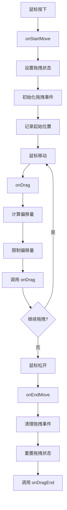
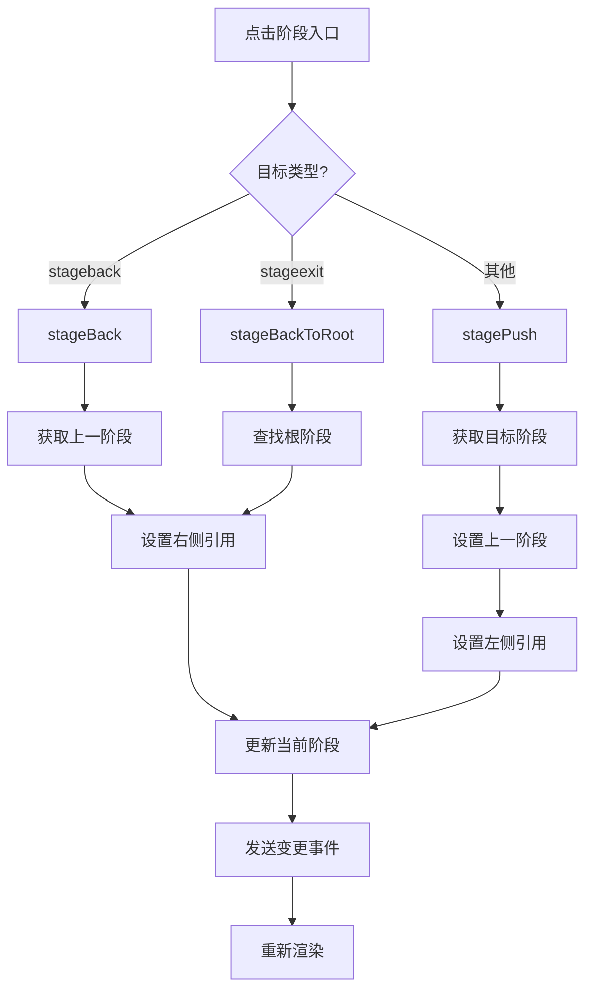

# 组件库

## 目录

- [组件概述](#组件概述)
- [DraggableLine 组件](#draggableline-组件)
- [Field 组件](#field-组件)
- [InlineTip 组件](#inlinetip-组件)
- [Popup 组件](#popup-组件)
- [Settings 组件](#settings-组件)
- [StageBox 组件](#stagebox-组件)
- [使用示例](#使用示例)

## 组件概述

Editor Skeleton 模块提供了一套完整的 UI 组件库，用于构建编辑器的各种界面元素。

**组件分类**:
- **布局组件**: DraggableLine
- **表单组件**: Field、InlineTip
- **弹出层组件**: Popup
- **设置组件**: SettingsPane、SettingsPrimaryPane
- **阶段组件**: StageBox、StageChain、Stage

**文件路径**: `packages/editor-skeleton/src/components/`

## DraggableLine 组件

### 组件概述

DraggableLine 是一个可拖拽的分隔线组件，用于调整布局区域的大小。

**文件路径**: `packages/editor-skeleton/src/components/draggable-line/index.tsx`

### 组件接口

```typescript
export interface DraggableLineProps {
  onDrag: (l: number, e: any) => any;
  onDragStart?: () => any;
  onDragEnd?: () => any;
  position?: 'right' | 'left' | 'top';
  className?: string;
  maxIncrement?: number;
  maxDecrement?: number;
}
```

### 属性说明

| 属性 | 类型 | 必填 | 默认值 | 说明 |
|------|------|------|---------|------|
| `onDrag` | `(l: number, e: any) => any` | 是 | - | 拖拽时的回调函数 |
| `onDragStart` | `() => any` | 否 | - | 拖拽开始时的回调函数 |
| `onDragEnd` | `() => any` | 否 | - | 拖拽结束时的回调函数 |
| `position` | `'right' \| 'left' \| 'top'` | 否 | `'right'` | 拖拽线位置 |
| `className` | `string` | 否 | `''` | 自定义类名 |
| `maxIncrement` | `number` | 否 | `100` | 最大增量 |
| `maxDecrement` | `number` | 否 | `0` | 最大减量 |

### 核心方法

#### onStartMove
```typescript
onStartMove(e: any): void
```

**功能**: 开始拖拽。

**参数**:
- `e`: 鼠标事件

**说明**: 
- 设置拖拽状态
- 初始化拖拽事件监听
- 记录起始位置

#### onDrag
```typescript
onDrag(e: any): void
```

**功能**: 拖拽中。

**参数**:
- `e`: 鼠标事件

**说明**: 
- 计算拖拽偏移量
- 限制偏移量在最大增量和最大减量之间
- 调用 `onDrag` 回调

#### onEndMove
```typescript
onEndMove(): void
```

**功能**: 结束拖拽。

**说明**: 
- 清理拖拽事件监听
- 重置拖拽状态
- 调用 `onDragEnd` 回调

### 拖拽流程



### 使用示例

```typescript
import DraggableLine from '@alilc/lowcode-editor-skeleton/lib/components/draggable-line';

function ResizablePanel() {
  const [width, setWidth] = useState(300);

  return (
    <div style={{ display: 'flex' }}>
      <div style={{ width: `${width}px` }}>
        左侧面板
      </div>
      <DraggableLine
        position="right"
        onDrag={(offset) => {
          setWidth(300 + offset);
        }}
        onDragStart={() => {
          console.log('开始拖拽');
        }}
        onDragEnd={() => {
          console.log('结束拖拽');
        }}
        maxIncrement={200}
        maxDecrement={100}
      />
      <div style={{ flex: 1 }}>
        右侧内容
      </div>
    </div>
  );
}
```

## Field 组件

### 组件概述

Field 是字段组件，用于渲染设置面板中的字段。

**文件路径**: `packages/editor-skeleton/src/components/field/fields.tsx`

### 组件类型

#### 1. Field

基础字段组件。

**接口**:
```typescript
export interface FieldProps {
  className?: string;
  meta?: { package: string; componentName: string } | string;
  title?: IPublicTypeTitleContent | null;
  editor?: IPublicModelEditor;
  defaultDisplay?: 'accordion' | 'inline' | 'block' | 'plain' | 'popup' | 'entry';
  collapsed?: boolean;
  valueState?: number;
  name?: string;
  tip?: any;
  onExpandChange?: (expandState: boolean) => void;
  onClear?: () => void;
}
```

**属性说明**:

| 属性 | 类型 | 必填 | 默认值 | 说明 |
|------|------|------|---------|------|
| `className` | `string` | 否 | - | 自定义类名 |
| `meta` | `{ package: string; componentName: string } \| string` | 否 | - | 组件元数据 |
| `title` | `IPublicTypeTitleContent \| null` | 否 | - | 字段标题 |
| `editor` | `IPublicModelEditor` | 否 | - | 编辑器实例 |
| `defaultDisplay` | `'accordion' \| 'inline' \| 'block' \| 'plain' \| 'popup' \| 'entry'` | 否 | `'inline'` | 默认显示方式 |
| `collapsed` | `boolean` | 否 | - | 是否折叠 |
| `valueState` | `number` | 否 | - | 值状态 |
| `name` | `string` | 否 | - | 字段名称 |
| `tip` | `any` | 否 | - | 提示信息 |
| `onExpandChange` | `(expandState: boolean) => void` | 否 | - | 折叠状态变更回调 |
| `onClear` | `() => void` | 否 | - | 清除回调 |

**显示方式**:
- `accordion`: 手风琴样式
- `inline`: 内联样式
- `block`: 块级样式
- `plain`: 纯文本样式
- `popup`: 弹出层样式
- `entry`: 入口样式

#### 2. PopupField

弹出字段组件。

**接口**:
```typescript
export interface PopupFieldProps extends FieldProps {
  width?: number;
}
```

**新增属性**:

| 属性 | 类型 | 必填 | 默认值 | 说明 |
|------|------|------|---------|------|
| `width` | `number` | 否 | `300` | 弹出层宽度 |

#### 3. EntryField

入口字段组件。

**接口**:
```typescript
export interface EntryFieldProps extends FieldProps {
  stageName?: string;
}
```

**新增属性**:

| 属性 | 类型 | 必填 | 默认值 | 说明 |
|------|------|------|---------|------|
| `stageName` | `string` | 否 | - | 阶段名称 |

#### 4. PlainField

纯文本字段组件。

**接口**: 继承自 `FieldProps`

### 核心功能

#### 1. 自动检测显示方式

```typescript
private deployBlockTesting() {
  if (this.dispose) {
    this.dispose();
  }
  const { body } = this;
  if (!body) {
    return;
  }
  const check = () => {
    const setter = body.firstElementChild;
    if (setter && setter.classList.contains('lc-block-setter')) {
      this.setState({
        display: 'block',
      });
    } else {
      this.setState({
        display: 'inline',
      });
    }
  };
  const observer = new MutationObserver(check);
  check();
  observer.observe(body, {
    childList: true,
    subtree: true,
    attributes: true,
    attributeFilter: ['class'],
  });
  this.dispose = () => observer.disconnect();
}
```

**说明**: 
- 使用 `MutationObserver` 监听 DOM 变化
- 自动检测 setter 类型
- 根据类型切换显示方式

#### 2. 错误边界

```typescript
static getDerivedStateFromError() {
  return {
    hasError: true,
  };
}

componentDidCatch(error: Error, errorInfo: ErrorInfo) {
  logger.error(`${this.props.title} has error`, error, errorInfo);
}
```

**说明**: 
- 捕获子组件错误
- 记录错误日志
- 防止错误扩散

#### 3. 提示内容生成

```typescript
getTipContent(propName: string, tip?: any): any {
  let tipContent = (
    <div>
      <div>{intl('Attribute: ')}{propName}</div>
    </div>
  );

  if (isObject(tip)) {
    tipContent = (
      <div>
        <div>{intl('Attribute: ')}{propName}</div>
        <div>{intl('Description: ')}{(tip as any).content}</div>
      </div>
    );
  } else if (tip) {
    tipContent = (
      <div>
        <div>{intl('Attribute: ')}{propName}</div>
        <div>{intl('Description: ')}{tip}</div>
      </div>
    );
  }
  return tipContent;
}
```

### 使用示例

#### 示例 1: 基础字段

```typescript
import { Field } from '@alilc/lowcode-editor-skeleton';

function MySettings() {
  return (
    <Field
      title="字段标题"
      name="fieldName"
      meta={{ package: '@alifd/next', componentName: 'Button' }}
      tip="这是字段提示"
      onExpandChange={(expanded) => {
        console.log('折叠状态:', expanded);
      }}
    >
      <div>字段内容</div>
    </Field>
  );
}
```

#### 示例 2: 手风琴字段

```typescript
<Field
  title="手风琴字段"
  defaultDisplay="accordion"
  collapsed={false}
  onExpandChange={(expanded) => {
    console.log('折叠状态:', expanded);
  }}
>
  <div>字段内容</div>
</Field>
```

#### 示例 3: 弹出字段

```typescript
import { PopupField } from '@alilc/lowcode-editor-skeleton';

<PopupField
  title="弹出字段"
  width={400}
>
  <div>弹出内容</div>
</PopupField>
```

#### 示例 4: 入口字段

```typescript
import { EntryField } from '@alilc/lowcode-editor-skeleton';

<EntryField
  title="入口字段"
  stageName="my-stage"
/>
```

#### 示例 5: 纯文本字段

```typescript
import { PlainField } from '@alilc/lowcode-editor-skeleton';

<PlainField>
  <div>纯文本字段内容</div>
</PlainField>
```

## InlineTip 组件

### 组件概述

InlineTip 是内联提示组件，用于显示字段提示信息。

**文件路径**: `packages/editor-skeleton/src/components/field/inlinetip.tsx`

### 组件接口

```typescript
export interface InlineTipProps {
  position: string;
  theme?: 'green' | 'black';
  children: React.ReactNode;
}
```

### 属性说明

| 属性 | 类型 | 必填 | 默认值 | 说明 |
|------|------|------|---------|------|
| `position` | `string` | 是 | `'auto'` | 提示位置 |
| `theme` | `'green' \| 'black'` | 否 | `'black'` | 提示主题 |
| `children` | `React.ReactNode` | 是 | - | 提示内容 |

### 使用示例

```typescript
import InlineTip from '@alilc/lowcode-editor-skeleton/lib/components/field/inlinetip';

<InlineTip position="top" theme="black">
  <div>属性名称</div>
  <div>属性描述</div>
</InlineTip>
```

## Popup 组件

### 组件概述

Popup 是弹出层组件，用于显示弹出内容。

**文件路径**: `packages/editor-skeleton/src/components/popup/index.tsx`

### 核心类

#### 1. PopupPipe

弹出管道类，用于管理弹出层。

**方法**:

##### create
```typescript
create(props?: PopupExtProps): {
  send: (content: ReactNode, title: ReactNode) => void;
  show: (target: Element) => void;
}
```

**功能**: 创建弹出管道。

**参数**:
- `props`: 弹出属性

**返回值**: 
- `send`: 发送内容方法
- `show`: 显示方法

##### onPopupChange
```typescript
onPopupChange(fn: (props: PopupProps, target?: Element) => void): () => void
```

**功能**: 监听弹出变更。

**参数**:
- `fn`: 回调函数

**返回值**: 取消监听函数

##### purge
```typescript
purge(): void
```

**功能**: 清理所有监听器。

#### 2. PopupService

弹出服务组件。

**属性**:

| 属性 | 类型 | 必填 | 默认值 | 说明 |
|------|------|------|---------|------|
| `popupPipe` | `PopupPipe` | 否 | - | 弹出管道 |
| `actionKey` | `string` | 否 | - | 动作键 |
| `safeId` | `string` | 否 | - | 安全 ID |
| `popupContainer` | `string` | 否 | - | 弹出容器 |

#### 3. PopupContent

弹出内容组件。

**属性**:

| 属性 | 类型 | 必填 | 默认值 | 说明 |
|------|------|------|---------|------|
| `safeId` | `string` | 否 | - | 安全 ID |
| `popupContainer` | `string` | 否 | - | 弹出容器 |

### 使用示例

#### 示例 1: 基础弹出层

```typescript
import { PopupService, PopupContext } from '@alilc/lowcode-editor-skeleton';

function MyComponent() {
  const pipe = useContext(PopupContext);
  const popupPipe = pipe?.create({ width: 400 });

  return (
    <div>
      <button
        onClick={(e) => {
          popupPipe?.send(
            <div>弹出内容</div>,
            <div>弹出标题</div>
          );
          popupPipe?.show(e.currentTarget);
        }}
      >
        显示弹出层
      </button>
    </div>
  );
}
```

#### 示例 2: 使用 PopupService

```typescript
import { PopupService } from '@alilc/lowcode-editor-skeleton';

<PopupService>
  <div>子组件</div>
</PopupService>
```

## Settings 组件

### 组件概述

Settings 组件用于渲染设置面板，包括设置面板和主设置面板。

**文件路径**: 
- `packages/editor-skeleton/src/components/settings/settings-pane.tsx`
- `packages/editor-skeleton/src/components/settings/settings-primary-pane.tsx`

### 核心类

#### 1. SettingsPane

设置面板组件。

**属性**:

```typescript
export type SettingsPaneProps = {
  target: ISettingTopEntry | ISettingField;
  usePopup?: boolean;
};
```

**属性说明**:

| 属性 | 类型 | 必填 | 默认值 | 说明 |
|------|------|------|---------|------|
| `target` | `ISettingTopEntry \| ISettingField` | 是 | - | 设置目标 |
| `usePopup` | `boolean` | 否 | `true` | 是否使用弹出层 |

**核心功能**:

##### 阶段导航

```typescript
private handleClick = (e: MouseEvent) => {
  const { usePopup = true } = this.props;
  if (!usePopup) return;
  const pane = e.currentTarget as HTMLDivElement;
  function getTarget(node: any): any {
    if (!pane.contains(node) || (node.nodeName === 'A' && node.getAttribute('href'))) {
      return null;
    }

    const target = node.dataset ? node.dataset.stageTarget : null;
    if (target) {
      return target;
    }
    return getTarget(node.parentNode);
  }
  const target = getTarget(e.target);
  if (!target) {
    return;
  }

  const skeleton = this.context as Skeleton;
  if (!skeleton || !skeleton.stages) {
    return;
  }
  const stage = skeleton.stages.container.get(target);
  if (stage) {
    if (this.currentStage) {
      stage.setPrevious(this.currentStage);
    }
    this.currentStage = stage;
  }
};
```

#### 2. SettingsPrimaryPane

主设置面板组件。

**属性**:

```typescript
interface ISettingsPrimaryPaneProps {
  engineEditor: Editor;
  config: any;
}
```

**属性说明**:

| 属性 | 类型 | 必填 | 默认值 | 说明 |
|------|------|------|---------|------|
| `engineEditor` | `Editor` | 是 | - | 编辑器实例 |
| `config` | `any` | 是 | - | 配置对象 |

**核心功能**:

##### 面包屑导航

```typescript
renderBreadcrumb() {
  const { settings, editor } = this.main;
  const { shouldIgnoreRoot } = this.state;
  if (!settings) {
    return null;
  }
  if (settings.isMultiple) {
    return (
      <div className="lc-settings-navigator">
        {createIcon(settings.componentMeta?.icon, {
          className: 'lc-settings-navigator-icon',
        })}
        <div style={{ marginLeft: '5px' }}>
          <Title title={settings.componentMeta!.title} />
          <span> x {settings.nodes.length}</span>
        </div>
      </div>
    );
  }

  const designer = editor.get('designer');
  const current = designer?.currentSelection?.getNodes()?.[0];
  let node: INode | null = settings.first;
  const focusNode = node.document?.focusNode;

  const items = [];
  let l = 3;
  while (l-- > 0 && node) {
    const _node = node;
    if (shouldIgnoreRoot && node.isRoot()) {
      break;
    }
    if (focusNode && node.contains(focusNode)) {
      l = 0;
    }
    items.unshift(
      <Breadcrumb.Item key={node.id}>
        <Title title={node.title} />
      </Breadcrumb.Item>,
    );
    node = node.parent;
  }

  return (
    <div className="lc-settings-navigator">
      {createIcon(this.main.componentMeta?.icon, {
        className: 'lc-settings-navigator-icon',
      })}
      <Breadcrumb className="lc-settings-node-breadcrumb">{items}</Breadcrumb>
    </div>
  );
}
```

### 使用示例

#### 示例 1: 使用 SettingsPane

```typescript
import { SettingsPane } from '@alilc/lowcode-editor-skeleton';

<SettingsPane
  target={settingsField}
  usePopup={true}
/>
```

#### 示例 2: 使用 SettingsPrimaryPane

```typescript
import { SettingsPrimaryPane } from '@alilc/lowcode-editor-skeleton';

<SettingsPrimaryPane
  engineEditor={editor}
  config={config}
/>
```

## StageBox 组件

### 组件概述

StageBox 是阶段框组件，用于管理阶段的显示和导航。

**文件路径**: 
- `packages/editor-skeleton/src/components/stage-box/stage-box.tsx`
- `packages/editor-skeleton/src/components/stage-box/stage-chain.ts`
- `packages/editor-skeleton/src/components/stage-box/stage.tsx`

### 核心类

#### 1. StageBox

阶段框组件。

**属性**:

```typescript
export type StageBoxProps = {
  stageChain?: StageChain;
  className?: string;
  children: React.ReactNode;
  skeleton: ISkeleton;
};
```

**属性说明**:

| 属性 | 类型 | 必填 | 默认值 | 说明 |
|------|------|------|---------|------|
| `stageChain` | `StageChain` | 否 | - | 阶段链 |
| `className` | `string` | 否 | - | 自定义类名 |
| `children` | `React.ReactNode` | 是 | - | 子组件 |
| `skeleton` | `ISkeleton` | 是 | - | 骨架实例 |

**核心功能**:

##### 阶段导航

```typescript
const click = (e: MouseEvent) => {
  const target = getTarget(e.target as HTMLElement);
  if (!target) {
    return;
  }

  if (target === 'stageback') {
    this.stageChain.stageBack();
  } else if (target === 'stageexit') {
    this.stageChain.stageBackToRoot();
  } else {
    const { skeleton } = this.props;
    this.stageChain.stagePush(skeleton.getStage(target));
  }
};
```

#### 2. StageChain

阶段链类，用于管理阶段的导航。

**方法**:

##### stagePush
```typescript
stagePush(stage: StageWidget | null): void
```

**功能**: 推入新阶段。

**参数**:
- `stage`: 阶段实例

**说明**: 
- 设置上一阶段
- 设置左侧引用
- 更新当前阶段
- 发送变更事件

##### stageBack
```typescript
stageBack(): void
```

**功能**: 返回上一阶段。

**说明**: 
- 获取上一阶段
- 设置右侧引用
- 更新当前阶段
- 发送变更事件

##### stageBackToRoot
```typescript
stageBackToRoot(): void
```

**功能**: 返回根阶段。

**说明**: 
- 查找根阶段
- 设置右侧引用
- 更新当前阶段
- 发送变更事件

##### getCurrentStage
```typescript
getCurrentStage(): StageWidget
```

**功能**: 获取当前阶段。

**返回值**: 当前阶段实例

##### onStageChange
```typescript
onStageChange(func: () => void): () => void
```

**功能**: 监听阶段变更。

**参数**:
- `func`: 回调函数

**返回值**: 取消监听函数

#### 3. Stage

阶段组件。

**属性**:

```typescript
export type StageProps = {
  stage?: StageWidget;
  current: boolean;
  direction?: string;
};
```

**属性说明**:

| 属性 | 类型 | 必填 | 默认值 | 说明 |
|------|------|------|---------|------|
| `stage` | `StageWidget` | 否 | - | 阶段实例 |
| `current` | `boolean` | 是 | `false` | 是否为当前阶段 |
| `direction` | `string` | 否 | - | 方向 |

**核心功能**:

##### 动画效果

```typescript
doSkate() {
  window.clearTimeout(this.timer);
  if (this.additionClassName) {
    this.timer = window.setTimeout(() => {
      const elem = this.shell;
      if (elem) {
        if (this.props.current) {
          elem.classList.remove(this.additionClassName);
        } else {
          elem.classList.add(this.additionClassName);
        }
        this.additionClassName = null;
      }
    }, 15);
  }
}
```

### 阶段导航流程



### 使用示例

#### 示例 1: 使用 StageBox

```typescript
import { StageBox } from '@alilc/lowcode-editor-skeleton';

<StageBox skeleton={skeleton}>
  <div>阶段内容</div>
</StageBox>
```

#### 示例 2: 使用 StageChain

```typescript
import { StageChain } from '@alilc/lowcode-editor-skeleton';

const stageChain = new StageChain(rootStage);

// 推入新阶段
stageChain.stagePush(newStage);

// 返回上一阶段
stageChain.stageBack();

// 返回根阶段
stageChain.stageBackToRoot();

// 获取当前阶段
const currentStage = stageChain.getCurrentStage();

// 监听阶段变更
const unsubscribe = stageChain.onStageChange(() => {
  console.log('阶段已变更');
});
```

#### 示例 3: 自定义阶段内容

```typescript
<StageBox skeleton={skeleton}>
  <div>
    <div data-stage-target="stage1">阶段 1</div>
    <div data-stage-target="stage2">阶段 2</div>
    <div data-stage-target="stage3">阶段 3</div>
  </div>
</StageBox>
```

## 使用示例

### 示例 1: 创建可调整大小的面板

```typescript
import DraggableLine from '@alilc/lowcode-editor-skeleton/lib/components/draggable-line';
import { useState } from 'react';

function ResizablePanel() {
  const [width, setWidth] = useState(300);

  return (
    <div style={{ display: 'flex', height: '100vh' }}>
      <div style={{ width: `${width}px`, background: '#f0f0f0' }}>
        左侧面板
      </div>
      <DraggableLine
        position="right"
        onDrag={(offset) => {
          setWidth(300 + offset);
        }}
        maxIncrement={200}
        maxDecrement={100}
      />
      <div style={{ flex: 1, background: '#ffffff' }}>
        右侧内容
      </div>
    </div>
  );
}
```

### 示例 2: 创建设置面板

```typescript
import { Field, PopupField, EntryField } from '@alilc/lowcode-editor-skeleton';

function SettingsPanel() {
  return (
    <div>
      <Field
        title="基础设置"
        defaultDisplay="accordion"
        collapsed={false}
      >
        <div>基础设置内容</div>
      </Field>

      <PopupField
        title="弹出设置"
        width={400}
      >
        <div>弹出设置内容</div>
      </PopupField>

      <EntryField
        title="高级设置"
        stageName="advanced-stage"
      />
    </div>
  );
}
```

### 示例 3: 创建阶段导航

```typescript
import { StageBox } from '@alilc/lowcode-editor-skeleton';

function StageNavigation({ skeleton }: { skeleton: ISkeleton }) {
  return (
    <StageBox skeleton={skeleton}>
      <div>
        <div data-stage-target="home-stage">首页</div>
        <div data-stage-target="design-stage">设计</div>
        <div data-stage-target="preview-stage">预览</div>
        <div data-stage-target="settings-stage">设置</div>
      </div>
    </StageBox>
  );
}
```

### 示例 4: 创建完整的设置面板

```typescript
import { SettingsPrimaryPane } from '@alilc/lowcode-editor-skeleton';

function CompleteSettings({ editor }: { editor: Editor }) {
  return (
    <div className="settings-container">
      <SettingsPrimaryPane
        engineEditor={editor}
        config={config}
      />
    </div>
  );
}
```

### 示例 5: 创建自定义弹出层

```typescript
import { PopupService, PopupContext } from '@alilc/lowcode-editor-skeleton';

function CustomPopup() {
  const pipe = useContext(PopupContext);
  const popupPipe = pipe?.create({ width: 500, hasMask: true });

  const handleShow = (e: React.MouseEvent) => {
    popupPipe?.send(
      <div>
        <h3>自定义弹出层</h3>
        <p>这是自定义弹出层的内容</p>
      </div>,
      <div>弹出层标题</div>
    );
    popupPipe?.show(e.currentTarget);
  };

  return (
    <PopupService>
      <div>
        <button onClick={handleShow}>显示弹出层</button>
      </div>
    </PopupService>
  );
}
```

## 设计模式

### 1. 观察者模式
- `StageChain` 使用事件系统通知阶段变更
- `PopupPipe` 使用事件系统管理弹出层

### 2. 策略模式
- `Field` 组件根据 `defaultDisplay` 属性选择不同的渲染策略
- `StageBox` 根据点击目标执行不同的导航策略

### 3. 责任链模式
- `StageChain` 维护阶段链，支持阶段导航
- 面包屑导航使用责任链模式

### 4. 工厂模式
- `createSettingFieldView` 函数根据字段类型创建不同的视图

## 注意事项

1. **DraggableLine**: 需要正确设置 `position` 属性，否则拖拽方向可能不正确
2. **Field**: `defaultDisplay` 属性会影响字段的显示方式，需要根据实际需求选择
3. **Popup**: 使用 `PopupContext` 时需要确保在 `PopupService` 的子组件中
4. **SettingsPane**: `target` 属性必须是有效的设置字段或设置入口
5. **StageBox**: 需要传入 `skeleton` 实例，否则无法正常工作
6. **StageChain**: 阶段导航会修改阶段链，需要注意状态管理
7. **事件监听**: 记得在组件卸载时取消事件监听，避免内存泄漏

## 相关文档

- [Editor Skeleton 模块总览](./index.md)
- [Skeleton 核心类](./skeleton-core.md)
- [面板系统](./panel-system.md)
- [组件系统](./widget-system.md)
- [阶段系统](./stage-system.md)
- [布局系统](./layout-system.md)
