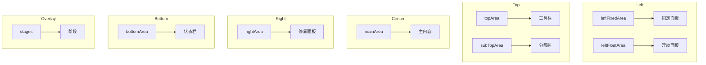

# Editor Skeleton 模块总览

## 目录

- [模块简介](#模块简介)
- [核心职责](#核心职责)
- [模块结构](#模块结构)
- [核心概念](#核心概念)
- [区域划分](#区域划分)
- [组件类型](#组件类型)
- [使用场景](#使用场景)
- [相关文档](#相关文档)

## 模块简介

Editor Skeleton 模块是编辑器的 UI 骨架系统，负责管理编辑器的面板、工具栏、布局区域、组件等 UI 元素。

**包路径**: `packages/editor-skeleton`

**主要导出**:
```typescript
export * from './skeleton';
export * from './area';
export * from './components';
export * from './context';
export * from './layouts';
export * from './transducers';
export * from './types';
export * from './widget';
export * from './icons';
export * from './locale';
```

## 核心职责

### 1. 骨架管理
- 管理编辑器的 UI 结构
- 提供面板注册和管理
- 支持面板的显示和隐藏
- 管理面板的停靠状态

### 2. 区域管理
- 划分编辑器的不同区域
- 管理区域内的组件
- 支持区域的动态配置

### 3. 组件管理
- 管理面板、工具栏等组件
- 提供组件的创建和销毁
- 支持组件的激活和禁用

### 4. 布局管理
- 提供编辑器的整体布局
- 管理布局的响应式适配
- 支持自定义布局配置

### 5. 阶段管理
- 管理编辑器的阶段（如设计模式、预览模式）
- 提供阶段切换功能
- 管理阶段相关的 UI 状态

### 6. 事件系统
- 提供骨架级别的事件
- 支持事件监听和触发
- 协调各组件间的通信

### 7. 国际化支持
- 提供多语言支持
- 管理语言切换
- 支持动态加载语言包

## 模块结构

```
packages/editor-skeleton/
├── src/
│   ├── skeleton.ts              # 骨架核心类
│   ├── area.ts                 # 区域定义
│   ├── context.ts              # 上下文管理
│   ├── types.ts                # 类型定义
│   ├── transducers/            # 转换器
│   │   ├── addon-combine.ts
│   │   └── parse-func.ts
│   ├── widget/                 # 组件系统
│   │   ├── panel.ts           # 面板组件
│   │   ├── stage.ts           # 阶段组件
│   │   ├── dialog-dock.ts     # 对话框停靠
│   │   ├── panel-dock.ts      # 面板停靠
│   │   ├── dock.ts            # 停靠组件
│   │   ├── widget.ts          # 组件基类
│   │   ├── widget-container.ts # 组件容器
│   │   └── utils.ts          # 工具函数
│   ├── components/              # UI 组件
│   │   ├── draggable-line/  # 可拖拽线
│   │   ├── field/            # 字段组件
│   │   ├── popup/            # 弹出层
│   │   ├── settings/         # 设置面板
│   │   ├── stage-box/       # 阶段框
│   │   └── widget-views/    # 组件视图
│   ├── layouts/                 # 布局组件
│   │   ├── bottom-area.ts    # 底部区域
│   │   ├── left-area.ts     # 左侧区域
│   │   ├── left-fixed-pane.ts
│   │   ├── left-float-pane.ts
│   │   ├── left-area.ts
│   │   ├── main-area.ts
│   │   ├── right-area.ts    # 右侧区域
│   │   ├── sub-top-area.ts
│   │   ├── toolbar.ts       # 工具栏
│   │   ├── top-area.ts     # 顶部区域
│   │   ├── workbench.ts     # 工作台
│   │   ├── theme.less        # 主题样式
│   │   └── index.ts
│   ├── icons/                   # 图标组件
│   │   ├── arrow.tsx
│   │   ├── clear.tsx
│   │   ├── convert.tsx
│   │   ├── exit.tsx
│   │   ├── fix.tsx
│   │   ├── float.tsx
│   │   ├── slot.tsx
│   │   └── variable.tsx
│   ├── locale/                  # 国际化
│   │   ├── en-US.json
│   │   ├── zh-CN.json
│   │   └── index.ts
│   └── less-variables.less   # Less 变量
├── tests/                    # 测试文件
│   └── widget/
│       └── utils.test.ts
├── package.json
├── tsconfig.json
├── jest.config.js
├── build.json
└── build.test.json
```

## 核心概念

### 1. Area (区域)
编辑器的布局区域，用于组织不同的 UI 组件。

**区域类型**:
- `leftArea`: 左侧区域，包含停靠的面板
- `topArea`: 顶部区域，包含工具栏
- `subTopArea`: 子顶部区域，包含分隔符
- `rightArea`: 右侧区域，包含停靠的面板
- `mainArea`: 主区域，包含中央内容
- `bottomArea`: 底部区域，包含状态栏
- `leftFixedArea`: 左侧固定区域，包含固定面板
- `leftFloatArea`: 左侧浮动区域，包含浮动面板
- `stages`: 阶段区域

### 2. Widget (组件)
UI 组件的基类，所有面板和工具栏都继承自 Widget。

**组件类型**:
- `Panel`: 面板组件
- `Dock`: 停靠组件
- `Stage`: 阶段组件
- `Divider`: 分隔符组件

### 3. Container (容器)
组件容器，用于管理一组相关组件。

**容器类型**:
- `WidgetContainer`: 组件容器
- `Area`: 区域容器

### 4. Dock (停靠)
停靠功能，允许面板停靠在编辑器的不同区域。

**停靠类型**:
- `PanelDock`: 面板停靠
- `DialogDock`: 对话框停靠

## 区域划分

### 区域布局图



### 区域说明

#### Left Area (左侧区域)
**包含**:
- `leftFixedArea`: 固定面板区域
- `leftFloatArea`: 浮动面板区域

**功能**:
- 承载编辑器的左侧面板
- 支持面板的停靠和浮动
- 管理面板的显示和隐藏

#### Top Area (顶部区域)
**包含**:
- `topArea`: 工具栏区域
- `subTopArea`: 分隔符区域

**功能**:
- 承载工具栏组件
- 显示分隔符
- 提供快速操作入口

#### Right Area (右侧区域)
**包含**:
- `rightArea`: 停靠面板区域

**功能**:
- 承载停靠的面板
- 支持面板的显示和隐藏

#### Main Area (主区域)
**包含**:
- `mainArea`: 主内容区域

**功能**:
- 显示编辑器的主要内容
- 支持画布和编辑器

#### Bottom Area (底部区域)
**包含**:
- `bottomArea`: 状态栏区域

**功能**:
- 显示编辑器状态
- 提供状态信息

#### Stages (阶段区域)
**包含**:
- `stages`: 阶段区域

**功能**:
- 显示编辑器阶段
- 支持阶段切换

## 组件类型

### 1. Panel (面板)
面板组件，用于显示编辑器的各种功能面板。

**特点**:
- 可停靠
- 可折叠
- 支持标签页
- 支持标题栏
- 支持帮助提示

### 2. Dock (停靠)
停靠组件，用于停靠面板和工具栏。

**特点**:
- 可拖拽
- 可调整大小
- 支持停靠位置切换
- 支持自动隐藏

### 3. Stage (阶段)
阶段组件，用于显示编辑器的不同阶段。

**特点**:
- 可切换
- 可自定义
- 支持阶段状态管理

### 4. Divider (分隔符)
分隔符组件，用于分隔不同的区域。

**特点**:
- 可自定义样式
- 支持多种分隔符类型
- 支持响应式

## 核心接口

### ISkeleton

```typescript
export interface ISkeleton extends Omit<IPublicApiSkeleton> {
  editor: IEditor;

  // 面板管理
  showPanel(name: string): void;
  hidePanel(name: string): void;
  showWidget(name: string): void;
  hideWidget(name: string): void;
  enableWidget(name: string): void;
  hideWidget(name: string): void;
  showArea(name: string): void;
  hideArea(name: string): void;
  onShowPanel(fn: (name: string) => void): void;
  onHidePanel(fn: (name: string) => void): void;
  onShowWidget(fn: (name: string) => void): void;
  onHideWidget(fn: (name: string) => void): void;
  remove(name: string): void;
  hideArea(name: string): void;

  // 组件管理
  getPanel(name: string): Panel | undefined;
  getWidget(name: string): IWidget | undefined;
  createStage(config: any): string | undefined;
  getStage(name: string): Stage | null;

  // 容器管理
  createContainer(
    name: string,
    handle: (item: any) => any,
    exclusive?: boolean,
    checkVisible?: () => boolean,
    defaultSetCurrent?: boolean,
  ): WidgetContainer;

  // 面板管理
  createPanel(config: IPublicTypePanelConfig): Panel;
  add(config: IPublicTypeSkeletonConfig, extraConfig?: Record<string, any>): IWidget | Widget | Panel | Stage | Dock | undefined;

  // 转换器管理
  registerConfigTransducer(
    transducer: IPublicTypeConfigTransducer,
    level: number,
    id?: string,
  ): void;
}
```

### IWidget

```typescript
export interface IWidget {
  readonly isWidget: boolean;
  name: string;
  id: string;
  body: ReactNode;
  content: ReactNode;
  visible: boolean;
  active: boolean;
}
```

### IPanel

```typescript
export interface IPanel extends IWidget {
  readonly isPanel: boolean;
  title: IPublicTypeTitleContent;
  help?: IPublicTypeHelpTipConfig;
  plain?: boolean;
  isChildOfFloatArea(): boolean;
  isChildOfFixedArea(): boolean;
  active(item?: string | null): void;
  toggle(): void;
  hide(): void;
  show(): void;
}
```

### IStage

```typescript
export interface IStage extends IWidget {
  readonly isRoot: boolean;
  hasBack(): boolean;
  setPrevious(stage: IStage, direction?: 'right' | 'left'): void;
  getPrevious(): IStage | undefined;
}
```

## 事件系统

### Skeleton Events

```typescript
export enum SkeletonEvents {
  PANEL_DOCK_ACTIVE = 'skeleton.panel-dock.active',
  PANEL_DOCK_UNACTIVE = 'skeleton.panel-dock.unactive',
  PANEL_SHOW = 'skeleton.panel.show',
  PANEL_HIDE = 'skeleton.panel.hide',
  WIDGET_SHOW = 'skeleton.widget.show',
  WIDGET_HIDE = 'skeleton.widget.hide',
  WIDGET_DISABLE = 'skeleton.widget.disable',
  WIDGET_ENABLE = 'skeleton.widget.enable',
}
```

### 事件监听

```typescript
// 监听面板显示
skeleton.onShowPanel((name) => {
  console.log('Panel shown:', name);
});

// 监听面板隐藏
skeleton.onHidePanel((name) => {
  console.log('Panel hidden:', name);
});

// 监听组件显示
skeleton.onShowWidget((name) => {
  console.log('Widget shown:', name);
});

// 监听组件隐藏
skeleton.onHideWidget((name) => {
  console.log('Widget hidden:', name);
});
```

## 使用场景

### 场景 1: 创建面板

```typescript
import { Skeleton } from '@alilc/lowcode-editor-skeleton';

const skeleton = new Skeleton(editor, 'global');

// 创建面板
skeleton.createPanel({
  name: 'my-panel',
  title: 'My Panel',
  icon: 'my-icon',
  props: {
    description: 'This is my panel',
    help: 'Help content',
  },
  content: [
    {
      type: 'Panel',
      name: 'tab1',
      title: 'Tab 1',
      content: MyComponent,
    },
    {
      type: 'Panel',
      name: 'tab2',
      title: 'Tab 2',
      content: MyComponent2,
    },
  ],
});
```

### 场景 2: 显示和隐藏面板

```typescript
// 显示面板
skeleton.showPanel('my-panel');

// 隐藏面板
skeleton.hidePanel('my-panel');

// 切换面板
skeleton.getPanel('my-panel')?.toggle();
```

### 场景 3: 创建阶段

```typescript
// 创建阶段
const stageName = skeleton.createStage({
  name: 'design-stage',
  title: 'Design Stage',
  props: {
    isRoot: true,
  },
  content: DesignStageComponent,
});

// 获取阶段
const stage = skeleton.getStage('design-stage');
```

### 场景 4: 创建容器

```typescript
// 创建容器
const container = skeleton.createContainer(
  'my-container',
  (item) => {
    console.log('Container item clicked:', item);
  },
  true,
  () => true,
  true
);
```

### 场景 5: 监听事件

```typescript
// 监听面板显示
const unsubscribe1 = skeleton.onShowPanel((name) => {
  console.log('Panel shown:', name);
});

// 监听面板隐藏
const unsubscribe2 = skeleton.onHidePanel((name) => {
  console.log('Panel hidden:', name);
});

// 取消监听
unsubscribe1();
unsubscribe2();
```

### 场景 6: 添加组件

```typescript
// 添加组件到骨架
skeleton.add({
  name: 'my-widget',
  type: 'Widget',
  props: {
    icon: 'my-icon',
    title: 'My Widget',
  },
  content: MyWidgetComponent,
});
```

### 场景 7: 从配置构建

```typescript
// 从配置构建骨架
skeleton.buildFromConfig({
  panels: [
    {
      name: 'panel1',
      title: 'Panel 1',
      icon: 'panel1-icon',
      props: {
        description: 'Panel 1 description',
      },
      content: [
        {
          type: 'Panel',
          name: 'tab1',
          title: 'Tab 1',
          content: Tab1Component,
        },
      ],
    },
  ],
  widgets: [
    {
      name: 'widget1',
      type: 'Widget',
      props: {
        icon: 'widget1-icon',
        title: 'Widget 1',
      },
      content: Widget1Component,
    },
  ],
});
```

## 相关文档

- [系统架构总览](../00-overview/architecture-overview.md)
- [Editor Core 模块](../02-editor-core/index.md)
- [Designer 模块](../01-designer/index.md)
- [骨架核心](./skeleton-core.md)
- [面板系统](./panel-system.md)
- [阶段系统](./stage-system.md)
- [组件系统](./widget-system.md)
- [布局系统](./layout-system.md)
- [组件库](./component-library.md)
