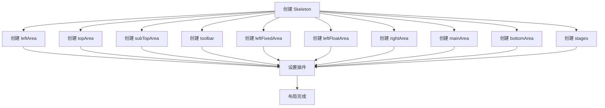
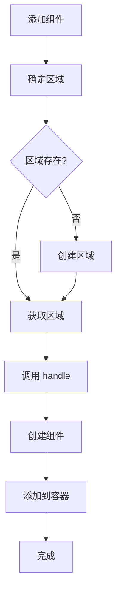
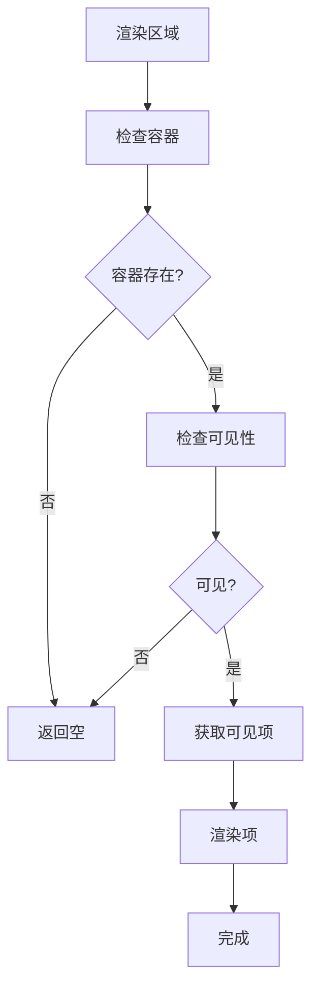

# 布局系统

## 目录

- [系统概述](#系统概述)
- [Area 类](#area-类)
- [布局组件](#布局组件)
- [区域配置](#区域配置)
- [布局流程](#布局流程)
- [响应式布局](#响应式布局)
- [使用示例](#使用示例)

## 系统概述

布局系统是 Editor Skeleton 模块的核心组成部分，负责管理编辑器的整体布局，包括各个区域的组织和排列。

**核心特点**:
- 支持多区域布局
- 支持区域组件管理
- 支持响应式布局
- 支持自定义布局配置
- 支持区域可见性控制

**文件路径**:
- `packages/editor-skeleton/src/area.ts`
- `packages/editor-skeleton/src/layouts/`

## Area 类

### 类定义

```typescript
export class Area<TConfig = any, TItem = any> {
  constructor(
    readonly skeleton: ISkeleton,
    readonly name: string,
    readonly handle: (config: TConfig) => TItem,
    readonly exclusive: boolean = false,
    readonly checkVisible: () => boolean = () => true,
    readonly defaultSetCurrent: boolean = false,
  )
}
```

### 核心属性

#### 基础属性

##### name
```typescript
readonly name: string;
```

**说明**: 区域名称。

##### skeleton
```typescript
readonly skeleton: ISkeleton;
```

**说明**: 骨架实例。

##### handle
```typescript
readonly handle: (config: TConfig) => TItem;
```

**说明**: 处理函数，用于将配置转换为组件。

##### exclusive
```typescript
readonly exclusive: boolean;
```

**说明**: 是否互斥激活。

##### checkVisible
```typescript
readonly checkVisible: () => boolean;
```

**说明**: 可见性检查函数。

##### defaultSetCurrent
```typescript
readonly defaultSetCurrent: boolean;
```

**说明**: 是否默认设置当前项。

#### 容器属性

##### container
```typescript
@obx.ref container: WidgetContainer<TItem, TConfig>;
```

**说明**: 组件容器。

#### 状态属性

##### visible
```typescript
@computed get visible(): boolean
```

**说明**: 区域是否可见（计算属性）。

**计算逻辑**:
```typescript
if (this.container) {
  return this.container.items.length > 0 && this.checkVisible();
}
return false;
```

### 核心方法

#### 容器管理

##### add
```typescript
add(config: TConfig): TItem | undefined
```

**功能**: 添加配置到区域。

**参数**:
- `config`: 配置对象

**返回值**: 组件实例或 undefined

**说明**: 
- 如果容器不存在，创建容器
- 调用处理函数将配置转换为组件
- 添加到容器中

##### remove
```typescript
remove(item: TItem | string): boolean
```

**功能**: 从区域中移除组件。

**参数**:
- `item`: 组件实例或组件名称

**返回值**: 是否成功移除

**说明**: 
- 如果容器不存在，返回 false
- 调用容器的 remove 方法

#### 其他方法

##### get
```typescript
get(name: string): TItem | undefined
```

**功能**: 根据名称获取组件。

**参数**:
- `name`: 组件名称

**返回值**: 组件实例或 undefined

**说明**: 调用容器的 get 方法

## 布局组件

### Workbench

**文件路径**: `packages/editor-skeleton/src/layouts/workbench.ts`

**功能**: 工作台组件，编辑器的主容器。

**特点**:
- 包含所有区域
- 管理整体布局
- 支持响应式

### TopArea

**文件路径**: `packages/editor-skeleton/src/layouts/top-area.ts`

**功能**: 顶部区域组件。

**特点**:
- 包含工具栏
- 支持分隔符
- 支持停靠组件

### SubTopArea

**文件路径**: `packages/editor-skeleton/src/layouts/sub-top-area.ts`

**功能**: 子顶部区域组件。

**特点**:
- 包含分隔符
- 支持停靠组件

### LeftArea

**文件路径**: `packages/editor-skeleton/src/layouts/left-area.ts`

**功能**: 左侧区域组件。

**特点**:
- 包含固定区域
- 包含浮动区域
- 支持停靠组件

### LeftFixedPane

**文件路径**: `packages/editor-skeleton/src/layouts/left-fixed-pane.ts`

**功能**: 左侧固定面板组件。

**特点**:
- 包含固定面板
- 支持面板切换

### LeftFloatPane

**文件路径**: `packages/editor-skeleton/src/layouts/left-float-pane.ts`

**功能**: 左侧浮动面板组件。

**特点**:
- 包含浮动面板
- 支持面板切换

### MainArea

**文件路径**: `packages/editor-skeleton/src/layouts/main-area.ts`

**功能**: 主区域组件。

**特点**:
- 包含中央内容
- 支持组件和面板

### RightArea

**文件路径**: `packages/editor-skeleton/src/layouts/right-area.ts`

**功能**: 右侧区域组件。

**特点**:
- 包含停靠面板
- 支持面板切换

### BottomArea

**文件路径**: `packages/editor-skeleton/src/layouts/bottom-area.ts`

**功能**: 底部区域组件。

**特点**:
- 包含状态栏
- 支持面板

### Toolbar

**文件路径**: `packages/editor-skeleton/src/layouts/toolbar.ts`

**功能**: 工具栏组件。

**特点**:
- 包含工具按钮
- 支持分隔符
- 支持停靠组件

## 区域配置

### 区域类型

#### leftArea
```typescript
{
  name: 'leftArea',
  type: 'Dock' | 'PanelDock' | 'DialogDock',
}
```

**说明**: 左侧区域，包含停靠组件。

#### topArea
```typescript
{
  name: 'topArea',
  type: 'Dock' | 'Divider' | 'PanelDock' | 'DialogDock',
}
```

**说明**: 顶部区域，包含工具栏和分隔符。

#### subTopArea
```typescript
{
  name: 'subTopArea',
  type: 'Dock' | 'Divider' | 'PanelDock' | 'DialogDock',
}
```

**说明**: 子顶部区域，包含分隔符和工具栏。

#### toolbar
```typescript
{
  name: 'toolbar',
  type: 'Dock' | 'Divider' | 'PanelDock' | 'DialogDock',
}
```

**说明**: 工具栏区域，包含工具按钮和分隔符。

#### leftFixedArea
```typescript
{
  name: 'leftFixedArea',
  type: 'Panel',
}
```

**说明**: 左侧固定区域，包含固定面板。

#### leftFloatArea
```typescript
{
  name: 'leftFloatArea',
  type: 'Panel',
}
```

**说明**: 左侧浮动区域，包含浮动面板。

#### rightArea
```typescript
{
  name: 'rightArea',
  type: 'Panel',
}
```

**说明**: 右侧区域，包含停靠面板。

#### mainArea
```typescript
{
  name: 'mainArea',
  type: 'Widget' | 'Panel',
}
```

**说明**: 主区域，包含中央内容。

#### bottomArea
```typescript
{
  name: 'bottomArea',
  type: 'Panel',
}
```

**说明**: 底部区域，包含状态栏。

#### stages
```typescript
{
  name: 'stages',
  type: 'Stage',
}
```

**说明**: 阶段区域，包含编辑器阶段。

## 布局流程

### 布局初始化流程



### 组件添加流程



### 区域渲染流程



## 响应式布局

### 响应式策略

#### 1. 宽度自适应
```typescript
@media (max-width: 1200px) {
  .left-area {
    width: 280px;
  }
}

@media (max-width: 768px) {
  .left-area {
    width: 240px;
  }
}
```

#### 2. 面板折叠
```typescript
@media (max-width: 768px) {
  .right-area {
    display: none;
  }
}
```

#### 3. 工具栏调整
```typescript
@media (max-width: 768px) {
  .toolbar {
    flex-direction: column;
  }
}
```

### 响应式配置

```typescript
const skeleton = new Skeleton(editor, 'global');

// 添加响应式组件
skeleton.add({
  name: 'responsive-widget',
  type: 'Widget',
  area: 'mainArea',
  props: {
    condition: (widget) => {
      // 根据窗口宽度决定是否显示
      return window.innerWidth > 768;
    },
  },
  content: ResponsiveWidgetComponent,
});
```

## 使用示例

### 示例 1: 创建自定义区域

```typescript
import { Area } from '@alilc/lowcode-editor-skeleton';

const customArea = new Area(
  skeleton,
  'customArea',
  (config) => {
    return skeleton.createWidget(config);
  },
  true,
  () => true,
  true
);
```

### 示例 2: 添加组件到区域

```typescript
// 添加到左侧区域
skeleton.add({
  name: 'left-dock',
  type: 'Dock',
  area: 'leftArea',
  props: {
    icon: 'my-icon',
    title: 'Left Dock',
  },
  content: LeftDockComponent,
});

// 添加到顶部区域
skeleton.add({
  name: 'top-dock',
  type: 'Dock',
  area: 'topArea',
  props: {
    icon: 'my-icon',
    title: 'Top Dock',
  },
  content: TopDockComponent,
});

// 添加到主区域
skeleton.add({
  name: 'main-widget',
  type: 'Widget',
  area: 'mainArea',
  props: {
    icon: 'my-icon',
    title: 'Main Widget',
  },
  content: MainWidgetComponent,
});
```

### 示例 3: 创建自定义布局

```typescript
function CustomLayout({ skeleton }: { skeleton: ISkeleton }) {
  return (
    <div className="custom-layout">
      <div className="custom-header">
        {skeleton.topArea.container?.items.map(item => (
          <div key={item.id}>{item.content}</div>
        ))}
      </div>
      <div className="custom-body">
        <div className="custom-sidebar">
          {skeleton.leftArea.container?.items.map(item => (
            <div key={item.id}>{item.content}</div>
          ))}
        </div>
        <div className="custom-main">
          {skeleton.mainArea.container?.items.map(item => (
            <div key={item.id}>{item.content}</div>
          ))}
        </div>
      </div>
    </div>
  );
}
```

### 示例 4: 区域可见性控制

```typescript
// 创建带可见性检查的区域
const customArea = new Area(
  skeleton,
  'customArea',
  (config) => {
    return skeleton.createWidget(config);
  },
  true,
  () => {
    // 根据条件决定区域是否可见
    return editor.get('showCustomArea');
  },
  true
);
```

### 示例 5: 区域互斥激活

```typescript
// 创建互斥激活的区域
const exclusiveArea = new Area(
  skeleton,
  'exclusiveArea',
  (config) => {
    return skeleton.createWidget(config);
  },
  true,  // exclusive
  () => true,
  true
);
```

### 示例 6: 响应式布局

```typescript
// 添加响应式组件
skeleton.add({
  name: 'responsive-widget',
  type: 'Widget',
  area: 'mainArea',
  props: {
    condition: (widget) => {
      // 根据窗口宽度决定是否显示
      return window.innerWidth > 768;
    },
  },
  content: ResponsiveWidgetComponent,
});

// 监听窗口大小变化
window.addEventListener('resize', () => {
  // 触发重新渲染
  skeleton.mainArea.container?.items.forEach(item => {
    // 更新组件可见性
  });
});
```

### 示例 7: 自定义布局组件

```typescript
import React, { useState, useEffect } from 'react';

function CustomWorkbench({ skeleton }: { skeleton: ISkeleton }) {
  const [isMobile, setIsMobile] = useState(false);

  useEffect(() => {
    const handleResize = () => {
      setIsMobile(window.innerWidth < 768);
    };

    window.addEventListener('resize', handleResize);
    handleResize();

    return () => {
      window.removeEventListener('resize', handleResize);
    };
  }, []);

  return (
    <div className="custom-workbench">
      <header className="custom-header">
        {skeleton.topArea.container?.items.map(item => (
          <div key={item.id}>{item.content}</div>
        ))}
      </header>
      
      <div className="custom-body">
        {!isMobile && (
          <aside className="custom-sidebar">
            {skeleton.leftArea.container?.items.map(item => (
              <div key={item.id}>{item.content}</div>
            ))}
          </aside>
        )}
        
        <main className="custom-main">
          {skeleton.mainArea.container?.items.map(item => (
            <div key={item.id}>{item.content}</div>
          ))}
        </main>
        
        {!isMobile && (
          <aside className="custom-right">
            {skeleton.rightArea.container?.items.map(item => (
              <div key={item.id}>{item.content}</div>
            ))}
          </aside>
        )}
      </div>
      
      <footer className="custom-footer">
        {skeleton.bottomArea.container?.items.map(item => (
          <div key={item.id}>{item.content}</div>
        ))}
      </footer>
    </div>
  );
}
```

### 示例 8: 区域拖拽调整

```typescript
import React, { useState, useRef } from 'react';

function ResizableArea({ skeleton, areaName }: { skeleton: ISkeleton; areaName: string }) {
  const [width, setWidth] = useState(300);
  const [isResizing, setIsResizing] = useState(false);
  const areaRef = useRef<HTMLDivElement>(null);

  const handleMouseDown = (e: React.MouseEvent) => {
    setIsResizing(true);
  };

  useEffect(() => {
    const handleMouseMove = (e: MouseEvent) => {
      if (!isResizing || !areaRef.current) return;

      const newWidth = e.clientX - areaRef.current.getBoundingClientRect().left;
      setWidth(Math.max(200, Math.min(600, newWidth)));
    };

    const handleMouseUp = () => {
      setIsResizing(false);
    };

    if (isResizing) {
      document.addEventListener('mousemove', handleMouseMove);
      document.addEventListener('mouseup', handleMouseUp);
    }

    return () => {
      document.removeEventListener('mousemove', handleMouseMove);
      document.removeEventListener('mouseup', handleMouseUp);
    };
  }, [isResizing]);

  const area = skeleton[areaName as keyof ISkeleton] as Area;

  return (
    <div
      ref={areaRef}
      className="resizable-area"
      style={{ width: `${width}px` }}
    >
      <div className="area-content">
        {area.container?.items.map(item => (
          <div key={item.id}>{item.content}</div>
        ))}
      </div>
      <div
        className="resize-handle"
        onMouseDown={handleMouseDown}
      />
    </div>
  );
}
```

### 示例 9: 区域折叠/展开

```typescript
import React, { useState } from 'react';

function CollapsibleArea({ skeleton, areaName }: { skeleton: ISkeleton; areaName: string }) {
  const [isCollapsed, setIsCollapsed] = useState(false);

  const area = skeleton[areaName as keyof ISkeleton] as Area;

  return (
    <div className={`collapsible-area ${isCollapsed ? 'collapsed' : ''}`}>
      <div className="area-header">
        <h3>{area.name}</h3>
        <button onClick={() => setIsCollapsed(!isCollapsed)}>
          {isCollapsed ? '展开' : '折叠'}
        </button>
      </div>
      {!isCollapsed && (
        <div className="area-content">
          {area.container?.items.map(item => (
            <div key={item.id}>{item.content}</div>
          ))}
        </div>
      )}
    </div>
  );
}
```

### 示例 10: 区域标签页

```typescript
import React, { useState } from 'react';

function TabbedArea({ skeleton, areaName }: { skeleton: ISkeleton; areaName: string }) {
  const [activeTab, setActiveTab] = useState(0);

  const area = skeleton[areaName as keyof ISkeleton] as Area;
  const items = area.container?.items || [];

  return (
    <div className="tabbed-area">
      <div className="tab-header">
        {items.map((item, index) => (
          <button
            key={item.id}
            className={`tab ${activeTab === index ? 'active' : ''}`}
            onClick={() => setActiveTab(index)}
          >
            {item.name}
          </button>
        ))}
      </div>
      <div className="tab-content">
        {items[activeTab] && (
          <div key={items[activeTab].id}>
            {items[activeTab].content}
          </div>
        )}
      </div>
    </div>
  );
}
```

## 设计模式

### 1. 组合模式
- 区域包含组件
- 组件可以包含子组件
- 形成树形结构

### 2. 策略模式
- 不同的区域有不同的布局策略
- 支持自定义布局

### 3. 观察者模式
- 通过 MobX 实现响应式布局
- 状态变更自动触发 UI 更新

### 4. 工厂模式
- Area 类根据配置创建不同的组件
- 支持多种组件类型

## 注意事项

1. **区域名称唯一性**: 区域名称必须唯一
2. **组件名称唯一性**: 组件名称必须唯一
3. **区域可见性**: 区域的可见性受容器和检查函数影响
4. **互斥激活**: 如果区域设置为互斥激活，同时只能有一个组件被激活
5. **响应式布局**: 需要自己实现响应式逻辑
6. **性能优化**: 大量组件时需要考虑性能优化
7. **布局调整**: 需要自己实现拖拽调整、折叠展开等功能

## 相关文档

- [Editor Skeleton 模块总览](./index.md)
- [Skeleton 核心类](./skeleton-core.md)
- [面板系统](./panel-system.md)
- [组件系统](./widget-system.md)
- [阶段系统](./stage-system.md)
