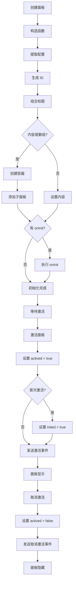
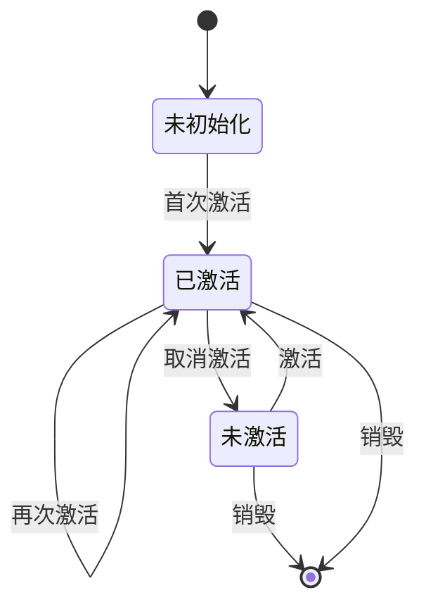

# 面板系统

## 目录

- [系统概述](#系统概述)
- [Panel 类](#panel-类)
- [面板生命周期](#面板生命周期)
- [面板类型](#面板类型)
- [面板容器](#面板容器)
- [面板停靠](#面板停靠)
- [面板状态管理](#面板状态管理)
- [面板事件](#面板事件)
- [使用示例](#使用示例)

## 系统概述

面板系统是 Editor Skeleton 模块的核心组成部分，负责管理编辑器的各种功能面板，如组件树、属性配置、代码编辑器等。

**核心特点**:
- 支持面板的创建和管理
- 支持面板的显示和隐藏
- 支持面板的停靠和浮动
- 支持面板的标签页
- 支持面板的激活和禁用
- 支持面板的标题栏和帮助提示

**文件路径**: `packages/editor-skeleton/src/widget/panel.ts`

## Panel 类

### 类定义

```typescript
export class Panel implements IWidget {
  constructor(readonly skeleton: ISkeleton, readonly config: IPublicTypePanelConfig)
}
```

### 核心属性

#### 基础属性

##### isWidget
```typescript
readonly isWidget = true;
```

**说明**: 标识这是一个组件。

##### isPanel
```typescript
readonly isPanel = true;
```

**说明**: 标识这是一个面板。

##### name
```typescript
readonly name: string;
```

**说明**: 面板名称，必须唯一。

##### id
```typescript
readonly id: string;
```

**说明**: 面板唯一标识，自动生成，格式为 `pane:${name}$uniqueId`。

#### 状态属性

##### inited
```typescript
@obx.ref inited = false;
```

**说明**: 面板是否已初始化。

**说明**: 
- 面板首次激活时设置为 true
- 面板取消激活时，如果名称不以父容器名称开头，则设置为 false

##### _actived
```typescript
@obx.ref private _actived = false;
```

**说明**: 面板是否已激活。

##### actived
```typescript
@computed get actived(): boolean
```

**说明**: 面板激活状态（计算属性）。

##### visible
```typescript
@computed get visible(): boolean
```

**说明**: 面板可见状态（计算属性）。

**计算逻辑**:
1. 如果父容器不可见，返回 false
2. 如果配置了 `props.condition`，执行条件函数
3. 否则返回 `_actived` 状态

#### 内容属性

##### title
```typescript
readonly title: IPublicTypeTitleContent;
```

**说明**: 面板标题。

**类型**:
- `string`: 纯文本标题
- `ReactNode`: React 节点标题
- `{ label: string; icon?: string; description?: string }`: 结构化标题

##### help
```typescript
readonly help?: IPublicTypeHelpTipConfig;
```

**说明**: 帮助提示配置。

##### plain
```typescript
private plain = false;
```

**说明**: 是否为纯面板（无标题栏）。

**设置条件**:
- 配置了 `props.hideTitleBar`
- 未配置标题

##### body
```typescript
get body(): ReactNode
```

**说明**: 面板主体内容。

**渲染逻辑**:
1. 如果有容器，渲染 `TabsPanelView`
2. 否则渲染配置的 `content`

##### content
```typescript
get content(): ReactNode
```

**说明**: 面板内容。

**渲染逻辑**:
1. 如果是纯面板，渲染 `PanelView`
2. 否则渲染 `TitledPanelView`

#### 关联属性

##### container
```typescript
private container?: WidgetContainer<Panel, IPublicTypePanelConfig>;
```

**说明**: 面板容器（用于标签页）。

##### parent
```typescript
@obx.ref parent?: WidgetContainer;
```

**说明**: 父容器。

### 核心方法

#### 生命周期方法

##### constructor
```typescript
constructor(readonly skeleton: ISkeleton, readonly config: IPublicTypePanelConfig)
```

**功能**: 构造函数，初始化面板。

**初始化流程**:
1. 设置 MobX 可观察性
2. 提取配置中的名称、内容、属性
3. 生成面板 ID
4. 组合标题
5. 设置纯面板标志
6. 如果内容是数组，创建容器并添加子面板
7. 如果配置了 `onInit`，执行初始化回调
8. 如果内容对象有 `onInit`，执行初始化回调

#### 父容器管理

##### setParent
```typescript
setParent(parent: WidgetContainer): void
```

**功能**: 设置父容器。

**参数**:
- `parent`: 父容器

**说明**: 
- 如果新父容器与当前父容器相同，直接返回
- 如果当前有父容器，先从原父容器中移除
- 设置新的父容器

#### 子面板管理

##### add
```typescript
add(item: Panel | IPublicTypePanelConfig): Panel | undefined
```

**功能**: 添加子面板。

**参数**:
- `item`: 面板实例或面板配置

**返回值**: 子面板实例

##### getPane
```typescript
getPane(name: string): Panel | null
```

**功能**: 获取子面板。

**参数**:
- `name`: 子面板名称

**返回值**: 子面板实例或 null

##### remove
```typescript
remove(item: Panel | string): boolean
```

**功能**: 移除子面板。

**参数**:
- `item`: 面板实例或面板名称

**返回值**: 是否成功移除

#### 激活管理

##### active
```typescript
active(item?: Panel | string | null): void
```

**功能**: 激活面板。

**参数**:
- `item`: 子面板或子面板名称，如果为空，激活自身

**说明**: 
- 如果指定了子面板，激活子面板
- 否则激活自身

##### setActive
```typescript
setActive(flag: boolean): void
```

**功能**: 设置激活状态。

**参数**:
- `flag`: 是否激活

**激活流程**:
1. 如果状态未改变，直接返回
2. 如果激活：
   - 如果在浮动区域，取消固定区域的所有激活
   - 如果在固定区域，取消浮动区域的所有激活
   - 设置 `_actived` 为 true
   - 激活父容器
   - 如果未初始化，设置 `inited` 为 true
   - 发送激活变更事件
3. 如果取消激活：
   - 如果已初始化且名称不以父容器名称开头，取消初始化
   - 设置 `_actived` 为 false
   - 取消父容器激活
   - 发送激活变更事件

##### toggle
```typescript
toggle(): void
```

**功能**: 切换激活状态。

#### 显示管理

##### show
```typescript
show(): void
```

**功能**: 显示面板。

**说明**: 调用 `setActive(true)`。

##### hide
```typescript
hide(): void
```

**功能**: 隐藏面板。

**说明**: 调用 `setActive(false)`。

#### 状态管理

##### enable
```typescript
enable(): void
```

**功能**: 启用面板。

**说明**: 当前为空实现。

##### disable
```typescript
disable(): void
```

**功能**: 禁用面板。

**说明**: 当前为空实现。

#### 位置检查

##### isChildOfFloatArea
```typescript
isChildOfFloatArea(): boolean
```

**功能**: 检查是否在浮动区域。

**返回值**: 是否在浮动区域

##### isChildOfFixedArea
```typescript
isChildOfFixedArea(): boolean
```

**功能**: 检查是否在固定区域。

**返回值**: 是否在固定区域

#### 其他方法

##### getName
```typescript
getName(): string
```

**功能**: 获取面板名称。

**返回值**: 面板名称

##### getContent
```typescript
getContent(): ReactNode
```

**功能**: 获取面板内容。

**返回值**: 面板内容

##### getAssocDocks
```typescript
getAssocDocks(): PanelDock[]
```

**功能**: 获取关联的停靠面板。

**返回值**: 关联的停靠面板列表

##### onActiveChange
```typescript
onActiveChange(fn: (flag: boolean) => void): () => void
```

**功能**: 监听激活状态变更。

**参数**:
- `fn`: 回调函数

**返回值**: 取消监听函数

**注意**: 已废弃

##### getSupportedPositions
```typescript
getSupportedPositions(): string[]
```

**功能**: 获取支持的位置。

**返回值**: 位置列表

**注意**: 已废弃

##### getCurrentPosition
```typescript
getCurrentPosition(): string
```

**功能**: 获取当前位置。

**返回值**: 当前位置

**注意**: 已废弃

##### setPosition
```typescript
setPosition(position: string): void
```

**功能**: 设置位置。

**参数**:
- `position`: 位置

**注意**: 已废弃

## 面板生命周期

### 生命周期流程图



### 生命周期阶段

#### 1. 创建阶段
- 调用构造函数
- 初始化面板属性
- 创建子面板容器（如果需要）
- 执行初始化回调

#### 2. 激活阶段
- 首次激活时设置 `inited` 为 true
- 设置 `actived` 为 true
- 激活父容器
- 发送激活变更事件

#### 3. 显示阶段
- 面板可见
- 响应用户交互
- 更新面板内容

#### 4. 取消激活阶段
- 设置 `actived` 为 false
- 取消父容器激活
- 发送取消激活变更事件

#### 5. 销毁阶段
- 从父容器中移除
- 取消事件监听
- 释放资源

## 面板类型

### 1. 纯面板 (Plain Panel)

**特点**:
- 无标题栏
- 简洁的界面
- 适合作为子面板使用

**配置**:
```typescript
{
  name: 'plain-panel',
  props: {
    hideTitleBar: true,
  },
  content: MyComponent,
}
```

### 2. 标题面板 (Titled Panel)

**特点**:
- 有标题栏
- 显示标题和图标
- 支持帮助提示

**配置**:
```typescript
{
  name: 'titled-panel',
  title: 'My Panel',
  icon: 'my-icon',
  props: {
    description: 'Panel description',
    help: 'Help content',
  },
  content: MyComponent,
}
```

### 3. 标签页面板 (Tabs Panel)

**特点**:
- 包含多个子面板
- 支持标签页切换
- 子面板互斥激活

**配置**:
```typescript
{
  name: 'tabs-panel',
  title: 'Tabs Panel',
  content: [
    {
      type: 'Panel',
      name: 'tab1',
      title: 'Tab 1',
      content: Tab1Component,
    },
    {
      type: 'Panel',
      name: 'tab2',
      title: 'Tab 2',
      content: Tab2Component,
    },
  ],
}
```

## 面板容器

### WidgetContainer

**功能**: 管理一组相关面板，支持互斥激活。

**特点**:
- 支持添加和移除面板
- 支持激活和取消激活面板
- 支持获取面板
- 支持取消所有激活

**创建容器**:
```typescript
const container = skeleton.createContainer(
  'my-container',
  (item) => {
    console.log('Container item clicked:', item);
  },
  true,  // exclusive
  () => true,  // checkVisible
  true  // defaultSetCurrent
);
```

### 容器管理

#### 添加面板
```typescript
panel.add({
  type: 'Panel',
  name: 'tab1',
  title: 'Tab 1',
  content: Tab1Component,
});
```

#### 获取面板
```typescript
const tab1 = panel.getPane('tab1');
```

#### 移除面板
```typescript
panel.remove('tab1');
```

#### 激活面板
```typescript
panel.active('tab1');
```

## 面板停靠

### 停靠类型

#### 固定停靠 (Fixed Dock)
- 面板固定在左侧固定区域
- 占据固定空间
- 适合常用面板

#### 浮动停靠 (Float Dock)
- 面板浮动在左侧浮动区域
- 可以拖拽调整大小
- 适合临时面板

### 停靠切换

```typescript
// 切换停靠状态
skeleton.toggleFloatStatus(panel);

// 检查停靠状态
const isFloat = panel.isChildOfFloatArea();
const isFixed = panel.isChildOfFixedArea();
```

### 停靠状态持久化

面板的停靠状态会保存到配置中，下次打开时会恢复。

```typescript
// 保存停靠状态
engineConfig.getPreference().set(
  `${panel.name}-pinned-status-isFloat`,
  !isFloat,
  'skeleton'
);

// 恢复停靠状态
const isFloat = engineConfig.getPreference()?.get(
  `${panel.name}-pinned-status-isFloat`,
  'skeleton'
);
```

## 面板状态管理

### 状态类型

#### 1. 初始化状态 (inited)
- 面板是否已初始化
- 首次激活时设置为 true
- 取消激活时可能重置为 false

#### 2. 激活状态 (actived)
- 面板是否已激活
- 控制面板的显示和隐藏

#### 3. 可见状态 (visible)
- 面板是否可见
- 受父容器和条件函数影响

### 状态转换



### 状态监听

```typescript
// 监听激活状态变更
const unsubscribe = panel.onActiveChange((flag) => {
  console.log('Panel active changed:', flag);
});

// 取消监听
unsubscribe();
```

## 面板事件

### 激活变更事件

**事件名称**: `activechange`

**触发时机**: 面板激活状态变更时

**参数**:
- `flag`: 激活状态

**示例**:
```typescript
panel.onActiveChange((flag) => {
  if (flag) {
    console.log('Panel activated');
  } else {
    console.log('Panel deactivated');
  }
});
```

### 骨架事件

#### PANEL_SHOW
```typescript
skeleton.onShowPanel((name, panel) => {
  console.log('Panel shown:', name, panel);
});
```

#### PANEL_HIDE
```typescript
skeleton.onHidePanel((name, panel) => {
  console.log('Panel hidden:', name, panel);
});
```

## 使用示例

### 示例 1: 创建纯面板

```typescript
const panel = skeleton.createPanel({
  name: 'plain-panel',
  props: {
    hideTitleBar: true,
  },
  content: PlainPanelComponent,
});
```

### 示例 2: 创建标题面板

```typescript
const panel = skeleton.createPanel({
  name: 'titled-panel',
  title: 'My Panel',
  icon: 'my-icon',
  props: {
    description: 'Panel description',
    help: 'Help content',
  },
  content: TitledPanelComponent,
});
```

### 示例 3: 创建标签页面板

```typescript
const panel = skeleton.createPanel({
  name: 'tabs-panel',
  title: 'Tabs Panel',
  icon: 'tabs-icon',
  content: [
    {
      type: 'Panel',
      name: 'tab1',
      title: 'Tab 1',
      icon: 'tab1-icon',
      content: Tab1Component,
    },
    {
      type: 'Panel',
      name: 'tab2',
      title: 'Tab 2',
      icon: 'tab2-icon',
      content: Tab2Component,
    },
    {
      type: 'Panel',
      name: 'tab3',
      title: 'Tab 3',
      icon: 'tab3-icon',
      content: Tab3Component,
    },
  ],
});
```

### 示例 4: 显示和隐藏面板

```typescript
// 显示面板
skeleton.showPanel('my-panel');

// 隐藏面板
skeleton.hidePanel('my-panel');

// 切换面板
skeleton.getPanel('my-panel')?.toggle();
```

### 示例 5: 切换面板停靠状态

```typescript
const panel = skeleton.getPanel('my-panel');
if (panel) {
  skeleton.toggleFloatStatus(panel);
}
```

### 示例 6: 监听面板事件

```typescript
// 监听面板激活状态变更
const panel = skeleton.getPanel('my-panel');
if (panel) {
  const unsubscribe = panel.onActiveChange((flag) => {
    console.log('Panel active changed:', flag);
  });
  
  // 取消监听
  unsubscribe();
}

// 监听面板显示
skeleton.onShowPanel((name, panel) => {
  console.log('Panel shown:', name, panel);
});

// 监听面板隐藏
skeleton.onHidePanel((name, panel) => {
  console.log('Panel hidden:', name, panel);
});
```

### 示例 7: 管理标签页面板

```typescript
const panel = skeleton.getPanel('tabs-panel');
if (panel) {
  // 添加标签页
  panel.add({
    type: 'Panel',
    name: 'tab4',
    title: 'Tab 4',
    content: Tab4Component,
  });
  
  // 获取标签页
  const tab1 = panel.getPane('tab1');
  
  // 激活标签页
  panel.active('tab1');
  
  // 移除标签页
  panel.remove('tab1');
}
```

### 示例 8: 条件显示面板

```typescript
const panel = skeleton.createPanel({
  name: 'conditional-panel',
  title: 'Conditional Panel',
  props: {
    condition: (panel) => {
      // 根据条件决定是否显示面板
      return editor.get('someCondition');
    },
  },
  content: ConditionalPanelComponent,
});
```

### 示例 9: 面板初始化回调

```typescript
const panel = skeleton.createPanel({
  name: 'init-panel',
  title: 'Init Panel',
  props: {
    onInit: (panel) => {
      console.log('Panel initialized:', panel.name);
      // 执行初始化逻辑
    },
  },
  content: InitPanelComponent,
});
```

### 示例 10: 获取关联的停靠面板

```typescript
const panel = skeleton.getPanel('my-panel');
if (panel) {
  const docks = panel.getAssocDocks();
  console.log('Associated docks:', docks);
}
```

## 设计模式

### 1. 观察者模式
- 通过事件系统实现面板状态变更通知
- 支持事件监听和取消监听

### 2. 组合模式
- 面板可以包含子面板
- 形成树形结构

### 3. 策略模式
- 不同的面板类型有不同的渲染策略
- 纯面板 vs 标题面板 vs 标签页面板

### 4. 状态模式
- 面板有不同的状态：未初始化、已激活、未激活
- 状态转换有明确的规则

## 注意事项

1. **面板名称唯一性**: 面板名称必须唯一，否则会覆盖之前的面板
2. **生命周期管理**: 面板首次激活时会初始化，取消激活时可能重置
3. **停靠状态持久化**: 面板的停靠状态会保存到配置中
4. **事件监听**: 记得在不需要时取消事件监听，避免内存泄漏
5. **条件显示**: 使用 `props.condition` 可以实现条件显示面板
6. **标签页面板**: 标签页面板的子面板互斥激活
7. **父容器管理**: 设置父容器时会自动从原父容器中移除

## 相关文档

- [Editor Skeleton 模块总览](./index.md)
- [Skeleton 核心类](./skeleton-core.md)
- [组件系统](./widget-system.md)
- [阶段系统](./stage-system.md)
- [布局系统](./layout-system.md)
