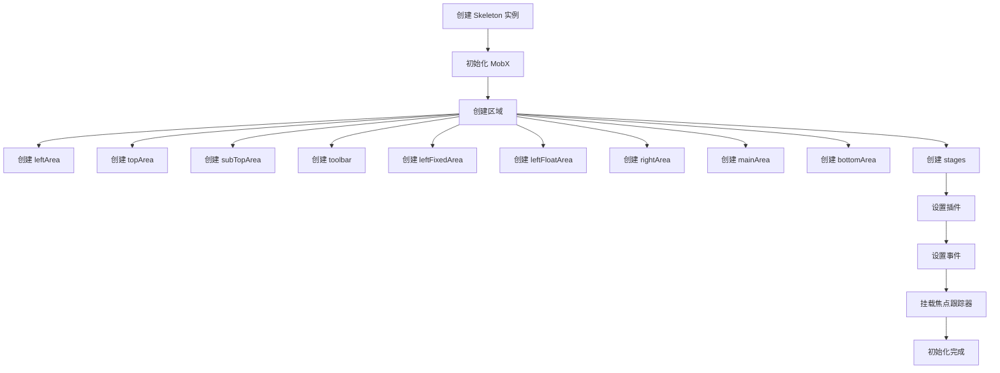
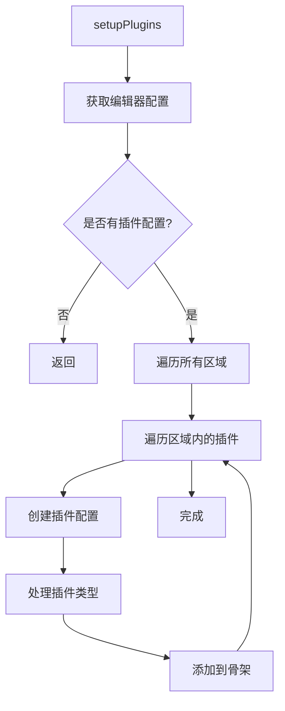
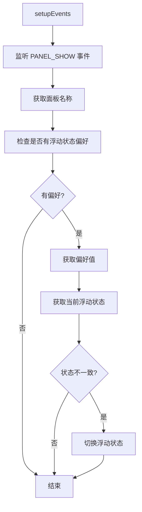
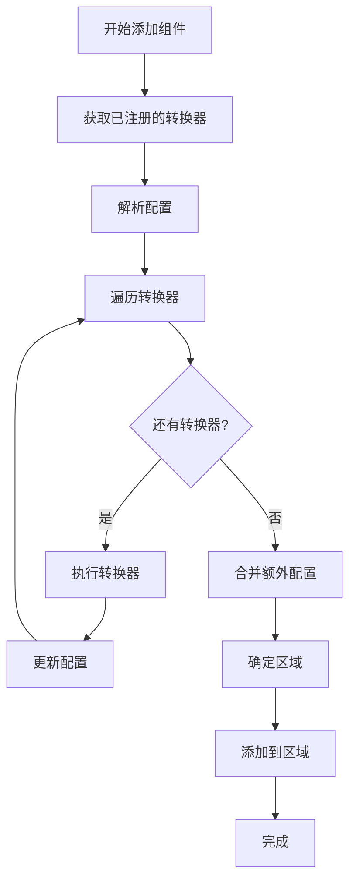

# Skeleton 核心类

## 目录

- [类概述](#类概述)
- [类定义](#类定义)
- [核心属性](#核心属性)
- [核心方法](#核心方法)
- [生命周期](#生命周期)
- [事件系统](#事件系统)
- [配置转换器](#配置转换器)
- [使用示例](#使用示例)

## 类概述

`Skeleton` 是 Editor Skeleton 模块的核心类，负责管理编辑器的 UI 骨架，包括面板、工具栏、布局区域、组件等 UI 元素。

**文件路径**: `packages/editor-skeleton/src/skeleton.ts`

**继承关系**:
- 实现 `ISkeleton` 接口
- 不继承任何基类

**核心职责**:
- 管理编辑器的 UI 结构
- 提供面板注册和管理
- 管理布局区域
- 提供组件创建和管理
- 处理面板的停靠和浮动
- 管理编辑器的阶段

## 类定义

```typescript
export class Skeleton implements ISkeleton {
  constructor(readonly editor: IEditor, readonly viewName: string = 'global')
}
```

### 构造函数参数

| 参数 | 类型 | 必填 | 说明 |
|------|------|------|------|
| `editor` | `IEditor` | 是 | 编辑器实例 |
| `viewName` | `string` | 否 | 视图名称，默认为 `'global'` |

## 核心属性

### 区域属性

#### leftArea
```typescript
readonly leftArea: Area<DockConfig | PanelDockConfig | DialogDockConfig>;
```

**说明**: 左侧区域，包含停靠的面板和工具栏。

**特点**:
- 支持停靠组件
- 支持面板停靠
- 支持对话框停靠
- 不支持分隔符

#### topArea
```typescript
readonly topArea: Area<DockConfig | DividerConfig | PanelDockConfig | DialogDockConfig>;
```

**说明**: 顶部区域，包含工具栏和分隔符。

**特点**:
- 支持停靠组件
- 支持分隔符
- 支持面板停靠
- 支持对话框停靠

#### subTopArea
```typescript
readonly subTopArea: Area<DockConfig | DividerConfig | PanelDockConfig | DialogDockConfig>;
```

**说明**: 子顶部区域，包含分隔符和工具栏。

**特点**:
- 支持停靠组件
- 支持分隔符
- 支持面板停靠
- 支持对话框停靠

#### toolbar
```typescript
readonly toolbar: Area<DockConfig | DividerConfig | PanelDockConfig | DialogDockConfig>;
```

**说明**: 工具栏区域，包含工具栏组件。

**特点**:
- 支持停靠组件
- 支持分隔符
- 支持面板停靠
- 支持对话框停靠

#### leftFixedArea
```typescript
readonly leftFixedArea: Area<IPublicTypePanelConfig, Panel>;
```

**说明**: 左侧固定区域，包含固定面板。

**特点**:
- 只支持面板
- 支持互斥激活
- 支持可见性检查

#### leftFloatArea
```typescript
readonly leftFloatArea: Area<IPublicTypePanelConfig, Panel>;
```

**说明**: 左侧浮动区域，包含浮动面板。

**特点**:
- 只支持面板
- 支持互斥激活
- 支持可见性检查

#### rightArea
```typescript
readonly rightArea: Area<IPublicTypePanelConfig, Panel>;
```

**说明**: 右侧区域，包含停靠面板。

**特点**:
- 只支持面板
- 不支持互斥激活
- 支持可见性检查

#### mainArea
```typescript
@obx readonly mainArea: Area<WidgetConfig | IPublicTypePanelConfig, Widget | Panel>;
```

**说明**: 主区域，包含中央内容。

**特点**:
- 支持组件和面板
- 支持互斥激活
- 支持可见性检查
- 响应式属性（@obx）

#### bottomArea
```typescript
readonly bottomArea: Area<IPublicTypePanelConfig, Panel>;
```

**说明**: 底部区域，包含状态栏。

**特点**:
- 只支持面板
- 支持互斥激活
- 支持可见性检查

#### stages
```typescript
readonly stages: Area<StageConfig, Stage>;
```

**说明**: 阶段区域，包含编辑器阶段。

**特点**:
- 只支持阶段
- 不支持互斥激活
- 不支持可见性检查

### 其他属性

#### widgets
```typescript
readonly widgets: IWidget[];
```

**说明**: 所有组件的列表。

#### focusTracker
```typescript
readonly focusTracker: FocusTracker;
```

**说明**: 焦点跟踪器，用于管理编辑器的焦点。

#### panels
```typescript
private panels = new Map<string, Panel>();
```

**说明**: 面板映射表，键为面板名称，值为面板实例。

#### configTransducers
```typescript
private configTransducers: IPublicTypeConfigTransducer[];
```

**说明**: 配置转换器列表，用于转换配置。

#### containers
```typescript
private containers = new Map<string, WidgetContainer<any>>();
```

**说明**: 容器映射表，键为容器名称，值为容器实例。

## 核心方法

### 面板管理

#### getPanel
```typescript
getPanel(name: string): Panel | undefined
```

**功能**: 根据名称获取面板。

**参数**:
- `name`: 面板名称

**返回值**: 面板实例或 undefined

**示例**:
```typescript
const panel = skeleton.getPanel('my-panel');
if (panel) {
  panel.show();
}
```

#### createPanel
```typescript
createPanel(config: IPublicTypePanelConfig): Panel
```

**功能**: 创建面板。

**参数**:
- `config`: 面板配置

**返回值**: 面板实例

**示例**:
```typescript
const panel = skeleton.createPanel({
  name: 'my-panel',
  title: 'My Panel',
  icon: 'my-icon',
  props: {
    description: 'This is my panel',
  },
  content: MyComponent,
});
```

### 组件管理

#### getWidget
```typescript
getWidget(name: string): IWidget | undefined
```

**功能**: 根据名称获取组件。

**参数**:
- `name`: 组件名称

**返回值**: 组件实例或 undefined

**示例**:
```typescript
const widget = skeleton.getWidget('my-widget');
if (widget) {
  widget.show();
}
```

#### createWidget
```typescript
private createWidget(config: IPublicTypeWidgetBaseConfig | IWidget): IWidget
```

**功能**: 创建组件。

**参数**:
- `config`: 组件配置或组件实例

**返回值**: 组件实例

**说明**: 
- 如果传入的是组件实例，直接返回
- 根据配置类型创建不同的组件：
  - `DockConfig`: 创建 Dock 组件
  - `PanelDockConfig`: 创建 PanelDock 组件
  - `DividerConfig`: 创建 Divider 组件
  - `PanelConfig`: 创建 Panel 组件
  - 其他: 创建 Widget 组件

### 阶段管理

#### createStage
```typescript
createStage(config: any): string | undefined
```

**功能**: 创建阶段。

**参数**:
- `config`: 阶段配置

**返回值**: 阶段名称或 undefined

**示例**:
```typescript
const stageName = skeleton.createStage({
  name: 'design-stage',
  title: 'Design Stage',
  props: {
    isRoot: true,
  },
  content: DesignStageComponent,
});
```

#### getStage
```typescript
getStage(name: string): Stage | null
```

**功能**: 根据名称获取阶段。

**参数**:
- `name`: 阶段名称

**返回值**: 阶段实例或 null

**示例**:
```typescript
const stage = skeleton.getStage('design-stage');
if (stage) {
  console.log('Stage found:', stage.name);
}
```

### 容器管理

#### createContainer
```typescript
createContainer(
  name: string,
  handle: (item: any) => any,
  exclusive?: boolean,
  checkVisible?: () => boolean,
  defaultSetCurrent?: boolean,
): WidgetContainer
```

**功能**: 创建容器。

**参数**:
- `name`: 容器名称
- `handle`: 处理函数
- `exclusive`: 是否互斥激活，默认为 false
- `checkVisible`: 可见性检查函数，默认为 () => true
- `defaultSetCurrent`: 是否默认设置当前项，默认为 false

**返回值**: 容器实例

**示例**:
```typescript
const container = skeleton.createContainer(
  'my-container',
  (item) => {
    console.log('Container item clicked:', item);
  },
  true,
  () => true,
  true
);
```

### 添加组件

#### add
```typescript
add(config: IPublicTypeSkeletonConfig, extraConfig?: Record<string, any>): IWidget | Widget | Panel | Stage | Dock | PanelDock | undefined
```

**功能**: 添加组件到骨架。

**参数**:
- `config`: 组件配置
- `extraConfig`: 额外配置

**返回值**: 组件实例或 undefined

**说明**: 
- 根据配置的 `area` 属性决定添加到哪个区域
- 如果未指定区域，根据组件类型自动选择区域：
  - `Panel`: 添加到 `leftFloatArea`
  - `Widget`: 添加到 `mainArea`
  - 其他: 添加到 `leftArea`

**示例**:
```typescript
const widget = skeleton.add({
  name: 'my-widget',
  type: 'Widget',
  area: 'mainArea',
  props: {
    icon: 'my-icon',
    title: 'My Widget',
  },
  content: MyWidgetComponent,
});
```

### 面板停靠管理

#### toggleFloatStatus
```typescript
@action
toggleFloatStatus(panel: Panel): void
```

**功能**: 切换面板的浮动状态。

**参数**:
- `panel`: 面板实例

**说明**: 
- 如果面板在浮动区域，移动到固定区域
- 如果面板在固定区域，移动到浮动区域
- 保存浮动状态到配置中

**示例**:
```typescript
const panel = skeleton.getPanel('my-panel');
if (panel) {
  skeleton.toggleFloatStatus(panel);
}
```

### 配置管理

#### buildFromConfig
```typescript
buildFromConfig(config?: EditorConfig, components?: PluginClassSet): void
```

**功能**: 从配置构建骨架。

**参数**:
- `config`: 编辑器配置
- `components`: 插件组件集合

**示例**:
```typescript
skeleton.buildFromConfig({
  plugins: {
    leftArea: [
      {
        pluginKey: 'my-plugin',
        type: 'Widget',
        props: {
          icon: 'my-icon',
        },
      },
    ],
  },
}, {
  'my-plugin': MyPluginComponent,
});
```

#### parseConfig
```typescript
private parseConfig(config: IPublicTypeWidgetBaseConfig): IPublicTypeWidgetBaseConfig
```

**功能**: 解析配置。

**参数**:
- `config`: 组件配置

**返回值**: 解析后的配置

**说明**: 
- 合并 `content` 属性到配置中
- 处理 `props` 属性的合并
- 标记配置为已解析

### 配置转换器

#### registerConfigTransducer
```typescript
registerConfigTransducer(
  transducer: IPublicTypeConfigTransducer,
  level?: number,
  id?: string,
): void
```

**功能**: 注册配置转换器。

**参数**:
- `transducer`: 配置转换器
- `level`: 转换器级别，默认为 100
- `id`: 转换器 ID

**说明**: 
- 转换器按级别排序，级别越小越先执行
- 相同级别的转换器按注册顺序执行

**示例**:
```typescript
skeleton.registerConfigTransducer(
  (config) => {
    config.props = { ...config.props, customProp: 'value' };
    return config;
  },
  50,
  'my-transducer'
);
```

#### getRegisteredConfigTransducers
```typescript
getRegisteredConfigTransducers(): IPublicTypeConfigTransducer[]
```

**功能**: 获取已注册的配置转换器。

**返回值**: 配置转换器列表

### 事件管理

#### postEvent
```typescript
postEvent(event: SkeletonEvents, ...args: any[]): void
```

**功能**: 发布事件。

**参数**:
- `event`: 事件类型
- `args`: 事件参数

**示例**:
```typescript
skeleton.postEvent(SkeletonEvents.PANEL_SHOW, 'my-panel');
```

## 生命周期

### 初始化流程



### 插件设置流程



### 事件设置流程



## 事件系统

### 事件类型

```typescript
export enum SkeletonEvents {
  PANEL_DOCK_ACTIVE = 'skeleton.panel-dock.active',
  PANEL_DOCK_UNACTIVE = 'skeleton.panel-dock.unactive',
  PANEL_SHOW = 'skeleton.panel.show',
  PANEL_HIDE = 'skeleton.panel.hide',
  WIDGET_SHOW = 'skeleton.widget.show',
  WIDGET_HIDE = 'skeleton.widget.hide',
  WIDGET_DISABLE = 'skeleton.widget.disable',
  WIDGET_ENABLE = 'skeleton.widget.enable',
}
```

### 事件说明

#### PANEL_DOCK_ACTIVE
**说明**: 面板停靠激活事件

**触发时机**: 面板停靠被激活时

**参数**: 无

#### PANEL_DOCK_UNACTIVE
**说明**: 面板停靠取消激活事件

**触发时机**: 面板停靠被取消激活时

**参数**: 无

#### PANEL_SHOW
**说明**: 面板显示事件

**触发时机**: 面板显示时

**参数**: 
- `panelName`: 面板名称
- `panel`: 面板实例

#### PANEL_HIDE
**说明**: 面板隐藏事件

**触发时机**: 面板隐藏时

**参数**: 
- `panelName`: 面板名称
- `panel`: 面板实例

#### WIDGET_SHOW
**说明**: 组件显示事件

**触发时机**: 组件显示时

**参数**: 
- `widgetName`: 组件名称
- `widget`: 组件实例

#### WIDGET_HIDE
**说明**: 组件隐藏事件

**触发时机**: 组件隐藏时

**参数**: 
- `widgetName`: 组件名称
- `widget`: 组件实例

#### WIDGET_DISABLE
**说明**: 组件禁用事件

**触发时机**: 组件被禁用时

**参数**: 
- `widgetName`: 组件名称
- `widget`: 组件实例

#### WIDGET_ENABLE
**说明**: 组件启用事件

**触发时机**: 组件被启用时

**参数**: 
- `widgetName`: 组件名称
- `widget`: 组件实例

### 事件监听

```typescript
// 监听面板显示
skeleton.onShowPanel((name) => {
  console.log('Panel shown:', name);
});

// 监听面板隐藏
skeleton.onHidePanel((name) => {
  console.log('Panel hidden:', name);
});

// 监听组件显示
skeleton.onShowWidget((name) => {
  console.log('Widget shown:', name);
});

// 监听组件隐藏
skeleton.onHideWidget((name) => {
  console.log('Widget hidden:', name);
});
```

## 配置转换器

### 转换器接口

```typescript
export interface IPublicTypeConfigTransducer {
  (config: IPublicTypeSkeletonConfig): IPublicTypeSkeletonConfig;
  level?: number;
  id?: string;
}
```

### 转换器执行流程



### 转换器示例

#### 示例 1: 添加自定义属性

```typescript
skeleton.registerConfigTransducer(
  (config) => {
    config.props = {
      ...config.props,
      customProp: 'value',
    };
    return config;
  },
  50,
  'add-custom-prop'
);
```

#### 示例 2: 修改组件类型

```typescript
skeleton.registerConfigTransducer(
  (config) => {
    if (config.name === 'special-widget') {
      config.type = 'Panel';
    }
    return config;
  },
  100,
  'modify-type'
);
```

#### 示例 3: 条件修改

```typescript
skeleton.registerConfigTransducer(
  (config) => {
    if (config.area === 'leftArea' && config.props?.icon) {
      config.props.icon = `icon-${config.props.icon}`;
    }
    return config;
  },
  75,
  'modify-icon'
);
```

## 使用示例

### 示例 1: 创建骨架

```typescript
import { Skeleton } from '@alilc/lowcode-editor-skeleton';
import { Editor } from '@alilc/lowcode-editor-core';

const editor = new Editor();
const skeleton = new Skeleton(editor, 'global');
```

### 示例 2: 创建面板

```typescript
const panel = skeleton.createPanel({
  name: 'my-panel',
  title: 'My Panel',
  icon: 'my-icon',
  props: {
    description: 'This is my panel',
    help: 'Help content',
  },
  content: MyComponent,
});
```

### 示例 3: 创建带标签页的面板

```typescript
const panel = skeleton.createPanel({
  name: 'my-panel',
  title: 'My Panel',
  icon: 'my-icon',
  content: [
    {
      type: 'Panel',
      name: 'tab1',
      title: 'Tab 1',
      content: Tab1Component,
    },
    {
      type: 'Panel',
      name: 'tab2',
      title: 'Tab 2',
      content: Tab2Component,
    },
  ],
});
```

### 示例 4: 添加组件

```typescript
const widget = skeleton.add({
  name: 'my-widget',
  type: 'Widget',
  area: 'mainArea',
  props: {
    icon: 'my-icon',
    title: 'My Widget',
  },
  content: MyWidgetComponent,
});
```

### 示例 5: 创建阶段

```typescript
const stageName = skeleton.createStage({
  name: 'design-stage',
  title: 'Design Stage',
  props: {
    isRoot: true,
  },
  content: DesignStageComponent,
});
```

### 示例 6: 切换面板浮动状态

```typescript
const panel = skeleton.getPanel('my-panel');
if (panel) {
  skeleton.toggleFloatStatus(panel);
}
```

### 示例 7: 监听事件

```typescript
const unsubscribe1 = skeleton.onShowPanel((name) => {
  console.log('Panel shown:', name);
});

const unsubscribe2 = skeleton.onHidePanel((name) => {
  console.log('Panel hidden:', name);
});

// 取消监听
unsubscribe1();
unsubscribe2();
```

### 示例 8: 注册配置转换器

```typescript
skeleton.registerConfigTransducer(
  (config) => {
    config.props = {
      ...config.props,
      customProp: 'value',
    };
    return config;
  },
  50,
  'my-transducer'
);
```

### 示例 9: 从配置构建

```typescript
skeleton.buildFromConfig({
  plugins: {
    leftArea: [
      {
        pluginKey: 'my-plugin',
        type: 'Widget',
        props: {
          icon: 'my-icon',
        },
      },
    ],
  },
}, {
  'my-plugin': MyPluginComponent,
});
```

### 示例 10: 创建容器

```typescript
const container = skeleton.createContainer(
  'my-container',
  (item) => {
    console.log('Container item clicked:', item);
  },
  true,
  () => true,
  true
);
```

## 设计模式

### 1. 单例模式
- 每个编辑器实例只有一个骨架实例
- 通过 `viewName` 区分不同的视图

### 2. 工厂模式
- `createPanel()`: 创建面板
- `createWidget()`: 创建组件
- `createStage()`: 创建阶段
- `createContainer()`: 创建容器

### 3. 观察者模式
- 通过事件系统实现组件间的通信
- 支持事件监听和取消监听

### 4. 策略模式
- 配置转换器系统
- 可以注册多个转换器，按级别执行

### 5. 组合模式
- 区域包含组件
- 组件可以包含子组件
- 形成树形结构

## 注意事项

1. **面板名称唯一性**: 面板名称必须唯一，否则会覆盖之前的面板
2. **组件名称唯一性**: 组件名称必须唯一，否则会覆盖之前的组件
3. **区域选择**: 如果未指定区域，会根据组件类型自动选择
4. **浮动状态**: 面板的浮动状态会保存到配置中，下次打开时会恢复
5. **事件监听**: 记得在不需要时取消事件监听，避免内存泄漏
6. **配置转换器**: 转换器按级别执行，级别越小越先执行

## 相关文档

- [Editor Skeleton 模块总览](./index.md)
- [面板系统](./panel-system.md)
- [组件系统](./widget-system.md)
- [阶段系统](./stage-system.md)
- [布局系统](./layout-system.md)
