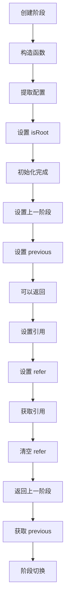
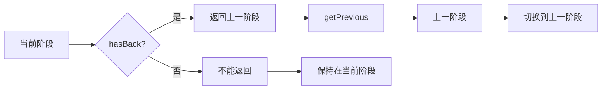
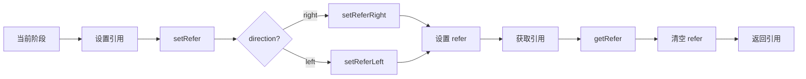

# 阶段系统

## 目录

- [系统概述](#系统概述)
- [Stage 类](#stage-类)
- [阶段生命周期](#阶段生命周期)
- [阶段导航](#阶段导航)
- [阶段引用](#阶段引用)
- [阶段管理](#阶段管理)
- [使用示例](#使用示例)

## 系统概述

阶段系统是 Editor Skeleton 模块的重要组成部分，负责管理编辑器的不同阶段，如设计模式、预览模式、编辑模式等。

**核心特点**:
- 支持多阶段管理
- 支持阶段导航
- 支持阶段引用
- 支持根阶段标识
- 支持返回上一阶段

**文件路径**: `packages/editor-skeleton/src/widget/stage.ts`

## Stage 类

### 类定义

```typescript
export class Stage extends Widget {
  constructor(skeleton: ISkeleton, config: StageConfig)
}
```

### 核心属性

#### 基础属性

##### isStage
```typescript
readonly isStage = true;
```

**说明**: 标识这是一个阶段组件。

##### isRoot
```typescript
readonly isRoot: boolean;
```

**说明**: 是否为根阶段。

**说明**: 
- 根阶段是阶段的起点
- 根阶段不能返回上一阶段
- 通常用于标识主编辑器阶段

#### 导航属性

##### previous
```typescript
private previous?: Stage;
```

**说明**: 上一阶段的引用。

##### refer
```typescript
private refer?: {
  stage?: Stage;
  direction?: 'right' | 'left';
};
```

**说明**: 阶段引用，用于记录阶段跳转方向。

**属性**:
- `stage`: 引用的阶段
- `direction`: 跳转方向（'right' 或 'left'）

### 核心方法

#### 生命周期方法

##### constructor
```typescript
constructor(skeleton: ISkeleton, config: StageConfig)
```

**功能**: 构造函数，初始化阶段。

**参数**:
- `skeleton`: 骨架实例
- `config`: 阶段配置

**初始化流程**:
1. 调用父类 Widget 的构造函数
2. 提取配置中的 `isRoot` 属性
3. 设置 `isRoot` 属性

#### 导航方法

##### setPrevious
```typescript
setPrevious(stage: Stage): void
```

**功能**: 设置上一阶段。

**参数**:
- `stage`: 上一阶段实例

**说明**: 
- 用于记录阶段的历史路径
- 支持阶段返回功能

##### getPrevious
```typescript
getPrevious(): Stage | undefined
```

**功能**: 获取上一阶段。

**返回值**: 上一阶段实例或 undefined

##### hasBack
```typescript
hasBack(): boolean
```

**功能**: 检查是否可以返回上一阶段。

**返回值**: 是否可以返回

**判断条件**:
- 存在上一阶段
- 当前阶段不是根阶段

#### 引用方法

##### setRefer
```typescript
setRefer(stage: Stage, direction: 'right' | 'left'): void
```

**功能**: 设置阶段引用。

**参数**:
- `stage`: 引用的阶段
- `direction`: 跳转方向

**说明**: 
- 用于记录阶段跳转方向
- 支持左右方向跳转

##### setReferRight
```typescript
setReferRight(stage: Stage): void
```

**功能**: 设置右侧引用阶段。

**参数**:
- `stage`: 引用的阶段

**说明**: 调用 `setRefer(stage, 'right')`

##### setReferLeft
```typescript
setReferLeft(stage: Stage): void
```

**功能**: 设置左侧引用阶段。

**参数**:
- `stage`: 引用的阶段

**说明**: 调用 `setRefer(stage, 'left')`

##### getRefer
```typescript
getRefer(): { stage?: Stage; direction?: 'right' | 'left' } | undefined
```

**功能**: 获取阶段引用。

**返回值**: 阶段引用对象或 undefined

**说明**: 
- 获取引用后，会清空引用
- 支持一次性获取

## 阶段生命周期

### 生命周期流程图



### 生命周期阶段

#### 1. 创建阶段
- 调用构造函数
- 初始化阶段属性
- 设置根阶段标识

#### 2. 设置导航
- 设置上一阶段
- 设置阶段引用
- 记录跳转方向

#### 3. 阶段切换
- 检查是否可以返回
- 获取上一阶段
- 获取引用阶段
- 执行阶段切换

## 阶段导航

### 导航流程



### 导航示例

#### 示例 1: 创建根阶段

```typescript
const rootStage = skeleton.createStage({
  name: 'root-stage',
  title: 'Root Stage',
  props: {
    isRoot: true,
  },
  content: RootStageComponent,
});
```

#### 示例 2: 创建子阶段

```typescript
const childStage = skeleton.createStage({
  name: 'child-stage',
  title: 'Child Stage',
  content: ChildStageComponent,
});
```

#### 示例 3: 设置上一阶段

```typescript
const rootStage = skeleton.getStage('root-stage');
const childStage = skeleton.getStage('child-stage');

if (rootStage && childStage) {
  childStage.setPrevious(rootStage);
}
```

#### 示例 4: 检查是否可以返回

```typescript
const stage = skeleton.getStage('child-stage');
if (stage) {
  if (stage.hasBack()) {
    console.log('Can go back to previous stage');
    const previous = stage.getPrevious();
    console.log('Previous stage:', previous?.name);
  } else {
    console.log('Cannot go back');
  }
}
```

## 阶段引用

### 引用流程



### 引用示例

#### 示例 1: 设置右侧引用

```typescript
const stage1 = skeleton.getStage('stage1');
const stage2 = skeleton.getStage('stage2');

if (stage1 && stage2) {
  stage1.setReferRight(stage2);
}
```

#### 示例 2: 设置左侧引用

```typescript
const stage1 = skeleton.getStage('stage1');
const stage2 = skeleton.getStage('stage2');

if (stage1 && stage2) {
  stage1.setReferLeft(stage2);
}
```

#### 示例 3: 获取引用

```typescript
const stage = skeleton.getStage('stage1');
if (stage) {
  const refer = stage.getRefer();
  if (refer) {
    console.log('Refer stage:', refer.stage?.name);
    console.log('Direction:', refer.direction);
  }
}
```

#### 示例 4: 使用引用进行跳转

```typescript
const stage = skeleton.getStage('stage1');
if (stage) {
  const refer = stage.getRefer();
  if (refer?.stage) {
    // 跳转到引用的阶段
    console.log('Navigate to:', refer.stage.name);
  }
}
```

## 阶段管理

### 创建阶段

```typescript
const stageName = skeleton.createStage({
  name: 'design-stage',
  title: 'Design Stage',
  props: {
    isRoot: false,
  },
  content: DesignStageComponent,
});
```

### 获取阶段

```typescript
const stage = skeleton.getStage('design-stage');
if (stage) {
  console.log('Stage found:', stage.name);
}
```

### 设置阶段关系

```typescript
// 设置上一阶段
const rootStage = skeleton.getStage('root-stage');
const childStage = skeleton.getStage('child-stage');

if (rootStage && childStage) {
  childStage.setPrevious(rootStage);
}

// 设置引用
const stage1 = skeleton.getStage('stage1');
const stage2 = skeleton.getStage('stage2');

if (stage1 && stage2) {
  stage1.setReferRight(stage2);
}
```

### 检查阶段状态

```typescript
const stage = skeleton.getStage('child-stage');
if (stage) {
  // 检查是否可以返回
  if (stage.hasBack()) {
    console.log('Can go back');
  } else {
    console.log('Cannot go back');
  }

  // 检查是否为根阶段
  if (stage.isRoot) {
    console.log('Is root stage');
  } else {
    console.log('Is not root stage');
  }
}
```

## 使用示例

### 示例 1: 创建简单的阶段系统

```typescript
// 创建根阶段
const rootStage = skeleton.createStage({
  name: 'root-stage',
  title: 'Root Stage',
  props: {
    isRoot: true,
  },
  content: RootStageComponent,
});

// 创建子阶段
const childStage = skeleton.createStage({
  name: 'child-stage',
  title: 'Child Stage',
  content: ChildStageComponent,
});

// 设置关系
const root = skeleton.getStage('root-stage');
const child = skeleton.getStage('child-stage');

if (root && child) {
  child.setPrevious(root);
}
```

### 示例 2: 创建多阶段导航系统

```typescript
// 创建多个阶段
const stages = [
  {
    name: 'home-stage',
    title: 'Home',
    isRoot: true,
  },
  {
    name: 'design-stage',
    title: 'Design',
  },
  {
    name: 'preview-stage',
    title: 'Preview',
  },
  {
    name: 'settings-stage',
    title: 'Settings',
  },
];

// 创建阶段
stages.forEach(stageConfig => {
  skeleton.createStage({
    name: stageConfig.name,
    title: stageConfig.title,
    props: {
      isRoot: stageConfig.isRoot || false,
    },
    content: StageComponent,
  });
});

// 设置阶段关系
const homeStage = skeleton.getStage('home-stage');
const designStage = skeleton.getStage('design-stage');
const previewStage = skeleton.getStage('preview-stage');
const settingsStage = skeleton.getStage('settings-stage');

if (homeStage && designStage) {
  designStage.setPrevious(homeStage);
}

if (designStage && previewStage) {
  previewStage.setPrevious(designStage);
}

if (previewStage && settingsStage) {
  settingsStage.setPrevious(previewStage);
}
```

### 示例 3: 使用阶段引用进行左右导航

```typescript
// 创建阶段
const stages = ['stage1', 'stage2', 'stage3', 'stage4'];

stages.forEach((stageName, index) => {
  skeleton.createStage({
    name: stageName,
    title: `Stage ${index + 1}`,
    content: StageComponent,
  });
});

// 设置左右引用
for (let i = 0; i < stages.length; i++) {
  const currentStage = skeleton.getStage(stages[i]);
  
  if (currentStage) {
    // 设置右侧引用
    if (i < stages.length - 1) {
      const rightStage = skeleton.getStage(stages[i + 1]);
      if (rightStage) {
        currentStage.setReferRight(rightStage);
      }
    }
    
    // 设置左侧引用
    if (i > 0) {
      const leftStage = skeleton.getStage(stages[i - 1]);
      if (leftStage) {
        currentStage.setReferLeft(leftStage);
      }
    }
  }
}
```

### 示例 4: 实现阶段切换功能

```typescript
class StageNavigator {
  constructor(private skeleton: ISkeleton) {}
  
  // 切换到指定阶段
  navigateTo(stageName: string): void {
    const stage = this.skeleton.getStage(stageName);
    if (stage) {
      console.log('Navigate to:', stage.name);
      // 执行切换逻辑
    }
  }
  
  // 返回上一阶段
  goBack(): void {
    const currentStage = this.getCurrentStage();
    if (currentStage && currentStage.hasBack()) {
      const previousStage = currentStage.getPrevious();
      if (previousStage) {
        this.navigateTo(previousStage.name);
      }
    }
  }
  
  // 向右导航
  goRight(): void {
    const currentStage = this.getCurrentStage();
    if (currentStage) {
      const refer = currentStage.getRefer();
      if (refer?.direction === 'right' && refer.stage) {
        this.navigateTo(refer.stage.name);
      }
    }
  }
  
  // 向左导航
  goLeft(): void {
    const currentStage = this.getCurrentStage();
    if (currentStage) {
      const refer = currentStage.getRefer();
      if (refer?.direction === 'left' && refer.stage) {
        this.navigateTo(refer.stage.name);
      }
    }
  }
  
  // 获取当前阶段
  private getCurrentStage(): Stage | null {
    // 实现获取当前阶段的逻辑
    return null;
  }
}

// 使用导航器
const navigator = new StageNavigator(skeleton);

// 切换到设计阶段
navigator.navigateTo('design-stage');

// 返回上一阶段
navigator.goBack();

// 向右导航
navigator.goRight();

// 向左导航
navigator.goLeft();
```

### 示例 5: 阶段历史记录

```typescript
class StageHistory {
  private history: string[] = [];
  private currentIndex = -1;
  
  constructor(private skeleton: ISkeleton) {}
  
  // 添加阶段到历史记录
  push(stageName: string): void {
    // 如果当前位置不是最后一个，删除当前位置之后的所有记录
    if (this.currentIndex < this.history.length - 1) {
      this.history = this.history.slice(0, this.currentIndex + 1);
    }
    
    // 添加新阶段
    this.history.push(stageName);
    this.currentIndex = this.history.length - 1;
  }
  
  // 返回上一阶段
  back(): string | null {
    if (this.currentIndex > 0) {
      this.currentIndex--;
      return this.history[this.currentIndex];
    }
    return null;
  }
  
  // 前进到下一阶段
  forward(): string | null {
    if (this.currentIndex < this.history.length - 1) {
      this.currentIndex++;
      return this.history[this.currentIndex];
    }
    return null;
  }
  
  // 获取当前阶段
  current(): string | null {
    if (this.currentIndex >= 0 && this.currentIndex < this.history.length) {
      return this.history[this.currentIndex];
    }
    return null;
  }
  
  // 检查是否可以返回
  canBack(): boolean {
    return this.currentIndex > 0;
  }
  
  // 检查是否可以前进
  canForward(): boolean {
    return this.currentIndex < this.history.length - 1;
  }
}

// 使用历史记录
const history = new StageHistory(skeleton);

// 添加阶段
history.push('home-stage');
history.push('design-stage');
history.push('preview-stage');

// 返回上一阶段
const previous = history.back();
if (previous) {
  console.log('Back to:', previous);
}

// 前进到下一阶段
const next = history.forward();
if (next) {
  console.log('Forward to:', next);
}
```

### 示例 6: 阶段切换动画

```typescript
import { CSSTransition, TransitionGroup } from 'react-transition-group';

function StageSwitcher({ skeleton }: { skeleton: ISkeleton }) {
  const [currentStage, setCurrentStage] = useState<Stage | null>(null);
  
  const navigateTo = (stageName: string) => {
    const stage = skeleton.getStage(stageName);
    if (stage) {
      setCurrentStage(stage);
    }
  };
  
  return (
    <TransitionGroup>
      {currentStage && (
        <CSSTransition
          key={currentStage.name}
          timeout={300}
          classNames="stage"
        >
          <div className="stage">
            {currentStage.content}
          </div>
        </CSSTransition>
      )}
    </TransitionGroup>
  );
}
```

## 设计模式

### 1. 状态模式
- 阶段代表编辑器的不同状态
- 每个阶段有独立的行为和状态

### 2. 责任链模式
- 通过 `previous` 属性形成阶段链
- 支持阶段返回功能

### 3. 备忘录模式
- 通过阶段引用记录跳转方向
- 支持阶段导航

### 4. 策略模式
- 不同的阶段有不同的渲染策略
- 支持自定义阶段内容

## 注意事项

1. **阶段名称唯一性**: 阶段名称必须唯一，否则会覆盖之前的阶段
2. **根阶段标识**: 根阶段不能返回上一阶段
3. **阶段引用**: 获取引用后会清空引用，支持一次性获取
4. **阶段关系**: 需要手动设置阶段之间的关系
5. **阶段导航**: 需要自己实现阶段切换逻辑
6. **阶段内容**: 每个阶段可以有不同的内容组件

## 相关文档

- [Editor Skeleton 模块总览](./index.md)
- [Skeleton 核心类](./skeleton-core.md)
- [面板系统](./panel-system.md)
- [组件系统](./widget-system.md)
- [布局系统](./layout-system.md)
