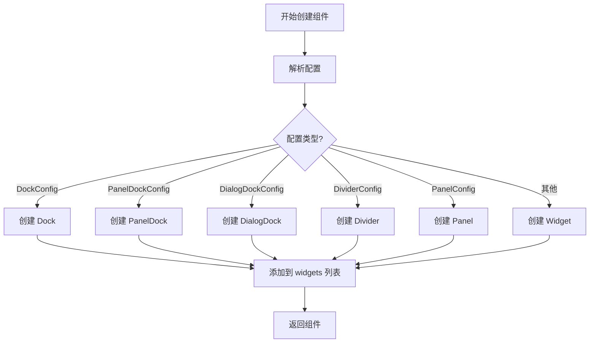
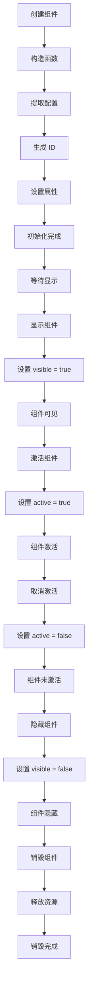

# 组件系统

## 目录

- [系统概述](#系统概述)
- [Widget 基类](#widget-基类)
- [Dock 组件](#dock-组件)
- [PanelDock 组件](#paneldock-组件)
- [DialogDock 组件](#dialogdock-组件)
- [Divider 组件](#divider-组件)
- [WidgetContainer 容器](#widgetcontainer-容器)
- [组件创建](#组件创建)
- [组件生命周期](#组件生命周期)
- [使用示例](#使用示例)

## 系统概述

组件系统是 Editor Skeleton 模块的基础，提供了所有 UI 组件的基类和核心功能。

**核心特点**:
- 提供统一的组件基类
- 支持多种组件类型
- 支持组件的显示和隐藏
- 支持组件的激活和禁用
- 支持组件的属性配置
- 支持组件的内容渲染

**文件路径**:
- `packages/editor-skeleton/src/widget/widget.ts`
- `packages/editor-skeleton/src/widget/dock.ts`
- `packages/editor-skeleton/src/widget/panel-dock.ts`
- `packages/editor-skeleton/src/widget/dialog-dock.ts`
- `packages/editor-skeleton/src/widget/widget-container.ts`

## Widget 基类

### 类定义

```typescript
export class Widget implements IWidget {
  constructor(readonly skeleton: ISkeleton, readonly config: WidgetConfig)
}
```

### 核心属性

#### 基础属性

##### isWidget
```typescript
readonly isWidget = true;
```

**说明**: 标识这是一个组件。

##### name
```typescript
readonly name: string;
```

**说明**: 组件名称，必须唯一。

##### id
```typescript
readonly id: string;
```

**说明**: 组件唯一标识，自动生成。

#### 状态属性

##### visible
```typescript
@obx.ref visible = true;
```

**说明**: 组件是否可见。

##### active
```typescript
@obx.ref active = false;
```

**说明**: 组件是否激活。

#### 内容属性

##### props
```typescript
readonly props: any;
```

**说明**: 组件属性。

##### body
```typescript
get body(): ReactNode
```

**说明**: 组件主体内容。

**渲染逻辑**:
```typescript
const { content, contentProps } = this.config;
return createContent(content, {
  ...contentProps,
  editor: getEvent(this.skeleton.editor),
  config: this.config,
  widget: this,
});
```

##### content
```typescript
get content(): ReactNode
```

**说明**: 组件内容。

**渲染逻辑**: 返回 `body` 属性。

### 核心方法

#### 生命周期方法

##### constructor
```typescript
constructor(readonly skeleton: ISkeleton, readonly config: WidgetConfig)
```

**功能**: 构造函数，初始化组件。

**初始化流程**:
1. 设置 MobX 可观察性
2. 提取配置中的名称、属性
3. 生成组件 ID
4. 设置组件属性

#### 显示管理

##### show
```typescript
show(): void
```

**功能**: 显示组件。

**说明**: 设置 `visible` 为 true。

##### hide
```typescript
hide(): void
```

**功能**: 隐藏组件。

**说明**: 设置 `visible` 为 false。

#### 状态管理

##### enable
```typescript
enable(): void
```

**功能**: 启用组件。

**说明**: 当前为空实现。

##### disable
```typescript
disable(): void
```

**功能**: 禁用组件。

**说明**: 当前为空实现。

#### 其他方法

##### getName
```typescript
getName(): string
```

**功能**: 获取组件名称。

**返回值**: 组件名称

##### getContent
```typescript
getContent(): ReactNode
```

**功能**: 获取组件内容。

**返回值**: 组件内容

## Dock 组件

### 类定义

```typescript
export class Dock extends Widget {
  constructor(readonly skeleton: ISkeleton, readonly config: DockConfig)
}
```

### 核心属性

#### 基础属性

##### isDock
```typescript
readonly isDock = true;
```

**说明**: 标识这是一个停靠组件。

### 核心方法

#### 生命周期方法

##### constructor
```typescript
constructor(readonly skeleton: ISkeleton, readonly config: DockConfig)
```

**功能**: 构造函数，初始化停靠组件。

**说明**: 调用父类 Widget 的构造函数。

## PanelDock 组件

### 类定义

```typescript
export class PanelDock extends Dock {
  constructor(readonly skeleton: ISkeleton, readonly config: PanelDockConfig)
}
```

### 核心属性

#### 基础属性

##### isPanelDock
```typescript
readonly isPanelDock = true;
```

**说明**: 标识这是一个面板停靠组件。

##### panelName
```typescript
readonly panelName: string;
```

**说明**: 关联的面板名称。

### 核心方法

#### 生命周期方法

##### constructor
```typescript
constructor(readonly skeleton: ISkeleton, readonly config: PanelDockConfig)
```

**功能**: 构造函数，初始化面板停靠组件。

**初始化流程**:
1. 调用父类 Dock 的构造函数
2. 提取配置中的面板名称

## DialogDock 组件

### 类定义

```typescript
export class DialogDock extends Dock {
  constructor(readonly skeleton: ISkeleton, readonly config: DialogDockConfig)
}
```

### 核心属性

#### 基础属性

##### isDialogDock
```typescript
readonly isDialogDock = true;
```

**说明**: 标识这是一个对话框停靠组件。

### 核心方法

#### 生命周期方法

##### constructor
```typescript
constructor(readonly skeleton: ISkeleton, readonly config: DialogDockConfig)
```

**功能**: 构造函数，初始化对话框停靠组件。

**说明**: 调用父类 Dock 的构造函数。

**注意**: 当前文件为空，未实现。

## Divider 组件

### 类定义

```typescript
export class Divider extends Widget {
  constructor(readonly skeleton: ISkeleton, readonly config: DividerConfig)
}
```

### 核心属性

#### 基础属性

##### isDivider
```typescript
readonly isDivider = true;
```

**说明**: 标识这是一个分隔符组件。

### 核心方法

#### 生命周期方法

##### constructor
```typescript
constructor(readonly skeleton: ISkeleton, readonly config: DividerConfig)
```

**功能**: 构造函数，初始化分隔符组件。

**说明**: 
- 调用父类 Widget 的构造函数
- 使用 `@alifd/next` 的 `Divider` 组件作为内容

**实现**:
```typescript
widget = new Widget(this, {
  ...config,
  type: 'Widget',
  content: Divider,
});
```

## WidgetContainer 容器

### 类定义

```typescript
export class WidgetContainer<TItem = any, TConfig = any> {
  constructor(
    readonly name: string,
    readonly handle: (item: TItem) => any,
    readonly exclusive: boolean,
    readonly checkVisible: () => boolean,
    readonly defaultSetCurrent: boolean,
  )
}
```

### 核心属性

#### 基础属性

##### name
```typescript
readonly name: string;
```

**说明**: 容器名称。

##### handle
```typescript
readonly handle: (item: TItem) => any;
```

**说明**: 处理函数，当容器项被点击时调用。

##### exclusive
```typescript
readonly exclusive: boolean;
```

**说明**: 是否互斥激活。

##### checkVisible
```typescript
readonly checkVisible: () => boolean;
```

**说明**: 可见性检查函数。

##### defaultSetCurrent
```typescript
readonly defaultSetCurrent: boolean;
```

**说明**: 是否默认设置当前项。

#### 状态属性

##### items
```typescript
@obx.ref items: TItem[] = [];
```

**说明**: 容器中的项列表。

##### current
```typescript
@obx.ref current: TItem | null = null;
```

**说明**: 当前激活的项。

### 核心方法

#### 项管理

##### add
```typescript
add(item: TItem | TConfig): TItem | undefined
```

**功能**: 添加项到容器。

**参数**:
- `item`: 项实例或项配置

**返回值**: 项实例

**说明**: 
- 如果是配置，先转换为项
- 添加到 items 数组
- 如果 `defaultSetCurrent` 为 true，设置为当前项

##### get
```typescript
get(name: string): TItem | undefined
```

**功能**: 根据名称获取项。

**参数**:
- `name`: 项名称

**返回值**: 项实例或 undefined

##### remove
```typescript
remove(item: TItem | string): boolean
```

**功能**: 从容器中移除项。

**参数**:
- `item`: 项实例或项名称

**返回值**: 是否成功移除

**说明**: 
- 如果移除的是当前项，清空当前项
- 从 items 数组中移除

#### 激活管理

##### active
```typescript
active(item: TItem | string): void
```

**功能**: 激活项。

**参数**:
- `item`: 项实例或项名称

**说明**: 
- 如果是互斥激活，先取消其他项的激活
- 设置当前项
- 调用处理函数

##### unactive
```typescript
unactive(item: TItem | string): void
```

**功能**: 取消激活项。

**参数**:
- `item`: 项实例或项名称

**说明**: 
- 如果是当前项，清空当前项

##### unactiveAll
```typescript
unactiveAll(): void
```

**功能**: 取消所有项的激活。

**说明**: 清空当前项

#### 其他方法

##### has
```typescript
has(name: string): boolean
```

**功能**: 检查是否包含指定名称的项。

**参数**:
- `name`: 项名称

**返回值**: 是否包含

##### getVisibleItems
```typescript
getVisibleItems(): TItem[]
```

**功能**: 获取可见的项。

**返回值**: 可见项列表

**说明**: 根据 `checkVisible` 函数过滤项

## 组件创建

### 创建流程



### 创建方法

```typescript
createWidget(config: IPublicTypeWidgetBaseConfig | IWidget): IWidget {
  if (isWidget(config)) {
    return config;
  }

  config = this.parseConfig(config);
  let widget: IWidget;
  if (isDockConfig(config)) {
    if (isPanelDockConfig(config)) {
      widget = new PanelDock(this, config);
    } else if (false) {
      // DialogDock
      // others...
    } else {
      widget = new Dock(this, config);
    }
  } else if (isDividerConfig(config)) {
    widget = new Widget(this, {
      ...config,
      type: 'Widget',
      content: Divider,
    });
  } else if (isPanelConfig(config)) {
    widget = this.createPanel(config);
  } else {
    widget = new Widget(this, config as WidgetConfig);
  }
  this.widgets.push(widget);
  return widget;
}
```

## 组件生命周期

### 生命周期流程图



### 生命周期阶段

#### 1. 创建阶段
- 调用构造函数
- 初始化组件属性
- 生成组件 ID
- 设置组件属性

#### 2. 显示阶段
- 设置 `visible` 为 true
- 组件可见
- 响应用户交互

#### 3. 激活阶段
- 设置 `active` 为 true
- 组件激活
- 响应用户交互

#### 4. 取消激活阶段
- 设置 `active` 为 false
- 组件未激活

#### 5. 隐藏阶段
- 设置 `visible` 为 false
- 组件隐藏

#### 6. 销毁阶段
- 从父容器中移除
- 释放资源

## 使用示例

### 示例 1: 创建 Widget

```typescript
const widget = skeleton.createWidget({
  name: 'my-widget',
  type: 'Widget',
  props: {
    icon: 'my-icon',
    title: 'My Widget',
  },
  content: MyWidgetComponent,
});
```

### 示例 2: 创建 Dock

```typescript
const dock = skeleton.createWidget({
  name: 'my-dock',
  type: 'Dock',
  props: {
    icon: 'my-icon',
    title: 'My Dock',
  },
  content: MyDockComponent,
});
```

### 示例 3: 创建 PanelDock

```typescript
const panelDock = skeleton.createWidget({
  name: 'my-panel-dock',
  type: 'PanelDock',
  props: {
    icon: 'my-icon',
    title: 'My Panel Dock',
  },
  panelName: 'my-panel',
  content: MyPanelDockComponent,
});
```

### 示例 4: 创建 Divider

```typescript
const divider = skeleton.createWidget({
  type: 'Divider',
});
```

### 示例 5: 创建容器

```typescript
const container = skeleton.createContainer(
  'my-container',
  (item) => {
    console.log('Container item clicked:', item);
  },
  true,  // exclusive
  () => true,  // checkVisible
  true  // defaultSetCurrent
);
```

### 示例 6: 管理容器项

```typescript
// 添加项
container.add({
  name: 'item1',
  content: Item1Component,
});

// 获取项
const item1 = container.get('item1');

// 移除项
container.remove('item1');

// 激活项
container.active('item1');

// 取消激活项
container.unactive('item1');

// 取消所有激活
container.unactiveAll();
```

### 示例 7: 显示和隐藏组件

```typescript
const widget = skeleton.getWidget('my-widget');
if (widget) {
  // 显示组件
  widget.show();
  
  // 隐藏组件
  widget.hide();
}
```

### 示例 8: 启用和禁用组件

```typescript
const widget = skeleton.getWidget('my-widget');
if (widget) {
  // 启用组件
  widget.enable();
  
  // 禁用组件
  widget.disable();
}
```

### 示例 9: 添加组件到骨架

```typescript
const widget = skeleton.add({
  name: 'my-widget',
  type: 'Widget',
  area: 'mainArea',
  props: {
    icon: 'my-icon',
    title: 'My Widget',
  },
  content: MyWidgetComponent,
});
```

### 示例 10: 检查组件类型

```typescript
import { isWidget, isDock, isPanelDock, isDivider } from '@alilc/lowcode-editor-skeleton';

const widget = skeleton.getWidget('my-widget');
if (widget) {
  if (isWidget(widget)) {
    console.log('Is a widget');
  }
  if (isDock(widget)) {
    console.log('Is a dock');
  }
  if (isPanelDock(widget)) {
    console.log('Is a panel dock');
  }
  if (isDivider(widget)) {
    console.log('Is a divider');
  }
}
```

## 设计模式

### 1. 继承模式
- 所有组件都继承自 `Widget` 基类
- `Dock` 继承自 `Widget`
- `PanelDock` 继承自 `Dock`
- `DialogDock` 继承自 `Dock`

### 2. 工厂模式
- `createWidget()` 方法根据配置类型创建不同的组件
- 支持多种组件类型的创建

### 3. 组合模式
- 容器可以包含多个组件
- 组件可以包含子组件
- 形成树形结构

### 4. 观察者模式
- 通过 MobX 实现响应式状态管理
- 状态变更自动触发 UI 更新

## 注意事项

1. **组件名称唯一性**: 组件名称必须唯一，否则会覆盖之前的组件
2. **生命周期管理**: 组件的显示、隐藏、激活、取消激活有明确的顺序
3. **容器互斥激活**: 如果容器设置为互斥激活，同时只能有一个项被激活
4. **可见性检查**: 容器的 `checkVisible` 函数可以控制项的可见性
5. **默认设置当前项**: 如果 `defaultSetCurrent` 为 true，添加项时会自动设置为当前项
6. **处理函数**: 容器的 `handle` 函数会在项被点击时调用
7. **PanelDock 关联面板**: PanelDock 需要关联一个面板，通过 `panelName` 属性指定

## 相关文档

- [Editor Skeleton 模块总览](./index.md)
- [Skeleton 核心类](./skeleton-core.md)
- [面板系统](./panel-system.md)
- [阶段系统](./stage-system.md)
- [布局系统](./layout-system.md)
