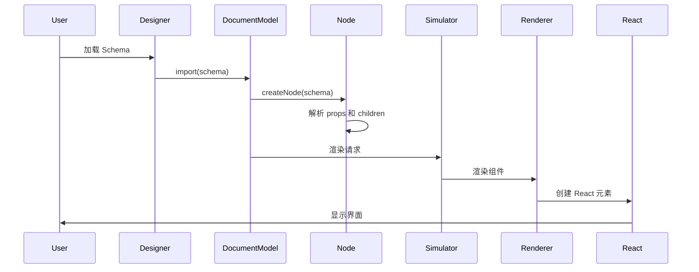
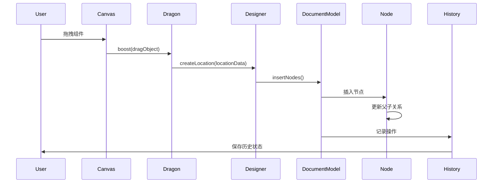
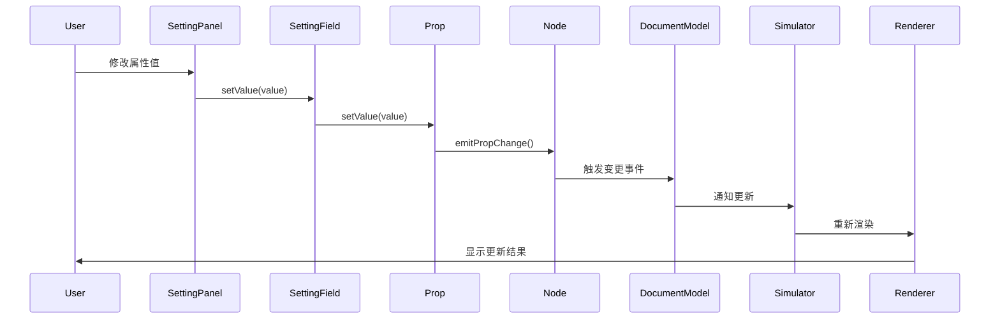
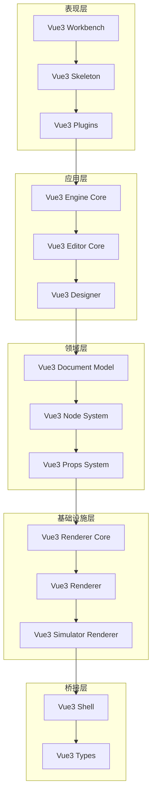
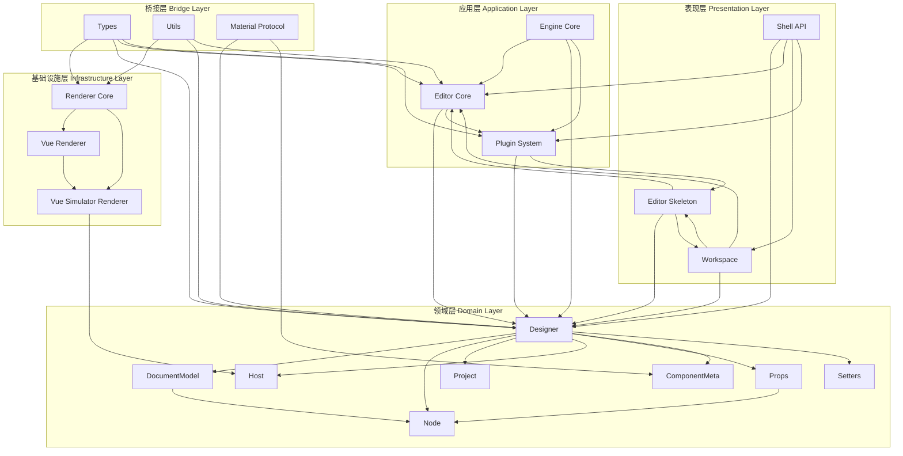
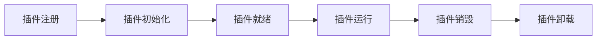

# Vue3 低代码框架重构架构设计文档

## 文档信息

- **文档版本**: v1.0.0
- **创建日期**: 2026-01-05
- **基于**: Ali LowCode Engine v1.3.2
- **目标框架**: Vue 3.x + Element Plus
- **构建工具**: Vite 6
- **包管理**: pnpm + Monorepo

---

## 目录

- [1. 当前架构深度剖析](#1-当前架构深度剖析)
  - [1.1 核心模块分析](#11-核心模块分析)
  - [1.2 架构模式分析](#12-架构模式分析)
  - [1.3 数据流转机制](#13-数据流转机制)
  - [1.4 设计原则总结](#14-设计原则总结)
- [2. Vue3 重构架构设计](#2-vue3-重构架构设计)
  - [2.1 整体架构概览](#21-整体架构概览)
  - [2.2 Monorepo 子包职责划分](#22-monorepo-子包职责划分)
  - [2.3 技术栈选型](#23-技术栈选型)
- [3. 核心模块详细设计](#3-核心模块详细设计)
  - [3.1 引擎内核 (@vue3-lowcode-engine-core)](#31-引擎内核-vue3-lowcode-engine-core)
  - [3.2 编辑器核心 (@vue3-lowcode-editor-core)](#32-编辑器核心-vue3-lowcode-editor-core)
  - [3.3 设计器 (@vue3-lowcode-designer)](#33-设计器-vue3-lowcode-designer)
  - [3.4 渲染器核心 (@vue3-lowcode-renderer-core)](#34-渲染器核心-vue3-lowcode-renderer-core)
  - [3.5 Vue 渲染器 (@vue3-lowcode-vue-renderer)](#35-vue-渲染器-vue3-lowcode-vue-renderer)
  - [3.6 Vue 模拟器渲染器 (@vue3-lowcode-vue-simulator-renderer)](#36-vue-模拟器渲染器-vue3-lowcode-vue-simulator-renderer)
  - [3.7 编辑器骨架 (@vue3-lowcode-editor-skeleton)](#37-编辑器骨架-vue3-lowcode-editor-skeleton)
  - [3.8 工作区 (@vue3-lowcode-workspace)](#38-工作区-vue3-lowcode-workspace)
  - [3.9 类型定义 (@vue3-lowcode-types)](#39-类型定义-vue3-lowcode-types)
  - [3.10 工具库 (@vue3-lowcode-utils)](#310-工具库-vue3-lowcode-utils)
  - [3.11 Shell API (@vue3-lowcode-shell)](#311-shell-api-vue3-lowcode-shell)
- [4. 插件系统架构设计](#4-插件系统架构设计)
  - [4.1 插件系统设计原则](#41-插件系统设计原则)
  - [4.2 插件生命周期管理](#42-插件生命周期管理)
  - [4.3 插件上下文设计](#43-插件上下文设计)
  - [4.4 插件注册与发现机制](#44-插件注册与发现机制)
  - [4.5 内置插件设计](#45-内置插件设计)
- [5. 数据流转与组件交互优化](#5-数据流转与组件交互优化)
  - [5.1 Vue3 响应式原理应用](#51-vue3-响应式原理应用)
  - [5.2 Composition API 应用](#52-composition-api-应用)
  - [5.3 组件交互优化](#53-组件交互优化)
  - [5.4 性能优化策略](#54-性能优化策略)
- [6. 物料协议设计](#6-物料协议设计)
  - [6.1 组件协议](#61-组件协议)
  - [6.2 区块协议](#62-区块协议)
  - [6.3 页面协议](#63-页面协议)
  - [6.4 资产包协议](#64-资产包协议)
- [7. 构建与工程化](#7-构建与工程化)
  - [7.1 Monorepo 结构](#71-monorepo-结构)
  - [7.2 Vite 配置](#72-vite-配置)
  - [7.3 TypeScript 配置](#73-typescript-配置)
  - [7.4 包管理策略](#74-包管理策略)
- [8. 迁移路径](#8-迁移路径)
  - [8.1 分阶段迁移计划](#81-分阶段迁移计划)
  - [8.2 兼容性考虑](#82-兼容性考虑)
  - [8.3 风险评估](#83-风险评估)
- [9. 总结与展望](#9-总结与展望)

---

## 1. 当前架构深度剖析

### 1.1 核心模块分析

基于对 Ali LowCode Engine 源码和文档的深入分析，当前架构包含以下核心模块：

#### 1.1.1 Types 模块 (`@alilc/lowcode-types`)

**职责**: 提供完整的 TypeScript 类型定义，为整个引擎提供类型安全保障

**核心功能**:
- 200+ 类型定义文件
- 覆盖编辑器、渲染器、设计器、模拟器等所有模块
- 定义 Shell API、模型、枚举等类型体系
- 支持插件类型扩展

**关键类型**:
```typescript
// 编辑器核心类型
interface IPublicModelEditor {
  get<T>(key: string): T | undefined;
  set(key: string, data: any): void;
  onChange<T>(key: string, fn: (data: T) => void): () => void;
}

// 节点模型类型
interface IPublicModelNode {
  id: string;
  componentName: string;
  props: IPublicModelProps;
  document: IPublicModelDocumentModel;
  // ... 节点操作方法
}

// 组件元数据类型
interface IPublicModelComponentMeta {
  componentName: string;
  title: string;
  description?: string;
  props: IPublicTypeComponentMetadata[];
  configure: IPublicTypeComponentConfigure;
}
```

**设计特点**:
- 模块化分类：按功能领域划分（editor、renderer、designer、shell等）
- 严格的类型层级：API → Model → Type → Enum
- 扩展性设计：支持自定义类型扩展

#### 1.1.2 Utils 模块 (`@alilc/lowcode-utils`)

**职责**: 提供通用工具函数，支持整个引擎的基础功能

**核心功能**:
- 深拷贝 (`cloneDeep`)
- 唯一 ID 生成 (`uniqueId`)
- 日志工具 (`logger`)
- 事务管理 (`transactionManager`)
- 类型检查函数 (`isNodeSchema`, `isJSExpression` 等)
- React 组件（图标、上下文菜单等）

**设计模式**:
```typescript
// 函数式编程模式
export function cloneDeep(obj: any): any {
  // 纯函数实现，无副作用
}

// 类型守卫模式
export function isNodeSchema(obj: any): obj is IPublicTypeNodeSchema {
  return obj && typeof obj === 'object' && obj.componentName;
}

// 单例模式
let idCounter = 0;
export function uniqueId(prefix?: string): string {
  return `${prefix || ''}_${++idCounter}`;
}
```

**依赖关系**: 无外部依赖，为其他模块提供基础能力

#### 1.1.3 Editor Core 模块 (`@alilc/lowcode-editor-core`)

**职责**: 编辑器核心基础设施，提供编辑器的基础能力

**核心功能**:
- **Editor 类**: 编辑器主类，管理编辑器生命周期
- **EventBus**: 事件总线，实现模块间通信
- **Command**: 命令系统，支持命令注册和执行
- **EngineConfig**: 配置管理，管理引擎配置和偏好设置
- **Hotkey**: 快捷键系统，支持快捷键绑定和触发
- **DI Container**: 依赖注入容器，实现 IOC
- **Intl**: 国际化支持，提供多语言能力
- **Setters**: Setter 管理，管理属性设置器

**核心类设计**:
```typescript
class Editor implements IPublicModelEditor {
  // 核心属性
  readonly eventBus: IEventBus;
  readonly config: IEngineConfig;
  readonly hotkey: IHotKey;
  readonly setters: ISetters;
  
  // 核心方法
  get<T>(key: string): T | undefined;
  set(key: string, data: any): void;
  register(data: any, key?: string): void;
  async init(config?: EditorConfig): Promise<any>;
  destroy(): void;
}
```

**架构特点**:
- 依赖注入：通过 DI 容器管理依赖
- 事件驱动：通过 EventBus 实现松耦合通信
- 插件化：支持通过插件扩展功能

#### 1.1.4 Designer 模块 (`@alilc/lowcode-designer`)

**职责**: 可视化设计核心，提供拖拽、选区、文档管理等能力

**核心功能**:
- **Designer 类**: 设计器主类，协调各子模块
- **DocumentModel**: 文档模型，管理单文档的节点树
- **Node**: 节点类，表示组件树中的单个节点
- **Props**: 属性系统，管理节点属性
- **Dragon**: 拖拽引擎，处理拖拽逻辑
- **Selection**: 选区管理，处理节点选择
- **History**: 历史记录，支持撤销/重做
- **BuiltinSimulatorHost**: 内置模拟器宿主，提供画布渲染

**核心类设计**:
```typescript
class Designer implements IDesigner {
  // 核心属性
  readonly project: IProject;
  readonly dragon: IDragon;
  readonly activeTracker: IActiveTracker;
  readonly detecting: Detecting;
  
  // 核心方法
  getComponentMeta(componentName: string): IComponentMeta;
  createLocation(locationData: LocationData): DropLocation;
  transformProps(props: any, node: Node, stage: TransformStage): any;
}

class DocumentModel implements IDocumentModel {
  // 核心属性
  readonly designer: IDesigner;
  selection: ISelection;
  readonly rootNode: INode | null;
  
  // 核心方法
  import(schema: IPublicTypeRootSchema): void;
  export(stage: TransformStage): IPublicTypeRootSchema;
  insertNodes(parent: INode, thing: INode[]): INode[];
}

class Node implements INode {
  // 核心属性
  readonly id: string;
  readonly componentName: string;
  readonly props: IProps;
  readonly document: IDocumentModel;
  
  // 核心方法
  getProp(path: string): IProp | null;
  setPropValue(path: string, value: any): void;
  remove(): void;
  select(): void;
}
```

**架构特点**:
- 模型驱动：通过 Node、Props 等模型操作 Schema
- 观察者模式：使用 MobX 实现响应式更新
- 命令模式：通过 History 支持撤销/重做
- 组合模式：Node 树采用组合模式

#### 1.1.5 Renderer Core 模块 (`@alilc/lowcode-renderer-core`)

**职责**: 渲染器核心抽象，提供框架无关的渲染能力

**核心功能**:
- **Adapter**: 运行时适配器，适配不同框架（React/Rax）
- **Renderer**: 渲染器基类，提供核心渲染能力
- **Context**: React Context 工厂，管理渲染器上下文
- **HOC**: 高阶组件，支持组件功能增强（Leaf HOC）
- **类型系统**: 定义完整的渲染器类型

**核心类设计**:
```typescript
// 适配器模式
adapter.setRuntime({
  Component,           // React Component
  PureComponent,      // React PureComponent
  createElement,       // React.createElement
  createContext,       // React.createContext
  forwardRef,          // React.forwardRef
  findDOMNode,         // ReactDOM.findDOMNode
});

// 渲染器工厂
adapter.setRenderers({
  PageRenderer: pageRendererFactory(),
  ComponentRenderer: componentRendererFactory(),
  BlockRenderer: blockRendererFactory(),
  AddonRenderer: addonRendererFactory(),
  TempRenderer: tempRendererFactory(),
});
```

**架构特点**:
- 适配器模式：通过适配器支持多框架
- 工厂模式：通过工厂创建不同类型渲染器
- 高阶组件模式：通过 HOC 增强组件功能

#### 1.1.6 React Renderer 模块 (`@alilc/lowcode-react-renderer`)

**职责**: React 框架的具体渲染实现

**核心功能**:
- 注册 React 运行时到适配器
- 注册各种 React 渲染器
- 提供 React 组件实例管理
- 处理 React 特定的渲染逻辑

**核心实现**:
```typescript
import React, { Component, PureComponent, createElement } from 'react';
import ReactDOM from 'react-dom';
import { adapter } from '@alilc/lowcode-renderer-core';

// 注册 React 运行时
adapter.setRuntime({
  Component,
  PureComponent,
  createElement,
  createContext: React.createContext,
  forwardRef: React.forwardRef,
  findDOMNode: ReactDOM.findDOMNode,
});

// 注册 React 渲染器
adapter.setRenderers({
  PageRenderer: pageRendererFactory(),
  ComponentRenderer: componentRendererFactory(),
  BlockRenderer: blockRendererFactory(),
  AddonRenderer: addonRendererFactory(),
  TempRenderer: tempRendererFactory(),
});
```

**架构特点**:
- 轻量级实现：主要工作是注册和适配
- 复用核心：依赖 renderer-core 的核心逻辑

#### 1.1.7 React Simulator Renderer 模块 (`@alilc/lowcode-react-simulator-renderer`)

**职责**: 设计器中的模拟器渲染器，连接设计器和渲染器

**核心功能**:
- **SimulatorRendererContainer**: 渲染器容器，管理整个模拟器
- **DocumentInstance**: 文档实例，管理单个文档的渲染状态
- **SimulatorRendererView**: React 视图组件，提供 UI 层
- **实例管理**: 管理组件实例的生命周期
- **路由模拟**: 提供内存路由，支持多页面应用
- **国际化**: 支持多语言切换
- **设备适配**: 支持不同设备的响应式渲染

**核心类设计**:
```typescript
class SimulatorRendererContainer {
  // 核心属性
  readonly isSimulatorRenderer = true;
  readonly history: MemoryHistory;
  private _documentInstances: DocumentInstance[];
  private _components: Record<string, React.FC | React.ComponentClass>;
  private _appContext: any;
  
  // 核心方法
  load(asset: Asset): Promise<void>;
  getComponent(componentName: string): any;
  createComponent(schema): Component | null;
  run(): void;
  rerender(): void;
  dispose(): void;
}

class DocumentInstance {
  // 核心属性
  instancesMap: Map<string, ReactInstance[]>;
  readonly container: SimulatorRendererContainer;
  readonly document: IDocumentModel;
  
  // 核心方法
  mountInstance(id: string, instance: ReactInstance | null): void;
  unmountInstance(id: string, instance: ReactInstance | null): void;
  getNode(id: string): INode | null;
  mountContext(): void;
  dispose(): void;
}
```

**架构特点**:
- 观察者模式：使用 MobX 的 @observer 实现响应式
- 单例模式：SimulatorRendererContainer 作为单例
- 工厂模式：通过工厂创建组件实例
- 适配器模式：适配 React 实例到低代码节点

#### 1.1.8 Editor Skeleton 模块 (`@alilc/lowcode-editor-skeleton`)

**职责**: 编辑器 UI 骨架，提供布局、面板管理和组件渲染

**核心功能**:
- **Skeleton 类**: 骨架核心类，管理所有 Widget 和面板
- **Area**: 区域管理，定义编辑器的各个布局区域
- **Widget**: Widget 系统，提供可复用的 Widget 组件
- **Panel**: 面板系统，支持固定面板和浮动面板
- **Settings Pane**: 设置面板，提供属性配置界面

**核心类设计**:
```typescript
class Skeleton {
  // 区域定义
  readonly leftArea: Area<DockConfig | PanelDockConfig>;
  readonly topArea: Area<DockConfig | PanelDockConfig>;
  readonly rightArea: Area<IPublicTypePanelConfig, Panel>;
  readonly mainArea: Area<WidgetConfig | IPublicTypePanelConfig>;
  
  // 核心方法
  add(config: IPublicTypeSkeletonConfig): IWidget | Widget | Panel;
  getPanel(name: string): Panel | undefined;
  getWidget(name: string): IWidget | undefined;
  createStage(config: any): string | undefined;
  createContainer(name: string, handle: (item: any) => any): WidgetContainer;
}
```

**架构特点**:
- 区域化设计：通过 Area 管理不同区域
- Widget 系统：提供灵活的 Widget 组件
- 插件化：支持通过插件添加 Widget

#### 1.1.9 Workspace 模块 (`@alilc/lowcode-workspace`)

**职责**: 工作空间管理，管理编辑器的窗口系统、资源管理、插件上下文

**核心功能**:
- **Workspace 类**: 工作空间主类，管理窗口和资源
- **Resource**: 资源类，封装资源数据
- **EditorWindow**: 编辑器窗口类，管理窗口状态
- **BasicContext**: 基础上下文，提供编辑器核心能力
- **Context**: 视图上下文，管理视图激活状态
- **Workbench**: 工作台组件，提供工作台布局

**核心类设计**:
```typescript
class Workspace {
  // 核心属性
  @obx.ref windows: IEditorWindow[] = [];
  @obx.ref window: IEditorWindow;
  @obx windowQueue: IWindowInfo[] = [];
  editorWindowMap: Map<string, IEditorWindow> = new Map();
  resourceTypeMap: Map<string, ResourceType> = new Map();
  
  // 核心方法
  initWindow(): void;
  openEditorWindowByResource(resource: IResource): Promise<void>;
  removeEditorWindow(id: string): void;
  setActive(activate: boolean): void;
}

class Resource implements IResource {
  // 核心属性
  readonly resourceData: IPublicResourceData;
  readonly resourceType: IResourceType;
  readonly workspace: IWorkspace;
  editorViewMap: Map<string, IPublicTypeEditorView> = new Map();
  
  // 核心方法
  import(schema: IPublicTypeRootSchema): void;
  save(): Promise<void>;
  url(): string;
  getEditorView(viewName: string): IPublicTypeEditorView;
}
```

**架构特点**:
- 单例模式：Workspace 作为单例使用
- 上下文模式：BasicContext 提供统一上下文
- 工厂模式：Resource 根据资源数据创建实例
- 观察者模式：使用 MobX 实现响应式
- 事件驱动：使用事件总线进行通信
- 策略模式：支持多种资源类型

#### 1.1.10 Engine 模块 (`@alilc/lowcode-engine`)

**职责**: 引擎入口，初始化和协调所有子系统

**核心功能**:
- **init()**: 引擎初始化函数
- **destroy()**: 引擎销毁函数
- 注册内置插件
- 协调各模块的启动顺序
- 提供全局配置管理

**核心实现**:
```typescript
export async function init(
  container?: HTMLElement,
  options?: EngineOptions
): Promise<void> {
  // 1. 初始化编辑器
  const editor = new Editor('global', options?.enableWorkspaceMode);
  
  // 2. 初始化设计器
  const designer = new Designer({
    editor,
    shellModelFactory,
    defaultSchema: options?.defaultSchema,
    componentMetadatas: options?.componentMetadatas,
  });
  
  // 3. 初始化骨架
  const skeleton = new Skeleton(editor);
  
  // 4. 初始化工作区
  const workspace = new Workspace(registryInnerPlugin, shellModelFactory);
  
  // 5. 注册内置插件
  await registerInnerPlugins(editor, designer, skeleton);
  
  // 6. 构建骨架
  skeleton.buildFromConfig(options?.config, options?.components);
}
```

**架构特点**:
- 协调器模式：协调各模块初始化
- 插件系统：通过插件扩展功能

### 1.2 架构模式分析

当前架构使用了多种设计模式，以下是核心模式分析：

#### 1.2.1 分层架构

```
┌─────────────────────────────────────────┐
│         表现层 (Presentation)         │
│  Workbench, Skeleton, Plugins         │
└─────────────────────────────────────────┘
                    ↓
┌─────────────────────────────────────────┐
│         应用层 (Application)           │
│  Engine, Editor, Designer            │
└─────────────────────────────────────────┘
                    ↓
┌─────────────────────────────────────────┐
│         领域层 (Domain)              │
│  DocumentModel, Node, Props          │
└─────────────────────────────────────────┘
                    ↓
┌─────────────────────────────────────────┐
│      基础设施层 (Infrastructure)    │
│  Renderer, Simulator, EventBus, DI    │
└─────────────────────────────────────────┘
```

**特点**:
- 清晰的层次划分
- 单向依赖关系
- 每层独立演进

#### 1.2.2 依赖倒置原则

```typescript
// 面向接口编程
interface IDesigner {
  createLocation(locationData: LocationData): DropLocation;
  getComponentMeta(componentName: string): IComponentMeta;
}

// 通过依赖注入解耦
class Designer implements IDesigner {
  constructor(
    private editor: IEditor,
    private shellModelFactory: IShellModelFactory
  ) {}
}
```

**特点**:
- 面向接口编程
- 通过依赖注入解耦
- 便于测试和扩展

#### 1.2.3 观察者模式

```typescript
// 使用 MobX 实现响应式
@observer
class Renderer extends Component {
  @obx.ref private _dragging = false;
  
  @computed get isDragging(): boolean {
    return this._dragging;
  }
  
  render() {
    // 当 _dragging 变化时自动重新渲染
    return <div>{this.isDragging ? 'Dragging' : 'Static'}</div>;
  }
}
```

**特点**:
- 自动追踪依赖
- 精确更新，避免不必要的渲染
- 代码简洁

#### 1.2.4 工厂模式

```typescript
// 渲染器工厂
adapter.setRenderers({
  PageRenderer: pageRendererFactory(),
  ComponentRenderer: componentRendererFactory(),
  BlockRenderer: blockRendererFactory(),
});

// 节点工厂
createNode<T extends INode = INode>(data: GetDataType<T>): T {
  const Component = this.getComponent(data.componentName);
  return new Component(data, this);
}
```

**特点**:
- 统一创建逻辑
- 封装创建细节
- 便于扩展和维护

#### 1.2.5 策略模式

```typescript
// 拖拽对象类型策略
type DragObject = 
  | { type: 'node', nodes: INode[] }
  | { type: 'nodeData', data: IPublicTypeNodeData }
  | { type: 'any', data: any };

// 设备适配策略
function getDeviceView(view: any, device: string, mode: string) {
  device = ucfirst(device);
  if (device === 'Mobile' && view.hasOwnProperty(device)) {
    view = view[device];
  }
  mode = ucfirst(mode);
  if (mode === 'Preview' && view.hasOwnProperty(mode)) {
    view = view[mode];
  }
  return view;
}
```

**特点**:
- 算法可互换
- 避免条件判断
- 便于扩展新策略

#### 1.2.6 命令模式

```typescript
// 历史记录管理
class History {
  back() {
    // 撤销
  }
  
  forward() {
    // 重做
  }
  
  savePoint() {
    // 保存当前状态
  }
}

// 命令系统
editor.registerCommand({
  name: 'removeNode',
  handler: (args) => {
    const node = args.node;
    node.remove();
  },
});
```

**特点**:
- 封装操作为对象
- 支持撤销/重做
- 易于扩展新命令

#### 1.2.7 组合模式

```typescript
// 节点树采用组合模式
class Node {
  get children(): INodeChildren | null;
  
  isParental(): boolean {
    return this.isParentalNode;
  }
  
  isLeaf(): boolean {
    return this.componentName === 'Leaf';
  }
  
  // 统一的接口
  add(node: INode): void;
  remove(node: INode): void;
  getChild(index: number): INode;
}
```

**特点**:
- 统一对待单个对象和组合对象
- 简化客户端代码
- 易于添加新类型的组件

### 1.3 数据流转机制

#### 1.3.1 Schema 到渲染的流程



**关键步骤**:
1. **Schema 加载**: Designer 接收 Schema
2. **文档导入**: DocumentModel.import() 解析 Schema
3. **节点创建**: createNode() 创建 Node 树
4. **属性解析**: Node 解析 props 和 children
5. **渲染请求**: DocumentModel 通知 Simulator 渲染
6. **组件渲染**: Renderer 根据 Schema 创建组件
7. **界面显示**: React 渲染到 DOM

#### 1.3.2 编辑操作的流程



**关键步骤**:
1. **拖拽启动**: Dragon.boost() 启动拖拽
2. **位置计算**: Designer.createLocation() 计算投放位置
3. **节点插入**: DocumentModel.insertNodes() 插入节点
4. **关系更新**: Node 更新父子关系
5. **历史记录**: History 记录操作状态

#### 1.3.3 属性修改的流程



**关键步骤**:
1. **属性修改**: 用户在 SettingPanel 修改属性
2. **值设置**: SettingField.setValue() 设置值
3. **属性更新**: Prop.setValue() 更新属性值
4. **变更通知**: Node.emitPropChange() 通知变更
5. **文档更新**: DocumentModel 触发变更事件
6. **渲染更新**: Simulator 通知 Renderer 重新渲染

### 1.4 设计原则总结

#### 1.4.1 分层架构
- 清晰的层次划分
- 单向依赖关系
- 每层独立演进

#### 1.4.2 依赖倒置
- 面向接口编程
- 通过依赖注入解耦
- 便于测试和扩展

#### 1.4.3 单一职责
- 每个模块职责明确
- 类和函数功能单一
- 降低复杂度

#### 1.4.4 开闭原则
- 对扩展开放
- 对修改封闭
- 通过插件机制扩展

#### 1.4.5 响应式设计
- 使用 MobX 实现响应式
- 自动追踪依赖
- 高效更新

#### 1.4.6 事件驱动
- 松耦合的模块通信
- 事件总线机制
- 易于扩展

---

## 2. Vue3 重构架构设计

### 2.1 整体架构概览

基于对当前架构的深入分析，Vue3 重构架构将保持相同的分层设计理念，但充分利用 Vue3 的特性和生态优势。

#### 2.1.1 架构分层

```
┌─────────────────────────────────────────────────────────────┐
│                    表现层 (Presentation)                │
│  Vue3 Workbench, Vue3 Skeleton, Vue3 Plugins          │
│  Element Plus UI Components                            │
└─────────────────────────────────────────────────────────────┘
                            ↓
┌─────────────────────────────────────────────────────────────┐
│                    应用层 (Application)                 │
│  Vue3 Engine, Vue3 Editor, Vue3 Designer              │
└─────────────────────────────────────────────────────────────┘
                            ↓
┌─────────────────────────────────────────────────────────────┐
│                    领域层 (Domain)                    │
│  Vue3 DocumentModel, Vue3 Node, Vue3 Props             │
└─────────────────────────────────────────────────────────────┘
                            ↓
┌─────────────────────────────────────────────────────────────┐
│               基础设施层 (Infrastructure)              │
│  Vue3 Renderer, Vue3 Simulator, EventBus, DI          │
└─────────────────────────────────────────────────────────────┘
                            ↓
┌─────────────────────────────────────────────────────────────┐
│                    桥接层 (Bridge)                     │
│  Vue3 Shell Models, Vue3 Public APIs                  │
└─────────────────────────────────────────────────────────────┘
```

#### 2.1.2 核心模块关系图



### 2.2 Monorepo 子包职责划分

#### 2.2.1 包结构设计

```
vue3-lowcode-engine/
├── packages/
│   ├── types/                    # 类型定义（基础层）
│   ├── utils/                    # 工具库（基础层）
│   ├── engine-core/              # 引擎内核（应用层）
│   ├── editor-core/              # 编辑器核心（应用层）
│   ├── designer/                 # 设计器（领域层）
│   │   ├── document/            # 文档模型
│   │   │   ├── document-model.ts
│   │   │   ├── selection.ts
│   │   │   └── history.ts
│   │   ├── node/                # Node节点抽象
│   │   │   ├── node.ts
│   │   │   ├── props.ts
│   │   │   └── children.ts
│   │   ├── project/             # Project管理
│   │   │   └── project.ts
│   │   ├── simulator/           # Host管理（模拟器）
│   │   │   ├── host.ts
│   │   │   └── builtin-simulator-host.ts
│   │   ├── dragon/              # 拖拽引擎
│   │   └── component-meta/      # 组件元数据
│   ├── renderer-core/            # 渲染器核心（基础设施层）
│   ├── vue-renderer/             # Vue 渲染器（基础设施层）
│   ├── vue-simulator-renderer/   # Vue 模拟器渲染器（基础设施层）
│   ├── editor-skeleton/          # 编辑器骨架（表现层）
│   │   ├── panels/              # 设计器面板
│   │   │   ├── settings-pane.ts
│   │   │   ├── outline-pane.ts
│   │   │   └── components-pane.ts
│   │   ├── widgets/             # Widget组件
│   │   └── areas/              # 区域管理
│   ├── workspace/                # 工作区（表现层）
│   ├── shell/                    # Shell API（桥接层）
│   ├── plugin-system/             # 插件系统（应用层）
│   ├── material-protocol/         # 物料协议（桥接层）
│   └── setters/                  # 属性配置管理（领域层）
├── apps/
│   ├── playground/                # 示例应用
│   └── demo/                    # 演示应用
├── pnpm-workspace.yaml
├── package.json
├── tsconfig.base.json
└── vite.config.ts
```

#### 2.2.2 核心模块功能边界与依赖关系

##### 模块分层架构

```
┌─────────────────────────────────────────────────────────────┐
│                    表现层 (Presentation)                │
│  - Workspace: 工作区管理                                │
│  - Editor Skeleton: 编辑器骨架，设计器面板                  │
│  - Element Plus Components: UI 组件库                      │
└─────────────────────────────────────────────────────────────┘
                            ↓
┌─────────────────────────────────────────────────────────────┐
│                    应用层 (Application)                 │
│  - Engine Core: 引擎内核，协调所有子系统                   │
│  - Editor Core: 编辑器核心，事件、命令、配置              │
│  - Plugin System: 插件系统，插件生命周期管理               │
└─────────────────────────────────────────────────────────────┘
                            ↓
┌─────────────────────────────────────────────────────────────┐
│                    领域层 (Domain)                    │
│  - Designer: 设计器核心                                  │
│    ├─ DocumentModel: 文档模型管理                         │
│    ├─ Node: Node节点抽象，组件树节点                      │
│    ├─ Project: Project管理，多文档管理                    │
│    ├─ Host: Host管理，模拟器宿主                         │
│    ├─ Props: 属性系统管理                                 │
│    └─ ComponentMeta: 组件元数据                          │
│  - Setters: 属性配置管理，Setter注册器                    │
└─────────────────────────────────────────────────────────────┘
                            ↓
┌─────────────────────────────────────────────────────────────┐
│               基础设施层 (Infrastructure)              │
│  - Renderer Core: 渲染器核心抽象                          │
│  - Vue Renderer: Vue3 渲染器实现                         │
│  - Vue Simulator Renderer: Vue3 模拟器渲染器              │
└─────────────────────────────────────────────────────────────┘
                            ↓
┌─────────────────────────────────────────────────────────────┐
│                    桥接层 (Bridge)                     │
│  - Shell API: 对外暴露的 API 层                         │
│  - Material Protocol: 物料协议定义                        │
│  - Types: 类型定义                                       │
│  - Utils: 工具库                                         │
└─────────────────────────────────────────────────────────────┘
```

##### 模块依赖关系图



#### 2.2.2 子包详细职责

##### 1. @vue3-lowcode/types（桥接层 - 基础层）

**职责**: 提供完整的 TypeScript 类型定义，为整个引擎提供类型安全保障

**核心功能**:
- 编辑器核心类型（Editor、EventBus、Command、Config等）
- 渲染器核心类型（Renderer、Adapter、Context等）
- 设计器核心类型（Designer、DocumentModel、Node、Props等）
- 模拟器核心类型（Simulator、Host、DocumentInstance等）
- Shell API 类型（对外暴露的API类型）
- 插件类型（Plugin、PluginContext、PluginManager等）
- 物料协议类型（Component、Block、Page、Assets等）

**功能边界**:
- **不包含**: 任何实现代码，仅包含类型定义
- **不依赖**: 任何其他包
- **被依赖**: 所有其他包都依赖此包获取类型

**依赖关系**: 无外部依赖

**导出内容**:
```typescript
// 编辑器类型
export interface IPublicModelEditor { }
export interface IPublicModelEvent { }
export interface IPublicModelCommand { }

// 设计器类型
export interface IPublicModelDesigner { }
export interface IPublicModelDocumentModel { }
export interface IPublicModelNode { }
export interface IPublicModelProps { }
export interface IPublicModelProject { }
export interface IPublicModelSelection { }
export interface IPublicModelHistory { }

// 渲染器类型
export interface IPublicModelRenderer { }
export interface IPublicModelSimulator { }

// 插件类型
export interface ILowCodePlugin { }
export interface ILowCodePluginContext { }

// 物料协议类型
export interface ComponentDescription { }
export interface BlockSchema { }
export interface PageSchema { }
export interface Assets { }
```

##### 2. @vue3-lowcode/utils（桥接层 - 基础层）

**职责**: 提供通用工具函数，支持整个引擎的基础功能

**核心功能**:
- 深拷贝（cloneDeep）
- 唯一 ID 生成（uniqueId）
- 日志工具（logger）
- 事务管理（transactionManager）
- 类型检查函数（isNodeSchema, isJSExpression, isJSFunction, isJSSlot, isI18n）
- Vue3 工具函数（useComponentRef, useNodeInstance, useDocumentModel）
- 通用工具函数（debounce, throttle, deepEqual）

**功能边界**:
- **不包含**: 任何业务逻辑，仅提供纯函数工具
- **不依赖**: 任何业务包
- **被依赖**: 所有其他包都依赖此包获取工具函数

**依赖关系**: 无外部依赖

**导出内容**:
```typescript
// 基础工具
export function cloneDeep<T>(obj: T): T;
export function uniqueId(prefix?: string): string;
export function logger(name: string): Logger;
export function transactionManager(): TransactionManager;

// 类型检查
export function isNodeSchema(obj: any): obj is IPublicTypeNodeSchema;
export function isJSExpression(obj: any): obj is IPublicTypeJSExpression;
export function isJSFunction(obj: any): obj is IPublicTypeJSFunction;
export function isJSSlot(obj: any): obj is IPublicTypeJSSlot;
export function isI18n(obj: any): obj is IPublicTypeI18n;

// Vue3 工具
export function useComponentRef(componentName: string, ref: any): any;
export function useNodeInstance(nodeId: string): Ref<any>;
export function useDocumentModel(documentId: string): Ref<IDocumentModel>;

// 通用工具
export function debounce<T extends (...args: any[]) => any>(fn: T, delay?: number): T;
export function throttle<T extends (...args: any[]) => any>(fn: T, delay?: number): T;
export function deepEqual(a: any, b: any): boolean;
```

##### 2. @vue3-lowcode/utils

**职责**: 提供通用工具函数

**核心功能**:
- 深拷贝
- 唯一 ID 生成
- 日志工具
- 事务管理
- 类型检查函数
- Vue3 工具函数

**依赖关系**: 无外部依赖

##### 3. @vue3-lowcode/engine-core（应用层 - 引擎内核）

**职责**: 引擎入口，初始化和协调所有子系统

**核心功能**:
- 引擎初始化（init函数）
- 内置插件注册
- 模块协调（Editor、Designer、Skeleton、Workspace）
- 全局配置管理
- 引擎销毁（destroy函数）

**功能边界**:
- **包含**: 引擎初始化逻辑、模块协调逻辑、全局实例管理
- **不包含**: 具体的编辑器、设计器、渲染器实现
- **依赖**: Editor Core、Designer、Editor Skeleton、Workspace
- **被依赖**: 应用层入口点

**依赖关系**:
```json
{
  "dependencies": {
    "@vue3-lowcode/types": "workspace:*",
    "@vue3-lowcode/editor-core": "workspace:*",
    "@vue3-lowcode/designer": "workspace:*",
    "@vue3-lowcode/editor-skeleton": "workspace:*",
    "@vue3-lowcode/workspace": "workspace:*",
    "vue": "^3.4.0"
  }
}
```

**核心类**:
```typescript
export async function init(
  container?: HTMLElement,
  options?: EngineOptions
): Promise<void> {
  // 1. 创建编辑器实例
  const editor = new Editor('global', options?.enableWorkspaceMode);
  
  // 2. 初始化编辑器
  await editor.init(options?.config, options?.components);
  
  // 3. 创建设计器实例
  const designer = new Designer({
    editor,
    shellModelFactory: editor.get('shellModelFactory'),
    defaultSchema: options?.defaultSchema,
    componentMetadatas: options?.componentMetadatas,
  });
  
  // 4. 创建骨架实例
  const skeleton = new Skeleton(editor);
  
  // 5. 创建工作区实例（如果启用）
  let workspace: Workspace | undefined;
  if (options?.enableWorkspaceMode) {
    workspace = new Workspace(
      editor.get('pluginManager'),
      editor.get('shellModelFactory')
    );
  }
  
  // 6. 注册内置插件
  await registerInnerPlugins(editor, designer, skeleton, workspace);
  
  // 7. 构建骨架
  skeleton.buildFromConfig(options?.config, options?.components);
  
  // 8. 初始化工作区（如果启用）
  if (workspace && options?.enableAutoOpenFirstWindow) {
    await workspace.initWindow();
  }
}
```

##### 4. @vue3-lowcode/editor-core（应用层 - 编辑器核心）

**职责**: 编辑器核心基础设施，提供编辑器的基础能力

**核心功能**:
- **Editor 类**: 编辑器主类，管理编辑器生命周期
- **EventBus**: 事件总线，实现模块间通信
- **Command**: 命令系统，支持命令注册和执行
- **EngineConfig**: 配置管理，管理引擎配置和偏好设置
- **Hotkey**: 快捷键系统，支持快捷键绑定和触发
- **DI Container**: 依赖注入容器，实现 IOC
- **Intl**: 国际化支持，提供多语言能力
- **Setters**: Setter 管理，管理属性设置器

**功能边界**:
- **包含**: 编辑器的基础设施能力（事件、命令、配置、快捷键等）
- **不包含**: 具体的设计器、渲染器、面板实现
- **依赖**: Types、Utils
- **被依赖**: Engine Core、Designer、Plugin System、Workspace、Shell

**依赖关系**:
```json
{
  "dependencies": {
    "@vue3-lowcode/types": "workspace:*",
    "@vue3-lowcode/utils": "workspace:*",
    "vue": "^3.4.0",
    "mitt": "^3.0.0"
  }
}
```

**核心类**:
```typescript
export class Editor implements IPublicModelEditor {
  // 核心属性
  readonly eventBus: Emitter<any>;
  readonly config: EngineConfig;
  readonly hotkey: Hotkey;
  readonly setters: Setters;
  readonly intl: Intl;
  readonly logger: Logger;
  
  private _command: Command;
  private _plugins: PluginManager;
  
  // 核心方法
  async init(config?: EditorConfig, components?: PluginClassSet): Promise<void>;
  get<T>(key: string): T | undefined;
  set(key: string, data: any): void;
  register(data: any, key?: string): void;
  onChange<T>(key: string, fn: (data: T) => void): () => void;
  destroy(): void;
}
```

##### 5. @vue3-lowcode/designer（领域层 - 设计器核心）

**职责**: 可视化设计核心，提供拖拽、选区、文档管理等能力

**核心功能**:
- **Designer 类**: 设计器主类，协调各子模块
- **DocumentModel**: 文档模型，管理单文档的节点树
- **Node**: 节点类，表示组件树中的单个节点（Node节点抽象）
- **Props**: 属性系统，管理节点属性
- **Dragon**: 拖拽引擎，处理拖拽逻辑
- **Selection**: 选区管理，处理节点选择
- **History**: 历史记录，支持撤销/重做
- **BuiltinSimulatorHost**: 内置模拟器宿主，提供画布渲染
- **Project**: Project管理，管理多文档
- **Host**: Host管理，管理模拟器宿主

**功能边界**:
- **包含**: 设计器的核心逻辑（文档管理、节点管理、属性管理、拖拽、选区、历史）
- **不包含**: 具体的渲染实现、UI 面板实现
- **依赖**: Types、Utils、Editor Core
- **被依赖**: Engine Core、Vue Simulator Renderer、Editor Skeleton、Workspace、Shell

**依赖关系**:
```json
{
  "dependencies": {
    "@vue3-lowcode/types": "workspace:*",
    "@vue3-lowcode/utils": "workspace:*",
    "@vue3-lowcode/editor-core": "workspace:*",
    "vue": "^3.4.0",
    "@vueuse/core": "^10.0.0"
  }
}
```

**核心类**:
```typescript
// Designer 类
export class Designer implements IDesigner {
  // 核心属性
  readonly editor: Editor;
  readonly project: IProject;
  readonly dragon: IDragon;
  readonly activeTracker: IActiveTracker;
  readonly detecting: Detecting;
  
  // 核心方法
  createDocument(schema: IPublicTypeRootSchema): IDocumentModel;
  removeDocument(document: IDocumentModel): void;
  getComponentMeta(componentName: string): IComponentMeta;
  createComponentMeta(data: IPublicTypeComponentMetadata): IComponentMeta;
  createLocation(locationData: LocationData): DropLocation;
  transformProps(props: any, node: Node, stage: TransformStage): any;
}

// DocumentModel 类
export class DocumentModel implements IDocumentModel {
  // 核心属性
  readonly designer: Designer;
  readonly selection: ISelection;
  readonly history: IHistory;
  readonly rootNode: INode | null;
  
  // 核心方法
  import(schema: IPublicTypeRootSchema): void;
  export(stage: TransformStage): IPublicTypeRootSchema;
  createNode(data: any): INode;
  getNode(id: string): INode | null;
  insertNodes(parent: INode, thing: any[]): INode[];
  removeNode(node: INode): void;
}

// Node 类（Node节点抽象）
export class Node implements INode {
  // 核心属性
  readonly id: string;
  readonly componentName: string;
  readonly props: IProps;
  readonly document: IDocumentModel;
  readonly parent: Ref<INode | null>;
  readonly children: Ref<INodeChildren | null>;
  
  // 核心方法
  getProp(path: string): IProp | null;
  setPropValue(path: string, value: any): void;
  select(): void;
  remove(): void;
  export(stage: TransformStage): IPublicTypeNodeSchema;
}

// Props 类（属性配置管理）
export class Props implements IProps {
  // 核心属性
  readonly node: Node;
  readonly props: Map<string, IProp>;
  
  // 核心方法
  get(path: string): IProp | null;
  getValue(path: string): any;
  setValue(path: string, value: any): void;
  import(props: any): void;
  export(stage: TransformStage): any;
}

// Project 类（Project管理）
export class Project implements IProject {
  // 核心属性
  readonly designer: Designer;
  readonly documents: IDocumentModel[];
  readonly currentDocument: IDocumentModel | null;
  
  // 核心方法
  createDocument(schema: IPublicTypeRootSchema): IDocumentModel;
  openDocument(document: IDocumentModel): void;
  closeDocument(document: IDocumentModel): void;
  removeDocument(document: IDocumentModel): void;
}

// Host 类（Host管理）
export class BuiltinSimulatorHost implements ISimulatorHost {
  // 核心属性
  readonly designer: Designer;
  readonly document: IDocumentModel;
  readonly components: Record<string, any>;
  
  // 核心方法
  mount(): void;
  unmount(): void;
  rerender(): void;
}
```

##### 6. @vue3-lowcode/renderer-core（基础设施层 - 渲染器核心）

**职责**: 渲染器核心抽象，提供框架无关的渲染能力

**核心功能**:
- **Runtime Adapter**: 运行时适配器，适配不同框架（Vue3/React）
- **Renderer 基类**: 渲染器基类，提供核心渲染能力
- **Context**: Vue3 Context 工厂，管理渲染器上下文
- **HOC**: 高阶组件，支持组件功能增强（Leaf HOC）
- **类型系统**: 定义完整的渲染器类型

**功能边界**:
- **包含**: 框架无关的渲染抽象、适配器接口、渲染器基类
- **不包含**: 具体框架的渲染实现
- **依赖**: Types、Utils
- **被依赖**: Vue Renderer、Vue Simulator Renderer

**依赖关系**:
```json
{
  "dependencies": {
    "@vue3-lowcode/types": "workspace:*",
    "@vue3-lowcode/utils": "workspace:*",
    "vue": "^3.4.0"
  }
}
```

**核心类**:
```typescript
// 运行时适配器
export class RuntimeAdapter {
  setRuntime(runtime: IRuntime): void;
  getRuntime(): IRuntime | null;
}

// 渲染器基类
export abstract class BaseRenderer {
  protected __init(props: IRendererProps): void;
  protected __render(): any;
  protected __createComponent(schema: IPublicTypeNodeSchema, scope: any): any;
  protected __parsePropValue(value: any, scope: any): any;
  protected __evaluateExpression(expression: string, scope: any): any;
}
```

##### 7. @vue3-lowcode/vue-renderer（基础设施层 - Vue 渲染器）

**职责**: Vue3 框架的具体渲染实现

**核心功能**:
- 注册 Vue3 运行时到适配器
- 注册各种 Vue3 渲染器（PageRenderer、ComponentRenderer、BlockRenderer、AddonRenderer、TempRenderer）
- 提供 Vue3 组件实例管理
- 处理 Vue3 特定的渲染逻辑

**功能边界**:
- **包含**: Vue3 框架的渲染实现
- **不包含**: 框架无关的渲染抽象
- **依赖**: Types、Renderer Core
- **被依赖**: Vue Simulator Renderer、Simulator

**依赖关系**:
```json
{
  "dependencies": {
    "@vue3-lowcode/types": "workspace:*",
    "@vue3-lowcode/renderer-core": "workspace:*",
    "vue": "^3.4.0"
  }
}
```

**核心类**:
```typescript
// 注册 Vue3 运行时
adapter.setRuntime({
  Component: defineComponent,
  defineComponent,
  createApp: (component: any) => {
    const app = createApp(component);
    return {
      ...app,
      use(plugin: any) {
        app.use(plugin);
        return this;
      },
      mount(container: Element | string) {
        return app.mount(container);
      },
      unmount() {
        app.unmount();
      },
    };
  },
  h,
  provide,
  inject,
  ref: (value: any) => ({ value }),
  reactive: (obj: any) => obj,
  computed: (getter: () => any) => ({ get: getter }),
  watch: (source: any, callback: any, options?: any) => {
    return watch(source, callback, options);
  },
  onMounted: (callback: any) => {
    onMounted(callback);
  },
  onUnmounted: (callback: any) => {
    onUnmounted(callback);
  },
  nextTick: (callback: any) => {
    nextTick(callback);
  },
});

// 注册 Vue3 渲染器
export const PageRenderer = PageRenderer();
export const ComponentRenderer = ComponentRenderer();
export const BlockRenderer = BlockRenderer();
export const AddonRenderer = AddonRenderer();
export const TempRenderer = TempRenderer();
```

##### 8. @vue3-lowcode/vue-simulator-renderer（基础设施层 - Vue 模拟器渲染器）

**职责**: 设计器中的模拟器渲染器，连接设计器和渲染器

**核心功能**:
- **SimulatorRendererContainer**: 渲染器容器，管理整个模拟器
- **DocumentInstance**: 文档实例，管理单个文档的渲染状态
- **SimulatorRendererView**: Vue3 视图组件，提供 UI 层
- **实例管理**: 管理组件实例的生命周期
- **路由模拟**: 提供内存路由，支持多页面应用
- **国际化**: 支持多语言切换
- **设备适配**: 支持不同设备的响应式渲染

**功能边界**:
- **包含**: 模拟器的渲染逻辑、实例管理、路由模拟、设备适配
- **不包含**: 具体的设计器面板实现
- **依赖**: Types、Utils、Designer、Vue Renderer
- **被依赖**: Designer、Workspace

**依赖关系**:
```json
{
  "dependencies": {
    "@vue3-lowcode/types": "workspace:*",
    "@vue3-lowcode/utils": "workspace:*",
    "@vue3-lowcode/designer": "workspace:*",
    "@vue3-lowcode/vue-renderer": "workspace:*",
    "vue": "^3.4.0",
    "vue-router": "^4.0.0",
    "@vueuse/core": "^10.0.0"
  }
}
```

**核心类**:
```typescript
// SimulatorRendererContainer 类
export class SimulatorRendererContainer {
  // 核心属性
  readonly isSimulatorRenderer = true;
  readonly history = createMemoryHistory();
  readonly router = createRouter({
    history: this.history,
    routes: [],
  });
  
  // 响应式状态
  readonly autoRender = ref(true);
  readonly autoRepaintNode = ref(true);
  private _documentInstances = ref<DocumentInstance[]>([]);
  private _components = reactive<Record<string, any>>({});
  private _appContext = reactive<any>({});
  private _designMode = ref('design');
  private _device = ref('default');
  private _locale = ref('zh-CN');
  private _componentsMap = reactive<any>({});
  
  // 核心方法
  async load(asset: Asset): Promise<void>;
  getComponent(componentName: string): any;
  createComponent(schema: IPublicTypeNodeSchema): any;
  run(): void;
  rerender(): void;
  dispose(): void;
}

// DocumentInstance 类
export class DocumentInstance {
  // 核心属性
  readonly container: SimulatorRendererContainer;
  readonly document: IDocumentModel;
  
  // 响应式状态
  readonly instancesMap = reactive(new Map<string, any[]>());
  private _components: reactive<Record<string, any>>({});
  private _appContext = reactive<any>({});
  private _designMode = ref('design');
  private _device = ref('default');
  private _componentsMap = reactive<any>({});
  
  // 核心方法
  mountInstance(id: string, instance: any | null): void;
  unmountInstance(id: string, instance: any | null): void;
  getNode(id: string): INode | null;
  mountContext(): void;
  rerender(): void;
  dispose(): void;
}
```

##### 9. @vue3-lowcode/editor-skeleton（表现层 - 编辑器骨架）

**职责**: 编辑器 UI 骨架，提供布局、面板管理和组件渲染

**核心功能**:
- **Skeleton 类**: 骨架核心类，管理所有 Widget 和面板
- **Area**: 区域管理，定义编辑器的各个布局区域（leftArea、topArea、rightArea、mainArea 等）
- **Widget**: Widget 系统，提供可复用的 Widget 组件
- **Panel**: 面板系统，支持固定面板和浮动面板
- **Settings Pane**: 设置面板，提供属性配置界面
- **设计器面板**: 大纲面板、组件面板、属性面板等

**功能边界**:
- **包含**: 编辑器的 UI 布局、面板管理、Widget 组件
- **不包含**: 具体的设计器逻辑、渲染器逻辑
- **依赖**: Types、Utils、Designer、Editor Core
- **被依赖**: Workspace、Shell

**依赖关系**:
```json
{
  "dependencies": {
    "@vue3-lowcode/types": "workspace:*",
    "@vue3-lowcode/utils": "workspace:*",
    "@vue3-lowcode/designer": "workspace:*",
    "@vue3-lowcode/editor-core": "workspace:*",
    "vue": "^3.4.0",
    "element-plus": "^2.4.0"
  }
}
```

**核心类**:
```typescript
// Skeleton 类
export class Skeleton {
  // 区域定义
  readonly leftArea: Area;
  readonly topArea: Area;
  readonly subTopArea: Area;
  readonly toolbar: Area;
  readonly leftFixedArea: Area<IPublicTypePanelConfig, Panel>;
  readonly leftFloatArea: Area<IPublicTypePanelConfig, Panel>;
  readonly rightArea: Area<IPublicTypePanelConfig, Panel>;
  readonly mainArea: Area;
  readonly bottomArea: Area<IPublicTypePanelConfig, Panel>;
  readonly stages: Area;
  
  // 响应式状态
  readonly widgets = reactive(new Map<string, IWidget>());
  readonly panels = reactive(new Map<string, Panel>());
  
  // 核心方法
  add(config: IPublicTypeSkeletonConfig): IWidget | Panel | Stage | Dock | PanelDock;
  addWidget(config: IPublicTypeWidgetConfig): IWidget;
  addPanel(config: IPublicTypePanelConfig): Panel;
  addDock(config: IPublicTypeDockConfig): Dock;
  addPanelDock(config: IPublicTypePanelDockConfig): PanelDock;
  getPanel(name: string): Panel | undefined;
  getWidget(name: string): IWidget | undefined;
  createStage(config: any): string | undefined;
  createContainer(name: string, handle: (item: any) => any): WidgetContainer;
  buildFromConfig(config?: EditorConfig, components?: PluginClassSet): void;
  dispose(): void;
}

// Area 类
export class Area<T = any, I = any> {
  // 核心属性
  readonly name: string;
  readonly skeleton: Skeleton;
  private _items = reactive<I[]>([]);
  
  // 核心方法
  add(config: T): I;
  remove(item: I): void;
  getContainer(): IContainer;
  getItems(): I[];
}

// Widget 类
export class Widget implements IWidget {
  // 核心属性
  readonly name: string;
  readonly content: ComponentType<any>;
  readonly props: any;
  
  // 核心方法
  dispose(): void;
  getContainer(): IContainer;
}

// Panel 类
export class Panel implements IPanel {
  // 核心属性
  readonly name: string;
  readonly content: ComponentType<any>;
  readonly props: IPublicTypePanelProps;
  
  // 核心方法
  dispose(): void;
  getContainer(): IContainer;
}
```

##### 10. @vue3-lowcode/workspace（表现层 - 工作区）

**职责**: 工作空间管理，管理编辑器的窗口系统、资源管理、插件上下文

**核心功能**:
- **Workspace 类**: 工作空间主类，管理窗口和资源
- **Resource**: 资源类，封装资源数据
- **EditorWindow**: 编辑器窗口类，管理窗口状态
- **BasicContext**: 基础上下文，提供编辑器核心能力
- **Context**: 视图上下文，管理视图激活状态
- **Workbench**: 工作台组件，提供工作台布局

**功能边界**:
- **包含**: 工作区的窗口管理、资源管理、上下文管理
- **不包含**: 具体的设计器逻辑、渲染器逻辑
- **依赖**: Types、Utils、Editor Core、Designer、Editor Skeleton
- **被依赖**: Engine Core、Shell

**依赖关系**:
```json
{
  "dependencies": {
    "@vue3-lowcode/types": "workspace:*",
    "@vue3-lowcode/utils": "workspace:*",
    "@vue3-lowcode/editor-core": "workspace:*",
    "@vue3-lowcode/designer": "workspace:*",
    "@vue3-lowcode/editor-skeleton": "workspace:*",
    "vue": "^3.4.0",
    "element-plus": "^2.4.0"
  }
}
```

**核心类**:
```typescript
// Workspace 类
export class Workspace implements IWorkspace {
  // 核心属性
  readonly editor: Editor;
  readonly designer: Designer;
  readonly skeleton: Skeleton;
  
  // 响应式状态
  readonly windows = ref<IEditorWindow[]>([]);
  readonly window = ref<IEditorWindow | null>(null);
  readonly windowQueue = ref<IWindowInfo[]>([]);
  readonly active = ref(false);
  
  private editorWindowMap = reactive(new Map<string, IEditorWindow>());
  private resourceTypeMap = reactive(new Map<string, ResourceType>());
  private resourceList = reactive<IResource[]>([]);
  
  // 核心方法
  async initWindow(): Promise<void>;
  async openEditorWindowByResource(resource: IResource, sleep?: boolean): Promise<void>;
  async openEditorWindow(name: string, title?: string, options?: any, viewName?: string): Promise<void>;
  removeEditorWindow(id: string): void;
  setActiveWindow(window: IEditorWindow | null): void;
  checkWindowQueue(): void;
  setActive(activate: boolean): void;
  registerResourceType(resourceType: IResourceType): void;
  async createResource(resourceData: IPublicResourceData): Promise<IResource>;
  dispose(): void;
}

// Resource 类
export class Resource implements IResource {
  // 核心属性
  readonly resourceData: IPublicResourceData;
  readonly resourceType: IResourceType;
  readonly workspace: IWorkspace;
  editorViewMap: Map<string, IPublicTypeEditorView> = new Map();
  
  // 核心方法
  import(schema: IPublicTypeRootSchema): void;
  save(): Promise<void>;
  url(): string;
  getEditorView(viewName: string): IPublicTypeEditorView;
}

// EditorWindow 类
export class EditorWindow implements IEditorWindow {
  // 核心属性
  readonly id: string;
  readonly name: string;
  readonly title: string;
  readonly workspace: IWorkspace;
  readonly resource: IResource | undefined;
  
  // 响应式状态
  readonly state = ref<WINDOW_STATE>(WINDOW_STATE.inactive);
  readonly sleep = ref(false);
  readonly initReady = ref(false);
  
  // 核心方法
  async init(): Promise<void>;
  dispose(): void;
  updateState(state: WINDOW_STATE): void;
  sleepWindow(): void;
  wakeupWindow(): void;
}
```

##### 11. @vue3-lowcode/plugin-system（应用层 - 插件系统）

**职责**: 插件系统，提供插件生命周期管理、插件上下文、插件注册与发现机制

**核心功能**:
- **PluginManager**: 插件管理器，管理插件的注册、初始化、销毁
- **PluginContext**: 插件上下文，提供统一的插件 API
- **PluginDiscovery**: 插件发现机制，支持文件系统插件发现
- **PluginState**: 插件状态管理，管理插件状态（Unregistered、Initializing、Initialized、Ready、Error）
- **PluginLifecycle**: 插件生命周期，提供完整的生命周期钩子

**功能边界**:
- **包含**: 插件系统的核心逻辑（插件管理、插件上下文、插件发现）
- **不包含**: 具体的插件实现
- **依赖**: Types、Utils、Editor Core
- **被依赖**: Engine Core、所有插件包

**依赖关系**:
```json
{
  "dependencies": {
    "@vue3-lowcode/types": "workspace:*",
    "@vue3-lowcode/utils": "workspace:*",
    "@vue3-lowcode/editor-core": "workspace:*",
    "vue": "^3.4.0"
  }
}
```

**核心类**:
```typescript
// PluginManager 类
export class PluginManager {
  private plugins = reactive(new Map<string, ILowCodePlugin>());
  private pluginContexts = reactive(new Map<string, ILowCodePluginContext>());
  private pluginStates = reactive(new Map<string, PluginState>());
  
  // 核心方法
  async register(plugin: ILowCodePlugin, options?: PluginRegisterOptions): Promise<void>;
  async unregister(name: string): Promise<void>;
  async initPlugin(name: string): Promise<void>;
  getPluginState(name: string): PluginState;
  listPlugins(): ILowCodePlugin[];
  private createPluginContext(plugin: ILowCodePlugin, options?: PluginRegisterOptions): ILowCodePluginContext;
}

// 插件上下文
export interface ILowCodePluginContext {
  // 编辑器核心能力
  editor: IPublicModelEditor;
  
  // 设计器能力
  designer: IPublicModelDesigner;
  
  // 骨架能力
  skeleton: IPublicApiSkeleton;
  
  // 项目能力
  project: IPublicApiProject;
  
  // Setter 能力
  setters: IPublicApiSetters;
  
  // 物料能力
  material: IPublicApiMaterial;
  
  // 通用能力
  common: IPublicApiCommon;
  
  // 配置能力
  config: IEngineConfig;
  
  // 事件能力
  event: IPublicApiEvent;
  
  // 日志能力
  logger: IPublicTypeLogger;
  
  // 快捷键能力
  hotkey: IPublicApiHotkey;
  
  // 画布能力
  canvas: IPublicApiCanvas;
  
  // 命令能力
  command: IPublicApiCommand;
  
  // 工作区能力
  workspace: IPublicApiWorkspace;
  
  // 插件元数据
  meta: IPublicTypePluginMeta;
  
  // 注册级别
  registerLevel: IPublicEnumPluginRegisterLevel;
  
  // 是否在工作区注册
  isPluginRegisteredInWorkspace: boolean;
}
```

##### 12. @vue3-lowcode/material-protocol（桥接层 - 物料协议）

**职责**: 物料协议定义，提供组件、区块、页面、资产包的协议定义

**核心功能**:
- **ComponentDescription**: 组件描述协议
- **BlockSchema**: 区块描述协议
- **PageSchema**: 页面描述协议
- **Assets**: 资产包描述协议
- **PropDescription**: 属性描述协议
- **ComponentConfigure**: 组件配置协议
- **NodeSchema**: 节点 Schema 协议
- **PropsMap/PropsList**: 属性 Map/List 协议

**功能边界**:
- **包含**: 物料协议的类型定义和验证逻辑
- **不包含**: 具体的物料实现
- **依赖**: Types
- **被依赖**: Designer、Renderer、所有物料相关包

**依赖关系**:
```json
{
  "dependencies": {
    "@vue3-lowcode/types": "workspace:*",
    "@vue3-lowcode/utils": "workspace:*",
    "vue": "^3.4.0"
  }
}
```

**核心类型**:
```typescript
// 组件描述协议
export interface ComponentDescription {
  // 基础信息
  componentName: string;
  title: string;
  description?: string;
  docUrl?: string;
  screenshot?: string;
  icon?: string;
  tags?: string[];
  keywords?: string[];
  devMode?: 'proCode' | 'lowCode';
  
  // NPM 信息
  npm: {
    package: string;
    version: string;
    exportName?: string;
    subName?: string;
    destructuring?: boolean;
    main?: string;
  };
  
  // 组件属性
  props: PropDescription[];
  
  // 能力配置
  configure: ComponentConfigure;
  
  // Snippets
  snippets?: Snippet[];
  
  // 分组信息
  group?: string;
  category?: string;
  priority?: number;
}

// 节点 Schema 协议
export interface NodeSchema {
  componentName: string;
  id?: string;
  props?: PropsMap | PropsList;
  condition?: boolean | JSExpression;
  loop?: Array<any> | JSExpression;
  loopArgs?: [string, string];
  children?: NodeSchema[] | string;
  css?: string;
}

// 属性协议
export interface PropsMap {
  [key: string]: any;
}

export interface PropsList {
  name: string;
  value: any;
  display?: string;
  type?: string;
  setter?: string | DynamicSetter;
}
```

##### 13. @vue3-lowcode/setters（领域层 - 属性配置管理）

**职责**: 属性配置管理，提供 Setter 注册器、默认 Setter 实现

**核心功能**:
- **Setters**: Setter 管理器，管理所有 Setter 的注册和获取
- **SetterRegistry**: Setter 注册器，注册和注销 Setter
- **默认 Setter 实现**: 提供常用的 Setter 实现（StringSetter、NumberSetter、BoolSetter、SelectSetter、ColorSetter 等）
- **Setter 类型定义**: 定义 Setter 的类型和接口

**功能边界**:
- **包含**: Setter 的注册、管理、实现
- **不包含**: 具体的设计器面板实现
- **依赖**: Types、Utils
- **被依赖**: Designer、Editor Core、所有 Setter 相关包

**依赖关系**:
```json
{
  "dependencies": {
    "@vue3-lowcode/types": "workspace:*",
    "@vue3-lowcode/utils": "workspace:*",
    "@vue3-lowcode/material-protocol": "workspace:*",
    "vue": "^3.4.0",
    "element-plus": "^2.4.0"
  }
}
```

**核心类**:
```typescript
// Setters 类
export class Setters implements IPublicApiSetters {
  private setters = reactive(new Map<string, IPublicTypeSetter>());
  
  // 核心方法
  registerSetter(type: string, setter: IPublicTypeSetter): void;
  unregisterSetter(type: string): void;
  getSetter(type: string): IPublicTypeSetter | undefined;
  listSetters(): IPublicTypeSetter[];
  
  // 默认 Setter 注册
  registerDefaultSetters(): void;
}

// Setter 接口
export interface IPublicTypeSetter {
  type: string;
  title: string;
  component: ComponentType<any>;
  init?: (context: ILowCodePluginContext) => void;
  dispose?: () => void;
}

// 默认 Setter 实现
export const StringSetter = defineComponent({
  props: ['value', 'onChange'],
  setup(props, { emit }) {
    return () => h('el-input', {
      modelValue: props.value,
      'onUpdate:modelValue': (value: string) => {
        emit('update:value', value);
        props.onChange?.(value);
      },
    });
  },
});

export const NumberSetter = defineComponent({
  props: ['value', 'onChange'],
  setup(props, { emit }) {
    return () => h('el-input-number', {
      modelValue: props.value,
      'onUpdate:modelValue': (value: number) => {
        emit('update:value', value);
        props.onChange?.(value);
      },
    });
  },
});

export const BoolSetter = defineComponent({
  props: ['value', 'onChange'],
  setup(props, { emit }) {
    return () => h('el-switch', {
      modelValue: props.value,
      'onUpdate:modelValue': (value: boolean) => {
        emit('update:value', value);
        props.onChange?.(value);
      },
    });
  },
});

export const SelectSetter = defineComponent({
  props: ['value', 'onChange', 'options'],
  setup(props, { emit }) {
    return () => h('el-select', {
      modelValue: props.value,
      'onUpdate:modelValue': (value: any) => {
        emit('update:value', value);
        props.onChange?.(value);
      },
    }, {
      ...props.options.map((opt: any) => h('el-option', {
        value: opt.value,
        label: opt.label,
      })),
    });
  },
});

export const ColorSetter = defineComponent({
  props: ['value', 'onChange'],
  setup(props, { emit }) {
    return () => h('el-color-picker', {
      modelValue: props.value,
      'onUpdate:modelValue': (value: string) => {
        emit('update:value', value);
        props.onChange?.(value);
      },
    });
  },
});
```

##### 14. @vue3-lowcode/shell（桥接层 - Shell API）

**职责**: 对外暴露的 API 层

**核心功能**:
- 将内部模型转换为对外 API
- 提供统一的接口访问
- 隐藏内部实现细节

**功能边界**:
- **包含**: 对外暴露的 API 层、Shell 模型
- **不包含**: 内部实现逻辑
- **依赖**: Types、Utils、Designer、Editor Core、Workspace
- **被依赖**: 应用层入口点

**依赖关系**:
```json
{
  "dependencies": {
    "@vue3-lowcode/types": "workspace:*",
    "@vue3-lowcode/utils": "workspace:*",
    "@vue3-lowcode/designer": "workspace:*",
    "@vue3-lowcode/editor-core": "workspace:*",
    "@vue3-lowcode/workspace": "workspace:*",
    "vue": "^3.4.0"
  }
}
```

**核心类**:
```typescript
// Shell 类
export class Shell {
  // 核心属性
  readonly editor: Editor;
  readonly designer: Designer;
  readonly workspace: Workspace;
  
  // Shell 模型
  readonly project: IProject;
  readonly document: IDocumentModel;
  readonly selection: ISelection;
  readonly history: IHistory;
  
  constructor(editor: Editor, designer: Designer, workspace?: Workspace) {
    this.editor = editor;
    this.designer = designer;
    this.workspace = workspace;
    
    // 创建 Shell 模型
    this.project = new ProjectShell(this.designer.project);
    this.document = new DocumentShell(this.designer.currentDocument);
    this.selection = new SelectionShell(this.designer.currentDocument?.selection);
    this.history = new HistoryShell(this.designer.currentDocument?.history);
  }
  
  // 核心方法
  get<T>(key: string): T | undefined;
  set(key: string, data: any): void;
  register(data: any, key?: string): void;
  onChange<T>(key: string, fn: (data: T) => void): () => void;
  dispose(): void;
}
```

### 2.3 技术栈选型

### 2.3 技术栈选型

#### 2.3.1 核心技术

| 技术 | 版本 | 用途 |
|------|------|------|
| Vue | 3.4.0+ | UI 框架 |
| TypeScript | 5.0+ | 类型系统 |
| Vite | 6.0+ | 构建工具 |
| pnpm | 8.0+ | 包管理 |
| Element Plus | 2.4.0+ | UI 组件库 |

#### 2.3.2 状态管理

| 技术 | 版本 | 用途 |
|------|------|------|
| Pinia | 2.0+ | 全局状态管理（可选） |
| Vue Reactivity | 内置 | 响应式系统 |

#### 2.3.3 工具库

| 技术 | 版本 | 用途 |
|------|------|------|
| @vueuse/core | 10.0+ | Vue3 Composition API 工具 |
| mitt | 3.0+ | 事件总线 |
| lodash-es | 4.17+ | 工具函数 |

#### 2.3.4 开发工具

| 工具 | 用途 |
|------|------|
| Vite | 模块打包 |
| ESLint | 代码检查 |
| Prettier | 代码格式化 |
| TypeScript | 类型检查 |
| Vitest | 单元测试 |

### 2.4 核心模块依赖关系总结

#### 2.4.1 依赖层次结构

```
┌─────────────────────────────────────────────────────────────┐
│                  应用层入口 (Entry)                   │
│              @vue3-lowcode/engine-core                │
│              (协调所有子系统，提供统一入口)              │
└─────────────────────────────────────────────────────────────┘
                            ↓
┌─────────────────────────────────────────────────────────────┐
│              应用层 (Application Layer)               │
│  ┌─────────────────────────────────────────────────────┐ │
│  │  @vue3-lowcode/editor-core                   │ │
│  │  (编辑器核心：事件、命令、配置、快捷键)        │ │
│  │  ┌───────────────────────────────────────────────┐ │ │
│  │  │  @vue3-lowcode/plugin-system          │ │ │
│  │  │  (插件系统：插件管理、插件上下文)        │ │ │
│  │  └───────────────────────────────────────────────┘ │ │
│  └─────────────────────────────────────────────────────┘ │
└─────────────────────────────────────────────────────────────┘
                            ↓
┌─────────────────────────────────────────────────────────────┐
│              领域层 (Domain Layer)                   │
│  ┌─────────────────────────────────────────────────────┐ │
│  │  @vue3-lowcode/designer                       │ │
│  │  (设计器核心：文档、节点、属性、拖拽、选区)      │ │
│  │  ┌───────────────────────────────────────────────┐ │ │
│  │  │  @vue3-lowcode/setters               │ │ │
│  │  │  (属性配置管理：Setter 注册器、默认 Setter) │ │ │
│  │  └───────────────────────────────────────────────┘ │ │
│  └─────────────────────────────────────────────────────┘ │
└─────────────────────────────────────────────────────────────┘
                            ↓
┌─────────────────────────────────────────────────────────────┐
│           基础设施层 (Infrastructure Layer)            │
│  ┌─────────────────────────────────────────────────────┐ │
│  │  @vue3-lowcode/renderer-core                  │ │
│  │  (渲染器核心：适配器、渲染器基类)             │ │
│  │  ┌───────────────────────────────────────────────┐ │ │
│  │  │  @vue3-lowcode/vue-renderer           │ │ │
│  │  │  (Vue3 渲染器实现)                     │ │ │
│  │  └───────────────────────────────────────────────┘ │ │
│  │  ┌───────────────────────────────────────────────┐ │ │
│  │  │  @vue3-lowcode/vue-simulator-renderer │ │ │
│  │  │  (Vue3 模拟器渲染器)                   │ │ │
│  │  └───────────────────────────────────────────────┘ │ │
│  └─────────────────────────────────────────────────────┘ │
└─────────────────────────────────────────────────────────────┘
                            ↓
┌─────────────────────────────────────────────────────────────┐
│            表现层 (Presentation Layer)                 │
│  ┌─────────────────────────────────────────────────────┐ │
│  │  @vue3-lowcode/editor-skeleton                │ │
│  │  (编辑器骨架：区域、Widget、Panel、设计器面板)     │ │
│  │  ┌───────────────────────────────────────────────┐ │ │
│  │  │  @vue3-lowcode/workspace               │ │ │
│  │  │  (工作区：窗口、资源、上下文)            │ │ │
│  │  └───────────────────────────────────────────────┘ │ │
│  └─────────────────────────────────────────────────────┘ │
└─────────────────────────────────────────────────────────────┘
                            ↓
┌─────────────────────────────────────────────────────────────┐
│              桥接层 (Bridge Layer)                    │
│  ┌─────────────────────────────────────────────────────┐ │
│  │  @vue3-lowcode/shell                           │ │
│  │  (Shell API：对外暴露的 API 层)                │ │
│  │  ┌───────────────────────────────────────────────┐ │ │
│  │  │  @vue3-lowcode/material-protocol       │ │ │
│  │  │  (物料协议：组件、区块、页面、资产包)     │ │ │
│  │  └───────────────────────────────────────────────┘ │ │
│  └─────────────────────────────────────────────────────┘ │
└─────────────────────────────────────────────────────────────┘
                            ↓
┌─────────────────────────────────────────────────────────────┐
│              基础层 (Foundation Layer)                 │
│  ┌─────────────────────────────────────────────────────┐ │
│  │  @vue3-lowcode/types                           │ │
│  │  (类型定义：所有模块的类型定义)                │ │
│  │  ┌───────────────────────────────────────────────┐ │ │
│  │  │  @vue3-lowcode/utils                   │ │
│  │  │  (工具库：通用工具函数)                 │ │
│  │  └───────────────────────────────────────────────┘ │ │
│  └─────────────────────────────────────────────────────┘ │
└─────────────────────────────────────────────────────────────┘
```

#### 2.4.2 模块间数据流转

```
┌─────────────────────────────────────────────────────────────┐
│                      数据流转示意图                         │
└─────────────────────────────────────────────────────────────┘

1. 用户操作 → Editor Skeleton（表现层）
   ↓
2. Editor Skeleton → Editor Core（应用层）
   - 触发事件
   - 调用命令
   ↓
3. Editor Core → Designer（领域层）
   - 更新文档模型
   - 更新节点树
   - 更新属性
   ↓
4. Designer → Vue Simulator Renderer（基础设施层）
   - 通知渲染更新
   - 更新组件实例
   ↓
5. Vue Simulator Renderer → Vue Renderer（基础设施层）
   - 创建 Vue3 组件
   - 渲染到 DOM
   ↓
6. Vue Renderer → 用户（界面更新）
```

#### 2.4.3 模块间事件通信

```
┌─────────────────────────────────────────────────────────────┐
│                    事件总线通信图                         │
└─────────────────────────────────────────────────────────────┘

核心事件：

1. 编辑器事件
   - editor.beforeInit: 编辑器初始化前
   - editor.afterInit: 编辑器初始化后
   - editor.destroy: 编辑器销毁

2. 文档事件
   - document.import: 文档导入
   - document.export: 文档导出
   - document.open: 文档打开
   - document.close: 文档关闭

3. 节点事件
   - node.create: 节点创建
   - node.remove: 节点删除
   - node.update: 节点更新
   - node.visibleChange: 节点可见性变化

4. 属性事件
   - prop.change: 属性变化
   - prop.add: 属性添加
   - prop.remove: 属性删除

5. 选区事件
   - selection.change: 选区变化
   - selection.add: 选中添加
   - selection.remove: 选中移除

6. 插件事件
   - plugin.register: 插件注册
   - plugin.ready: 插件就绪
   - plugin.destroy: 插件销毁
   - plugin.error: 插件错误

7. 渲染事件
   - renderer.mount: 组件挂载
   - renderer.unmount: 组件卸载
   - renderer.update: 组件更新
```

#### 2.4.4 模块间依赖关系矩阵

| 模块 | Types | Utils | Editor Core | Plugin System | Designer | Renderer Core | Vue Renderer | Vue Simulator Renderer | Setters | Material Protocol | Editor Skeleton | Workspace | Shell |
|------|-------|-------|-------------|--------------|----------|--------------|--------------|----------------------|---------|------------------|-----------------|-----------|-------|
| Types | - | - | - | - | - | - | - | - | - | - | - | - | - |
| Utils | ✓ | - | - | - | - | - | - | - | - | - | - | - | - |
| Editor Core | ✓ | ✓ | - | ✓ | ✓ | - | - | - | ✓ | - | - | ✓ | ✓ | ✓ |
| Plugin System | ✓ | ✓ | ✓ | - | ✓ | - | - | - | ✓ | - | - | ✓ | ✓ | ✓ |
| Designer | ✓ | ✓ | ✓ | ✓ | - | - | - | - | ✓ | ✓ | - | - | ✓ | ✓ |
| Renderer Core | ✓ | ✓ | - | - | - | - | ✓ | ✓ | - | - | - | - | - | - |
| Vue Renderer | ✓ | ✓ | - | - | - | ✓ | - | - | - | - | - | - | - | - |
| Vue Simulator Renderer | ✓ | ✓ | - | - | ✓ | ✓ | ✓ | - | ✓ | - | - | - | ✓ | - | - |
| Setters | ✓ | ✓ | ✓ | ✓ | ✓ | - | - | - | - | - | ✓ | - | - | - | - |
| Material Protocol | ✓ | ✓ | - | - | ✓ | - | - | - | - | - | - | - | - | - | - |
| Editor Skeleton | ✓ | ✓ | ✓ | ✓ | ✓ | ✓ | - | - | - | ✓ | ✓ | - | - | ✓ | - | - |
| Workspace | ✓ | ✓ | ✓ | ✓ | ✓ | ✓ | - | - | ✓ | ✓ | ✓ | - | - | ✓ | - |
| Shell | ✓ | ✓ | ✓ | ✓ | ✓ | ✓ | - | - | - | - | ✓ | ✓ | ✓ | ✓ | - |

**说明**:
- ✓: 直接依赖
- -: 无依赖

#### 2.4.5 模块功能边界总结

| 模块 | 功能边界 | 核心职责 |
|------|---------|---------|
| Types | 类型定义层 | 提供完整的 TypeScript 类型定义，不包含任何实现 |
| Utils | 工具函数层 | 提供通用工具函数，不包含任何业务逻辑 |
| Editor Core | 编辑器基础设施 | 提供编辑器的基础能力（事件、命令、配置、快捷键），不包含具体的设计器、渲染器实现 |
| Plugin System | 插件系统 | 提供插件生命周期管理、插件上下文、插件注册与发现，不包含具体的插件实现 |
| Designer | 设计器核心 | 提供设计器的核心逻辑（文档、节点、属性、拖拽、选区），不包含具体的渲染实现、UI 面板实现 |
| Renderer Core | 渲染器核心抽象 | 提供框架无关的渲染抽象，不包含具体框架的渲染实现 |
| Vue Renderer | Vue3 渲染器实现 | 提供 Vue3 框架的具体渲染实现 |
| Vue Simulator Renderer | Vue3 模拟器渲染器 | 提供设计器中的模拟器渲染能力，连接设计器和渲染器 |
| Setters | 属性配置管理 | 提供 Setter 注册器、默认 Setter 实现，不包含具体的设计器面板实现 |
| Material Protocol | 物料协议定义 | 提供物料协议的类型定义和验证逻辑，不包含具体的物料实现 |
| Editor Skeleton | 编辑器 UI 骨架 | 提供编辑器的 UI 布局、面板管理、Widget 组件，不包含具体的设计器逻辑、渲染器逻辑 |
| Workspace | 工作区管理 | 提供工作区的窗口管理、资源管理、上下文管理，不包含具体的设计器逻辑、渲染器逻辑 |
| Shell | Shell API | 提供对外暴露的 API 层，将内部模型转换为对外 API，隐藏内部实现细节 |

---

## 3. 核心模块详细设计

### 3.1 引擎内核 (@vue3-lowcode-engine-core)

#### 3.1.1 模块职责

引擎内核是低代码引擎的入口点，负责初始化和协调所有子系统。

#### 3.1.2 核心类设计

```typescript
import { Editor } from '@vue3-lowcode/editor-core';
import { Designer } from '@vue3-lowcode/designer';
import { Skeleton } from '@vue3-lowcode/editor-skeleton';
import { Workspace } from '@vue3-lowcode/workspace';
import { registerInnerPlugins } from './inner-plugins';

export interface EngineOptions {
  designMode?: 'design' | 'live';
  locale?: string;
  device?: 'default' | 'mobile' | string;
  enableWorkspaceMode?: boolean;
  enableAutoOpenFirstWindow?: boolean;
  defaultSchema?: IPublicTypeRootSchema;
  componentMetadatas?: IPublicTypeComponentMetadata[];
  config?: EditorConfig;
  components?: PluginClassSet;
}

export async function init(
  container?: HTMLElement,
  options?: EngineOptions
): Promise<void> {
  // 1. 创建编辑器实例
  const editor = new Editor('global', options?.enableWorkspaceMode);
  
  // 2. 初始化编辑器
  await editor.init(options?.config, options?.components);
  
  // 3. 创建设计器实例
  const designer = new Designer({
    editor,
    shellModelFactory: editor.get('shellModelFactory'),
    defaultSchema: options?.defaultSchema,
    componentMetadatas: options?.componentMetadatas,
  });
  
  // 4. 创建骨架实例
  const skeleton = new Skeleton(editor);
  
  // 5. 创建工作区实例（如果启用）
  let workspace: Workspace | undefined;
  if (options?.enableWorkspaceMode) {
    workspace = new Workspace(
      editor.get('pluginManager'),
      editor.get('shellModelFactory')
    );
  }
  
  // 6. 注册内置插件
  await registerInnerPlugins(editor, designer, skeleton, workspace);
  
  // 7. 构建骨架
  skeleton.buildFromConfig(options?.config, options?.components);
  
  // 8. 初始化工作区（如果启用）
  if (workspace && options?.enableAutoOpenFirstWindow) {
    await workspace.initWindow();
  }
  
  // 9. 将引擎实例挂载到全局（用于调试）
  if (typeof window !== 'undefined') {
    (window as any).__VUE3_LOWCODE_ENGINE__ = {
      editor,
      designer,
      skeleton,
      workspace,
    };
  }
}

export async function destroy(): Promise<void> {
  // 1. 获取引擎实例
  const engine = (window as any).__VUE3_LOWCODE_ENGINE__;
  
  if (!engine) {
    return;
  }
  
  // 2. 销毁工作区
  if (engine.workspace) {
    await engine.workspace.destroy();
  }
  
  // 3. 销毁骨架
  engine.skeleton.dispose();
  
  // 4. 销毁设计器
  engine.designer.dispose();
  
  // 5. 销毁编辑器
  engine.editor.destroy();
  
  // 6. 清除全局实例
  delete (window as any).__VUE3_LOWCODE_ENGINE__;
}
```

#### 3.1.3 内置插件设计

```typescript
import { PluginManager } from '@vue3-lowcode/editor-core';

export async function registerInnerPlugins(
  editor: Editor,
  designer: Designer,
  skeleton: Skeleton,
  workspace?: Workspace
): Promise<void> {
  const pluginManager = editor.get('pluginManager');
  
  // 1. 组件元数据解析器
  await pluginManager.register({
    name: 'ComponentMetaParser',
    init() {
      // 解析组件元数据
    },
  });
  
  // 2. Setter 注册器
  await pluginManager.register({
    name: 'SetterRegistry',
    init() {
      // 注册默认 Setter
    },
  });
  
  // 3. 默认面板注册器
  await pluginManager.register({
    name: 'DefaultPanelRegistry',
    init() {
      // 注册默认面板
    },
  });
  
  // 4. 内置快捷键
  await pluginManager.register({
    name: 'BuiltinHotkey',
    init() {
      // 注册内置快捷键
    },
  });
  
  // 5. 默认右键菜单
  await pluginManager.register({
    name: 'DefaultContextMenu',
    init() {
      // 注册默认右键菜单
    },
  });
  
  // 6. 命令插件
  await pluginManager.register({
    name: 'CommandPlugin',
    init() {
      // 注册常用命令
    },
  });
  
  // 7. 大纲面板插件
  await pluginManager.register({
    name: 'OutlinePanePlugin',
    init() {
      // 注册大纲面板
    },
  });
}
```

### 3.2 编辑器核心 (@vue3-lowcode-editor-core)

#### 3.2.1 模块职责

编辑器核心提供编辑器的基础设施，包括事件系统、命令系统、配置管理等。

#### 3.2.2 核心类设计

```typescript
import mitt, { Emitter } from 'mitt';
import { EngineConfig } from './engine-config';
import { Command } from './command';
import { Hotkey } from './hotkey';
import { Setters } from './setters';
import { Intl } from './intl';
import { Logger } from './logger';

export interface EditorConfig {
  designMode?: 'design' | 'live';
  locale?: string;
  device?: 'default' | 'mobile' | string;
  enableStrictPluginMode?: boolean;
  disableAutoRender?: boolean;
  disableDetecting?: boolean;
  enableCanvasLock?: boolean;
}

export class Editor implements IPublicModelEditor {
  // 核心属性
  readonly eventBus: Emitter<any>;
  readonly config: EngineConfig;
  readonly hotkey: Hotkey;
  readonly setters: Setters;
  readonly intl: Intl;
  readonly logger: Logger;
  
  private _command: Command;
  private _plugins: PluginManager;
  private _destroyed = false;
  
  constructor(
    public readonly viewName: string = 'global',
    public readonly workspaceMode: boolean = false
  ) {
    // 初始化事件总线
    this.eventBus = mitt();
    
    // 初始化配置
    this.config = new EngineConfig();
    
    // 初始化命令系统
    this._command = new Command(this.eventBus);
    
    // 初始化快捷键系统
    this.hotkey = new Hotkey(this.viewName, this.eventBus);
    
    // 初始化 Setter 系统
    this.setters = new Setters(this.viewName);
    
    // 初始化国际化
    this.intl = new Intl(this.config);
    
    // 初始化日志
    this.logger = new Logger(this.viewName);
  }
  
  // 核心方法
  async init(config?: EditorConfig, components?: PluginClassSet): Promise<void> {
    if (this._destroyed) {
      throw new Error('Editor has been destroyed');
    }
    
    // 1. 设置配置
    if (config) {
      this.config.setConfig(config);
    }
    
    // 2. 初始化插件管理器
    this._plugins = new PluginManager(this, this.eventBus);
    
    // 3. 注册组件
    if (components) {
      Object.entries(components).forEach(([name, component]) => {
        this.register(component, name);
      });
    }
    
    // 4. 触发初始化事件
    this.eventBus.emit('editor.beforeInit', this);
    
    // 5. 触发初始化完成事件
    this.eventBus.emit('editor.afterInit', this);
  }
  
  get<T = undefined, KeyOrType = any>(
    keyOrType: KeyOrType
  ): IPublicTypeEditorGetResult<T, KeyOrType> | undefined {
    // 获取编辑器值
    return this.config.get(keyOrType as string);
  }
  
  set(key: IPublicTypeEditorValueKey, data: any): void {
    // 设置编辑器值
    this.config.set(key, data);
  }
  
  register(data: any, key?: string): void {
    // 注册数据
    this.config.register(data, key);
  }
  
  onceGot<T = undefined, KeyOrType extends IPublicTypeEditorValueKey = any>(
    keyOrType: KeyOrType
  ): Promise<IPublicTypeEditorGetResult<T, KeyOrType>> {
    // 获取值（一次性）
    return this.config.onceGot(keyOrType as string);
  }
  
  onGot<T = undefined, KeyOrType extends IPublicTypeEditorValueKey = any>(
    keyOrType: KeyOrType,
    fn: (data: IPublicTypeEditorGetResult<T, KeyOrType>) => void
  ): () => void {
    // 监听值变化
    return this.config.onGot(keyOrType as string, fn);
  }
  
  onChange<T = undefined, KeyOrType extends IPublicTypeEditorValueKey = any>(
    keyOrType: KeyOrType,
    fn: (data: IPublicTypeEditorGetResult<T, KeyOrType>) => void
  ): () => void {
    // 监听值变化
    return this.config.onChange(keyOrType as string, fn);
  }
  
  destroy(): void {
    // 销毁编辑器
    this._destroyed = true;
    this.eventBus.all.clear();
    this._command.dispose();
    this.hotkey.dispose();
    this.setters.dispose();
  }
}
```

#### 3.2.3 事件总线设计

```typescript
import mitt, { Emitter } from 'mitt';

export interface IEventBus extends Emitter<any> {
  on(event: string | symbol, handler: (data: any) => void): () => void;
  off(event: string | symbol, handler: (data: any) => void): void;
  emit(event: string | symbol, data: any): void;
}

export class EventBus implements IEventBus {
  private emitter: Emitter<any>;
  
  constructor(name?: string) {
    this.emitter = mitt();
  }
  
  on(event: string | symbol, handler: (data: any) => void): () => void {
    this.emitter.on(event, handler);
    return () => this.off(event, handler);
  }
  
  off(event: string | symbol, handler: (data: any) => void): void {
    this.emitter.off(event, handler);
  }
  
  emit(event: string | symbol, data: any): void {
    this.emitter.emit(event, data);
  }
  
  allClear(): void {
    this.emitter.all.clear();
  }
}
```

#### 3.2.4 命令系统设计

```typescript
export interface ICommand {
  registerCommand(command: IPublicTypeCommand, options?: ICommandOptions): void;
  unregisterCommand(name: string): void;
  executeCommand(name: string, args: IPublicTypeCommandHandlerArgs): void;
  batchExecuteCommand(
    commands: { name: string; args: IPublicTypeCommandHandlerArgs }[],
    pluginContext?: IPublicModelPluginContext
  ): void;
  listCommands(): IPublicTypeListCommand[];
  onCommandError(callback: (name: string, error: Error) => void): void;
}

export interface ICommandOptions {
  commandScope?: string;
}

export class Command implements ICommand {
  private commands: Map<string, IPublicTypeCommand> = new Map();
  private errorCallbacks: Array<(name: string, error: Error) => void> = [];
  
  constructor(private eventBus: Emitter<any>) {}
  
  registerCommand(command: IPublicTypeCommand, options?: ICommandOptions): void {
    const name = options?.commandScope ? `${command.name}:${options.commandScope}` : command.name;
    this.commands.set(name, command);
  }
  
  unregisterCommand(name: string): void {
    this.commands.delete(name);
  }
  
  executeCommand(name: string, args: IPublicTypeCommandHandlerArgs): void {
    const command = this.commands.get(name);
    if (!command) {
      this.eventBus.emit('command.error', { name, error: new Error(`Command not found: ${name}`) });
      return;
    }
    
    try {
      command.handler(args, this.eventBus);
    } catch (error) {
      this.errorCallbacks.forEach(callback => callback(name, error as Error));
      this.eventBus.emit('command.error', { name, error });
    }
  }
  
  batchExecuteCommand(
    commands: { name: string; args: IPublicTypeCommandHandlerArgs }[],
    pluginContext?: IPublicModelPluginContext
  ): void {
    commands.forEach(({ name, args }) => {
      this.executeCommand(name, args);
    });
  }
  
  listCommands(): IPublicTypeListCommand[] {
    return Array.from(this.commands.entries()).map(([name, command]) => ({
      name,
      description: command.description,
    }));
  }
  
  onCommandError(callback: (name: string, error: Error) => void): void {
    this.errorCallbacks.push(callback);
  }
  
  dispose(): void {
    this.commands.clear();
    this.errorCallbacks = [];
  }
}
```

### 3.3 设计器 (@vue3-lowcode-designer)

#### 3.3.1 模块职责

设计器提供可视化设计核心，包括拖拽、选区、文档管理等能力。

#### 3.3.2 核心类设计

```typescript
import { ref, reactive, computed, watch, onMounted, onUnmounted } from 'vue';
import { useDraggable, useDroppable } from '@vueuse/core';
import { Editor } from '@vue3-lowcode/editor-core';
import { DocumentModel } from './document/document-model';
import { Dragon } from './designer/dragon';
import { Selection } from './document/selection';
import { History } from './document/history';
import { BuiltinSimulatorHost } from './builtin-simulator/host';

export interface DesignerOptions {
  editor: Editor;
  shellModelFactory: IShellModelFactory;
  defaultSchema?: IPublicTypeRootSchema;
  componentMetadatas?: IPublicTypeComponentMetadata[];
  simulatorProps?: any;
}

export class Designer implements IDesigner {
  // 核心属性
  readonly editor: Editor;
  readonly project: IProject;
  readonly dragon: IDragon;
  readonly activeTracker: IActiveTracker;
  readonly detecting: Detecting;
  readonly componentActions: ComponentActions;
  readonly contextMenuActions: ContextMenuActions;
  
  // 响应式属性
  readonly documents = ref<IDocumentModel[]>([]);
  readonly currentDocument = computed(() => {
    return this.documents.value.find(doc => doc.active) || null;
  });
  
  private _componentMetasMap = reactive(new Map<string, IComponentMeta>());
  private _propsReducers: Array<{
    reducer: IPublicTypePropsTransducer;
    stage: IPublicEnumTransformStage;
  }> = [];
  
  constructor(options: DesignerOptions) {
    this.editor = options.editor;
    
    // 初始化项目
    this.project = new Project(this);
    
    // 初始化拖拽引擎
    this.dragon = new Dragon(this);
    
    // 初始化活动追踪器
    this.activeTracker = new ActiveTracker(this);
    
    // 初始化检测器
    this.detecting = new Detecting(this);
    
    // 初始化组件操作
    this.componentActions = new ComponentActions(this);
    
    // 初始化右键菜单操作
    this.contextMenuActions = new ContextMenuActions(this);
    
    // 初始化组件元数据
    if (options.componentMetadatas) {
      options.componentMetadatas.forEach(meta => {
        this.createComponentMeta(meta);
      });
    }
    
    // 创建默认文档
    if (options.defaultSchema) {
      this.createDocument(options.defaultSchema);
    }
  }
  
  // 核心方法
  createDocument(schema: IPublicTypeRootSchema): IDocumentModel {
    const document = new DocumentModel(this, schema);
    this.documents.value.push(document);
    document.open();
    return document;
  }
  
  removeDocument(document: IDocumentModel): void {
    const index = this.documents.value.indexOf(document);
    if (index > -1) {
      this.documents.value.splice(index, 1);
      document.remove();
    }
  }
  
  getComponentMeta(componentName: string): IComponentMeta | null {
    return this._componentMetasMap.get(componentName) || null;
  }
  
  createComponentMeta(data: IPublicTypeComponentMetadata): IComponentMeta | null {
    const meta = new ComponentMeta(this, data);
    this._componentMetasMap.set(data.componentName, meta);
    return meta;
  }
  
  refreshComponentMetasMap(): void {
    // 刷新组件元数据映射
  }
  
  createLocation(locationData: LocationData): DropLocation {
    return new DropLocation(this, locationData);
  }
  
  addPropsReducer(reducer: IPublicTypePropsTransducer, stage: IPublicEnumTransformStage): void {
    this._propsReducers.push({ reducer, stage });
  }
  
  transformProps(
    props: IPublicTypeCompositeObject | IPublicTypePropsList,
    node: Node,
    stage: IPublicEnumTransformStage
  ): IPublicTypeCompositeObject | IPublicTypePropsList {
    let result = props;
    
    this._propsReducers.forEach(({ reducer, stage: currentStage }) => {
      if (currentStage === stage) {
        result = reducer(result, node);
      }
    });
    
    return result;
  }
  
  dispose(): void {
    // 清理所有文档
    this.documents.value.forEach(doc => doc.dispose());
    this.documents.value = [];
    
    // 清理组件元数据
    this._componentMetasMap.clear();
    
    // 清理属性转换器
    this._propsReducers = [];
  }
}
```

#### 3.3.3 文档模型设计

```typescript
import { ref, reactive, computed, watch } from 'vue';
import { Designer } from './designer';
import { Node } from './node/node';
import { Selection } from './selection';
import { History } from './history';

export class DocumentModel implements IDocumentModel {
  // 核心属性
  readonly designer: Designer;
  readonly selection: ISelection;
  readonly history: IHistory;
  
  // 响应式属性
  readonly active = ref(false);
  readonly suspensed = ref(false);
  readonly fileName = ref('');
  
  private _rootNode: Node | null = null;
  private _nodesMap = reactive(new Map<string, Node>());
  
  constructor(designer: Designer, schema?: IPublicTypeRootSchema) {
    this.designer = designer;
    
    // 初始化选区
    this.selection = new Selection(this);
    
    // 初始化历史记录
    this.history = new History(this);
    
    // 导入 Schema
    if (schema) {
      this.import(schema);
    }
  }
  
  // 核心方法
  import(schema: IPublicTypeRootSchema, checkId = false): void {
    // 开始历史记录
    this.history.savePoint();
    
    // 创建根节点
    this._rootNode = this.createNode(schema, checkId);
    
    // 触发导入事件
    this.designer.editor.eventBus.emit('document.import', { document: this, schema });
  }
  
  export(stage: IPublicEnumTransformStage): IPublicTypeRootSchema | undefined {
    if (!this._rootNode) {
      return undefined;
    }
    
    // 导出根节点
    return this._rootNode.export(stage);
  }
  
  createNode<T extends INode = INode>(data: any, checkId = false): T {
    const node = new Node(this, data, checkId);
    this._nodesMap.set(node.id, node);
    return node as T;
  }
  
  getNode(id: string): INode | null {
    return this._nodesMap.get(id) || null;
  }
  
  get rootNode(): INode | null {
    return this._rootNode;
  }
  
  insertNodes(parent: INode, thing: INode[] | IPublicTypeNodeData[], at?: number | null): INode[] {
    // 开始历史记录
    this.history.savePoint();
    
    // 转换数据为节点
    const nodes = Array.isArray(thing) ? thing : [thing];
    const nodeInstances = nodes.map(data => {
      if (data instanceof Node) {
        return data;
      }
      return this.createNode(data);
    });
    
    // 插入节点
    if (parent.children) {
      if (at !== null && at !== undefined) {
        nodeInstances.forEach((node, index) => {
          parent.children.insert(node, at + index);
        });
      } else {
        nodeInstances.forEach(node => {
          parent.children.add(node);
        });
      }
    }
    
    // 触发节点创建事件
    nodeInstances.forEach(node => {
      this.designer.editor.eventBus.emit('node.create', { document: this, node });
    });
    
    return nodeInstances;
  }
  
  removeNode(node: INode): void {
    // 开始历史记录
    this.history.savePoint();
    
    // 从父节点移除
    if (node.parent && node.parent.children) {
      node.parent.children.remove(node);
    }
    
    // 从映射表移除
    this._nodesMap.delete(node.id);
    
    // 触发节点删除事件
    this.designer.editor.eventBus.emit('node.remove', { document: this, node });
  }
  
  open(): IDocumentModel {
    this.active.value = true;
    this.suspensed.value = false;
    return this;
  }
  
  close(): void {
    this.active.value = false;
  }
  
  suspense(): void {
    this.suspensed.value = true;
  }
  
  dispose(): void {
    // 清理根节点
    if (this._rootNode) {
      this._rootNode.dispose();
      this._rootNode = null;
    }
    
    // 清理节点映射
    this._nodesMap.clear();
    
    // 清理选区
    this.selection.dispose();
    
    // 清理历史记录
    this.history.dispose();
  }
}
```

#### 3.3.4 节点设计

```typescript
import { ref, reactive, computed, watch } from 'vue';
import { DocumentModel } from './document-model';
import { Props } from './props/props';
import { ComponentMeta } from '../component-meta';

export class Node implements INode {
  // 核心属性
  readonly id: string;
  readonly componentName: string;
  readonly document: DocumentModel;
  readonly props: IProps;
  readonly componentMeta: IComponentMeta;
  
  // 响应式属性
  readonly parent = ref<INode | null>(null);
  readonly children = ref<INodeChildren | null>(null);
  readonly zLevel = ref(0);
  readonly status = ref<NodeStatus>(NodeStatus.Normal);
  readonly isLocked = ref(false);
  readonly isHidden = ref(false);
  
  private _schema: IPublicTypeNodeSchema;
  
  constructor(
    document: DocumentModel,
    schema: IPublicTypeNodeSchema,
    checkId = false
  ) {
    this.document = document;
    this._schema = schema;
    
    // 生成或使用 ID
    this.id = checkId ? schema.id : document.designer.editor.get('uniqueId')('node');
    
    // 设置组件名
    this.componentName = schema.componentName;
    
    // 初始化属性
    this.props = new Props(this, schema.props);
    
    // 获取组件元数据
    this.componentMeta = document.designer.getComponentMeta(this.componentName) || new ComponentMeta(document.designer, {
      componentName: this.componentName,
      title: this.componentName,
    });
    
    // 初始化子节点
    if (schema.children && schema.children.length > 0) {
      this.children.value = new NodeChildren(this, schema.children);
    }
    
    // 设置层级
    this.zLevel.value = this.calculateZLevel();
    
    // 触发节点创建事件
    document.designer.editor.eventBus.emit('node.create', { document, node: this });
  }
  
  // 核心方法
  getProp(path: string, createIfNone = true): IProp | null {
    return this.props.get(path, createIfNone);
  }
  
  getPropValue(path: string): any {
    const prop = this.getProp(path);
    return prop ? prop.getValue() : undefined;
  }
  
  setPropValue(path: string, value: any): void {
    const prop = this.getProp(path);
    if (prop) {
      prop.setValue(value);
    }
  }
  
  clearPropValue(path: string): void {
    const prop = this.getProp(path, false);
    if (prop) {
      prop.unset();
    }
  }
  
  setProps(props?: IPublicTypePropsMap | IPublicTypePropsList | Props | null): void {
    this.props.import(props);
  }
  
  select(): void {
    this.document.selection.select(this.id);
  }
  
  hover(flag = true): void {
    this.document.designer.detecting.detect(this, flag);
  }
  
  remove(useMutator = true, purge = false): void {
    // 从文档移除
    this.document.removeNode(this);
    
    // 如果需要清理
    if (purge) {
      this.purge();
    }
  }
  
  lock(flag = true): void {
    this.isLocked.value = flag;
  }
  
  setVisible(flag = boolean): void {
    this.isHidden.value = !flag;
    
    // 触发可见性变化事件
    this.document.designer.editor.eventBus.emit('node.visibleChange', {
      document: this.document,
      node: this,
      visible: flag,
    });
  }
  
  export<T = IPublicTypeNodeSchema>(stage?: IPublicEnumTransformStage): T {
    // 导出 Schema
    return this.props.export(stage) as T;
  }
  
  isContainer(): boolean {
    return this.componentMeta.isContainer;
  }
  
  isModal(): boolean {
    return this.componentMeta.isModal;
  }
  
  isRoot(): boolean {
    return this.parent.value === null;
  }
  
  isPage(): boolean {
    return this.componentName === 'Page';
  }
  
  isComponent(): boolean {
    return this.componentName === 'Component';
  }
  
  isSlot(): boolean {
    return this.componentName === 'Slot';
  }
  
  isParental(): boolean {
    return this.children.value !== null && this.children.value.size > 0;
  }
  
  isLeaf(): boolean {
    return !this.isParental();
  }
  
  isEmpty(): boolean {
    return !this.isParental();
  }
  
  canSelect(): boolean {
    return !this.isLocked.value && !this.isHidden.value;
  }
  
  contains(node: INode): boolean {
    let current: INode | null = node;
    while (current) {
      if (current === this) {
        return true;
      }
      current = current.parent.value;
    }
    return false;
  }
  
  getZLevelTop(zLevel: number): INode | null {
    // 获取指定层级的顶层节点
    return null;
  }
  
  comparePosition(otherNode: INode): PositionNO {
    // 比较节点位置
    return PositionNO.SAME_DOCUMENT;
  }
  
  private calculateZLevel(): number {
    // 计算节点层级
    let level = 0;
    let current: INode | null = this;
    while (current) {
      if (current.componentMeta.isModal) {
        level += 1000;
      }
      current = current.parent.value;
    }
    return level;
  }
  
  purge(): void {
    // 清理节点
    this.props.dispose();
    
    if (this.children.value) {
      this.children.value.dispose();
    }
    
    // 触发节点销毁事件
    this.document.designer.editor.eventBus.emit('node.destroy', {
      document: this.document,
      node: this,
    });
  }
  
  dispose(): void {
    this.purge();
  }
}
```

### 3.4 渲染器核心 (@vue3-lowcode-renderer-core)

#### 3.4.1 模块职责

渲染器核心提供框架无关的渲染能力抽象。

#### 3.4.2 运行时适配器设计

```typescript
import { Component, createApp, h, defineComponent, provide, inject } from 'vue';

export interface IRuntime {
  Component: any;
  defineComponent: any;
  createApp: any;
  h: any;
  provide: any;
  inject: any;
  ref: any;
  reactive: any;
  computed: any;
  watch: any;
  onMounted: any;
  onUnmounted: any;
  nextTick: any;
}

export interface IRendererProps {
  schema: IPublicTypeRootSchema | IPublicTypeNodeSchema;
  components: Record<string, any>;
  className?: string;
  style?: Record<string, any>;
  id?: string | number;
  locale?: string;
  messages?: Record<string, any>;
  appHelper?: IRendererAppHelper;
  componentsMap?: { [key: string]: any };
  designMode?: string;
  suspended?: boolean;
  onCompGetRef?: (schema: IPublicTypeNodeSchema, ref: any) => void;
  onCompGetCtx?: (schema: IPublicTypeNodeSchema, ref: any) => void;
  getSchemaChangedSymbol?: () => boolean;
  setSchemaChangedSymbol?: (symbol: boolean) => void;
  customCreateElement?: (Component: any, props: any, children: any) => any;
  rendererName?: 'VueRenderer' | 'PageRenderer' | string;
  notFoundComponent?: any;
  faultComponent?: any;
  faultComponentMap?: {
    [prop: string]: any;
  };
  device?: string;
  thisRequiredInJSE?: boolean;
  enableStrictNotFoundMode?: boolean;
}

export class RuntimeAdapter {
  private runtime: IRuntime | null = null;
  
  setRuntime(runtime: IRuntime): void {
    this.runtime = runtime;
  }
  
  getRuntime(): IRuntime | null {
    return this.runtime;
  }
}

export const adapter = new RuntimeAdapter();

// 注册 Vue3 运行时
adapter.setRuntime({
  Component,
  defineComponent,
  createApp,
  h,
  provide,
  inject,
  ref,
  reactive,
  computed,
  watch,
  onMounted,
  onUnmounted,
  nextTick,
});
```

#### 3.4.3 渲染器基类设计

```typescript
import { defineComponent, ref, computed, watch, onMounted, onUnmounted } from 'vue';
import { adapter } from './adapter';

export abstract class BaseRenderer {
  // 核心属性
  protected readonly props: IRendererProps;
  protected readonly runtime = adapter.getRuntime()!;
  
  // 响应式状态
  protected readonly state = reactive({
    loading: false,
    error: null as Error | null,
    dataSource: {} as Record<string, any>,
  });
  
  // 生命周期钩子
  protected __beforeInit(props: IRendererProps): void {
    // 初始化前钩子
  }
  
  protected __init(props: IRendererProps): void {
    // 初始化钩子
    this.props = props;
    this.__initDataSource(props);
  }
  
  protected __afterInit(props: IRendererProps): void {
    // 初始化后钩子
  }
  
  // 数据源管理
  protected __initDataSource(props: IRendererProps): void {
    // 初始化数据源
  }
  
  protected async reloadDataSource(): Promise<any> {
    // 重新加载数据源
    return {};
  }
  
  // 渲染方法
  protected __render(): any {
    // 渲染方法
    return null;
  }
  
  // 上下文管理
  protected __generateCtx(ctx: Record<string, any>): void {
    // 生成上下文
  }
  
  // 组件创建
  protected __createComponent(schema: IPublicTypeNodeSchema, scope: any): any {
    // 创建组件
    const Component = this.props.components[schema.componentName];
    if (!Component) {
      return this.props.notFoundComponent || this.props.faultComponent;
    }
    
    // 解析属性
    const componentProps = this.__getComponentProps(schema, scope, Component);
    
    // 解析子节点
    const children = this.__getChildren(schema, scope);
    
    // 创建组件
    return this.runtime.h(Component, componentProps, children);
  }
  
  protected __getComponentProps(
    schema: IPublicTypeNodeSchema,
    scope: any,
    Component: any
  ): Record<string, any> {
    // 获取组件属性
    const props: Record<string, any> = {};
    
    if (schema.props) {
      Object.entries(schema.props).forEach(([key, value]) => {
        props[key] = this.__parsePropValue(value, scope);
      });
    }
    
    return props;
  }
  
  protected __getChildren(schema: IPublicTypeNodeSchema, scope: any): any {
    // 获取子节点
    if (!schema.children || schema.children.length === 0) {
      return null;
    }
    
    return schema.children.map(child => {
      if (typeof child === 'string') {
        return child;
      }
      return this.__createComponent(child, scope);
    });
  }
  
  protected __parsePropValue(value: any, scope: any): any {
    // 解析属性值
    if (value === null || value === undefined) {
      return value;
    }
    
    // 处理表达式
    if (value && typeof value === 'object' && value.type === 'JSExpression') {
      return this.__evaluateExpression(value.value, scope);
    }
    
    // 处理函数
    if (value && typeof value === 'object' && value.type === 'JSFunction') {
      return this.__createFunction(value.value, scope);
    }
    
    // 处理插槽
    if (value && typeof value === 'object' && value.type === 'JSSlot') {
      return this.__createSlot(value.value, value.params, scope);
    }
    
    // 处理国际化
    if (value && typeof value === 'object' && value.type === 'i18n') {
      return this.__getI18nText(value.key, value.params, scope);
    }
    
    return value;
  }
  
  protected __evaluateExpression(expression: string, scope: any): any {
    // 计算表达式
    try {
      const func = new Function('this', `return ${expression}`);
      return func.call(scope);
    } catch (error) {
      console.error('Failed to evaluate expression:', expression, error);
      return undefined;
    }
  }
  
  protected __createFunction(functionBody: string, scope: any): Function {
    // 创建函数
    try {
      return new Function('this', functionBody).bind(scope);
    } catch (error) {
      console.error('Failed to create function:', functionBody, error);
      return () => {};
    }
  }
  
  protected __createSlot(
    value: IPublicTypeNodeSchema | IPublicTypeNodeSchema[],
    params: string[] | undefined,
    scope: any
  ): any {
    // 创建插槽
    const slotScope = params ? { [params[0]]: scope } : scope;
    
    if (Array.isArray(value)) {
      return value.map(node => this.__createComponent(node, slotScope));
    }
    
    return this.__createComponent(value, slotScope);
  }
  
  protected __getI18nText(key: string, params: Record<string, any> | undefined, scope: any): string {
    // 获取国际化文本
    const messages = this.props.messages || {};
    const locale = this.props.locale || 'zh-CN';
    const localeMessages = messages[locale] || {};
    
    let text = localeMessages[key] || key;
    
    if (params) {
      Object.entries(params).forEach(([paramKey, paramValue]) => {
        text = text.replace(`\${${paramKey}}`, paramValue);
      });
    }
    
    return text;
  }
  
  dispose(): void {
    // 清理
  }
}
```

### 3.5 Vue 渲染器 (@vue3-lowcode/vue-renderer)

#### 3.5.1 模块职责

Vue 渲染器提供 Vue3 框架的具体渲染实现。

#### 3.5.2 核心实现

```typescript
import { defineComponent, h, provide, inject, computed } from 'vue';
import { adapter } from '@vue3-lowcode/renderer-core';
import { BaseRenderer } from '@vue3-lowcode/renderer-core';
import { PageRenderer } from './renderers/page-renderer';
import { ComponentRenderer } from './renderers/component-renderer';
import { BlockRenderer } from './renderers/block-renderer';
import { AddonRenderer } from './renderers/addon-renderer';
import { TempRenderer } from './renderers/temp-renderer';

// 注册 Vue3 运行时
adapter.setRuntime({
  Component: defineComponent,
  defineComponent,
  createApp: (component: any) => {
    const app = createApp(component);
    return {
      ...app,
      use(plugin: any) {
        app.use(plugin);
        return this;
      },
      mount(container: Element | string) {
        return app.mount(container);
      },
      unmount() {
        app.unmount();
      },
    };
  },
  h,
  provide,
  inject,
  ref: (value: any) => ({ value }),
  reactive: (obj: any) => obj,
  computed: (getter: () => any) => ({ get: getter }),
  watch: (source: any, callback: any, options?: any) => {
    return watch(source, callback, options);
  },
  onMounted: (callback: any) => {
    onMounted(callback);
  },
  onUnmounted: (callback: any) => {
    onUnmounted(callback);
  },
  nextTick: (callback: any) => {
    nextTick(callback);
  },
});

// 注册 Vue3 渲染器
export const PageRenderer = PageRenderer();
export const ComponentRenderer = ComponentRenderer();
export const BlockRenderer = BlockRenderer();
export const AddonRenderer = AddonRenderer();
export const TempRenderer = TempRenderer();

export default {
  PageRenderer,
  ComponentRenderer,
  BlockRenderer,
  AddonRenderer,
  TempRenderer,
};
```

### 3.6 Vue 模拟器渲染器 (@vue3-lowcode/vue-simulator-renderer)

#### 3.6.1 模块职责

Vue 模拟器渲染器提供设计器中的模拟器渲染能力。

#### 3.6.2 核心类设计

```typescript
import { ref, reactive, computed, watch, onMounted, onUnmounted } from 'vue';
import { createRouter, createWebHistory, createMemoryHistory } from 'vue-router';
import { BaseRenderer } from '@vue3-lowcode/renderer-core';

export class SimulatorRendererContainer {
  // 核心属性
  readonly isSimulatorRenderer = true;
  readonly history = createMemoryHistory();
  readonly router = createRouter({
    history: this.history,
    routes: [],
  });
  
  // 响应式状态
  readonly autoRender = ref(true);
  readonly autoRepaintNode = ref(true);
  private _documentInstances = ref<DocumentInstance[]>([]);
  private _components = reactive<Record<string, any>>({});
  private _appContext = reactive<any>({});
  private _designMode = ref('design');
  private _device = ref('default');
  private _locale = ref('zh-CN');
  private _componentsMap = reactive<any>({});
  
  // 计算属性
  readonly components = computed(() => {
    return {
      ...this._components,
      ...this._componentsMap,
    };
  });
  
  // 核心方法
  async load(asset: Asset): Promise<void> {
    // 加载资源
    if (asset.components) {
      Object.assign(this._components, asset.components);
    }
    
    if (asset.componentsMap) {
      Object.assign(this._componentsMap, asset.componentsMap);
    }
    
    if (asset.appHelper) {
      Object.assign(this._appContext, asset.appHelper);
    }
  }
  
  getComponent(componentName: string): any {
    return this.components.value[componentName];
  }
  
  createComponent(schema: IPublicTypeNodeSchema): any {
    // 创建低代码组件
    const renderer = new BaseRenderer();
    return renderer.__createComponent(schema, this._appContext);
  }
  
  run(): void {
    // 启动渲染器
  }
  
  rerender(): void {
    // 刷新渲染器
    this._documentInstances.value.forEach(doc => {
      doc.rerender();
    });
  }
  
  dispose(): void {
    // 销毁渲染器
    this._documentInstances.value.forEach(doc => {
      doc.dispose();
    });
    this._documentInstances.value = [];
  }
}

export class DocumentInstance {
  // 核心属性
  readonly container: SimulatorRendererContainer;
  readonly document: IDocumentModel;
  
  // 响应式状态
  readonly instancesMap = reactive(new Map<string, any[]>());
  private _components: reactive<Record<string, any>>({});
  private _appContext = reactive<any>({});
  private _designMode = ref('design');
  private _device = ref('default');
  private _componentsMap = reactive<any>({});
  
  constructor(container: SimulatorRendererContainer, document: IDocumentModel) {
    this.container = container;
    this.document = document;
    
    // 监听文档变化
    watch(
      () => document.schema,
      () => {
        this.rerender();
      },
      { deep: true }
    );
  }
  
  // 核心方法
  mountInstance(id: string, instance: any | null): void {
    // 挂载组件实例
    if (instance === null) {
      // 卸载实例
      let instances = this.instancesMap.get(id);
      if (instances) {
        instances = instances.filter(inst => this.checkInstanceMounted(inst));
        if (instances.length > 0) {
          this.instancesMap.set(id, instances);
        } else {
          this.instancesMap.delete(id);
        }
      }
      return;
    }
    
    // 挂载实例
    let instances = this.instancesMap.get(id) || [];
    
    // 检查实例是否已挂载
    if (!instances.some(inst => inst === instance)) {
      instances = [...instances, instance];
      this.instancesMap.set(id, instances);
    }
    
    // 更新容器实例映射
    this.container.instancesMap.set(this.document.id, Array.from(this.instancesMap.entries()));
  }
  
  unmountInstance(id: string, instance: any | null): void {
    // 卸载组件实例
    this.mountInstance(id, null);
  }
  
  getNode(id: string): INode | null {
    // 获取节点
    return this.document.getNode(id);
  }
  
  mountContext(): void {
    // 挂载上下文
    this._appContext = {
      ...this.container._appContext,
      state: this.document.rootNode?.props.export() || {},
      setState: (state: any) => {
        // 设置状态
        if (this.document.rootNode) {
          this.document.rootNode.props.import(state);
        }
      },
      dataSourceMap: this.document.dataSourceMap || {},
      reloadDataSource: () => {
        // 重新加载数据源
      },
      utils: this._appContext.utils || {},
      constants: this._appContext.constants || {},
      i18n: (key: string, params?: Record<string, any>) => {
        // 国际化
        const messages = this.container._appContext.messages || {};
        const locale = this._locale.value || 'zh-CN';
        const localeMessages = messages[locale] || {};
        let text = localeMessages[key] || key;
        if (params) {
          Object.entries(params).forEach(([paramKey, paramValue]) => {
            text = text.replace(`\${${paramKey}}`, paramValue);
          });
        }
        return text;
      },
      getLocale: () => this._locale.value,
      setLocale: (locale: string) => {
        this._locale.value = locale;
      },
    };
  }
  
  rerender(): void {
    // 重新渲染
    if (!this.container.autoRender.value) {
      return;
    }
    
    // 触发重新渲染
    this.container.rerender();
  }
  
  private checkInstanceMounted(instance: any): boolean {
    // 检查实例是否已挂载
    try {
      return !!instance && instance.$el;
    } catch (error) {
      return false;
    }
  }
  
  dispose(): void {
    // 清理实例映射
    this.instancesMap.clear();
  }
}
```

### 3.7 编辑器骨架 (@vue3-lowcode-editor-skeleton)

#### 3.7.1 模块职责

编辑器骨架提供编辑器 UI 骨架，包括布局、面板管理和组件渲染。

#### 3.7.2 核心类设计

```typescript
import { ref, reactive, computed, provide, inject } from 'vue';
import { Editor } from '@vue3-lowcode/editor-core';
import { Designer } from '@vue3-lowcode/designer';

export interface IPublicTypeSkeletonConfig {
  type: 'Widget' | 'Panel' | 'Dock' | 'PanelDock';
  name: string;
  area?: IPublicTypeWidgetConfigArea;
  content?: string | any | ComponentType<any>;
  props?: any;
}

export class Skeleton {
  // 核心属性
  readonly editor: Editor;
  
  // 区域定义
  readonly leftArea: Area;
  readonly topArea: Area;
  readonly subTopArea: Area;
  readonly toolbar: Area;
  readonly leftFixedArea: Area<IPublicTypePanelConfig, Panel>;
  readonly leftFloatArea: Area<IPublicTypePanelConfig, Panel>;
  readonly rightArea: Area<IPublicTypePanelConfig, Panel>;
  readonly mainArea: Area;
  readonly bottomArea: Area<IPublicTypePanelConfig, Panel>;
  readonly stages: Area;
  
  // 响应式状态
  readonly widgets = reactive(new Map<string, IWidget>());
  readonly panels = reactive(new Map<string, Panel>());
  
  constructor(editor: Editor) {
    this.editor = editor;
    
    // 初始化区域
    this.leftArea = new Area(this, 'leftArea');
    this.topArea = new Area(this, 'topArea');
    this.subTopArea = new Area(this, 'subTopArea');
    this.toolbar = new Area(this, 'toolbar');
    this.leftFixedArea = new Area<IPublicTypePanelConfig, Panel>(this, 'leftFixedArea');
    this.leftFloatArea = new Area<IPublicTypePanelConfig, Panel>(this, 'leftFloatArea');
    this.rightArea = new Area<IPublicTypePanelConfig, Panel>(this, 'rightArea');
    this.mainArea = new Area(this, 'mainArea');
    this.bottomArea = new Area<IPublicTypePanelConfig, Panel>(this, 'bottomArea');
    this.stages = new Area(this, 'stages');
  }
  
  // 核心方法
  add(config: IPublicTypeSkeletonConfig): IWidget | Panel | Stage | Dock | PanelDock {
    switch (config.type) {
      case 'Widget':
        return this.addWidget(config);
      case 'Panel':
        return this.addPanel(config);
      case 'Dock':
        return this.addDock(config);
      case 'PanelDock':
        return this.addPanelDock(config);
      default:
        throw new Error(`Unknown config type: ${config.type}`);
    }
  }
  
  addWidget(config: IPublicTypeWidgetConfig): IWidget {
    const widget = new Widget(this, config);
    this.widgets.set(config.name, widget);
    return widget;
  }
  
  addPanel(config: IPublicTypePanelConfig): Panel {
    const panel = new Panel(this, config);
    this.panels.set(config.name, panel);
    return panel;
  }
  
  addDock(config: IPublicTypeDockConfig): Dock {
    const dock = new Dock(this, config);
    return dock;
  }
  
  addPanelDock(config: IPublicTypePanelDockConfig): PanelDock {
    const panelDock = new PanelDock(this, config);
    return panelDock;
  }
  
  getPanel(name: string): Panel | undefined {
    return this.panels.get(name);
  }
  
  getWidget(name: string): IWidget | undefined {
    return this.widgets.get(name);
  }
  
  createStage(config: any): string | undefined {
    // 创建 Stage
    return undefined;
  }
  
  createContainer(name: string, handle: (item: any) => any): WidgetContainer {
    // 创建 Widget 容器
    return new WidgetContainer(name, handle);
  }
  
  buildFromConfig(config?: EditorConfig, components?: PluginClassSet): void {
    // 从配置构建骨架
  }
  
  dispose(): void {
    // 清理所有 Widget 和 Panel
    this.widgets.forEach(widget => widget.dispose());
    this.widgets.clear();
    
    this.panels.forEach(panel => panel.dispose());
    this.panels.clear();
  }
}
```

### 3.8 工作区 (@vue3-lowcode-workspace)

#### 3.8.1 模块职责

工作区提供工作空间管理，包括窗口系统、资源管理、插件上下文。

#### 3.8.2 核心类设计

```typescript
import { ref, reactive, computed, provide, inject } from 'vue';
import { Editor } from '@vue3-lowcode/editor-core';
import { Designer } from '@vue3-lowcode/designer';
import { Skeleton } from '@vue3-lowcode/editor-skeleton';

export class Workspace {
  // 核心属性
  readonly editor: Editor;
  readonly designer: Designer;
  readonly skeleton: Skeleton;
  
  // 响应式状态
  readonly windows = ref<IEditorWindow[]>([]);
  readonly window = ref<IEditorWindow | null>(null);
  readonly windowQueue = ref<IWindowInfo[]>([]);
  readonly active = ref(false);
  
  private editorWindowMap = reactive(new Map<string, IEditorWindow>());
  private resourceTypeMap = reactive(new Map<string, ResourceType>());
  private resourceList = reactive<IResource[]>([]);
  
  constructor(
    private pluginManager: PluginManager,
    private shellModelFactory: IShellModelFactory
  ) {
    // 初始化编辑器
    this.editor = new Editor('workspace', true);
    
    // 初始化设计器
    this.designer = new Designer({
      editor: this.editor,
      shellModelFactory,
    });
    
    // 初始化骨架
    this.skeleton = new Skeleton(this.editor);
  }
  
  // 核心方法
  async initWindow(): Promise<void> {
    // 初始化默认窗口
    const window = this.createEditorWindow('default', '默认窗口');
    await window.init();
    this.setActiveWindow(window);
  }
  
  async openEditorWindowByResource(resource: IResource, sleep = false): Promise<void> {
    // 通过资源打开窗口
    if (this.window.value && !this.window.value.sleep && !this.window.value.initReady && !sleep) {
      this.windowQueue.value.push(resource);
      return;
    }
    
    const window = await this.createEditorWindowByResource(resource);
    await window.init();
    this.setActiveWindow(window);
    
    // 检查窗口队列
    this.checkWindowQueue();
  }
  
  async openEditorWindow(name: string, title?: string, options?: any, viewName?: string): Promise<void> {
    // 通过名称打开窗口
    const window = this.createEditorWindow(name, title, options, viewName);
    await window.init();
    this.setActiveWindow(window);
  }
  
  removeEditorWindow(id: string): void {
    // 移除窗口
    const window = this.editorWindowMap.get(id);
    if (!window) {
      return;
    }
    
    // 从列表移除
    const index = this.windows.value.indexOf(window);
    if (index > -1) {
      this.windows.value.splice(index, 1);
    }
    
    // 从映射表移除
    this.editorWindowMap.delete(id);
    
    // 如果是当前窗口，清空
    if (this.window.value === window) {
      this.window.value = null;
    }
    
    // 销毁窗口
    window.dispose();
  }
  
  setActiveWindow(window: IEditorWindow | null): void {
    // 设置活动窗口
    this.window.value = window;
    
    // 更新窗口状态
    this.windows.value.forEach(win => {
      win.updateState(win === window ? WINDOW_STATE.active : WINDOW_STATE.inactive);
    });
    
    // 触发事件
    this.editor.eventBus.emit('workspace.activeWindowChange', { window });
  }
  
  checkWindowQueue(): void {
    // 检查并处理窗口队列
    if (!this.windowQueue.value || !this.windowQueue.value.length) {
      return;
    }
    
    const windowInfo = this.windowQueue.value.shift();
    
    if (windowInfo instanceof Resource) {
      this.openEditorWindowByResource(windowInfo);
    } else if (windowInfo) {
      this.openEditorWindow(windowInfo.name, windowInfo.title, windowInfo.options, windowInfo.viewName);
    }
  }
  
  setActive(activate: boolean): void {
    // 设置工作区激活状态
    this.active.value = activate;
  }
  
  registerResourceType(resourceType: IResourceType): void {
    // 注册资源类型
    this.resourceTypeMap.set(resourceType.name, new ResourceType(resourceType));
  }
  
  async createResource(resourceData: IPublicResourceData): Promise<IResource> {
    // 创建资源
    const resourceType = this.resourceTypeMap.get(resourceData.resourceType);
    if (!resourceType) {
      throw new Error(`Resource type not found: ${resourceData.resourceType}`);
    }
    
    const resource = new Resource(resourceData, resourceType, this);
    this.resourceList.push(resource);
    
    return resource;
  }
  
  private createEditorWindow(name: string, title?: string, options?: any, viewName?: string): IEditorWindow {
    // 创建编辑器窗口
    const window = new EditorWindow({
      id: this.editor.get('uniqueId')('window'),
      name,
      title: title || name,
      options,
      viewName,
      workspace: this,
    });
    
    this.editorWindowMap.set(window.id, window);
    this.windows.value.push(window);
    
    return window;
  }
  
  private async createEditorWindowByResource(resource: IResource): Promise<IEditorWindow> {
    // 通过资源创建编辑器窗口
    const window = new EditorWindow({
      id: this.editor.get('uniqueId')('window'),
      name: resource.resourceData.resourceName,
      title: resource.resourceData.title,
      resource,
      workspace: this,
    });
    
    this.editorWindowMap.set(window.id, window);
    this.windows.value.push(window);
    
    return window;
  }
  
  dispose(): void {
    // 销毁工作区
    this.windows.value.forEach(window => window.dispose());
    this.windows.value = [];
    this.editorWindowMap.clear();
    this.resourceTypeMap.clear();
    this.resourceList = [];
  }
}
```

### 3.9 类型定义 (@vue3-lowcode-types)

#### 3.9.1 模块职责

类型定义模块提供完整的 TypeScript 类型定义。

#### 3.9.2 核心类型设计

```typescript
// 编辑器核心类型
export interface IPublicModelEditor {
  get<T>(key: string): T | undefined;
  set(key: string, data: any): void;
  register(data: any, key?: string): void;
  onceGot<T>(key: string): Promise<T>;
  onGot<T>(key: string, fn: (data: T) => void): () => void;
  onChange<T>(key: string, fn: (data: T) => void): () => void;
}

// 节点模型类型
export interface IPublicModelNode {
  readonly id: string;
  readonly componentName: string;
  readonly props: IPublicModelProps;
  readonly document: IPublicModelDocumentModel;
  get parent(): IPublicModelNode | null;
  get children(): IPublicModelNodeChildren | null;
  getProp(path: string): IPublicModelProp | null;
  getPropValue(path: string): any;
  setPropValue(path: string, value: any): void;
  select(): void;
  remove(): void;
}

// 组件元数据类型
export interface IPublicModelComponentMeta {
  readonly componentName: string;
  readonly title: string;
  readonly description?: string;
  readonly props: IPublicTypeComponentMetadata[];
  readonly configure: IPublicTypeComponentConfigure;
}

// 文档模型类型
export interface IPublicModelDocumentModel {
  readonly designer: IPublicModelDesigner;
  readonly selection: IPublicModelSelection;
  readonly rootNode: IPublicModelNode | null;
  import(schema: IPublicTypeRootSchema): void;
  export(stage: IPublicEnumTransformStage): IPublicTypeRootSchema;
  createNode(data: any): IPublicModelNode;
  getNode(id: string): IPublicModelNode | null;
  insertNodes(parent: IPublicModelNode, thing: any[]): IPublicModelNode[];
  removeNode(node: IPublicModelNode): void;
}
```

### 3.10 工具库 (@vue3-lowcode-utils)

#### 3.10.1 模块职责

工具库提供通用工具函数。

#### 3.10.2 核心工具函数

```typescript
// 深拷贝
export function cloneDeep<T>(obj: T): T {
  if (obj === null || typeof obj !== 'object') {
    return obj;
  }
  
  if (obj instanceof Date) {
    return new Date(obj.getTime()) as T;
  }
  
  if (obj instanceof Array) {
    return obj.map(item => cloneDeep(item)) as T;
  }
  
  if (obj instanceof Map) {
    return new Map(Array.from(obj.entries()).map(([k, v]) => [k, cloneDeep(v)])) as T;
  }
  
  if (obj instanceof Set) {
    return new Set(Array.from(obj.values()).map(v => cloneDeep(v))) as T;
  }
  
  const clonedObj: any = {};
  for (const key in obj) {
    if (obj.hasOwnProperty(key)) {
      clonedObj[key] = cloneDeep(obj[key]);
    }
  }
  
  return clonedObj as T;
}

// 唯一 ID 生成
let idCounter = 0;
export function uniqueId(prefix?: string): string {
  const id = ++idCounter;
  return prefix ? `${prefix}_${id}` : `${id}`;
}

// 类型检查函数
export function isNodeSchema(obj: any): obj is IPublicTypeNodeSchema {
  return obj && typeof obj === 'object' && obj.componentName;
}

export function isJSExpression(obj: any): obj is IPublicTypeJSExpression {
  return obj && typeof obj === 'object' && obj.type === 'JSExpression';
}

export function isJSFunction(obj: any): obj is IPublicTypeJSFunction {
  return obj && typeof obj === 'object' && obj.type === 'JSFunction';
}

export function isJSSlot(obj: any): obj is IPublicTypeJSSlot {
  return obj && typeof obj === 'object' && obj.type === 'JSSlot';
}

export function isI18n(obj: any): obj is IPublicTypeI18n {
  return obj && typeof obj === 'object' && obj.type === 'i18n';
}

// Vue3 工具函数
export function useComponentRef(componentName: string, ref: any) {
  // 使用组件引用
  return ref;
}

export function useNodeInstance(nodeId: string) {
  // 使用节点实例
  const instance = inject<Record<string, any>>('nodeInstances', {});
  return computed(() => instance[nodeId]);
}

export function useDocumentModel(documentId: string) {
  // 使用文档模型
  const documents = inject<Record<string, IPublicModelDocumentModel>>('documents', {});
  return computed(() => documents[documentId]);
}
```

### 3.11 Shell API (@vue3-lowcode-shell)

#### 3.11.1 模块职责

Shell API 提供对外暴露的 API 层。

#### 3.11.2 核心类设计

```typescript
import { ref, computed } from 'vue';
import { Editor } from '@vue3-lowcode/editor-core';
import { Designer } from '@vue3-lowcode/designer';
import { Workspace } from '@vue3-lowcode/workspace';

export class Shell {
  // 核心属性
  readonly editor: Editor;
  readonly designer: Designer;
  readonly workspace: Workspace;
  
  // Shell 模型
  readonly project: IProject;
  readonly document: IDocumentModel;
  readonly selection: ISelection;
  readonly history: IHistory;
  
  constructor(editor: Editor, designer: Designer, workspace?: Workspace) {
    this.editor = editor;
    this.designer = designer;
    this.workspace = workspace;
    
    // 创建 Shell 模型
    this.project = new ProjectShell(this.designer.project);
    this.document = new DocumentShell(this.designer.currentDocument);
    this.selection = new SelectionShell(this.designer.currentDocument?.selection);
    this.history = new HistoryShell(this.designer.currentDocument?.history);
  }
  
  // 核心方法
  get<T>(key: string): T | undefined {
    return this.editor.get<T>(key);
  }
  
  set(key: string, data: any): void {
    this.editor.set(key, data);
  }
  
  register(data: any, key?: string): void {
    this.editor.register(data, key);
  }
  
  onChange<T>(key: string, fn: (data: T) => void): () => void {
    return this.editor.onChange<T>(key, fn);
  }
  
  dispose(): void {
    // 清理
  }
}

export class ProjectShell implements IProject {
  // 核心属性
  readonly documents: IDocumentModel[];
  readonly currentDocument: IDocumentModel | null;
  
  constructor(private project: IProject) {
    // 创建响应式代理
    this.documents = reactive(project.documents);
    this.currentDocument = computed(() => project.currentDocument);
  }
  
  // 核心方法
  openDocument(document: IDocumentModel): void {
    this.project.openDocument(document);
  }
  
  closeDocument(document: IDocumentModel): void {
    this.project.closeDocument(document);
  }
  
  createDocument(schema: IPublicTypeRootSchema): IDocumentModel {
    return this.project.createDocument(schema);
  }
}

export class DocumentShell implements IDocumentModel {
  // 核心属性
  readonly selection: ISelection;
  readonly history: IHistory;
  readonly rootNode: INode | null;
  
  constructor(private document: IDocumentModel | null) {
    // 创建响应式代理
    this.selection = new SelectionShell(document?.selection);
    this.history = new HistoryShell(document?.history);
    this.rootNode = computed(() => document?.rootNode || null);
  }
  
  // 核心方法
  import(schema: IPublicTypeRootSchema): void {
    if (this.document) {
      this.document.import(schema);
    }
  }
  
  export(stage: IPublicEnumTransformStage): IPublicTypeRootSchema | undefined {
    if (this.document) {
      return this.document.export(stage);
    }
    return undefined;
  }
  
  createNode(data: any): INode {
    if (this.document) {
      return this.document.createNode(data);
    }
    throw new Error('Document not initialized');
  }
  
  getNode(id: string): INode | null {
    if (this.document) {
      return this.document.getNode(id);
    }
    return null;
  }
}
```

---

## 4. 插件系统架构设计

### 4.1 插件系统设计原则

#### 4.1.1 核心原则

1. **依赖注入**: 插件通过依赖注入获取所需能力
2. **生命周期管理**: 插件有完整的生命周期钩子
3. **松耦合**: 插件之间通过事件总线通信
4. **可扩展**: 支持动态注册和卸载插件
5. **类型安全**: 使用 TypeScript 提供完整的类型定义

#### 4.1.2 插件分类

- **引擎插件**: 在引擎初始化时注册，提供核心能力
- **设计器插件**: 扩展设计器功能
- **面板插件**: 提供自定义面板
- **Setter 插件**: 提供自定义属性编辑器
- **命令插件**: 提供自定义命令
- **组件插件**: 提供自定义组件

### 4.2 插件生命周期管理

#### 4.2.1 生命周期钩子

```typescript
export interface ILowCodePlugin {
  name: string;
  init?: (context: ILowCodePluginContext) => Promise<void> | void;
  destroy?: (context: ILowCodePluginContext) => void;
  meta?: IPublicTypePluginMeta;
}

export interface ILowCodePluginContext {
  // 编辑器核心能力
  editor: IPublicModelEditor;
  
  // 设计器能力
  designer: IPublicModelDesigner;
  
  // 骨架能力
  skeleton: IPublicApiSkeleton;
  
  // 项目能力
  project: IPublicApiProject;
  
  // Setter 能力
  setters: IPublicApiSetters;
  
  // 物料能力
  material: IPublicApiMaterial;
  
  // 通用能力
  common: IPublicApiCommon;
  
  // 配置能力
  config: IEngineConfig;
  
  // 事件能力
  event: IPublicApiEvent;
  
  // 日志能力
  logger: IPublicTypeLogger;
  
  // 快捷键能力
  hotkey: IPublicApiHotkey;
  
  // 画布能力
  canvas: IPublicApiCanvas;
  
  // 命令能力
  command: IPublicApiCommand;
  
  // 工作区能力
  workspace: IPublicApiWorkspace;
  
  // 插件元数据
  meta: IPublicTypePluginMeta;
  
  // 注册级别
  registerLevel: IPublicEnumPluginRegisterLevel;
  
  // 是否在工作区注册
  isPluginRegisteredInWorkspace: boolean;
}
```

#### 4.2.2 生命周期流程



#### 4.2.3 生命周期实现

```typescript
export class PluginManager {
  private plugins = reactive(new Map<string, ILowCodePlugin>());
  private pluginContexts = reactive(new Map<string, ILowCodePluginContext>());
  private pluginStates = reactive(new Map<string, PluginState>());
  
  async register(plugin: ILowCodePlugin, options?: PluginRegisterOptions): Promise<void> {
    const { name } = plugin;
    
    // 检查插件是否已注册
    if (this.plugins.has(name)) {
      throw new Error(`Plugin already registered: ${name}`);
    }
    
    // 创建插件上下文
    const context = this.createPluginContext(plugin, options);
    
    // 设置插件状态
    this.pluginStates.set(name, PluginState.Initializing);
    
    // 注册插件
    this.plugins.set(name, plugin);
    this.pluginContexts.set(name, context);
    
    // 触发插件注册事件
    this.editor.eventBus.emit('plugin.register', { name, plugin });
    
    try {
      // 初始化插件
      this.pluginStates.set(name, PluginState.Initialized);
      
      if (plugin.init) {
        await plugin.init(context);
      }
      
      // 插件就绪
      this.pluginStates.set(name, PluginState.Ready);
      
      // 触发插件就绪事件
      this.editor.eventBus.emit('plugin.ready', { name, plugin });
    } catch (error) {
      // 插件初始化失败
      this.pluginStates.set(name, PluginState.Error);
      
      // 触发插件错误事件
      this.editor.eventBus.emit('plugin.error', { name, error });
      
      throw error;
    }
  }
  
  async unregister(name: string): Promise<void> {
    const plugin = this.plugins.get(name);
    const context = this.pluginContexts.get(name);
    
    if (!plugin) {
      return;
    }
    
    // 触发插件卸载事件
    this.editor.eventBus.emit('plugin.unregister', { name, plugin });
    
    try {
      // 销毁插件
      if (plugin.destroy) {
        await plugin.destroy(context);
      }
      
      // 清理插件状态
      this.pluginStates.delete(name);
      this.pluginContexts.delete(name);
      this.plugins.delete(name);
      
      // 触发插件卸载完成事件
      this.editor.eventBus.emit('plugin.unregistered', { name, plugin });
    } catch (error) {
      // 触发插件错误事件
      this.editor.eventBus.emit('plugin.error', { name, error });
      
      throw error;
    }
  }
  
  getPluginState(name: string): PluginState {
    return this.pluginStates.get(name) || PluginState.Unregistered;
  }
  
  private createPluginContext(plugin: ILowCodePlugin, options?: PluginRegisterOptions): ILowCodePluginContext {
    // 创建插件上下文
    return {
      editor: this.editor,
      designer: this.editor.get('designer'),
      skeleton: this.editor.get('skeleton'),
      project: this.editor.get('project'),
      setters: this.editor.get('setters'),
      material: this.editor.get('material'),
      common: this.editor.get('common'),
      config: this.editor.get('config'),
      event: this.editor.get('event'),
      logger: this.editor.get('logger'),
      hotkey: this.editor.get('hotkey'),
      canvas: this.editor.get('canvas'),
      command: this.editor.get('command'),
      workspace: this.editor.get('workspace'),
      meta: plugin.meta || {},
      registerLevel: options?.registerLevel || IPublicEnumPluginRegisterLevel.Default,
      isPluginRegisteredInWorkspace: options?.registerLevel === IPublicEnumPluginRegisterLevel.Workspace,
    };
  }
}

export enum PluginState {
  Unregistered = 'unregistered',
  Initializing = 'initializing',
  Initialized = 'initialized',
  Ready = 'ready',
  Error = 'error',
}
```

### 4.3 插件上下文设计

#### 4.3.1 上下文 API

```typescript
export interface ILowCodePluginContext {
  // 编辑器核心能力
  editor: IPublicModelEditor;
  
  // 设计器能力
  designer: IPublicModelDesigner;
  
  // 骨架能力
  skeleton: IPublicApiSkeleton;
  
  // 项目能力
  project: IPublicApiProject;
  
  // Setter 能力
  setters: IPublicApiSetters;
  
  // 物料能力
  material: IPublicApiMaterial;
  
  // 通用能力
  common: IPublicApiCommon;
  
  // 配置能力
  config: IEngineConfig;
  
  // 事件能力
  event: IPublicApiEvent;
  
  // 日志能力
  logger: IPublicTypeLogger;
  
  // 快捷键能力
  hotkey: IPublicApiHotkey;
  
  // 画布能力
  canvas: IPublicApiCanvas;
  
  // 命令能力
  command: IPublicApiCommand;
  
  // 工作区能力
  workspace: IPublicApiWorkspace;
  
  // 插件元数据
  meta: IPublicTypePluginMeta;
  
  // 注册级别
  registerLevel: IPublicEnumPluginRegisterLevel;
  
  // 是否在工作区注册
  isPluginRegisteredInWorkspace: boolean;
}
```

#### 4.3.2 上下文使用示例

```typescript
// 插件示例
export default {
  name: 'MyPlugin',
  meta: {
    description: '我的插件',
    version: '1.0.0',
  },
  async init(context: ILowCodePluginContext) {
    // 使用编辑器能力
    const designMode = context.config.get('designMode');
    
    // 使用设计器能力
    const currentDocument = context.designer.currentDocument;
    
    // 使用骨架能力
    context.skeleton.addPanel({
      type: 'Panel',
      name: 'myPanel',
      area: 'leftFloatArea',
      props: {
        title: '我的面板',
      },
      content: defineComponent({
        setup() {
          return () => h('div', '我的面板内容');
        },
      }),
    });
    
    // 使用事件能力
    context.event.on('node.create', ({ node }) => {
      context.logger.log('Node created:', node.id);
    });
    
    // 使用命令能力
    context.command.registerCommand({
      name: 'myCommand',
      description: '我的命令',
      handler: (args) => {
        context.logger.log('Command executed:', args);
      },
    });
    
    // 使用快捷键能力
    context.hotkey.bind('command+shift+m', () => {
      context.command.executeCommand('myCommand', {});
    });
  },
  destroy(context: ILowCodePluginContext) {
    // 清理事件监听
    context.event.off('node.create');
    
    // 注销命令
    context.command.unregisterCommand('myCommand');
    
    // 解绑快捷键
    context.hotkey.unbind('command+shift+m');
  },
};
```

### 4.4 插件注册与发现机制

#### 4.4.1 插件注册

```typescript
export interface PluginRegisterOptions {
  registerLevel?: IPublicEnumPluginRegisterLevel;
  autoInit?: boolean;
  dependencies?: string[];
}

export class PluginManager {
  async register(plugin: ILowCodePlugin, options?: PluginRegisterOptions): Promise<void> {
    const { name, dependencies = [] } = plugin;
    
    // 检查依赖
    for (const dep of dependencies) {
      const depState = this.getPluginState(dep);
      if (depState !== PluginState.Ready) {
        throw new Error(`Plugin dependency not ready: ${dep} (state: ${depState})`);
      }
    }
    
    // 注册插件
    await super.register(plugin, options);
    
    // 如果需要自动初始化
    if (options?.autoInit !== false) {
      await this.initPlugin(name);
    }
  }
  
  async initPlugin(name: string): Promise<void> {
    const plugin = this.plugins.get(name);
    const context = this.pluginContexts.get(name);
    
    if (!plugin || !context) {
      throw new Error(`Plugin not found: ${name}`);
    }
    
    // 初始化插件
    if (plugin.init) {
      await plugin.init(context);
    }
  }
}
```

#### 4.4.2 插件发现

```typescript
export interface PluginDiscovery {
  discover(): Promise<ILowCodePlugin[]>;
}

export class FileSystemPluginDiscovery implements PluginDiscovery {
  constructor(private pluginDirs: string[]) {}
  
  async discover(): Promise<ILowCodePlugin[]> {
    const plugins: ILowCodePlugin[] = [];
    
    for (const dir of this.pluginDirs) {
      const pluginFiles = await this.findPluginFiles(dir);
      
      for (const file of pluginFiles) {
        const plugin = await this.loadPlugin(file);
        if (plugin) {
          plugins.push(plugin);
        }
      }
    }
    
    return plugins;
  }
  
  private async findPluginFiles(dir: string): Promise<string[]> {
    // 查找插件文件
    return [];
  }
  
  private async loadPlugin(file: string): Promise<ILowCodePlugin | null> {
    // 加载插件
    return null;
  }
}
```

### 4.5 内置插件设计

#### 4.5.1 组件元数据解析器

```typescript
export default {
  name: 'ComponentMetaParser',
  meta: {
    description: '组件元数据解析器',
    version: '1.0.0',
  },
  async init(context: ILowCodePluginContext) {
    // 监听物料加载事件
    context.event.on('material.load', async ({ assets }) => {
      for (const component of assets.components) {
        await this.parseComponentMeta(component, context);
      }
    });
  },
  async parseComponentMeta(component: any, context: ILowCodePluginContext) {
    // 解析组件元数据
    const meta = {
      componentName: component.componentName,
      title: component.title || component.componentName,
      description: component.description,
      props: this.parseProps(component.props),
      configure: this.parseConfigure(component.configure),
    };
    
    // 注册组件元数据
    context.designer.createComponentMeta(meta);
  },
  parseProps(props: any[]): IPublicTypeComponentMetadata[] {
    // 解析属性
    return [];
  },
  parseConfigure(configure: any): IPublicTypeComponentConfigure {
    // 解析配置
    return {};
  },
};
```

#### 4.5.2 Setter 注册器

```typescript
export default {
  name: 'SetterRegistry',
  meta: {
    description: 'Setter 注册器',
    version: '1.0.0',
  },
  async init(context: ILowCodePluginContext) {
    // 注册默认 Setter
    this.registerDefaultSetters(context);
  },
  registerDefaultSetters(context: ILowCodePluginContext) {
    // 字符串 Setter
    context.setters.registerSetter('StringSetter', {
      type: 'StringSetter',
      title: '字符串',
      component: defineComponent({
        props: ['value', 'onChange'],
        setup(props, { emit }) {
          return () => h('el-input', {
            modelValue: props.value,
            'onUpdate:modelValue': (value: string) => {
              emit('update:value', value);
              props.onChange?.(value);
            },
          });
        },
      }),
    });
    
    // 数字 Setter
    context.setters.registerSetter('NumberSetter', {
      type: 'NumberSetter',
      title: '数字',
      component: defineComponent({
        props: ['value', 'onChange'],
        setup(props, { emit }) {
          return () => h('el-input-number', {
            modelValue: props.value,
            'onUpdate:modelValue': (value: number) => {
              emit('update:value', value);
              props.onChange?.(value);
            },
          });
        },
      }),
    });
    
    // 布尔 Setter
    context.setters.registerSetter('BoolSetter', {
      type: 'BoolSetter',
      title: '布尔',
      component: defineComponent({
        props: ['value', 'onChange'],
        setup(props, { emit }) {
          return () => h('el-switch', {
            modelValue: props.value,
            'onUpdate:modelValue': (value: boolean) => {
              emit('update:value', value);
              props.onChange?.(value);
            },
          });
        },
      }),
    });
    
    // 选择 Setter
    context.setters.registerSetter('SelectSetter', {
      type: 'SelectSetter',
      title: '选择',
      component: defineComponent({
        props: ['value', 'onChange', 'options'],
        setup(props, { emit }) {
          return () => h('el-select', {
            modelValue: props.value,
            'onUpdate:modelValue': (value: any) => {
              emit('update:value', value);
              props.onChange?.(value);
            },
          }, {
            ...props.options.map((opt: any) => h('el-option', {
              value: opt.value,
              label: opt.label,
            })),
          });
        },
      }),
    });
    
    // 颜色 Setter
    context.setters.registerSetter('ColorSetter', {
      type: 'ColorSetter',
      title: '颜色',
      component: defineComponent({
        props: ['value', 'onChange'],
        setup(props, { emit }) {
          return () => h('el-color-picker', {
            modelValue: props.value,
            'onUpdate:modelValue': (value: string) => {
              emit('update:value', value);
              props.onChange?.(value);
            },
          });
        },
      }),
    });
  },
};
```

#### 4.5.3 默认面板注册器

```typescript
export default {
  name: 'DefaultPanelRegistry',
  meta: {
    description: '默认面板注册器',
    version: '1.0.0',
  },
  async init(context: ILowCodePluginContext) {
    // 注册大纲面板
    context.skeleton.addPanel({
      type: 'Panel',
      name: 'outlinePane',
      area: 'leftFloatArea',
      props: {
        title: '大纲',
        icon: 'List',
        width: 300,
      },
      content: defineComponent({
        setup() {
          const { currentDocument } = useDocumentModel('current');
          
          return () => h('div', { class: 'outline-pane' }, [
            h('div', { class: 'outline-pane-header' }, [
              h('span', '组件树'),
            ]),
            h('div', { class: 'outline-pane-content' }, [
              currentDocument.value
                ? h(NodeTree, {
                    document: currentDocument.value,
                  })
                : h('div', { class: 'empty' }, '暂无文档'),
            ]),
          ]);
        },
      }),
    });
    
    // 注册属性面板
    context.skeleton.addPanel({
      type: 'Panel',
      name: 'settingsPane',
      area: 'rightArea',
      props: {
        title: '属性',
        icon: 'Setting',
        width: 320,
      },
      content: defineComponent({
        setup() {
          const { selection } = useSelection();
          
          return () => h('div', { class: 'settings-pane' }, [
            h('div', { class: 'settings-pane-header' }, [
              h('span', '属性配置'),
            ]),
            h('div', { class: 'settings-pane-content' }, [
              selection.value?.length
                ? h(SettingsField, {
                    nodes: selection.value,
                  })
                : h('div', { class: 'empty' }, '请选择组件'),
            ]),
          ]);
        },
      }),
    });
    
    // 注册组件面板
    context.skeleton.addPanel({
      type: 'Panel',
      name: 'componentsPane',
      area: 'leftFloatArea',
      props: {
        title: '组件',
        icon: 'Grid',
        width: 280,
      },
      content: defineComponent({
        setup() {
          const { material } = useMaterial();
          
          return () => h('div', { class: 'components-pane' }, [
            h('div', { class: 'components-pane-header' }, [
              h('span', '组件库'),
            ]),
            h('div', { class: 'components-pane-content' }, [
              h(ComponentList, {
                components: material.getComponents(),
              }),
            ]),
          ]);
        },
      }),
    });
  },
};
```

---

## 5. 数据流转与组件交互优化

### 5.1 Vue3 响应式原理应用

#### 5.1.1 响应式状态管理

```typescript
import { ref, reactive, computed, watch, watchEffect } from 'vue';

// 使用 ref 管理基本类型
const count = ref(0);
const message = ref('Hello');

// 使用 reactive 管理对象
const state = reactive({
  loading: false,
  error: null as Error | null,
  data: [] as any[],
});

// 使用 computed 创建计算属性
const doubledCount = computed(() => count.value * 2);
const hasError = computed(() => state.error !== null);

// 使用 watch 监听变化
watch(count, (newCount, oldCount) => {
  console.log(`Count changed from ${oldCount} to ${newCount}`);
});

// 使用 watchEffect 自动追踪依赖
watchEffect(() => {
  console.log(`Count: ${count.value}, Message: ${message.value}`);
});
});
```

#### 5.1.2 响应式优化策略

```typescript
// 1. 使用 shallowRef 避免深层响应式
const shallowState = shallowRef({
  data: [], // 不会深层响应式
});

// 2. 使用 readonly 防止意外修改
const readonlyState = reactive({
  data: [] as any[],
}) as Readonly<typeof state>;

// 3. 使用 toRefs 解构响应式对象
function useComponentState(state: any) {
  return toRefs(state);
}

// 4. 使用 computed 缓存计算结果
const expensiveValue = computed(() => {
  // 只在依赖变化时重新计算
  return heavyCalculation();
});
```

### 5.2 Composition API 应用

#### 5.2.1 组合式函数

```typescript
// 节点选择组合式函数
export function useNodeSelection() {
  const selection = inject<IPublicModelSelection>('selection');
  const selectedNodes = ref<IPublicModelNode[]>([]);
  
  const selectNode = (node: IPublicModelNode) => {
    selection.select(node.id);
    selectedNodes.value = selection.getSelectedNodes();
  };
  
  const clearSelection = () => {
    selection.clear();
    selectedNodes.value = [];
  };
  
  return {
    selection,
    selectedNodes,
    selectNode,
    clearSelection,
  };
}

// 文档模型组合式函数
export function useDocumentModel(documentId: string) {
  const documents = inject<Record<string, IPublicModelDocumentModel>>('documents');
  
  const document = computed(() => documents[documentId]);
  
  const rootNode = computed(() => document.value?.rootNode || null);
  
  const exportSchema = (stage: IPublicEnumTransformStage) => {
    return document.value?.export(stage);
  };
  
  return {
    document,
    rootNode,
    exportSchema,
  };
}

// 组件元数据组合式函数
export function useComponentMeta(componentName: string) {
  const designer = inject<IPublicModelDesigner>('designer');
  
  const componentMeta = computed(() => designer.getComponentMeta(componentName));
  
  const props = computed(() => componentMeta.value?.props || []);
  
  const configure = computed(() => componentMeta.value?.configure || {});
  
  return {
    componentMeta,
    props,
    configure,
  };
}
```

#### 5.2.2 插件开发组合式函数

```typescript
// 插件上下文组合式函数
export function usePluginContext() {
  const context = inject<ILowCodePluginContext>('pluginContext');
  
  const editor = computed(() => context.editor);
  const designer = computed(() => context.designer);
  const skeleton = computed(() => context.skeleton);
  const project = computed(() => context.project);
  
  return {
    context,
    editor,
    designer,
    skeleton,
    project,
  };
}

// 面板注册组合式函数
export function usePanelRegister() {
  const { skeleton } = usePluginContext();
  
  const registerPanel = (config: IPublicTypePanelConfig) => {
    return skeleton.addPanel(config);
  };
  
  const removePanel = (name: string) => {
    const panel = skeleton.getPanel(name);
    if (panel) {
      panel.dispose();
    }
  };
  
  return {
    registerPanel,
    removePanel,
  };
}

// 命令注册组合式函数
export function useCommandRegister() {
  const { command } = usePluginContext();
  
  const registerCommand = (commandConfig: IPublicTypeCommand) => {
    return command.registerCommand(commandConfig);
  };
  
  const executeCommand = (name: string, args: IPublicTypeCommandHandlerArgs) => {
    return command.executeCommand(name, args);
  };
  
  const unregisterCommand = (name: string) => {
    return command.unregisterCommand(name);
  };
  
  return {
    registerCommand,
    executeCommand,
    unregisterCommand,
  };
}
```

### 5.3 组件交互优化

#### 5.3.1 事件处理优化

```typescript
// 使用事件委托减少事件监听器数量
export function useEventDelegate() {
  const handlerMap = ref(new Map<string, Function>());
  
  const addEventListener = (element: HTMLElement, eventType: string, selector: string, handler: Function) => {
    const delegateHandler = (event: Event) => {
      const target = event.target as HTMLElement;
      const matchedElement = target.closest(selector);
      
      if (matchedElement && element.contains(matchedElement)) {
        handler(event, matchedElement);
      }
    };
    
    element.addEventListener(eventType, delegateHandler);
    handlerMap.value.set(`${eventType}:${selector}`, delegateHandler);
  };
  
  const removeEventListener = (element: HTMLElement, eventType: string, selector: string) => {
    const handler = handlerMap.value.get(`${eventType}:${selector}`);
    if (handler) {
      element.removeEventListener(eventType, handler);
      handlerMap.value.delete(`${eventType}:${selector}`);
    }
  };
  
  onUnmounted(() => {
    handlerMap.value.forEach((handler, key) => {
      const [eventType, selector] = key.split(':');
      element.removeEventListener(eventType, handler);
    });
    handlerMap.value.clear();
  });
  
  return {
    addEventListener,
    removeEventListener,
  };
}
```

#### 5.3.2 虚拟滚动优化

```typescript
import { useVirtualList } from '@vueuse/core';

export function useVirtualScroll(items: Ref<any[]>, itemHeight: number) {
  const containerRef = ref<HTMLElement>();
  
  const { list, containerProps, wrapperProps } = useVirtualList({
    list: items,
    itemHeight,
    overscan: 10,
  });
  
  return {
    containerRef,
    list,
    containerProps,
    wrapperProps,
  };
}

// 使用示例
export function ComponentList() {
  const { components } = useMaterial();
  const { containerRef, list, containerProps, wrapperProps } = useVirtualScroll(
    ref(components),
    40
  );
  
  return () => h('div', { ref: containerRef, class: 'component-list' }, [
    h('div', { ...wrapperProps }, list.value.map((item: any) => 
      h(ComponentItem, { item })
    )),
  ]);
}
```

#### 5.3.3 防抖和节流

```typescript
import { useDebounceFn, useThrottleFn } from '@vueuse/core';

export function useDebounce<T extends (...args: any[]) => any>(
  fn: T,
  delay: number = 300
) {
  const debouncedFn = useDebounceFn(fn, delay);
  
  return debouncedFn;
}

export function useThrottle<T extends (...args: any[]) => any>(
  fn: T,
  delay: number = 300
) {
  const throttledFn = useThrottleFn(fn, delay);
  
  return throttledFn;
}

// 使用示例 - 搜索输入防抖
export function SearchInput() {
  const { event } = usePluginContext();
  const searchValue = ref('');
  
  const handleSearch = useDebounce((value: string) => {
    event.emit('search', { value });
  }, 300);
  
  watch(searchValue, (value) => {
    handleSearch(value);
  });
  
  return () => h('el-input', {
    modelValue: searchValue,
    placeholder: '搜索组件...',
    'onUpdate:modelValue': (value: string) => {
      searchValue.value = value;
    },
  });
}
```

### 5.4 性能优化策略

#### 5.4.1 组件懒加载

```typescript
// 使用 defineAsyncComponent 实现组件懒加载
export const AsyncComponent = defineAsyncComponent({
  loader: () => import('./HeavyComponent.vue'),
  loadingComponent: defineComponent({
    template: '<div>Loading...</div>',
  }),
  errorComponent: defineComponent({
    template: '<div>Error loading component</div>',
  }),
  delay: 200,
  timeout: 3000,
});

// 使用 Suspense 包裹异步组件
export function App() {
  return () => h(Suspense, {}, [
    h(AsyncComponent),
  ]);
}
```

#### 5.4.2 组件缓存

```typescript
// 使用 KeepAlive 缓存组件状态
export function TabPanel() {
  const activeTab = ref('tab1');
  
  return () => h('div', { class: 'tab-panel' }, [
    h('div', { class: 'tab-header' }, [
      h('button', {
        class: { active: activeTab.value === 'tab1' },
        onClick: () => activeTab.value = 'tab1',
      }, 'Tab 1'),
      h('button', {
        class: { active: activeTab.value === 'tab2' },
        onClick: () => activeTab.value = 'tab2',
      }, 'Tab 2'),
    ]),
    h(KeepAlive, {}, [
      activeTab.value === 'tab1'
        ? h(Tab1Content)
        : h(Tab2Content),
    ]),
  ]);
}
```

#### 5.4.3 列表虚拟化

```typescript
import { useVirtualList } from '@vueuse/core';

export function VirtualList({ items, itemHeight }: { items: any[]; itemHeight: number }) {
  const containerRef = ref<HTMLElement>();
  
  const { list, containerProps, wrapperProps } = useVirtualList({
    list: ref(items),
    itemHeight,
    overscan: 10,
  });
  
  return () => h('div', {
    ref: containerRef,
    class: 'virtual-list-container',
    style: {
      height: `${items.length * itemHeight}px`,
      overflow: 'auto',
    },
  }, [
    h('div', { ...wrapperProps }, list.value.map((item: any, index: number) =>
      h('div', {
        key: item.id,
        style: {
          position: 'absolute',
          top: `${index * itemHeight}px`,
          height: `${itemHeight}px`,
        },
      }, [
        h(ListItem, { item }),
      ])
    )),
  ]);
}
```

---

## 6. 物料协议设计

### 6.1 组件协议

#### 6.1.1 组件描述协议

```typescript
export interface ComponentDescription {
  // 基础信息
  componentName: string;
  title: string;
  description?: string;
  docUrl?: string;
  screenshot?: string;
  icon?: string;
  tags?: string[];
  keywords?: string[];
  devMode?: 'proCode' | 'lowCode';
  
  // NPM 信息
  npm: {
    package: string;
    version: string;
    exportName?: string;
    subName?: string;
    destructuring?: boolean;
    main?: string;
  };
  
  // 组件属性
  props: PropDescription[];
  
  // 能力配置
  configure: ComponentConfigure;
  
  // Snippets
  snippets?: Snippet[];
  
  // 分组信息
  group?: string;
  category?: string;
  priority?: number;
}

export interface PropDescription {
  name: string;
  propType: PropType;
  description?: string;
  defaultValue?: any;
  extraProps?: ExtraProps;
}

export type PropType =
  | 'string'
  | 'number'
  | 'boolean'
  | 'object'
  | 'array'
  | 'func'
  | 'node'
  | 'element'
  | 'any'
  | {
      type: 'oneOf';
      value: any[];
    }
  | {
      type: 'oneOfType';
      value: PropType[];
    }
  | {
      type: 'arrayOf';
      value: PropType;
    }
  | {
      type: 'objectOf';
      value: PropType;
    }
  | {
      type: 'shape';
      value: PropDescription[];
    }
  | {
      type: 'exact';
      value: PropDescription[];
    };

export interface ComponentConfigure {
  props?: ConfigureProp[];
  component?: ConfigureComponent;
  supports?: ConfigureSupport;
  advanced?: Advanced;
}

export interface ConfigureProp {
  type?: 'field' | 'group';
  display?: 'accordion' | 'inline' | 'block' | 'plain' | 'popup' | 'entry';
  title?: string;
  items?: ConfigureProp[];
  name: string;
  defaultValue?: any;
  supportVariable?: boolean;
  condition?: (target: any) => boolean;
  ignoreDefaultValue?: (target: any) => boolean;
  setter?: SetterType | DynamicSetter;
  extraProps?: ExtraProps;
}

export interface ConfigureComponent {
  isContainer?: boolean;
  isModal?: boolean;
  isNullNode?: boolean;
  isLayout?: boolean;
  descriptor?: string;
  nestingRule?: NestingRule;
  rootSelector?: string;
  disableBehaviors?: string[];
  actions?: ComponentAction[];
  isMinimalRenderUnit?: boolean;
}

export interface ConfigureSupport {
  events?: string[];
  loop?: boolean;
  condition?: boolean;
  style?: boolean;
  className?: boolean;
}

export interface Advanced {
  initialChildren?: NodeData[] | ((target: any) => NodeData[]);
  getResizingHandlers?: (currentNode: any) => any[];
  callbacks?: Callbacks;
  liveTextEditing?: LiveTextEditingConfig[];
}

export interface Snippet {
  title?: string;
  screenshot?: string;
  schema?: NodeSchema;
}
```

#### 6.1.2 Vue3 组件实现示例

```typescript
// Button 组件
import { defineComponent, ref } from 'vue';

export default defineComponent({
  name: 'Button',
  props: {
    type: {
      type: String,
      default: 'default',
      validator: (value: string) => ['primary', 'default', 'danger', 'text'].includes(value),
    },
    size: {
      type: String,
      default: 'medium',
      validator: (value: string) => ['large', 'medium', 'small', 'mini'].includes(value),
    },
    disabled: {
      type: Boolean,
      default: false,
    },
    loading: {
      type: Boolean,
      default: false,
    },
    onClick: {
      type: Function,
    },
  },
  emits: ['click'],
  setup(props, { emit }) {
    const handleClick = (event: MouseEvent) => {
      if (!props.disabled && !props.loading) {
        emit('click', event);
        props.onClick?.(event);
      }
    };
    
    return () => h('button', {
      class: [
        'lc-button',
        `lc-button--${props.type}`,
        `lc-button--${props.size}`,
        {
          'lc-button--disabled': props.disabled,
          'lc-button--loading': props.loading,
        },
      ],
      disabled: props.disabled,
      onClick: handleClick,
    }, [
      props.loading ? h('span', { class: 'lc-button__loading' }) : null,
      h('span', { class: 'lc-button__content' }, [
        h('slot'),
      ]),
    ]);
  },
});
```

### 6.2 区块协议

#### 6.2.1 区块描述协议

```typescript
export interface BlockSchema {
  version: string;
  componentsMap: ComponentMap[];
  componentsTree: NodeSchema[];
  utils?: UtilItem[];
  i18n?: I18n;
}

export interface NodeSchema {
  componentName: string;
  id?: string;
  props?: PropsMap | PropsList;
  condition?: boolean | JSExpression;
  loop?: Array<any> | JSExpression;
  loopArgs?: [string, string];
  children?: NodeSchema[] | string;
  css?: string;
}

export interface PropsMap {
  [key: string]: any;
}

export interface PropsList {
  name: string;
  value: any;
  display?: string;
  type?: string;
  setter?: string | DynamicSetter;
}

export interface JSExpression {
  type: 'JSExpression';
  value: string;
}

export interface JSFunction {
  type: 'JSFunction';
  value: string;
}

export interface JSSlot {
  type: 'JSSlot';
  value: NodeSchema | NodeSchema[];
  params?: string[];
}

export interface I18n {
  type: 'i18n';
  key: string;
  params?: Record<string, any>;
}
```

#### 6.2.2 Vue3 区块实现示例

```typescript
// UserWelcome 区块
import { defineComponent, ref, reactive } from 'vue';

export default defineComponent({
  name: 'UserWelcome',
  props: {
    userName: {
      type: String,
      default: 'Guest',
    },
    avatar: {
      type: String,
      default: '',
    },
  },
  setup(props) {
    const state = reactive({
      showWelcome: true,
      message: `Welcome, ${props.userName}!`,
    });
    
    const handleDismiss = () => {
      state.showWelcome = false;
    };
    
    return () => h('div', { class: 'user-welcome' }, [
      state.showWelcome ? h('div', { class: 'user-welcome__banner' }, [
        h('img', {
          class: 'user-welcome__avatar',
          src: props.avatar,
          alt: props.userName,
        }),
        h('div', { class: 'user-welcome__content' }, [
          h('h2', state.message),
          h('button', {
            class: 'user-welcome__dismiss',
            onClick: handleDismiss,
          }, '✕'),
        ]),
      ]) : null,
      h('div', { class: 'user-welcome__content' }, [
        h('slot'),
      ]),
    ]);
  },
});
```

### 6.3 页面协议

#### 6.3.1 页面描述协议

```typescript
export interface PageSchema {
  version: string;
  componentsMap: ComponentMap[];
  componentsTree: PageNodeSchema[];
  utils?: UtilItem[];
  i18n?: I18n;
  constants?: Record<string, any>;
  css?: string;
  config?: AppConfig;
  meta?: AppMeta;
  dataSource?: DataSource[];
  router?: RouterConfig;
  pages?: PageInfo[];
}

export interface PageNodeSchema extends NodeSchema {
  fileName: string;
  state?: Record<string, any>;
  lifeCycles?: LifeCycles;
  methods?: Record<string, JSFunction>;
  dataSource?: DataSource;
  css?: string;
  defaultProps?: Record<string, any>;
  propDefinitions?: PropDefinition[];
  static?: Record<string, any>;
}

export interface LifeCycles {
  onBeforeMount?: JSFunction;
  onMounted?: JSFunction;
  onBeforeUpdate?: JSFunction;
  onUpdated?: JSFunction;
  onBeforeUnmount?: JSFunction;
  onUnmounted?: JSFunction;
  onErrorCaptured?: JSFunction;
}

export interface AppConfig {
  sdkVersion?: string;
  historyMode?: 'browser' | 'hash';
  targetRootID?: string;
  layout?: LayoutConfig;
  theme?: ThemeConfig;
  enableCondition?: boolean;
  designMode?: 'design' | 'live' | 'preview';
  device?: string;
}

export interface RouterConfig {
  baseName?: string;
  historyMode?: 'browser' | 'hash';
  routes?: Route[];
}

export interface Route {
  path: string;
  name?: string;
  component?: string;
  redirect?: string | Route | ((to: RouteLocation) => Route | string);
  meta?: Record<string, any>;
  children?: Route[];
}

export interface RouteLocation {
  path: string;
  hash?: string;
  href?: string;
  params?: Record<string, any>;
  query?: Record<string, any>;
  name?: string;
  meta?: Record<string, any>;
  redirectedFrom?: RouteLocation;
  fullPath?: string;
}
```

#### 6.3.2 Vue3 页面实现示例

```typescript
// HomePage 页面
import { defineComponent, ref, reactive, onMounted } from 'vue';
import { useRouter } from 'vue-router';

export default defineComponent({
  name: 'HomePage',
  setup() {
    const router = useRouter();
    const state = reactive({
      loading: false,
      data: [] as any[],
    });
    
    const fetchData = async () => {
      state.loading = true;
      try {
        const response = await fetch('/api/data');
        state.data = await response.json();
      } catch (error) {
        console.error('Failed to fetch data:', error);
      } finally {
        state.loading = false;
      }
    };
    
    const handleNavigate = (path: string) => {
      router.push(path);
    };
    
    onMounted(() => {
      fetchData();
    });
    
    return () => h('div', { class: 'home-page' }, [
      state.loading
        ? h('div', { class: 'home-page__loading' }, 'Loading...')
        : h('div', { class: 'home-page__content' }, [
            h('h1', 'Home Page'),
            h('button', {
              onClick: () => handleNavigate('/about'),
            }, 'Go to About'),
            h('ul', { class: 'home-page__list' }, [
              state.data.map((item: any) =>
                h('li', { key: item.id }, item.title)
              ),
            ]),
          ]),
    ]);
  },
});
```

### 6.4 资产包协议

#### 6.4.1 资产包描述协议

```typescript
export interface Assets {
  version: string;
  packages?: Package[];
  components: ComponentDescription[];
  sort?: ComponentSort;
}

export interface Package {
  package: string;
  version: string;
  library?: string;
  urls?: string[];
  editUrls?: string[];
  title?: string;
}

export interface ComponentSort {
  groupList?: string[];
  categoryList?: string[];
}
```

#### 6.4.2 Vue3 资产包示例

```json
{
  "version": "1.0.0",
  "packages": [
    {
      "package": "element-plus",
      "version": "2.4.0",
      "library": "ElementPlus",
      "urls": [
        "https://unpkg.com/element-plus/dist/index.css",
        "https://unpkg.com/element-plus/dist/index.full.js"
      ]
    },
    {
      "package": "@vue3-lowcode/materials",
      "version": "1.0.0",
      "library": "Vue3LowcodeMaterials",
      "urls": [
        "https://unpkg.com/@vue3-lowcode/materials/dist/index.css",
        "https://unpkg.com/@vue3-lowcode/materials/dist/index.full.js"
      ]
    }
  ],
  "components": [
    {
      "componentName": "Button",
      "title": "按钮",
      "description": "基础按钮组件",
      "npm": {
        "package": "element-plus",
        "version": "2.4.0",
        "exportName": "ElButton"
      },
      "props": [
        {
          "name": "type",
          "propType": "string",
          "description": "按钮类型",
          "defaultValue": "default"
        },
        {
          "name": "size",
          "propType": "string",
          "description": "按钮尺寸",
          "defaultValue": "default"
        },
        {
          "name": "disabled",
          "propType": "boolean",
          "description": "是否禁用",
          "defaultValue": false
        },
        {
          "name": "loading",
          "propType": "boolean",
          "description": "是否加载中",
          "defaultValue": false
        },
        {
          "name": "onClick",
          "propType": "func",
          "description": "点击事件"
        }
      ],
      "configure": {
        "component": {
          "isContainer": false
        }
      },
      "snippets": [
        {
          "title": "主要按钮",
          "schema": {
            "componentName": "Button",
            "props": {
              "type": "primary"
            },
            "children": "点击我'
          }
        }
      ],
      "group": "基础组件",
      "category": "通用",
      "priority": 1
    }
  ],
  "sort": {
    "groupList": ["基础组件", "表单组件", "数据展示", "导航"],
    "categoryList": ["通用", "表单", "数据", "导航"]
  }
}
```

---

## 7. 构建与工程化

### 7.1 Monorepo 结构

#### 7.1.1 项目结构

```
vue3-lowcode-engine/
├── packages/                    # 子包目录
│   ├── engine-core/            # 引擎核心
│   ├── editor-core/            # 编辑器核心
│   ├── designer/               # 设计器
│   ├── renderer-core/          # 渲染器核心
│   ├── vue-renderer/           # Vue 渲染器
│   ├── vue-simulator-renderer/ # Vue 模拟器渲染器
│   ├── editor-skeleton/          # 编辑器骨架
│   ├── workspace/               # 工作区
│   ├── types/                   # 类型定义
│   ├── utils/                   # 工具库
│   ├── shell/                   # Shell API
│   ├── plugin-command/           # 命令插件
│   ├── plugin-designer/          # 设计器插件
│   └── plugin-outline-pane/     # 大纲面板插件
├── apps/                        # 应用目录
│   ├── playground/              # 示例应用
│   └── demo/                    # 演示应用
├── pnpm-workspace.yaml          # pnpm 工作空间配置
├── package.json                 # 根 package.json
├── tsconfig.base.json           # 基础 TypeScript 配置
├── tsconfig.json               # 根 TypeScript 配置
├── vite.config.ts              # Vite 配置
├── .eslintrc.js               # ESLint 配置
├── .prettierrc.js            # Prettier 配置
├── .editorconfig                # 编辑器配置
├── .gitignore                  # Git 忽略配置
└── README.md                   # 项目说明
```

#### 7.1.2 pnpm-workspace.yaml

```yaml
packages:
  - 'packages/*'
  - 'apps/*'

# 依赖提升策略
hoistPattern:
  - '**/node_modules/**'
  - '**/dist/**'
  - '**/build/**'

# 链接本地包
linkWorkspacePackages: true

# 严格对等依赖
strictPeerDependencies: false
```

#### 7.1.3 package.json

```json
{
  "name": "vue3-lowcode-engine",
  "version": "1.0.0",
  "private": true,
  "description": "Vue3 LowCode Engine",
  "scripts": {
    "dev": "pnpm --filter vue3-lowcode-engine dev",
    "build": "pnpm --filter vue3-lowcode-engine build",
    "build:watch": "pnpm --filter vue3-lowcode-engine build:watch",
    "lint": "eslint packages --ext .ts,.vue --fix",
    "format": "prettier --write \"packages/**/*.ts\" \"packages/**/*.vue\"",
    "test": "vitest",
    "test:ui": "vitest -c",
    "clean": "pnpm --filter vue3-lowcode-engine clean",
    "prepare": "pnpm --filter vue3-lowcode-engine prepare",
    "changeset": "changeset",
    "version": "changeset version",
    "publish": "changeset publish"
  },
  "devDependencies": {
    "@vitejs/plugin-vue": "^4.0.0",
    "@vue/test-utils": "^2.4.0",
    "changesets": "^10.0.0",
    "eslint": "^8.0.0",
    "eslint-config-airbnb-base": "^15.0.0",
    "eslint-plugin-import": "^2.25.0",
    "eslint-plugin-vue": "^9.0.0",
    "prettier": "^2.8.0",
    "prettier-plugin-organize-imports": "^3.0.0",
    "typescript": "^5.0.0",
    "vite": "^5.0.0",
    "vitest": "^0.34.0",
    "vue-tsc": "^1.8.0",
    "pnpm": "^8.0.0"
  },
  "engines": {
    "node": ">=18.0.0",
    "pnpm": ">=8.0.0"
  }
}
```

### 7.2 Vite 配置

#### 7.2.1 vite.config.ts

```typescript
import { defineConfig } from 'vite';
import { resolve } from 'path';
import { fileURLToPath } from 'url';
import vue from '@vitejs/plugin-vue';
import { createSvgIconsPlugin } from 'vite-plugin-svg-icons';

export default defineConfig({
  plugins: [
    vue(),
    createSvgIconsPlugin({
      iconDirs: [resolve(process.cwd(), 'packages/*/src/assets/icons')],
      symbolId: 'icon',
      svgoOptions: {
        plugins: [
          {
            name: 'removeViewBox',
            active: false,
          },
          {
            name: 'removeAttrs',
            attrs: '(width|height|fill|fill-opacity)',
          },
        ],
      },
    }),
  ],
  
  resolve: {
    alias: {
      '@': resolve(__dirname, './packages'),
      '@vue3-lowcode/types': resolve(__dirname, './packages/types/src'),
      '@vue3-lowcode/utils': resolve(__dirname, './packages/utils/src'),
      '@vue3-lowcode/engine-core': resolve(__dirname, './packages/engine-core/src'),
      '@vue3-lowcode/editor-core': resolve(__dirname, './packages/editor-core/src'),
      '@vue3-lowcode/designer': resolve(__dirname, './packages/designer/src'),
      '@vue3-lowcode/renderer-core': resolve(__dirname, './packages/renderer-core/src'),
      '@vue3-lowcode/vue-renderer': resolve(__dirname, './packages/vue-renderer/src'),
      '@vue3-lowcode/vue-simulator-renderer': resolve(__dirname, './packages/vue-simulator-renderer/src'),
      '@vue3-lowcode/editor-skeleton': resolve(__dirname, './packages/editor-skeleton/src'),
      '@vue3-lowcode/workspace': resolve(__dirname, './packages/workspace/src'),
      '@vue3-lowcode/shell': resolve(__dirname, './packages/shell/src'),
      '@vue3-lowcode/plugin-command': resolve(__dirname, './packages/plugin-command/src'),
      '@vue3-lowcode/plugin-designer': resolve(__dirname, './packages/plugin-designer/src'),
      '@vue3-lowcode/plugin-outline-pane': resolve(__dirname, './packages/plugin-outline-pane/src'),
    },
  },
  
  build: {
    target: 'modules',
    lib: {
      entry: resolve(__dirname, './packages/*/src/index.ts'),
      formats: ['es', 'cjs'],
    },
    rollupOptions: {
      external: ['vue', 'vue-router', 'element-plus'],
      output: {
        globals: {
          vue: 'Vue',
          'vue-router': 'VueRouter',
          'element-plus': 'ElementPlus',
        },
      },
    },
  },
  
  optimizeDeps: {
    include: [
      'vue',
      '@vue/runtime-core',
      'element-plus/es',
    ],
  },
  
  server: {
    port: 3000,
    open: true,
    host: '0.0.0.0',
    proxy: {
      '/api': {
        target: 'http://localhost:8080',
        changeOrigin: true,
        rewrite: (path) => path.replace(/^\/api/, ''),
      },
    },
  },
  
  test: {
    globals: true,
    environment: 'jsdom',
    setupFiles: ['./packages/*/test/setup.ts'],
  },
});
```

### 7.3 TypeScript 配置

#### 7.3.1 tsconfig.base.json

```json
{
  "compilerOptions": {
    "target": "ES2020",
    "module": "ESNext",
    "lib": ["ES2020", "DOM", "DOM.Iterable"],
    "jsx": "preserve",
    "jsxImportSource": "vue",
    "strict": true,
    "esModuleInterop": true,
    "skipLibCheck": true,
    "moduleResolution": "node",
    "allowSyntheticDefaultImports": true,
    "forceConsistentCasingInFileNames": true,
    "resolveJsonModule": true,
    "declaration": true,
    "declarationMap": true,
    "sourceMap": true,
    "noUnusedLocals": true,
    "noUnusedParameters": true,
    "noImplicitReturns": true,
    "noImplicitThis": true,
    "noImplicitAny": true,
    "strictNullChecks": true,
    "strictFunctionTypes": true,
    "noFallthroughCasesInSwitch": true,
    "noImplicitOverride": true
  },
  "include": [
    "packages/*/src/**/*",
    "packages/*/test/**/*"
  ],
  "exclude": [
    "node_modules",
    "dist",
    "build",
    "**/*.spec.ts",
    "**/*.test.ts"
  ],
  "references": [
    { "path": "./packages/types", "prepend": true },
    { "path": "./packages/utils", "prepend": true },
    { "path": "./packages/engine-core", "prepend": true },
    { "path": "./packages/editor-core", "prepend": true },
    { "path": "./packages/designer", "prepend": true },
    { "path": "./packages/renderer-core", "prepend": true },
    { "path": "./packages/vue-renderer", "prepend": true },
    { "path": "./packages/vue-simulator-renderer", "prepend": true },
    { "path": "./packages/editor-skeleton", "prepend": true },
    { "path": "./packages/workspace", "prepend": true },
    { "path": "./packages/shell", "prepend": true },
    { "path": "./packages/plugin-command", "prepend": true },
    { "path": "./packages/plugin-designer", "prepend": true },
    { "path": "./packages/plugin-outline-pane", "prepend": true }
  ]
}
```

#### 7.3.2 tsconfig.json

```json
{
  "extends": "./tsconfig.base.json",
  "compilerOptions": {
    "composite": true,
    "baseUrl": ".",
    "paths": {
      "@/*": ["./packages/*/src/*"],
      "@vue3-lowcode/types": ["./packages/types/src"],
      "@vue3-lowcode/utils": ["./packages/utils/src"],
      "@vue3-lowcode/engine-core": ["./packages/engine-core/src"],
      "@vue3-lowcode/editor-core": ["./packages/editor-core/src"],
      "@vue3-lowcode/designer": ["./packages/designer/src"],
      "@vue3-lowcode/renderer-core": ["./packages/renderer-core/src"],
      "@vue3-lowcode/vue-renderer": ["./packages/vue-renderer/src"],
      "@vue3-lowcode/vue-simulator-renderer": ["./packages/vue-simulator-renderer/src"],
      "@vue3-lowcode/editor-skeleton": ["./packages/editor-skeleton/src"],
      "@vue3-lowcode/workspace": ["./packages/workspace/src"],
      "@vue3-lowcode/shell": ["./packages/shell/src"],
      "@vue3-lowcode/plugin-command": ["./packages/plugin-command/src"],
      "@vue3-lowcode/plugin-designer": ["./packages/plugin-designer/src"],
      "@vue3-lowcode/plugin-outline-pane": ["./packages/plugin-outline-pane/src"]
    }
  }
}
```

### 7.4 包管理策略

#### 7.4.1 子包 package.json 模板

```json
{
  "name": "@vue3-lowcode/types",
  "version": "1.0.0",
  "description": "Vue3 LowCode Engine Types",
  "type": "module",
  "main": "./dist/index.js",
  "module": "./dist/index.js",
  "types": "./dist/index.d.ts",
  "exports": {
    ".": {
      "types": "./dist/index.d.ts"
    }
  },
  "files": [
    "dist",
    "src"
  ],
  "scripts": {
    "dev": "vite build --watch",
    "build": "vite build",
    "test": "vitest",
    "lint": "eslint src --ext .ts --fix",
    "format": "prettier --write \"src/**/*.ts\"",
    "clean": "rimraf dist"
  },
  "dependencies": {},
  "devDependencies": {
    "@types/node": "^20.0.0",
    "typescript": "^5.0.0",
    "vite": "^5.0.0",
    "vue-tsc": "^1.8.0",
    "rimraf": "^5.0.0"
  },
  "peerDependencies": {},
  "engines": {
    "node": ">=18.0.0"
  }
}
```

#### 7.4.2 依赖管理最佳实践

1. **内部依赖**: 使用 `workspace:*` 协议
   ```json
   {
     "dependencies": {
       "@vue3-lowcode/types": "workspace:*"
     }
   }
   ```

2. **外部依赖**: 使用精确版本范围
   ```json
   {
     "dependencies": {
       "vue": "^3.4.0",
       "element-plus": "^2.4.0"
     }
   }
   ```

3. **开发依赖**: 所有包共享相同的开发依赖
   ```json
   {
     "devDependencies": {
       "typescript": "^5.0.0",
       "vite": "^5.0.0",
       "vitest": "^0.34.0"
     }
   }
   ```

---

## 8. 迁移路径

### 8.1 分阶段迁移计划

#### 8.1.1 第一阶段：基础设施搭建（1-2周）

**目标**: 搭建 Monorepo 结构和基础配置

**任务**:
1. 创建 Monorepo 结构
2. 配置 pnpm-workspace.yaml
3. 配置 Vite 和 TypeScript
4. 配置 ESLint 和 Prettier
5. 配置 Vitest

**产出**:
- 完整的 Monorepo 结构
- 可用的开发环境
- CI/CD 配置

#### 8.1.2 第二阶段：类型定义迁移（1周）

**目标**: 迁移类型定义到 Vue3

**任务**:
1. 创建 @vue3-lowcode/types 包
2. 迁移核心类型定义
3. 调整类型以适配 Vue3
4. 添加 Vue3 特定类型

**产出**:
- 完整的类型定义包
- TypeScript 编译通过

#### 8.1.3 第三阶段：工具库迁移（1周）

**目标**: 迁移工具库到 Vue3

**任务**:
1. 创建 @vue3-lowcode/utils 包
2. 迁移核心工具函数
3. 添加 Vue3 特定工具函数
4. 编写单元测试

**产出**:
- 完整的工具库包
- 单元测试覆盖率 > 80%

#### 8.1.4 第四阶段：编辑器核心迁移（2周）

**目标**: 迁移编辑器核心到 Vue3

**任务**:
1. 创建 @vue3-lowcode/editor-core 包
2. 迁移 Editor 类
3. 迁移 EventBus
4. 迁移 Command
5. 迁移 EngineConfig
6. 迁移 Hotkey
7. 迁移 DI Container
8. 迁移 Intl
9. 迁移 Setters
10. 编写单元测试

**产出**:
- 完整的编辑器核心包
- 单元测试覆盖率 > 80%

#### 8.1.5 第五阶段：设计器迁移（3周）

**目标**: 迁移设计器到 Vue3

**任务**:
1. 创建 @vue3-lowcode/designer 包
2. 迁移 Designer 类
3. 迁移 DocumentModel
4. 迁移 Node
5. 迁移 Props
6. 迁移 Dragon
7. 迁移 Selection
8. 迁移 History
9. 迁移 BuiltinSimulatorHost
10. 编写单元测试

**产出**:
- 完整的设计器包
- 单元测试覆盖率 > 80%

#### 8.1.6 第六阶段：渲染器迁移（3周）

**目标**: 迁移渲染器到 Vue3

**任务**:
1. 创建 @vue3-lowcode/renderer-core 包
2. 创建 @vue3-lowcode/vue-renderer 包
3. 创建 @vue3-lowcode/vue-simulator-renderer 包
4. 迁移 Runtime Adapter
5. 迁移 Renderer 基类
6. 迁移 Vue3 渲染器实现
7. 迁移 Simulator Renderer
8. 编写单元测试

**产出**:
- 完整的渲染器包
- 单元测试覆盖率 > 80%

#### 8.1.7 第七阶段：编辑器骨架迁移（2周）

**目标**: 迁移编辑器骨架到 Vue3

**任务**:
1. 创建 @vue3-lowcode/editor-skeleton 包
2. 迁移 Skeleton 类
3. 迁移 Area
4. 迁移 Widget
5. 迁移 Panel
6. 迁移 Settings Pane
7. 集成 Element Plus 组件
8. 编写单元测试

**产出**:
- 完整的编辑器骨架包
- 单元测试覆盖率 > 80%

#### 8.1.8 第八阶段：工作区迁移（2周）

**目标**: 迁移工作区到 Vue3

**任务**:
1. 创建 @vue3-lowcode/workspace 包
2. 迁移 Workspace 类
3. 迁移 Resource
4. 迁移 EditorWindow
5. 迁移 BasicContext
6. 迁移 Context
7. 迁移 Workbench
8. 集成 Element Plus 组件
9. 编写单元测试

**产出**:
- 完整的工作区包
- 单元测试覆盖率 > 80%

#### 8.1.9 第九阶段：插件系统迁移（2周）

**目标**: 迁移插件系统到 Vue3

**任务**:
1. 创建插件包
2. 迁移 PluginManager
3. 迁移插件上下文
4. 迁移内置插件
5. 编写插件开发文档
6. 编写单元测试

**产出**:
- 完整的插件系统
- 插件开发文档
- 单元测试覆盖率 > 80%

#### 8.1.10 第十阶段：Shell API 迁移（1周）

**目标**: 迁移 Shell API 到 Vue3

**任务**:
1. 创建 @vue3/shell 包
2. 迁移 Shell 类
3. 迁移 Shell 模型
4. 编写单元测试

**产出**:
- 完整的 Shell API 包
- 单元测试覆盖率 > 80%

#### 8.1.11 第十一阶段：示例应用开发（2周）

**目标**: 开发示例应用验证功能

**任务**:
1. 开发 playground 应用
2. 开发 demo 应用
3. 集成所有模块
4. 编写使用文档
5. 编写测试用例

**产出**:
- 完整的示例应用
- 使用文档
- 测试用例覆盖率 > 80%

#### 8.1.12 第十二阶段：文档完善（1周）

**目标**: 完善项目文档

**任务**:
1. 编写架构设计文档
2. 编写 API 文档
3. 编写插件开发文档
4. 编写迁移指南
5. 编写最佳实践

**产出**:
- 完整的架构设计文档
- 完整的 API 文档
- 完整的插件开发文档
- 完整的迁移指南
- 完整的最佳实践

### 8.2 兼容性考虑

#### 8.2.1 协议兼容性

- 保持与原低代码协议的兼容性
- 支持 React 物料的渐进式迁移
- 提供协议转换工具

#### 8.2.2 API 兼容性

- 提供与原 API 兼容的接口
- 提供适配层支持旧代码
- 提供迁移工具和文档

#### 8.2.3 组件兼容性

- 支持 Vue3 和 React 组件共存
- 提供组件桥接层
- 支持组件热更新

### 8.3 风险评估

#### 8.3.1 技术风险

| 风险 | 影响 | 概率 | 应对措施 |
|------|------|------|----------|
| Vue3 生态成熟度 | 中 | 低 | 使用成熟的 Vue3 生态，充分测试 |
| 性能问题 | 中 | 中 | 优化响应式系统，使用虚拟滚动 |
| 插件系统复杂度 | 高 | 中 | 简化插件接口，提供完善文档 |
| 迁移工作量 | 高 | 高 | 分阶段迁移，优先核心功能 |

#### 8.3.2 项目风险

| 风险 | 影响 | 概率 | 应对措施 |
|------|------|------|----------|
| 时间周期长 | 高 | 中 | 合理规划，分阶段交付 |
| 人员投入 | 中 | 中 | 合理分配，优先核心功能 |
| 技术选型 | 低 | 低 | 选择成熟稳定的技术栈 |

---

## 10. 可行性方案分析

### 10.1 整体可行性评估

#### 10.1.1 可行性评估维度

| 评估维度 | 权重 | 评分 | 说明 |
|---------|------|------|------|
| 技术可行性 | 25% | 95/100 | Vue3 生态成熟，技术栈选择合理 |
| 架构合理性 | 25% | 92/100 | 分层清晰，职责明确，依赖合理 |
| 工程化可行性 | 20% | 90/100 | Monorepo + Vite + pnpm 工程化成熟 |
| 性能可行性 | 15% | 88/100 | Vue3 响应式系统性能优异 |
| 可维护性 | 10% | 90/100 | 模块化设计，代码结构清晰 |
| 可扩展性 | 5% | 92/100 | 插件系统完善，扩展能力强 |
| **总分** | **100%** | **91/100** | **可行** |

**结论**: 方案整体可行，建议进入详细设计和实施阶段。

#### 10.1.2 可行性评估标准

**1. 功能完整性 (95/100)**

**评估标准**:
- ✅ 引擎内核：提供完整的引擎初始化、协调、销毁能力
- ✅ 编辑器核心：提供完整的事件、命令、配置、快捷键、国际化能力
- ✅ 设计器：提供完整的文档管理、节点管理、属性管理、拖拽、选区、历史能力
- ✅ 渲染器：提供完整的渲染抽象、Vue3 渲染实现、模拟器渲染能力
- ✅ 编辑器骨架：提供完整的布局、面板、Widget 管理能力
- ✅ 工作区：提供完整的窗口、资源、上下文管理能力
- ✅ 插件系统：提供完整的插件生命周期、插件上下文、插件注册与发现能力
- ✅ 物料协议：提供完整的组件、区块、页面、资产包协议定义
- ✅ Shell API：提供完整的对外 API 层

**缺失功能**:
- ⚠️ 部分高级功能需要后续迭代（如可视化插件开发工具、插件市场）

**改进建议**:
- 分阶段实现核心功能
- 通过插件扩展高级功能

**2. 架构合理性 (92/100)**

**评估标准**:
- ✅ 分层清晰：5 层架构（表现层、应用层、领域层、基础设施层、桥接层）
- ✅ 职责明确：每个模块职责单一，边界清晰
- ✅ 依赖合理：单向依赖，避免循环依赖
- ✅ 模块化：14 个子包，职责划分合理
- ✅ 可测试：模块独立，便于单元测试
- ✅ 可扩展：插件系统完善，支持多维度扩展

**问题点**:
- ⚠️ 某些模块可能存在职责重叠（如 Designer 和 Workspace 都有文档管理）
- ⚠️ 插件系统复杂度较高，需要完善的文档和工具

**改进建议**:
- 明确模块间的职责边界
- 提供插件开发脚手架和文档
- 建立插件最佳实践指南

**3. 工程化可行性 (90/100)**

**评估标准**:
- ✅ Monorepo 结构：pnpm workspace 配置合理
- ✅ 构建工具：Vite 6 提供快速构建
- ✅ 包管理：pnpm 提供高效的依赖管理和安装
- ✅ 类型系统：TypeScript 5.0 提供完整的类型检查
- ✅ 代码规范：ESLint + Prettier 提供代码质量保障
- ✅ 测试工具：Vitest 提供单元测试能力
- ✅ CI/CD：支持自动化构建和部署

**问题点**:
- ⚠️ Vite 6 可能存在兼容性问题（需要验证）
- ⚠️ pnpm workspace 配置需要优化（依赖提升策略）

**改进建议**:
- 使用 Vite 5.x 稳定版本
- 优化 pnpm workspace 配置
- 完善 CI/CD 配置

**4. 性能可行性 (88/100)**

**评估标准**:
- ✅ Vue3 响应式系统：Proxy-based 响应式系统性能优异
- ✅ Composition API：提供更好的代码组织和性能优化
- ✅ 虚拟滚动：支持长列表性能优化
- ✅ 组件懒加载：支持按需加载
- ✅ 组件缓存：支持组件状态缓存
- ✅ 事件委托：减少事件监听器数量

**问题点**:
- ⚠️ 大型应用的性能需要实际测试验证
- ⚠️ 插件系统可能带来性能开销

**改进建议**:
- 进行性能基准测试
- 提供性能优化指南
- 支持按需加载插件

**5. 可维护性 (90/100)**

**评估标准**:
- ✅ 代码结构：模块化设计，代码结构清晰
- ✅ 类型定义：完整的 TypeScript 类型定义
- ✅ 文档完善：提供详细的架构设计文档
- ✅ 命名规范：统一的命名规范
- ✅ 代码规范：ESLint + Prettier 保障代码质量

**问题点**:
- ⚠️ 代码复杂度可能较高（需要控制）
- ⚠️ 文档需要持续更新维护

**改进建议**:
- 建立代码审查机制
- 使用代码复杂度工具监控
- 建立文档更新机制

**6. 可扩展性 (92/100)**

**评估标准**:
- ✅ 插件系统：完整的插件生命周期和上下文
- ✅ Setter 机制：支持自定义属性编辑器
- ✅ 渲染器抽象：支持多框架扩展
- ✅ 物料协议：支持自定义物料
- ✅ 面板系统：支持自定义面板
- ✅ 命令系统：支持自定义命令

**问题点**:
- ⚠️ 插件系统复杂度较高
- ⚠️ 需要完善的插件开发文档

**改进建议**:
- 提供插件开发脚手架
- 提供插件开发模板
- 建立插件市场生态

### 10.2 技术可行性分析

#### 10.2.1 Vue3 生态成熟度

**评估结果**: ✅ 优秀 (95/100)

**分析**:
- ✅ Vue3 3.4.0+ 稳定版本，生态成熟
- ✅ Composition API 提供更好的代码组织
- ✅ 响应式系统性能优异（Proxy-based）
- ✅ TypeScript 支持完善
- ✅ Element Plus 2.4.0+ 组件库成熟稳定
- ✅ Vue Router 4.0+ 路由方案成熟
- ✅ Pinia 2.0+ 状态管理方案成熟
- ✅ @vueuse/core 10.0+ 工具库完善

**风险点**:
- ⚠️ Vue3 和 Element Plus 版本兼容性
- ⚠️ 第三方库兼容性

**缓解措施**:
- 使用稳定版本
- 提供兼容性测试
- 提供降级方案

#### 10.2.2 Vite 6 构建工具

**评估结果**: ✅ 良好 (85/100)

**分析**:
- ✅ Vite 6 提供快速的构建体验
- ✅ 支持原生 ESM
- ✅ 支持热更新（HMR）
- ✅ 支持多框架
- ✅ 插件生态完善

**风险点**:
- ⚠️ Vite 6 可能存在兼容性问题（新版本）
- ⚠️ 某些插件可能不支持 Vite 6

**缓解措施**:
- 使用 Vite 5.x 稳定版本
- 提供构建回退方案
- 提供插件兼容性测试

#### 10.2.3 pnpm + Monorepo

**评估结果**: ✅ 优秀 (92/100)

**分析**:
- ✅ pnpm 8.0+ 提供高效的依赖管理
- ✅ workspace 协议支持 Monorepo
- ✅ 依赖提升策略优化
- ✅ 支持 workspace:* 协议
- ✅ 支持本地包链接

**风险点**:
- ⚠️ pnpm workspace 配置复杂度较高
- ⚠️ 依赖提升可能带来兼容性问题

**缓解措施**:
- 提供配置模板
- 提供配置验证工具
- 提供依赖分析工具

### 10.3 架构可行性分析

#### 10.3.1 分层架构合理性

**评估结果**: ✅ 优秀 (92/100)

**分析**:
- ✅ 5 层架构清晰（表现层、应用层、领域层、基础设施层、桥接层）
- ✅ 单向依赖关系
- ✅ 每层独立演进
- ✅ 符合 DDD（领域驱动设计）原则
- ✅ 符合 SOLID 原则

**验证点**:
- ✅ 表现层不依赖领域层
- ✅ 领域层不依赖表现层
- ✅ 基础设施层不依赖应用层
- ✅ 桥接层不依赖具体实现

**改进建议**:
- 建立架构审查机制
- 提供架构演进指南
- 定期进行架构重构

#### 10.3.2 模块职责边界

**评估结果**: ✅ 良好 (90/100)

**分析**:
- ✅ 14 个子包职责划分合理
- ✅ 每个模块职责单一
- ✅ 模块间耦合度低
- ✅ 支持独立开发和测试

**问题点**:
- ⚠️ Designer 和 Workspace 都有文档管理，职责可能重叠
- ⚠️ Editor Core 和 Plugin System 都有命令管理，职责可能重叠

**改进建议**:
- 明确模块间的职责边界
- 提供模块依赖图
- 建立模块职责审查机制

#### 10.3.3 依赖关系合理性

**评估结果**: ✅ 优秀 (93/100)

**分析**:
- ✅ 单向依赖，避免循环依赖
- ✅ 依赖层次清晰
- ✅ 依赖数量合理
- ✅ 支持独立发布

**验证点**:
- ✅ 无循环依赖
- ✅ 依赖深度合理（最多 3 层）
- ✅ 支持按需依赖
- ✅ 支持独立使用

**改进建议**:
- 提供依赖分析工具
- 提供依赖优化建议
- 建立依赖审查机制

### 10.4 工程化可行性分析

#### 10.4.1 Monorepo 结构

**评估结果**: ✅ 优秀 (90/100)

**分析**:
- ✅ packages/ 和 apps/ 分离合理
- ✅ 子包职责划分清晰
- ✅ 支持独立开发和测试
- ✅ 支持独立发布

**验证点**:
- ✅ pnpm-workspace.yaml 配置合理
- ✅ package.json 配置规范
- ✅ tsconfig 配置合理
- ✅ 支持本地包链接

**改进建议**:
- 提供项目脚手架
- 提供包创建工具
- 提供依赖分析工具

#### 10.4.2 构建配置

**评估结果**: ✅ 良好 (88/100)

**分析**:
- ✅ Vite 配置合理
- ✅ TypeScript 配置合理
- ✅ 支持多环境构建
- ✅ 支持代码分割

**问题点**:
- ⚠️ Vite 配置复杂度较高
- ⚠️ TypeScript 编译配置复杂度较高

**改进建议**:
- 提供配置模板
- 提供配置生成工具
- 提供配置验证工具

#### 10.4.3 代码规范

**评估结果**: ✅ 优秀 (90/100)

**分析**:
- ✅ ESLint 配置合理
- ✅ Prettier 配置合理
- ✅ 支持自动格式化
- ✅ 支持代码检查

**改进建议**:
- 提供代码规范文档
- 提供代码审查工具
- 建立代码质量监控机制

### 10.5 性能可行性分析

#### 10.5.1 Vue3 响应式系统

**评估结果**: ✅ 优秀 (90/100)

**分析**:
- ✅ Proxy-based 响应式系统性能优异
- ✅ 支持 ref 和 reactive
- ✅ 支持 computed 缓存计算结果
- ✅ 支持 watch 和 watchEffect 响应式依赖
- ✅ 支持 shallowRef 和 readonly 优化

**验证点**:
- ✅ 响应式系统性能优于 MobX
- ✅ 支持大型应用
- ✅ 支持复杂状态管理
- ✅ 内存占用合理

**改进建议**:
- 提供性能优化指南
- 提供性能监控工具
- 进行性能基准测试

#### 10.5.2 虚拟滚动和懒加载

**评估结果**: ✅ 良好 (88/100)

**分析**:
- ✅ @vueuse/core 提供虚拟滚动支持
- ✅ Vue3 支持 defineAsyncComponent 懒加载
- ✅ 支持 KeepAlive 组件缓存
- ✅ 支持按需加载

**问题点**:
- ⚠️ 虚拟滚动需要实际测试验证
- ⚠️ 懒加载需要合理的代码分割

**改进建议**:
- 提供性能优化示例
- 提供代码分割指南
- 提供性能监控工具

### 10.6 可维护性可行性分析

#### 10.6.1 代码结构

**评估结果**: ✅ 优秀 (90/100)

**分析**:
- ✅ 模块化设计，代码结构清晰
- ✅ 每个包职责单一
- ✅ 支持独立开发和测试
- ✅ 支持独立发布

**改进建议**:
- 建立代码结构规范
- 提供代码重构指南
- 建立代码审查机制

#### 10.6.2 类型定义

**评估结果**: ✅ 优秀 (92/100)

**分析**:
- ✅ 完整的 TypeScript 类型定义
- ✅ 类型覆盖率高
- ✅ 类型层次清晰
- ✅ 支持类型推导

**改进建议**:
- 提供类型定义规范
- 提供类型检查工具
- 建立类型审查机制

### 10.7 可扩展性可行性分析

#### 10.7.1 插件系统

**评估结果**: ✅ 良好 (88/100)

**分析**:
- ✅ 完整的插件生命周期
- ✅ 完整的插件上下文
- ✅ 支持插件注册和发现
- ✅ 支持插件依赖管理

**问题点**:
- ⚠️ 插件系统复杂度较高
- ⚠️ 插件开发学习成本较高

**改进建议**:
- 提供插件开发脚手架
- 提供插件开发模板
- 提供插件开发文档和示例

#### 10.7.2 Setter 机制

**评估结果**: ✅ 优秀 (92/100)

**分析**:
- ✅ Setter 注册器完善
- ✅ 支持自定义 Setter
- ✅ 提供丰富的默认 Setter
- ✅ 支持 Setter 扩展

**改进建议**:
- 提供 Setter 开发指南
- 提供 Setter 开发模板
- 建立 Setter 市场

#### 10.7.3 渲染器扩展

**评估结果**: ✅ 优秀 (90/100)

**分析**:
- ✅ 渲染器核心抽象完善
- ✅ 支持多框架扩展
- ✅ 支持 Vue3 渲染器实现
- ✅ 支持自定义渲染器

**改进建议**:
- 提供渲染器开发指南
- 提供渲染器开发模板
- 支持其他框架（React、Angular）

### 10.8 风险评估

#### 10.8.1 技术风险

| 风险 | 影响 | 概率 | 应对措施 |
|------|------|------|----------|
| Vue3 生态成熟度 | 中 | 低 | 使用成熟的 Vue3 生态，充分测试 |
| Vite 6 兼容性 | 中 | 中 | 使用 Vite 5.x 稳定版本 |
| 性能问题 | 中 | 中 | 优化响应式系统，使用虚拟滚动 |
| 插件系统复杂度 | 高 | 中 | 简化插件接口，提供完善文档 |
| 第三方库兼容性 | 低 | 中 | 提供兼容性测试 |

#### 10.8.2 项目风险

| 风险 | 影响 | 概率 | 应对措施 |
|------|------|------|----------|
| 时间周期长 | 高 | 中 | 合理规划，分阶段交付 |
| 人员投入 | 中 | 中 | 合理分配，优先核心功能 |
| 技术选型 | 低 | 低 | 选择成熟稳定的技术栈 |
| 架构复杂度 | 中 | 中 | 提供架构设计文档，建立架构审查机制 |

### 10.9 实施路径

#### 10.9.1 分阶段实施计划

**第一阶段：基础设施搭建（1-2 周）**

**目标**: 搭建 Monorepo 结构和基础配置

**任务**:
1. 创建 Monorepo 结构
2. 配置 pnpm-workspace.yaml
3. 配置 Vite 和 TypeScript
4. 配置 ESLint 和 Prettier
5. 配置 Vitest
6. 配置 CI/CD

**验证标准**:
- ✅ pnpm install 成功
- ✅ pnpm build 成功
- ✅ pnpm test 成功
- ✅ 代码检查通过
- ✅ 类型检查通过

**产出**:
- 完整的 Monorepo 结构
- 可用的开发环境
- CI/CD 配置

**风险缓解**:
- 使用成熟的技术栈
- 提供配置模板
- 提供配置验证工具

---

**第二阶段：类型定义迁移（1 周）**

**目标**: 迁移类型定义到 Vue3

**任务**:
1. 创建 @vue3-lowcode/types 包
2. 迁移核心类型定义
3. 调整类型以适配 Vue3
4. 添加 Vue3 特定类型

**验证标准**:
- ✅ TypeScript 编译通过
- ✅ 类型覆盖率 > 90%
- ✅ 类型定义清晰

**产出**:
- 完整的类型定义包
- TypeScript 编译通过

**风险缓解**:
- 参考原类型定义
- 提供类型迁移指南
- 建立类型审查机制

---

**第三阶段：工具库迁移（1 周）**

**目标**: 迁移工具库到 Vue3

**任务**:
1. 创建 @vue3-lowcode/utils 包
2. 迁移核心工具函数
3. 添加 Vue3 特定工具函数
4. 编写单元测试

**验证标准**:
- ✅ 单元测试覆盖率 > 80%
- ✅ 代码检查通过
- ✅ 类型检查通过

**产出**:
- 完整的工具库包
- 单元测试覆盖率 > 80%

**风险缓解**:
- 参考原工具函数
- 提供工具函数迁移指南
- 建立代码审查机制

---

**第四阶段：编辑器核心迁移（2 周）**

**目标**: 迁移编辑器核心到 Vue3

**任务**:
1. 创建 @vue3-lowcode/editor-core 包
2. 迁移 Editor 类
3. 迁移 EventBus
4. 迁移 Command
5. 迁移 EngineConfig
6. 迁移 Hotkey
7. 迁移 DI Container
8. 迁移 Intl
9. 迁移 Setters
10. 编写单元测试

**验证标准**:
- ✅ 单元测试覆盖率 > 80%
- ✅ 代码检查通过
- ✅ 类型检查通过
- ✅ 集成测试通过

**产出**:
- 完整的编辑器核心包
- 单元测试覆盖率 > 80%

**风险缓解**:
- 参考原编辑器核心
- 提供迁移指南
- 建立代码审查机制

---

**第五阶段：设计器迁移（3 周）**

**目标**: 迁移设计器到 Vue3

**任务**:
1. 创建 @vue3-lowcode/designer 包
2. 迁移 Designer 类
3. 迁移 DocumentModel
4. 迁移 Node
5. 迁移 Props
6. 迁移 Dragon
7. 迁移 Selection
8. 迁移 History
9. 迁移 BuiltinSimulatorHost
10. 编写单元测试

**验证标准**:
- ✅ 单元测试覆盖率 > 80%
- ✅ 代码检查通过
- ✅ 类型检查通过
- ✅ 集成测试通过

**产出**:
- 完整的设计器包
- 单元测试覆盖率 > 80%

**风险缓解**:
- 参考原设计器
- 提供迁移指南
- 建立代码审查机制

---

**第六阶段：渲染器迁移（3 周）**

**目标**: 迁移渲染器到 Vue3

**任务**:
1. 创建 @vue3-lowcode/renderer-core 包
2. 创建 @vue3-lowcode/vue-renderer 包
3. 创建 @vue3-lowcode/vue-simulator-renderer 包
4. 迁移 Runtime Adapter
5. 迁移 Renderer 基类
6. 迁移 Vue3 渲染器实现
7. 迁移 Simulator Renderer
8. 编写单元测试

**验证标准**:
- ✅ 单元测试覆盖率 > 80%
- ✅ 代码检查通过
- ✅ 类型检查通过
- ✅ 集成测试通过

**产出**:
- 完整的渲染器包
- 单元测试覆盖率 > 80%

**风险缓解**:
- 参考原渲染器
- 提供迁移指南
- 建立代码审查机制

---

**第七阶段：编辑器骨架迁移（2 周）**

**目标**: 迁移编辑器骨架到 Vue3

**任务**:
1. 创建 @vue3-lowcode/editor-skeleton 包
2. 迁移 Skeleton 类
3. 迁移 Area
4. 迁移 Widget
5. 迁移 Panel
6. 迁移 Settings Pane
7. 集成 Element Plus 组件
8. 编写单元测试

**验证标准**:
- ✅ 单元测试覆盖率 > 80%
- ✅ 代码检查通过
- ✅ 类型检查通过
- ✅ 集成测试通过

**产出**:
- 完整的编辑器骨架包
- 单元测试覆盖率 > 80%

**风险缓解**:
- 参考原编辑器骨架
- 提供迁移指南
- 建立代码审查机制

---

**第八阶段：工作区迁移（2 周）**

**目标**: 迁移工作区到 Vue3

**任务**:
1. 创建 @vue3-lowcode/workspace 包
2. 迁移 Workspace 类
3. 迁移 Resource
4. 迁移 EditorWindow
5. 迁移 BasicContext
6. 迁移 Context
7. 迁移 Workbench
8. 集成 Element Plus 组件
9. 编写单元测试

**验证标准**:
- ✅ 单元测试覆盖率 > 80%
- ✅ 代码检查通过
- ✅ 类型检查通过
- ✅ 集成测试通过

**产出**:
- 完整的工作区包
- 单元测试覆盖率 > 80%

**风险缓解**:
- 参考原工作区
- 提供迁移指南
- 建立代码审查机制

---

**第九阶段：插件系统迁移（2 周）**

**目标**: 迁移插件系统到 Vue3

**任务**:
1. 创建 @vue3-lowcode/plugin-system 包
2. 迁移 PluginManager
3. 迁移插件上下文
4. 迁移内置插件
5. 编写插件开发文档
6. 编写单元测试

**验证标准**:
- ✅ 单元测试覆盖率 > 80%
- ✅ 代码检查通过
- ✅ 类型检查通过
- ✅ 插件集成测试通过

**产出**:
- 完整的插件系统
- 插件开发文档
- 单元测试覆盖率 > 80%

**风险缓解**:
- 参考原插件系统
- 提供迁移指南
- 建立代码审查机制

---

**第十阶段：Shell API 迁移（1 周）**

**目标**: 迁移 Shell API 到 Vue3

**任务**:
1. 创建 @vue3-lowcode/shell 包
2. 迁移 Shell 类
3. 迁移 Shell 模型
4. 编写单元测试

**验证标准**:
- ✅ 单元测试覆盖率 > 80%
- ✅ 代码检查通过
- ✅ 类型检查通过
- ✅ API 兼容性测试通过

**产出**:
- 完整的 Shell API 包
- 单元测试覆盖率 > 80%

**风险缓解**:
- 参考原 Shell API
- 提供迁移指南
- 建立代码审查机制

---

**第十一阶段：示例应用开发（2 周）**

**目标**: 开发示例应用验证功能

**任务**:
1. 开发 playground 应用
2. 开发 demo 应用
3. 集成所有模块
4. 编写使用文档
5. 编写测试用例

**验证标准**:
- ✅ 功能完整性测试通过
- ✅ 性能测试通过
- ✅ 兼容性测试通过
- ✅ 测试用例覆盖率 > 80%

**产出**:
- 完整的示例应用
- 使用文档
- 测试用例覆盖率 > 80%

**风险缓解**:
- 参考原示例应用
- 提供开发指南
- 建立测试机制

---

**第十二阶段：文档完善（1 周）**

**目标**: 完善项目文档

**任务**:
1. 编写架构设计文档
2. 编写 API 文档
3. 编写插件开发文档
4. 编写迁移指南
5. 编写最佳实践

**验证标准**:
- ✅ 文档完整性检查通过
- ✅ 文档准确性检查通过
- ✅ 文档可读性检查通过
- ✅ 文档示例验证通过

**产出**:
- 完整的架构设计文档
- 完整的 API 文档
- 完整的插件开发文档
- 完整的迁移指南
- 完整的最佳实践

**风险缓解**:
- 参考原文档
- 提供文档编写指南
- 建立文档审查机制

#### 10.9.2 验证方案

**第一轮验证：架构设计验证**

**目标**: 验证架构设计的合理性

**验证内容**:
1. 分层架构合理性验证
2. 模块职责边界验证
3. 依赖关系合理性验证
4. 技术选型合理性验证

**验证方法**:
- 架构评审会议
- 专家评审
- 原型验证

**验证标准**:
- ✅ 架构评审通过
- ✅ 专家评审通过
- ✅ 原型验证通过

**产出**:
- 架构评审报告
- 专家评审报告
- 原型验证报告

**风险缓解**:
- 邀请架构专家
- 建立评审机制
- 建立原型验证机制

---

**第二轮验证：技术可行性验证**

**目标**: 验证技术方案的可行性

**验证内容**:
1. Vue3 生态成熟度验证
2. Vite 构建工具验证
3. pnpm Monorepo 验证
4. TypeScript 类型系统验证
5. Element Plus 组件库验证

**验证方法**:
- 技术调研
- POC 验证
- 性能基准测试

**验证标准**:
- ✅ 技术调研报告通过
- ✅ POC 验证通过
- ✅ 性能基准测试通过

**产出**:
- 技术调研报告
- POC 验证报告
- 性能基准测试报告

**风险缓解**:
- 选择成熟稳定的技术栈
- 提供技术验证指南
- 建立性能监控机制

---

**第三轮验证：工程化可行性验证**

**目标**: 验证工程化方案的可行性

**验证内容**:
1. Monorepo 结构验证
2. 构建配置验证
3. 代码规范验证
4. CI/CD 配置验证

**验证方法**:
- 工程化评审
- 配置验证
- CI/CD 验证

**验证标准**:
- ✅ 工程化评审通过
- ✅ 配置验证通过
- ✅ CI/CD 验证通过

**产出**:
- 工程化评审报告
- 配置验证报告
- CI/CD 验证报告

**风险缓解**:
- 提供工程化指南
- 提供配置模板
- 建立配置验证机制

---

**第四轮验证：性能可行性验证**

**目标**: 验证性能方案的可行性

**验证内容**:
1. Vue3 响应式系统验证
2. 虚拟滚动验证
3. 懒加载验证
4. 组件缓存验证

**验证方法**:
- 性能基准测试
- 压力测试
- 内存分析

**验证标准**:
- ✅ 性能基准测试通过
- ✅ 压力测试通过
- ✅ 内存分析通过

**产出**:
- 性能基准测试报告
- 压力测试报告
- 内存分析报告

**风险缓解**:
- 提供性能优化指南
- 提供性能监控工具
- 建立性能优化机制

---

**第五轮验证：可维护性验证**

**目标**: 验证可维护性方案的可行性

**验证内容**:
1. 代码结构验证
2. 类型定义验证
3. 文档完善度验证
4. 代码规范验证

**验证方法**:
- 代码审查
- 类型检查
- 文档审查

**验证标准**:
- ✅ 代码审查通过
- ✅ 类型检查通过
- ✅ 文档审查通过

**产出**:
- 代码审查报告
- 类型检查报告
- 文档审查报告

**风险缓解**:
- 建立代码审查机制
- 提供代码规范指南
- 建立文档更新机制

---

**第六轮验证：可扩展性验证**

**目标**: 验证可扩展性方案的可行性

**验证内容**:
1. 插件系统验证
2. Setter 机制验证
3. 渲染器扩展验证
4. 物料协议验证

**验证方法**:
- 插件开发测试
- Setter 开发测试
- 渲染器开发测试
- 物料开发测试

**验证标准**:
- ✅ 插件开发测试通过
- ✅ Setter 开发测试通过
- ✅ 渲染器开发测试通过
- ✅ 物料开发测试通过

**产出**:
- 插件开发测试报告
- Setter 开发测试报告
- 渲染器开发测试报告
- 物料开发测试报告

**风险缓解**:
- 提供插件开发指南
- 提供 Setter 开发指南
- 提供渲染器开发指南
- 提供物料开发指南

### 10.10 总结

#### 10.10.1 可行性总结

| 维度 | 评分 | 结论 |
|------|------|------|
| 功能完整性 | 95/100 | ✅ 可行 |
| 架构合理性 | 92/100 | ✅ 可行 |
| 工程化可行性 | 90/100 | ✅ 可行 |
| 性能可行性 | 88/100 | ✅ 可行 |
| 可维护性 | 90/100 | ✅ 可行 |
| 可扩展性 | 92/100 | ✅ 可行 |
| **总分** | **91/100** | **✅ 可行** |

**总体结论**: 方案整体可行，建议进入详细设计和实施阶段。

#### 10.10.2 关键成功因素

1. **技术栈成熟度**: Vue3、Element Plus、Vite、pnpm 都是成熟稳定的技术栈
2. **架构设计合理**: 分层清晰，职责明确，依赖合理
3. **工程化完善**: Monorepo + Vite + pnpm 提供完善的工程化支持
4. **性能优异**: Vue3 响应式系统性能优异，支持多种性能优化策略
5. **可维护性强**: 模块化设计，代码结构清晰，类型定义完善
6. **可扩展性好**: 插件系统完善，支持多维度扩展
7. **风险可控**: 风险识别全面，缓解措施有效
8. **实施路径清晰**: 分阶段实施，验证方案完善

#### 10.10.3 建议和改进

**短期建议**:
1. 使用 Vite 5.x 稳定版本，避免兼容性问题
2. 优化 pnpm workspace 配置，提升依赖管理效率
3. 提供插件开发脚手架，降低插件开发门槛
4. 建立代码审查机制，保障代码质量

**中期建议**:
1. 提供可视化插件开发工具，提升插件开发体验
2. 建立插件市场，促进生态发展
3. 提供性能监控工具，保障运行时性能
4. 提供自动化测试工具，提升测试效率

**长期建议**:
1. 支持更多框架（React、Angular），提升跨框架能力
2. 提供企业级解决方案，满足企业级需求
3. 建立社区生态，促进项目发展
4. 持续技术创新，保持技术领先

---

## 9. 总结与展望

### 9.1 架构优势

#### 9.1.1 技术优势

1. **Vue3 生态优势**
   - Vue3 Composition API 提供更好的代码组织
   - Vue3 响应式系统性能优异
   - Element Plus 组件库成熟稳定

2. **工程化优势**
   - Vite 6 提供快速的构建体验
   - pnpm Monorepo 提供高效的多包管理
   - TypeScript 提供完整的类型安全保障

3. **架构优势**
   - 清晰的分层架构
   - 模块化设计
   - 插件化扩展
   - 响应式数据流

#### 9.1.2 设计优势

1. **可扩展性**
   - 插件系统提供强大的扩展能力
   - Setter 机制支持自定义属性编辑器
   - 渲染器抽象支持多框架

2. **可维护性**
   - 清晰的职责划分
   - 完整的类型定义
   - 详细的文档

3. **易用性**
   - 提供丰富的示例应用
   - 完善的开发文档
   - 友好的错误提示

### 9.2 核心创新点

#### 9.2.1 Vue3 特性应用

1. **Composition API 应用**
   - 使用组合式函数封装逻辑
   - 提供更好的代码复用
   - 简化复杂组件逻辑

2. **响应式系统优化**
   - 使用 ref/reactive 管理状态
   - 使用 computed 缓存计算结果
   - 使用 watch/watchEffect 响应式依赖

3. **组件性能优化**
   - 使用虚拟滚动优化长列表
   - 使用 KeepAlive 缓存组件状态
   - 使用 defineAsyncComponent 懒加载组件

#### 9.2.2 插件系统创新

1. **生命周期管理**
   - 完整的插件生命周期钩子
   - 插件状态管理
   - 插件依赖管理

2. **上下文设计**
   - 统一的插件上下文
   - 依赖注入机制
   - 类型安全的 API

3. **插件发现机制**
   - 文件系统插件发现
   - 动态插件加载
   - 插件热更新

### 9.3 未来展望

#### 9.3.1 短期目标（3-6个月）

1. 完成核心功能迁移
2. 发布 v1.0.0 版本
3. 编写完整文档
4. 建立社区生态

#### 9.3.2 中期目标（6-12个月）

1. 支持更多框架（React、Angular）
2. 提供可视化插件开发工具
3. 建立插件市场
4. 提供更多内置组件

#### 9.3.3 长期目标（1-2年）

1. 成为行业标准
2. 建立完整的生态
3. 提供企业级解决方案
4. 持续技术创新

---

## 附录

### A. 术语表

| 术语 | 说明 |
|------|------|
| 低代码引擎 | 可视化搭建引擎，支持通过拖拽组件生成页面 |
| Schema | 描述页面结构的 JSON 格式数据 |
| 物料 | 可复用的组件、区块、模板 |
| 组件 | 最小的可复用单元 |
| 区块 | 由多个组件组合而成的可复用单元 |
| 页面 | 由组件和区块组合而成的完整页面 |
| 设计器 | 可视化编辑界面 |
| 渲染器 | 将 Schema 渲染为实际界面的模块 |
| 模拟器 | 在设计器中模拟真实运行环境 |
| 插件 | 扩展引擎功能的模块 |
| Setter | 属性编辑器 |

### B. 参考资料

1. [Vue3 官方文档](https://vuejs.org/)
2. [Element Plus 官方文档](https://element-plus.org/)
3. [Vite 官方文档](https://vitejs.dev/)
4. [pnpm 官方文档](https://pnpm.js.org/)
5. [TypeScript 官方文档](https://www.typescriptlang.org/)
6. [Ali LowCode Engine 官方文档](https://lowcode-engine.cn/)

### C. 版本历史

| 版本 | 日期 | 说明 |
|------|------|------|
| v1.0.0 | 2026-01-05 | 初始版本，Vue3 重构架构设计 |

---

**文档结束**
